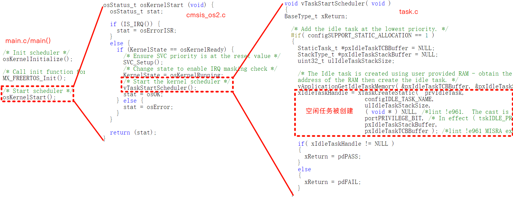
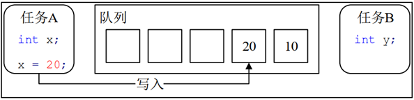
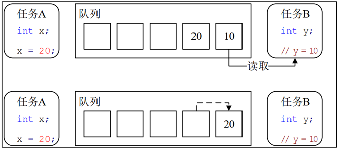
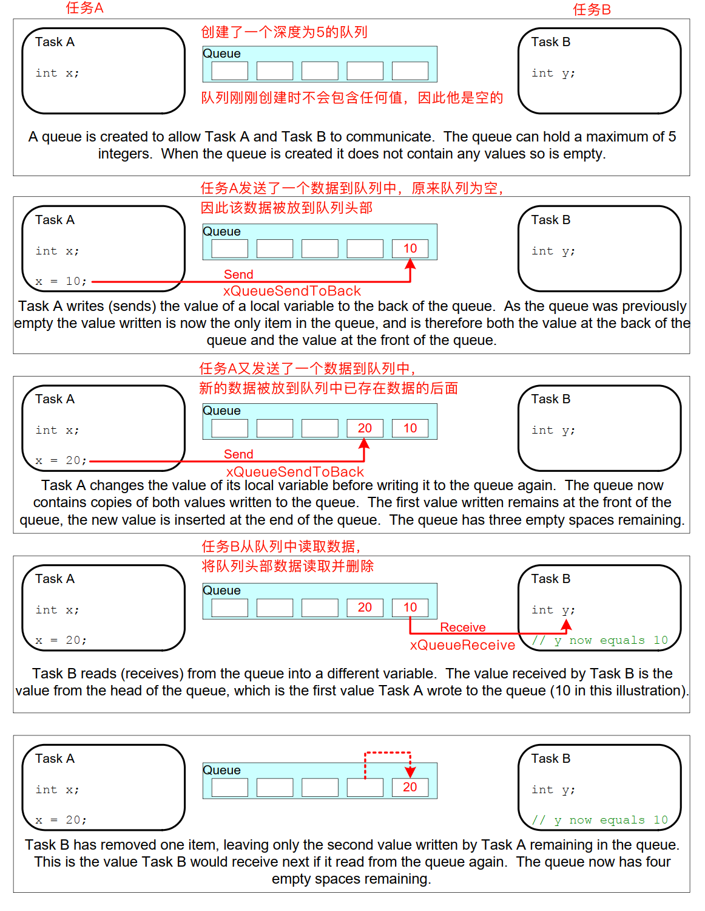
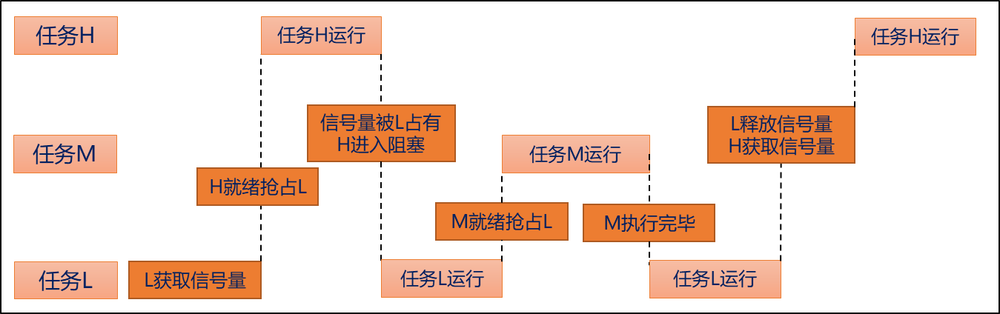
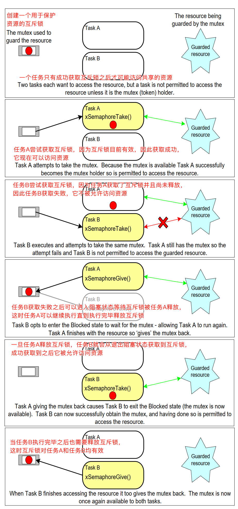
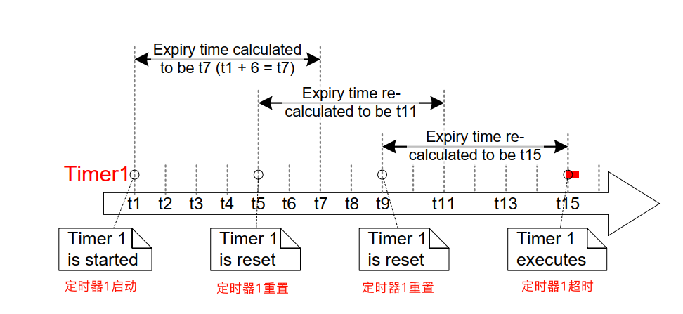

# FreeRTOS基础知识

## 任务调度简介

**调度器保证了总是在所有可运行的任务中选择具有最高优先级的任务，并将其进入运行态**

根据 configUSE_PREEMPTION（使用抢占调度器） 和 configUSE_TIME_SLICING（使用时间片轮询） 两个参数的不同，FreeRTOS涉及三种不同的调度方法

1. 时间片轮询的抢占式调度方法（configUSE_PREEMPTION=1，configUSE_TIME_SLICING=1）
2. 不用时间片轮询的抢占式调度方法（configUSE_PREEMPTION=1，configUSE_TIME_SLICING=0）
3. 协作式调度方法（configUSE_PREEMPTION=0）任务不会被强制抢占，只有当任务主动让出执行权时，调度器才会切换到其他任务执行。

### 什么是时间片？

FreeRTOS基础时钟的一个定时周期称为一个时间片，所以其长度由 *configTICK_RATE_HZ* 参数决定，默认情况下为1000HZ（也即1ms）

对于时间片轮询的抢占式调度方法，其在任务调度过程中一般满足以下两点要求

1. 高优先级的任务可以抢占低优先级的任务
2. 同等优先级的任务根据时间片轮流执行

对于不用时间片轮询的抢占式调度方法，其在任务调度过程中一般满足以下两点要求

1. 高优先级的任务同样可以抢占低优先级的任务
2. 同等优先级的任务不会按照时间片轮流执行，可能出现任务间占用处理器时间相差很大的情况

任务调度主要是由任务调度器 scheduler 负责，其由 FreeRTOS 内核管理，用户一般无需控制任务调度器，但是 FreeRTOS 也给用户提供了启动、停止、挂起和恢复三个常见的控制 scheduler 的 API 函数，具体如下所述

```c
/**
  * @brief  启动调度器
  * @retval None
  */
void vTaskStartScheduler(void);
 
/**
  * @brief  停止调度器
  * @retval None
  */
void vTaskEndScheduler(void);
 
/**
  * @brief  挂起调度器
  * @retval None
  */
void vTaskSuspendAll(void);
 
/**
  * @brief  恢复调度器
  * @retval 返回是否会导致发生挂起的上下文切换(pdTRUE/pdFALSE)
  */
BaseType_t xTaskResumeAll(void);
```

## 任务状态

FreeRTOS 中任务共存在4种状态: 

1. 运行状态：**一个任务正在被处理器执行**， 如果运行RTOS 的处理器只有一个内核， 那么在任何给定时间内都只能有一个任务处于运行状态。

2. 就绪状态：**一个任务处于未运行状态但是既没有阻塞也没有挂起**，处于就绪状态的任务当前尚未运行，但随时可以进入运行状态

    下图为一个任务在四种不同状态（阻塞状态、挂起状态、就绪状态和运行状态）下完整的状态转移机制图

3. 阻塞状态：**一个任务正在等待某个事件发生**，调用可以进入阻塞状态的API函数可以使任务进入阻塞状态，等待的事件通常为以下两种事件

    1. 时间相关事件：如 vTaskDelay() 或 vTaskDelayUntil()，处于运行状态的任务调用这两个延时函数就会进入阻塞状态，等待延时时间结束后会进入就绪状态，待任务调度后又会进入运行状态
    2. 同步相关事件：例如尝试进行读取空队列、尝试写入满队列、尝试获取尚未被释放的二值信号量等等操作都会使任务进入阻塞状态，这些同步事件会在后面的章节详细讲解

4. 挂起状态：**一个任务暂时脱离调度器的调度**，挂起状态的任务对调度器来说不可见

    1. 让一个任务进入挂起状态的唯一方法是调用 vTaskSuspend() API函数
    2. 将一个任务从挂起状态唤醒的唯一方法是调用 vTaskResume() API函数（在中断中应调用挂起唤醒的中断安全版本vTaskResumeFromISR() API函数）

```c
/**
  * @brief  挂起某个任务
  * @param  pxTaskToSuspend：被挂起的任务的句柄，通过传入NULL来挂起自身
  * @retval None
  */
void vTaskSuspend(TaskHandle_t pxTaskToSuspend);
 
/**
  * @brief  将某个任务从挂起状态恢复
  * @param  pxTaskToResume：正在恢复的任务的句柄
  * @retval None
  */
void vTaskResume(TaskHandle_t pxTaskToResume);
 
/**
  * @brief  vTaskResume的中断安全版本
  * @param  pxTaskToResume：正在恢复的任务的句柄
  * @retval 返回退出中断之前是否需要进行上下文切换(pdTRUE/pdFALSE)
  */
BaseType_t xTaskResumeFromISR(TaskHandle_t pxTaskToResume);
```

四种任务状态之间的转换图：


这四种状态中, 除了运行态, 其他三种任务状态的任务都有其对应的任务状态列表

1. 就绪列表:`pxReadyTasksLists[x]`, 数组的下标对应任务的优先级，优先级越低对应的数组下标越小。空闲任务的优先级最低，对应的是下标为0的链表。任务在创建的时候, 会根据任务的优先级将任务插入到就绪列表不同的位置。相同优先级的任务插入到就绪列表里面 的同一条链表中
2. 阻塞列表: pxDelayedTaskList
3. 挂起列表: xSuspendedTaskList

在程序中可以使用 eTaskGetState() API 函数利用任务的句柄查询任务当前处于什么状态，任务的状态由枚举类型 eTaskState 表示，具体如下所示

```c
/**
  * @brief  查询一个任务当前处于什么状态
  * @param  pxTask：要查询任务状态的任务句柄，NULL查询自己
  * @retval 任务状态的枚举类型
  */
eTaskState eTaskGetState(TaskHandle_t pxTask);
 
/*任务状态枚举类型返回值*/
typedef enum
{
	eRunning = 0,	/* 任务正在查询自身的状态，因此肯定是运行状态 */
	eReady,			/* 就绪状态 */
	eBlocked,		/* 阻塞状态 */
	eSuspended,		/* 挂起状态 */
	eDeleted,		/* 正在查询的任务已被删除，但其 TCB 尚未释放 */
	eInvalid		/* 无效状态 */
} eTaskState;
```

## 源码函数命名规律

**FreeRTOS源码中函数命名规律**：FreeRTOS源码中各个函数并非随机命名，而是有规律的命名，这样方便使用者看到名字就能获得该函数更多的信息，其函数名一般由 ① 函数返回值类型简写，② 函数所在文件 和 ③ 函数作用名称这三部分组成

1. 函数返回值类型简写主要有：

    1. 'u'表示'unsigned'
    2. 'c'表示'char'
    3. 's'表示'int16_t(short)'
    4. 'l'表示'int32_t(long)'
    5. 'p'表示指针类型变量
    6. 'x'表示'BaseType_t'结构体和其他非标准类型的变量名
    7. 'uc'表示'UBaseType_t'结构体
    8. 'v'表示'void'
    9. 'prv'表示私有函数无返回值

    这些简写可以自由组合在一起，例如 'pc' 表示 'char *' 类型，'uc' 表示 'unsigned char' 类型

2. 函数所在文件：

    1. 'CoRoutine'表示该函数定义在'coroutine.c'文件中的
    2. 'EventGroup'表示该函数定义在'event_groups.c'文件中的
    3. 'List'表示该函数定义在'list.c'文件中的
    4. 'Queue'表示该函数定义在'queue.c'文件中的
    5. 'StreamBuffer'表示该函数定义在'stream_buffer.c'文件中的
    6. 'Task'表示该函数定义在'tasks.c'文件中的
    7. 'Timer'表示该函数定义在'timers.c'文件中的
    8. 'Port'表示该函数定义在'port.c'或'heap_x.c'文件中的

举几个例子：

1. xTaskCreate表示函数返回值为 BaseType_t 结构体类型，函数被定义在 'tasks.c' 文件中，函数作用为“创建”
2. vTaskSuspend表示函数返回值为 void 类型，函数被定义在 'tasks.c' 文件中，函数作用为“挂起”
3. prvTaskIsTaskSuspended表示该函数为私有函数，仅能在 'tasks.c' 文件中使用，函数作用为“判断任务是否被挂起”

# 任务创建和删除

## 一个最简单的任务函数

**FreeRTOS中任务是一个永远不会退出的 C 函数**，因此通常是作为无限循环实现，其不允许以任何方式从实现函数中返回，如果一个任务不再需要，可以显示的将其删除，其典型的任务函数结构如下所示

```c
/**
  * @brief  任务函数
  * @retval None
  */
void ATaskFunction(void *pvParameters)  
{
	/*初始化或定义任务需要使用的变量*/
	int iVariable = 0;
	
	for(;;)
	{
		/*完成任务的功能代码*/
	
	}
	/*跳出循环的任务需要被删除*/
	vTaskDelete(NULL);
}
```

## 创建任务函数

```c
/**
  * @brief  动态分配内存创建任务函数，需将宏configSUPPORT_DYNAMIC_ALLOCATION配置为 1 
  * @param  pxTaskCode：指向任务函数的指针
  * @param  pcName：任务名称，单纯用于辅助调试，最大长度configMAX_TASK_NAME_LEN
  * @param  usStackDepth：任务堆栈大小, 注意字（word）为单位
  * @param  pvParameters：传递给任务函数的参数
  * @param  uxPriority：任务优先级, 范围: 0 ~ configMAX_PRIORITIES - 1
  * @param  pxCreatedTask：任务句柄，可通过该句柄进行删除/挂起任务等操作
  * @retval pdTRUE：创建成功，errCOULD_NOT_ALLOCATE_REQUIRED_MEMORY：内存不足创建失败
  */
BaseType_t xTaskCreate(TaskFunction_t pxTaskCode,
					   const char * const pcName,
					   unsigned short usStackDepth,
					   void *pvParameters,
					   UBaseType_t uxPriority,
					   TaskHandle_t *pxCreatedTask);

/**
  * @brief  静态分配内存创建任务函数，需将宏configSUPPORT_STATIC_ALLOCATION配置为 1 
  * @param  pxTaskCode：任务函数
  * @param  pcName：任务名称
  * @param  usStackDepth：任务栈深度，单位为字（word）
  * @param  pvParameters：任务参数
  * @param  uxPriority：任务优先级
  * @param  puxStackBuffer：任务栈空间数组
  * @param  pxTaskBuffer：任务控制块存储空间
  * @retval 创建成功的任务句柄
  */
TaskHandle_t xTaskCreateStatic(TaskFunction_t pxTaskCode,
							   const char * const pcName,
							   uint32_t ulStackDepth,
							   void *pvParameters,
							   UBaseType_t uxPriority,
							   StackType_t * const puxStackBuffer,
							   StaticTask_t * const pxTaskBuffer);
```

上述两个任务创建函数有如下几点不同，**之后如无特殊需要将一律使用动态分配内存的方式创建任务或其他实例**

1. xTaskCreateStatic创建任务时需要用户指定`任务的任务控制块以及任务的栈空间所需的内存`，而xTaskCreate创建任务其存储空间被动态分配，无需用户指定
2. xTaskCreateStatic创建任务函数的返回值为成功创建的任务句柄，而xTaskCreate成功创建任务的句柄需要以参数形式提前定义并指定，同时其函数返回值仅表示任务创建成功/失败

### 动态创建任务函数内部实现 (此函数创建的任务会立刻进入就绪态, 由任务调度器调度运行)

1. 申请堆栈内存&任务控制块内存
2. TCB结构体成员赋值
3. 添加新任务到就绪列表中

### 任务控制块结构体成员介绍

```c
typedef struct tskTaskControlBlock
{
    volatile StackType_t    *pxTopOfStack;     /* 任务栈栈顶, 必须为TCB的第一个成员 */
    ListItem_t              xStateListItem;    /* 任务状态列表项 */
    ListItem_t              xEventListItem;    /* 任务事件列表项 */
    UBaseType_t             uxPriority;        /* 任务优先级, 数值越大, 优先级越大 */
    StackType_t             *pxStack;          /* 任务栈起始地址 */
    char                    pcTaskName[ configMAX_TASK_NAME_LEN ]; /* 任务名字 */
    …
    省略很多条件编译的成员
} tskTCB;
```

```c
typedef struct tskTaskControlBlock *TaskHandle_t;
```

`*TaskHandle_t`和`tskTCB`都是任务控制块


> 任务栈栈顶: 在任务切换时的任务上下文保存、任务恢复息息相关
>
> 每个任务都有属于自己的任务控制块, 类似身份证

## 任务优先级

FreeRTOS每个任务都拥有一个自己的优先级，该优先级可以在创建任务时以参数的形式传入，也可以在需要修改时通过 vTaskPrioritySet() API函数动态设置优先级

**任务优先级的设置范围为1~(configMAX_PRIORITIES-1)，任务设置的优先级数字越大优先级越高**，设置优先级时可以直接使用数字进行设置，也可以使用内核定义好的枚举类型设置，另外可以使用 uxTaskPriorityGet() API函数获取任务的优先级，如下所示列出了部分优先级枚举类型定义

```c
/*cmsis_os2.c中的定义*/
typedef enum {
  osPriorityNone          =  0,         ///< No priority (not initialized).
  osPriorityIdle          =  1,         ///< Reserved for Idle thread.
  osPriorityLow           =  8,         ///< Priority: low
  osPriorityNormal        = 24,         ///< Priority: normal
  osPriorityAboveNormal   = 32,         ///< Priority: above normal
  osPriorityHigh          = 40,         ///< Priority: high
  osPriorityRealtime      = 48,         ///< Priority: realtime
  osPriorityISR           = 56,         ///< Reserved for ISR deferred thread.
} osPriority_t;
```

任务的优先级主要决定了在任务调度时，多个任务同时处于就绪态时应该让哪个任务先执行，**FreeRTOS调度器则保证了任何时刻总是在所有可运行的任务中选择具有最高优先级的任务，并将其进入运行态**，如下所述为上述提到的两个设置和获取任务优先级函数的具体声明

```c
/**
  * @brief  修改任务优先级
  * @param  pxTask：要修改优先级的任务句柄，通过NULL改变任务自身优先级
  * @param  uxNewPriority：要修改的任务优先级
  * @retval None
  */
void vTaskPrioritySet(TaskHandle_t pxTask, UBaseType_t uxNewPriority);
 
/**
  * @brief  获取任务优先级
  * @param  pxTask：要获取任务优先级的句柄，通过NULL获取任务自身优先级
  * @retval 任务优先级
  */
UBaseType_t uxTaskPriorityGet(TaskHandle_t pxTask);
```

## 延时函数

学习STM32时经常会使用到HAL库的延时函数HAL_Delay()，FreeRTOS也同样提供了vTaskDelay()和 vTaskDelayUntil()两个API延时函数，如下所述

```c
/**
  * @brief  延时函数
  * @param  xTicksToDelay：延迟多少个心跳周期
  * @retval None
  */
void vTaskDelay(TickType_t xTicksToDelay);
 
/**
  * @brief  延时函数，用于实现一个任务固定执行周期
  * @param  pxPreviousWakeTime：保存任务上一次离开阻塞态的时刻
  * @param  xTimeIncrement：指定任务执行多少心跳周期
  * @retval None
  */
void vTaskDelayUntil(TickType_t *pxPreviousWakeTime, TickType_t xTimeIncrement);
```

上述两个延时函数与 HAL_Delay() 作用都是延时，**但是FreeRTOS延时函数 API 可以让任务进入阻塞状态，而 HAL_Delay() 不具有该功能**，因此如果一个任务需要使用延时，一般应该使用 FreeRTOS 的 API 函数让任务进入阻塞状态等待延时结束，处于阻塞状态的任务便可以让出内核处理其他任务

对于 vTaskDelayUntil() API函数的 *pxPreviousWakeTime* 参数一般通过 xTaskGetTickCount() API函数获取，该函数作用为获取滴答信号当前计数值，具体如下所述

```c
/**
  * @brief  获取滴答信号当前计数值
  * @retval 滴答信号当前计数值
  */
TickType_t xTaskGetTickCount(void);
 
/**
  * @brief  获取滴答信号当前计数值的中断安全版本
  */
TickType_t xTaskGetTickCountFromISR(void);
 
/**
  * @brief  周期任务函数结构
  * @retval None
  */
void APeriodTaskFunction(void *pvParameters)  
{
	/*获取任务创建后的滴答信号计数值*/
	TickType_t pxPreviousWakeTime = xTaskGetTickCount();
	
	for(;;)
	{
		/*完成任务的功能代码*/
		
		/*任务周期500ms*/
		vTaskDelayUntil(&pxPreviousWakeTime, pdMS_TO_TICKS(500));
	}
	/*跳出循环的任务需要被删除*/
	vTaskDelete(NULL);
}
```

**当一个任务因为延时函数或者其他同步事件进入阻塞状态后，可以通过 xTaskAbortDelay() API 函数终止任务的阻塞状态**，即使事件任务等待尚未发生，或者任务进入时指定的超时时间阻塞状态尚未过去，都会使其进入就绪状态，具体函数描述如下所述

```c
/**
  * @brief  终止任务延时，退出阻塞状态
  * @param  xTask：操作的任务句柄
  * @retval pdPASS：任务成功从阻塞状态中删除，pdFALSE：任务不属于阻塞状态导致删除失败
  */
BaseType_t xTaskAbortDelay(TaskHandle_t xTask);
```

## 为什么会有空闲任务?

### 概述

**FreeRTOS 调度器决定在任何时刻处理器必须保持有一个任务运行**，当用户创建的所有任务都处于阻塞状态不能运行时，空闲任务就会被运行

空闲任务是一个优先级为0（最低优先级）的非常短小的循环，其优先级为 0 保证了不会影响到具有更高优先级的任务进入运行态，一旦有更高优先级的任务进入就绪态，空闲任务就会立刻切出运行态

空闲任务何时被创建？**当调用 vTaskStartScheduler() 启动调度器时就会自动创建一个空闲任务，如下图所示，另外空闲任务还负责将分配给已删除任务的内存释放掉**



### 空闲任务钩子函数

空闲任务有一个钩子函数，可以通过配置 configUSE_IDLE_HOOK 参数为 Enable 启动空闲任务的钩子函数，如果是使用STM32CubeMX软件生成的工程则会自动生成空闲任务钩子函数，当调度器调度内核进入空闲任务时就会调用钩子函数

通常空闲任务钩子函数主要被用于下方函数体内部注释列举的几种情况，如下所述为空闲任务钩子函数典型的任务函数结构
```c
/**
  * @brief  空闲任务钩子函数
  * @retval NULL
  */
void vApplicationIdleHook(void)
{
	/*
		1.执行低优先级，或后台需要不停处理的功能代码
		2.测试系统处理裕量（内核执行空闲任务时间越长表示内核越空闲）
		3.将处理器配置到低功耗模式（Tickless模式）
	*/
}
```

## 删除任务

**一个任务不再需要时，需要显示调用 vTaskDelete() API函数将任务删除**，该函数需要传入要删除任务的句柄这个参数（传入NULL时表示删除自己），函数声明如下所述

```c
/**
  * @brief  任务删除函数，需将宏`INCLUDE_vTaskDelete`配置为 1 
  * @param  pxTaskToDelete：要删除的任务句柄，NULL表示删除自己
  * @retval None
  */
void vTaskDelete(TaskHandle_t pxTaskToDelete);
```

> 用于删除已被创建的任务, 被删除的任务将从就绪态任务列表、阻塞态任务列表、挂起态任务列表和事件列表中移除

注意: 

1. 当传入的参数为 NULL, 则代表删除任务自身 (当前正在运行的任务 ) 
2. 空闲任务会负责释放被删除任务中由系统分配的内存, 但是由用户在任务删除前申请的内存,  则需要由用户在任务被删除前提前释放, 否则将导致内存泄露 

### 删除任务函数的内部实现过程

1. 获取所要删除任务的控制块: 通过传入的任务句柄, 判断所需要删除哪个任务, NULL代表删除自身
2. 将被删除任务, 移除所在列表: 将该任务在所在列表中移除, 包括: 就绪、阻塞、挂起、事件等列表
3. 判断所需要删除的任务: 如果删除任务自身, 需先添加到等待删除列表, 内存释放将在空闲任务执行,如果删除其他任务, 释放内存, 任务数量--
4. 更新下个任务的阻塞时间: 更新下一个任务的阻塞超时时间, 以防被删除的任务就是下一个阻塞超时的任务

# 中断管理

## 什么是中断? 

> 让CPU打断正常运行的程序, 转而去处理紧急的事件 (程序 ) , 就叫中断

中断执行机制, 可简单概括为三步: 

1, 中断请求: 外设产生中断请求 (GPIO外部中断、定时器中断等 ) 
2, 响应中断: CPU停止执行当前程序, 转而去执行中断处理程序 (ISR ) 
3, 退出中断: 执行完毕, 返回被打断的程序处, 继续往下执行

## 中断优先级分组设置

ARM Cortex-M 使用了 8 位宽的寄存器来配置中断的优先等级, 这个寄存器就是中断优先级配置寄存器

但STM32, 只用了中断优先级配置寄存器的高4位 [7 : 4], 所以STM32提供了最大16级的中断优先等级


STM32 的中断优先级可以分为`抢占优先级`和`子优先级 `

**抢占优先级**:  抢占优先级高的中断可以打断正在执行但抢占优先级低的中断 

**子优先级**: 当同时发生具有相同抢占优先级的两个中断时, 子优先级数值小的优先执行

> 注意: 中断优先级数值越小越优先

## 中断优先级分组设置

一共有 5 种分配方式, 对应着中断优先级分组的 5 个组 

|      优先级分组      |    抢占优先级     |    子优先级     |          优先级配置寄存器高 4 位          |
| :------------------: | :---------------: | :-------------: | :---------------------------------------: |
| NVIC_PriorityGroup_0 |  0 级抢占优先级   | 0-15 级子优先级 | 0bit 用于抢占优先级     4bit 用于子优先级 |
| NVIC_PriorityGroup_1 | 0-1 级抢占优先级  | 0-7 级子优先级  | 1bit 用于抢占优先级     3bit 用于子优先级 |
| NVIC_PriorityGroup_2 | 0-3 级抢占优先级  | 0-3 级子优先级  | 2bit 用于抢占优先级     2bit 用于子优先级 |
| NVIC_PriorityGroup_3 | 0-7 级抢占优先级  | 0-1 级子优先级  | 3bit 用于抢占优先级     1bit 用于子优先级 |
| NVIC_PriorityGroup_4 | 0-15 级抢占优先级 |  0 级子优先级   | 4bit 用于抢占优先级     0bit 用于子优先级 |

在HAL_Init中通过调用函数`HAL_NVIC_SetPriorityGrouping(NVIC_PRIORITYGROUP_4)`即可完成设置

## 中断优先级分组设置

特点: 

1. 低于`configMAX_SYSCALL_INTERRUPT_PRIORITY`优先级的中断里才允许调用 FreeRTOS 的API函数
2. 建议将所有优先级位指定为抢占优先级位, 方便FreeRTOS管理
3. 中断优先级数值越小越优先, 任务优先级数值越大越优先


## 中断相关寄存器

三个系统中断优先级配置寄存器, 分别为 SHPR1.  SHPR2.  SHPR3 

SHPR1寄存器地址: 0xE000ED18

SHPR2寄存器地址: 0xE000ED1C

SHPR3寄存器地址: 0xE000ED20


> PendSV 和 SysTick 设置最低优先级的作用: 保证系统任务切换不会阻塞系统其他中断的响应

三个, 分别为 PRIMASK、 FAULTMASK 和BASEPRI 


FreeRTOS所使用的中断管理就是利用的**BASEPRI**这个寄存器

BASEPRI: 屏蔽优先级低于某一个阈值的中断

比如:  BASEPRI设置为0x50, 代表中断优先级在5\~15内的均被屏蔽, 0\~4的中断优先级正常执行

### BASEPRI寄存器

屏蔽优先级低于某一个阈值的中断, 当设置为0时, 则不关闭任何中断

**关中断**程序示例: 

```c
#define portDISABLE_INTERRUPTS()         vPortRaiseBASEPRI()
static portFORCE_INLINE void vPortRaiseBASEPRI( void )
{
    uint32_t ulNewBASEPRI = configMAX_SYSCALL_INTERRUPT_PRIORITY;
    __asm
    {
        msr basepri, ulNewBASEPRI
        dsb
        isb
    }
}
#define configMAX_SYSCALL_INTERRUPT_PRIORITY ( configLIBRARY_MAX_SYSCALL_INTERRUPT_PRIORITY << (8 - configPRIO_BITS) )
#define configLIBRARY_MAX_SYSCALL_INTERRUPT_PRIORITY     5   /* FreeRTOS可管理的最高中断优先级 */
```

中断优先级在5 ~ 15的全部被关闭

当BASEPRI设置为0x50时: 


在中断服务函数中调度 FreeRTOS 的API函数需注意: 

1. 中断服务函数的优先级需在 FreeRTOS 所管理的范围内
2. 在中断服务函数里边需调用 FreeRTOS 的API函数, 必须使用带`FromISR`后缀的函数

**开中断**程序示例: 

```c
#define portENABLE_INTERRUPTS()         vPortSetBASEPRI( 0 )
static portFORCE_INLINE void vPortSetBASEPRI( uint32_t ulBASEPRI )
{
    __asm
    {
        msr basepri, ulBASEPRI
    }
}
```

FreeRTOS中断管理就是利用BASEPRI寄存器实现的

# 临界段代码保护

## 临界段代码保护简介

> 什么是临界段? 临界段代码也叫做临界区, 是指那些必须完整运行, 不能被打断的代码段

适用场合如: 

1. 外设: 需严格按照时序初始化的外设: IIC、SPI等等
2. 系统: 系统自身需求
3. 用户: 用户需求

问题: 什么可以打断当前程序的运行? 中断或者任务调度

## 临界段代码保护函数介绍

> 临界区是直接屏蔽了中断, 系统任务调度靠中断, ISR也靠中断

FreeRTOS 在进入临界段代码的时候需要关闭中断, 当处理完临界段代码以后再打开中断

|             函数              |         描述         |
| :---------------------------: | :------------------: |
|     taskENTER_CRITICAL()      | （任务级）进入临界段 |
|      taskEXIT_CRITICAL()      | （任务级）退出临界段 |
| taskENTER_CRITICAL_FROM_ISR() | （中断级）进入临界段 |
| taskEXIT_CRITICAL_FROM_ISR()  | （中断级）退出临界段 |

任务级临界区调用格式示例: 

```c
taskENTER_CRITICAL() ;
{
        … …    /* 临界区 */
}
taskEXIT_CRITICAL();    
```

中断级临界区调用格式示例: 

```c
uint32_t  save_status;
save_status  = taskENTER_CRITICAL_FROM_ISR(); 
{
        … …    /* 临界区 */
}
taskEXIT_CRITICAL_FROM_ISR(save_status );    
```

特点: 

1. 成对使用
2. 支持嵌套
3. 尽量保持临界段耗时短

# 列表和列表项

## 列表和列表项的简介

> 列表是 FreeRTOS 中的一个数据结构, 概念上和链表有点类似, 列表被用来跟踪 FreeRTOS 中的任务。 

列表项就是存放在列表中的项目


列表相当于链表, 列表项相当于节点, FreeRTOS 中的列表是一个双向环形链表 

列表的特点: 列表项间的地址非连续的, 是人为的连接到一起的。列表项的数目是由后期添加的个数决定的, 随时可以改变

数组的特点: 数组成员地址是连续的, 数组在最初确定了成员数量后期无法改变

在OS中任务的数量是不确定的, 并且任务状态是会发生改变的, 所以非常适用列表(链表)这种数据结构

举个例子: 


### 列表

有关于列表的东西均在文件 list.c 和 list.h 中, 首先我们先看下在list.h中的, 列表相关结构体: 

```c
typedef struct xLIST
{
    listFIRST_LIST_INTEGRITY_CHECK_VALUE               /* 校验值 */
    volatile UBaseType_t uxNumberOfItems;              /* 列表中的列表项数量 */
    ListItem_t *configLIST_VOLATILE pxIndex            /* 用于遍历列表项的指针 */
    MiniListItem_t xListEnd                            /* 末尾列表项 */
    listSECOND_LIST_INTEGRITY_CHECK_VALUE              /* 校验值 */
} List_t;
```

1. 在该结构体中,  包含了两个宏, 这两个宏是确定的已知常量,  FreeRTOS 通过检查这两个常量的值, 
来判断列表的数据在程序运行过程中, 是否遭到破坏 , 该功能一般用于调试,  默认是不开启的 
2. 成员*uxNumberOfItems*, 用于记录列表中列表项的个数 (不包含 xListEnd ) 
3. 成员*pxIndex*用于指向列表中的某个列表项, 一般用于遍历列表中的所有列表项 
4. 成员变量*xListEnd*是一个迷你列表项, 排在最末尾 


### 列表项

列表项是列表中用于存放数据的地方, 在`list.h`文件中, 有列表项的相关结构体定义: 

```c
struct xLIST_ITEM
{
    listFIRST_LIST_ITEM_INTEGRITY_CHECK_VALUE                /* 用于检测列表项的数据完整性 */
    configLIST_VOLATILE TickType_t xItemValue                /* 列表项的值 */
    struct xLIST_ITEM *configLIST_VOLATILE pxNext            /* 下一个列表项 */
    struct xLIST_ITEM *configLIST_VOLATILE pxPrevious        /* 上一个列表项 */
    void *pvOwner                                            /* 此列表项的任务控制块 */
    struct xLIST *configLIST_VOLATILE pxContainer;           /* 列表项所在列表 */
    listSECOND_LIST_ITEM_INTEGRITY_CHECK_VALUE               /* 用于检测列表项的数据完整性 */
};
typedef struct xLIST_ITEM ListItem_t;
```

1. 成员变量*xItemValue*为列表项的值, 这个值多用于按升序对列表中的列表项进行排序 
2. 成员变量*pxNext*和*pxPrevious*分别用于指向列表中列表项的下一个列表项和上一个列表项 
3. 成员变量*pvOwner*用于指向包含列表项的对象 (通常是任务控制块 )  
4. 成员变量*pxContaine*用于指向列表项所在列表。 


### 迷你列表项

迷你列表项也是列表项, 但迷你列表项仅用于标记列表的末尾和挂载其他插入列表中的列表项

```c
struct xMINI_LIST_ITEM
{
    listFIRST_LIST_ITEM_INTEGRITY_CHECK_VALUE                 /* 用于检测数据完整性 */
    configLIST_VOLATILE TickType_t xItemValue;                /* 列表项的值 */
    struct xLIST_ITEM *configLIST_VOLATILE pxNext;            /* 上一个列表项 */
    struct xLIST_ITEM *configLIST_VOLATILE pxPrevious;        /* 下一个列表项 */
};
typedef struct xMINI_LIST_ITEM MiniListItem_t;
```

1. 成员变量*xItemValue*为列表项的值, 这个值多用于按升序对列表中的列表项进行排序 
2. 成员变量*pxNext*和*pxPrevious*分别用于指向列表中列表项的下一个列表项和上一个列表项 
3. 迷你列表项只用于标记列表的末尾和挂载其他插入列表中的列表项, 因此不需要成员变量*pxOwner*和*pxContainer*, 以节省内存开销 


## 函数

### 初始化列表vListInitialise()

```c
void vListInitialise(List_t *const pxList)
{
    /*  初始化时, 列表中只有 xListEnd, 因此 pxIndex 指向 xListEnd */
    pxList->pxIndex = ( ListItem_t * ) & ( pxList->xListEnd );
    /* xListEnd 的值初始化为最大值, 用于列表项升序排序时, 排在最后 */
    pxList->xListEnd.xItemValue = portMAX_DELAY;
    /* 初始化时, 列表中只有 xListEnd, 因此上一个和下一个列表项都为 xListEnd 本身 */
    pxList->xListEnd.pxNext = ( ListItem_t * ) & ( pxList->xListEnd );
    pxList->xListEnd.pxPrevious = ( ListItem_t * ) & ( pxList->xListEnd );
    /* 初始化时, 列表中的列表项数量为 0 (不包含 xListEnd )  */
    pxList->uxNumberOfItems = ( UBaseType_t ) 0U;
    /* 初始化用于检测列表数据完整性的校验值 */
    listSET_LIST_INTEGRITY_CHECK_1_VALUE( pxList );
    listSET_LIST_INTEGRITY_CHECK_2_VALUE( pxList );
}
```

初始化后列表结构: 


### 初始化列表项vListInitialiseItem()

```c
void vListInitialiseItem( ListItem_t *const pxItem )
{
    /* 初始化时, 列表项所在列表设为空 */
    pxItem->pxContainer = NULL;
    /* 初始化用于检测列表项数据完整性的校验值 */
    listSET_FIRST_LIST_ITEM_INTEGRITY_CHECK_VALUE( pxItem );
    listSET_SECOND_LIST_ITEM_INTEGRITY_CHECK_VALUE( pxItem );
}
```

初始化后的列表项结构: 


### 列表项有序插入列表函数vListInsert()

```c
/**
  * @brief  此函数用于将待插入列表的列表项按照列表项值升序进行排序, 有序地插入到列表中 
  * @param  pxList：列表
  * @param  pxNewListItem：待插入列表项
  * @retval None
  */
void vListInsert( List_t *const pxList, ListItem_t *const pxNewListItem )
{
    ListItem_t *pxIterator;
    const TickType_t  xValueOfInsertion = pxNewListItem->xItemValue;  /* 获取列表项的数值依据数值升序排列 */
    listTEST_LIST_INTEGRITY( pxList );                         /* 检查参数是否正确 */
    listTEST_LIST_ITEM_INTEGRITY( pxNewListItem );            /* 如果待插入列表项的值为最大值 */
    if ( xValueOfInsertion == portMAX_DELAY )
    {
        pxIterator = pxList->xListEnd.pxPrevious;            /* 插入的位置为列表 xListEnd 前面 */
    }
    else
    {
        for (  pxIterator = ( ListItem_t * ) & ( pxList->xListEnd );      /*遍历列表中的列表项, 找到插入的位置*/
                pxIterator->pxNext->xItemValue <= xValueOfInsertion;
                pxIterator = pxIterator->pxNext  ) { }
    }
    pxNewListItem->pxNext = pxIterator->pxNext;                  /* 将待插入的列表项插入指定位置 */
    pxNewListItem->pxNext->pxPrevious = pxNewListItem;
    pxNewListItem->pxPrevious = pxIterator;
    pxIterator->pxNext = pxNewListItem;
    pxNewListItem->pxContainer = pxList;                         /* 更新待插入列表项所在列表 */
    ( pxList->uxNumberOfItems )++;                            /* 更新列表中列表项的数量 */
}
```

### 列表项无序插入列表函数vListInsertEnd()

```c
/**
  * @brief  此函数用于将待插入列表的列表项插入到列表 pxIndex 指针指向的列表项前面, 是一种无序的插入方法  
  * @param  pxList：列表
  * @param  pxNewListItem：待插入列表项
  * @retval None
  */
void vListInsertEnd(List_t *const pxList, ListItem_t *const pxNewListItem)
{
    省略部分非关键代码 … …
    /* 获取列表 pxIndex 指向的列表项 */
    ListItem_t *const pxIndex = pxList->pxIndex;
    /* 更新待插入列表项的指针成员变量 */
    pxNewListItem->pxNext = pxIndex;
    pxNewListItem->pxPrevious = pxIndex->pxPrevious;
    /* 更新列表中原本列表项的指针成员变量 */
    pxIndex->pxPrevious->pxNext = pxNewListItem;
    pxIndex->pxPrevious = pxNewListItem;
    /* 更新待插入列表项的所在列表成员变量 */
    pxNewListItem->pxContainer = pxList;
    /* 更新列表中列表项的数量 */
    ( pxList->uxNumberOfItems )++;
}
```

### 列表项移除函数uxListRemove()

```c
/**
  * @brief  此函数用于将列表项从列表项所在列表中移除
  * @param  pxItemToRemove：待移除的列表项
  * @retval 待移除列表项移除后, 所在列表剩余列表项的数量（整数）
  */
UBaseType_t uxListRemove( ListItem_t *const pxItemToRemove )
{
    List_t *const pxList = pxItemToRemove->pxContainer;
    /* 从列表中移除列表项 */
    pxItemToRemove->pxNext->pxPrevious = pxItemToRemove->pxPrevious;
    pxItemToRemove->pxPrevious->pxNext = pxItemToRemove->pxNext;
    /*如果 pxIndex 正指向待移除的列表项 */
    if ( pxList->pxIndex == pxItemToRemove )
    {
        /*pxIndex 指向上一个列表项*/
        pxList->pxIndex = pxItemToRemove->pxPrevious;
    }
    else
    {
        mtCOVERAGE_TEST_MARKER();
    }
    /*将待移除的列表项的所在列表指针清空*/
    pxItemToRemove->pxContainer = NULL;
    /*更新列表中列表项的数量*/
    ( pxList->uxNumberOfItems )--;
    /*返回移除后的列表中列表项的数量*/
    return pxList->uxNumberOfItems;
}
```

# 任务调度

## 开启任务调度器

### vTaskStartScheduler()

> 作用: 用于启动任务调度器, 任务调度器启动后, FreeRTOS 便会开始进行任务调度 

该函数内部实现, 如下: 

1. 创建空闲任务

2. 如果使能软件定时器, 则创建定时器任务

3. 关闭中断, 防止调度器开启之前或过程中, 受中断干扰, 会在运行第一个任务时打开中断

4. 初始化全局变量, 并将任务调度器的运行标志设置为已运行

5. 初始化任务运行时间统计功能的时基定时器 

6. 调用函数 xPortStartScheduler() 

###     xPortStartScheduler()

> 作用: 该函数用于完成启动任务调度器中与硬件架构相关的配置部分, 以及启动第一个任务

该函数内部实现, 如下: 

1. 检测用户在 FreeRTOSConfig.h 文件中对中断的相关配置是否有误 

2. 配置 PendSV 和 SysTick 的中断优先级为最低优先级

3. 调用函数 vPortSetupTimerInterrupt()配置 SysTick

4. 初始化临界区嵌套计数器为 0 

5. 调用函数 prvEnableVFP()使能 FPU

6. 调用函数 prvStartFirstTask()启动第一个任务

## 启动第一个任务

想象下应该如何启动第一个任务? 

假设我们要启动的第一个任务是任务A, 那么就需要将任务A的寄存器值恢复到CPU寄存器

任务A的寄存器值, 在一开始创建任务时就保存在任务堆栈里边! 

注意: 

1. 中断产生时, 硬件自动将xPSR, PC(R15), LR(R14), R12, R3-R0出/入栈; 而R4~R11需要手动出/入栈
	
2. 进入中断后硬件会强制使用MSP指针 , 此时LR(R14) 的值将会被自动被更新为特殊的EXC_RETURN

### prvStartFirstTask()

> 用于初始化启动第一个任务前的环境, 主要是重新设置MSP 指针, 并使能全局中断

1、什么是MSP指针? 

程序在运行过程中需要一定的栈空间来保存局部变量等一些信息。当有信息保存到栈中时, 
 MCU 会自动更新 SP 指针, ARM Cortex-M 内核提供了两个栈空间, : 

主堆栈指针 (MSP) 它由 OS 内核、异常服务例程以及所有需要特权访问的应用程序代码来使用。

进程堆栈指针 (PSP) 用于常规的应用程序代码 (不处于异常服务例程中时) 。

> 在FreeRTOS中, 中断使用MSP (主堆栈) , 中断以外使用PSP (进程堆栈) 

2、为什么是 0xE000ED08?  

因为需从 0xE000ED08 获取向量表的偏移, 为啥要获得向量表呢? 因为向量表的第一个是 MSP 指针! 

取 MSP 的初始值的思路是先根据向量表的位置寄存器 VTOR (0xE000ED08) 来获取向量表存储的地址; 

在根据向量表存储的地址, 来访问第一个元素, 也就是初始的 MSP

CM3 允许向量表重定位——从其它地址处开始定位各异常向量 这个就是向量表偏移量寄存器, 向量表的起始地址保存的就是主栈指针MSP 的初始值

### vPortSVCHandler () 

> 注意: SVC中断只在启动第一次任务时会调用一次, 以后均不调用 

当使能了全局中断, 并且手动触发 SVC 中断后, 就会进入到 SVC 的中断服务函数中 

1. 通过 pxCurrentTCB 获取优先级最高的就绪态任务的任务栈地址, 优先级最高的就绪态任务是系统将要运行的任务 。

2. 通过任务的栈顶指针, 将任务栈中的内容出栈到 CPU 寄存器中, 任务栈中的内容在调用任务创建函数的时候, 已初始化, 然后设置 PSP 指针 。

3. 通过往 BASEPRI 寄存器中写 0, 允许中断。 

4. R14 是链接寄存器 LR, 在 ISR 中 (此刻我们在 SVC 的 ISR 中) , 它记录了异常返回值 EXC_RETURN

而EXC_RETURN 只有 6 个合法的值 (M4、M7) , 如下表所示:  

|                 描述                 | 使用浮点单元 | 未使用浮点单元 |
| :----------------------------------: | :----------: | :------------: |
| 中断返回后进入Hamdler模式, 并使用MSP |  0xFFFFFFE1  |   0xFFFFFFF1   |
|  中断返回后进入线程模式, 并使用 MSP  |  0xFFFFFFE9  |   0xFFFFFFF9   |
|  中断返回后进入线程模式, 并使用 PSP  |  0xFFFFFFED  |   0xFFFFFFFD   |

## 出栈/压栈汇编指令详解

1. 出栈 (恢复现场) , 方向: 从下往上 (低地址往高地址) : 假设r0地址为0x04汇编指令示例: 

```asm
ldmia r0!, {r4-r6}   /* 任务栈r0地址由低到高, 将r0存储地址里面的内容手动加载到 CPU寄存器r4、r5、r6 */
```

r0地址(0x04)内容加载到r4, 此时地址r0 = r0+4 = 0x08

r0地址(0x08)内容加载到r5, 此时地址r0 = r0+4 = 0x0C

r0地址(0x0C)内容加载到r6, 此时地址r0 = r0+4 = 0x10

2. 压栈 (保存现场) , 方向: 从上往下 (高地址往低地址) : 假设r0地址为0x10汇编指令示例: 

```asm
stmdb r0!, {r4-r6} }   /* r0的存储地址由高到低递减, 将r4、r5、r6里的内容存储到r0的任务栈里面。 */
```

地址: r0 = r0-4 = 0x0C, 将r6的内容 (寄存器值) 存放到r0所指向地址(0x0C)

地址: r0 = r0-4 = 0x08, 将r5的内容 (寄存器值) 存放到r0所指向地址(0x08)

地址: r0 = r0-4 = 0x04, 将r4的内容 (寄存器值) 存放到r0所指向地址(0x04)

## 任务切换

> 任务切换的本质: 就是CPU寄存器的切换。

假设当由任务A切换到任务B时, 主要分为两步: 

第一步: 需暂停任务A的执行, 并将此时任务A的寄存器保存到任务堆栈, 这个过程叫做`保存现场`

第二步: 将任务B的各个寄存器值 (被存于任务堆栈中) 恢复到CPU寄存器, 这个过程叫做`恢复现场`

对任务A保存现场, 对任务B恢复现场, 这个整体的过程称之为`上下文切换`

> 注意: 任务切换的过程在`PendSV中断服务函数`里边完成


### PendSV中断是如何触发的?

1. 滴答定时器中断调用

2. 执行FreeRTOS提供的相关API函数: portYIELD() 

> 本质: 通过向中断控制和状态寄存器 ICSR 的bit28 写入 1 挂起 PendSV 来启动 PendSV 中断


### PendSV的任务切换操作 (出栈, 即恢复现场) 

硬件自动将xPSR, PC(R15), LR(R14), R12, R3-R0使用PSP压入/出任务堆栈中

```asm
ldr r3, =pxCurrentTCB 
ldr r2, [ r3 ] 
```

1. 获取当前运行任务的栈顶地址

即R2保存的栈顶地址, 注意R3等于pxCurrentTCB的地址

```asm
stmdb r0!, {r4-r11, r14}
```

2. 压栈, 从上往下压, 将r0的值, 当压栈的起始地址, 开始压栈

如: 先压r14,r0 = r14 (即将r14中的内容放入r0所指的内存地址) ,接着r0 = r0 - 4, 再压r11, r0 = r11 ....压栈向下长, 高到低, 此时r0的值为所保存的这些数据的最底部的一个地址, 只要我们按照地址往上找就可以找到这些寄存器所保存的值

```asm
str r0, [ r2 ] 
```

3. 将r0的值(前面的底部地址), 存到r2地址所指向的内存中 (即栈顶地址指向的内存, pxTopOfStack中) 


### PendSV的任务切换操作 (入栈, 即保存现场) 

硬件自动将xPSR, PC(R15), LR(R14), R12, R3-R0使用PSP压入/出任务堆栈中

```asm
 bl vTaskSwitchContext
```

1. 通过该函数, 获取下一个执行任务的任务控制块, 赋值给pxCurrentTCB

```asm
ldr r1, [ r3]
ldr r0, [ r1 ] 
```

2. r3前面说过是存放的pxCurrentTCB的地址, 经过上述操作后, 此时该地址指向了当前下一个要运行的任务控制块, 所以r1指向pxCurrentTCB的首成员地址, 即栈顶地址pxTopOfStack , r0就取这个栈顶地址里边的值, 该值为入栈时所保存的寄存器寻址地址

```asm
ldmia r0!, {r4-r11, r14}
```

3. 出栈, 以寻址地址开始, 从下往上进行出栈, 将保存在这些地址的值恢复到寄存器里边去

```asm
msr psp, r0     /* 更新任务B的栈给PSP */
bx r14 
```

4. 将r0更新给psp线程堆栈

5. 返回线程模式, 执行新任务


# 任务状态查询API函数介绍

```c
/**
  * @brief  此函数用于获取指定任务的任务优先级, 使用该函数需将宏INCLUDE_uxTaskPriorityGet置 1
  * @param  xTask：要查找的任务句柄, NULL代表任务自身
  * @retval 任务优先级数值（整数）
  */
UBaseType_t uxTaskPriorityGet(const TaskHandle_t xTask)
```

```c
/**
  * @brief  此函数用于改变某个任务的任务优先级, 使用该函数需将宏INCLUDE_vTaskPrioritySet为 1 
  * @param  xTask：要查找的任务句柄, NULL代表任务自身
  * @param  uxNewPriority：需要设置的任务优先级
  * @retval None
  */
void vTaskPrioritySet(TaskHandle_t xTask, UBaseType_t uxNewPriority)
```

```c
/**
  * @brief  此函数用于获取系统中任务的任务数量
  * @param  None
  * @retval 系统中任务的数量（整数）
  */
UBaseType_t uxTaskGetNumberOfTasks(void)
```

```c
/**
  * @brief  此函数用于获取系统中所有任务的任务状态信息, 使用该函数需将宏configUSE_TRACE_FACILITY置 1
  * @param  xTaskStatusArray：指向 TaskStatus_t 结构体数组首地址
  * @param  uxArraySize：接收信息的数组大小
  * @param  pulTotalRunTime：系统总运行时间, 为NULL 则省略总运行时间值
  * @retval 获取信息的任务数量（整数）
  */
UBaseType_t uxTaskGetSystemState(TaskStatus_t *const pxTaskStatusArray,
                                 const UBaseType_t uxArraySize, 				                                  configRUN_TIME_COUNTER_TYPE *const pulTotalRunTime )
```

### TaskStatus_t 结构体

```c
typedef struct xTASK_STATUS
{
    TaskHandle_t                 xHandle;                      /* 任务句柄 */ 
    const char *                 pcTaskName;                   /* 任务名 */ 
    UBaseType_t                  xTaskNumber;                  /* 任务编号 */ 
    eTaskState e                 CurrentState;                 /* 任务状态 */ 
    UBaseType_t                  uxCurrentPriority;            /* 任务优先级 */ 
    UBaseType_t                  uxBasePriority;               /* 任务原始优先级*/ 
    configRUN_TIME_COUNTER_TYPE  ulRunTimeCounter;             /* 任务运行时间*/
    StackType_t *                pxStackBase;                  /* 任务栈基地址 */ 
    configSTACK_DEPTH_TYPE       usStackHighWaterMark;         /* 任务栈历史剩余最小值 */ 
} TaskStatus_t;
```

```c
/**
  * @brief  此函数用于获取指定的单个任务的状态信息, 使用该函数需将宏configUSE_TRACE_FACILITY置 1 
  * @param  xTask：指定获取信息的任务的句柄
  * @param  pxTaskStatus：接收任务信息的变量
  * @param  xGetFreeStackSpace：任务栈历史剩余最小值，当为pdFALSE则跳过这个步骤当为pdTRUE则检查历史剩余最小堆栈
  * @param  eState：任务状态, 可直接赋值, 如想获取代入eInvalid
  * @retval None
  */
void vTaskGetInfo(TaskHandle_t xTask, 
                  TaskStatus_t *pxTaskStatus,
                  BaseType_t xGetFreeStackSpace, 
                  eTaskState eState)
```

```c
typedef enum
{   
    eRunning = 0,   /* 运行态 */ 
    eReady          /* 就绪态 */ 
    eBlocked,       /* 阻塞态 */ 
    eSuspended,     /* 挂起态 */ 
    eDeleted,       /* 任务被删除 */ 
    eInvalid        /* 无效 */ 
} eTaskState;
```

```c
/**
  * @brief  此函数用于获取当前任务的任务句柄,  使用该函数需将宏INCLUDE_xTaskGetCurrentTaskHandle置 1
  * @param  None
  * @retval 当前任务的任务句柄
  */
TaskHandle_t xTaskGetCurrentTaskHandle(void)
```

```c
/**
  * @brief  此函数用于通过任务名获取任务句柄 ,  使用该函数需将宏INCLUDE_xTaskGetHandle置 1
  * @param  pcNameToQuery：任务名
  * @retval 任务句柄
  */
TaskHandle_t xTaskGetHandle(const char *pcNameToQuery)
```


```c
/**
  * @brief  此函数用于获取指定任务的任务栈历史最小剩余堆栈; 使用该函数需将宏INCLUDE_uxTaskGetStackHighWaterMark置 1
  * @param  xTask：任务句柄
  * @retval 任务栈的历史剩余最小值
  */
UBaseType_t uxTaskGetStackHighWaterMark(TaskHandle_t xTask)
```

```c
/**
  * @brief  此函数用于查询某个任务的运行状态, 使用此函数需将宏INCLUDE_eTaskGetState置1 
  * @param  xTask：待获取状态任务的任务句柄
  * @retval 任务状态
  */
eTaskState eTaskGetState(TaskHandle_t xTask)
```

```c
typedef enum
{   
    eRunning = 0,    /* 运行态 */ 
    eReady            /* 就绪态 */ 
    eBlocked,         /* 阻塞态 */ 
    eSuspended,     /* 挂起态 */ 
    eDeleted,         /* 任务被删除 */ 
    eInvalid        /* 无效 */ 
} eTaskState;
```

```c
/**
  * @brief  此函数用于以表格的形式获取系统中任务的信息 ; 使用此函数需将宏configUSE_TRACE_FACILITY和configUSE_STATS_FORMATTING_FUNCTIONS置1 
  * @param  pcWriteBuffer：接收任务信息的缓存指针
  * @retval None
  */
void vTaskList(char *pcWriteBuffer)
```

Name   :  创建任务的时候给任务分配的名字。
State   :  任务的壮态信息,  B 是阻塞态,  R 是就绪态,  S 是挂起态,  D 是删除态
Priority : 任务优先级。
Stack   :  任务堆栈的`高水位线`, 就是堆栈历史最小剩余大小。
Num   :  任务编号, 这个编号是唯一的, 当多个任务使用同一个任务名的时候可以通过此编号来做区分。 

表格如下所示: 


```c
/**
  * @brief  此函数用于统计任务的运行时间信息, 使用此函数需将宏configGENERATE_RUN_TIME_STAT、configUSE_STATS_FORMATTING_FUNCTIONS置1  
  * @param  pcWriteBuffer：接收任务运行时间信息的缓存指针
  * @retval None
  */
void vTaskGetRunTimeStats(char *pcWriteBuffer)
```

Task: 任务名称

Abs Time: 任务实际运行的总时间 (绝对时间) 

% Time: 占总处理时间的百分比


​      时间统计API函数使用流程

1. 将宏`configGENERATE_RUN_TIME_STATS`置1

2. 将宏`configUSE_STATS_FORMATTING_FUNCTIONS`置1

3. 当将此宏`configGENERATE_RUN_TIME_STAT`置1之后, 还需要实现2个宏定义: 

① portCONFIGURE_TIMER_FOR_RUNTIME_STATE() : 用于初始化用于配置任务运行时间统计的时基定时器; 

注意: 这个时基定时器的计时精度需高于系统时钟节拍精度的10至100倍! 

② portGET_RUN_TIME_COUNTER_VALUE(): 用于获取该功能时基硬件定时器计数的计数值 。

# 时间管理

## 延时函数介绍

|       函数        |   描述   |
| :---------------: | :------: |
|   vTaskDelay()    | 相对延时 |
| xTaskDelayUntil() | 绝对延时 |

**相对延时**: 指每次延时都是从执行函数vTaskDelay()开始，直到延时指定的时间结束

**绝对延时**: 指将整个任务的运行周期看成一个整体，适用于需要按照一定频率运行的任务


(1)为任务主体，也就是任务真正要做的工作

(2)是任务函数中调用vTaskDelayUntil()对任务进行延时

(3)为其他任务在运行

# 消息队列

## 队列简介

队列是任务到任务、任务到中断、中断到任务数据交流的一种机制（消息传递） 

FreeRTOS基于队列， 实现了多种功能，其中包括队列集、互斥信号量、计数型信号量、二值信号量、 递归互斥信号量，因此很有必要深入了解 FreeRTOS 的队列 。

读写队列做好了保护，防止多任务同时访问冲突；
我们只需要直接调用API函数即可，简单易用！

在队列中可以存储数量有限、大小固定的数据。队列中的每一个数据叫做“队列项目”，队列能够存储“队列项目”的最大数量称为队列的长度


1. 队列长度为：5个

2. 队列项目大小为：10字节

> 在创建队列时，就要指定队列长度以及队列项目的大小！

### 队列特点：

1. 数据入队出队方式    队列通常采用“先进先出”(FIFO)的数据存储缓冲机制，即先入队的数据会先从队列中被读取，FreeRTOS中也可以配置为“后进先出”LIFO方式；

2. 数据传递方式    FreeRTOS中队列采用实际值传递，即将数据拷贝到队列中进行传递， FreeRTOS采用拷贝数据传递，也可以传递指针，所以在传递较大的数据的时候采用指针传递

3. 多任务访问    队列不属于某个任务，任何任务和中断都可以向队列发送/读取消息

4. 出队、入队阻塞    当任务向一个队列发送消息时，可以指定一个阻塞时间，假设此时当队列已满无法入队

①若阻塞时间为0 ：直接返回不会等待；

②若阻塞时间为0~port_MAX_DELAY ：等待设定的阻塞时间，若在该时间内还无法入队，超时后直接返回不再等待；

③若阻塞时间为port_MAX_DELAY ：死等，一直等到可以入队为止。出队阻塞与入队阻塞类似；

### 入队阻塞：


队列满了，此时写不进去数据；

 ①将该任务的状态列表项挂载在pxDelayedTaskList；

 ②将该任务的事件列表项挂载在xTasksWaitingToSend；

### 出队阻塞：


队列为空，此时读取不了数据；

 ①将该任务的状态列表项挂载在pxDelayedTaskList；

 ②将该任务的事件列表项挂载在xTasksWaitingToReceive；

##    队列操作基本过程

①创建队列


②往队列写入第一个消息


③往队列写入第二个消息



④从队列读取第一个消息



## 队列结构体介绍

```c
typedef struct QueueDefinition 
{
    int8_t * pcHead                        /* 存储区域的起始地址 */
    int8_t * pcWriteTo;                        /* 下一个写入的位置 */
    union
    {
        QueuePointers_t     xQueue; 
        SemaphoreData_t  xSemaphore; 
    } u ;
    List_t xTasksWaitingToSend;             /* 等待发送列表 */
    List_t xTasksWaitingToReceive;            /* 等待接收列表 */
    volatile UBaseType_t uxMessagesWaiting;     /* 非空闲队列项目的数量 */
    UBaseType_t uxLength；                    /* 队列长度 */
    UBaseType_t uxItemSize;                         /* 队列项目的大小 */
    volatile int8_t cRxLock;                 /* 读取上锁计数器 */
    volatile int8_t cTxLock；            /* 写入上锁计数器 */
   /* 其他的一些条件编译 */
} xQUEUE;
```

当用于队列使用时：

```c
typedef struct QueuePointers
{
    int8_t * pcTail;                 /* 存储区的结束地址 */
    int8_t * pcReadFrom;            /* 最后一个读取队列的地址 */
} QueuePointers_t;
```

当用于互斥信号量和递归互斥信号量时 ：

```c
typedef struct SemaphoreData
{
    TaskHandle_t xMutexHolder;        /* 互斥信号量持有者 */
    UBaseType_t uxRecursiveCallCount;    /* 递归互斥信号量的获取计数器 */
} SemaphoreData_t;
```

队列结构体整体示意图：


使用队列的主要流程：创建队列 -> 写队列 -> 读队列。

## 创建队列

**队列在使用前必须先创建**，和创建任务类似， FreeRTOS 也提供了动态或静态内存分配创建队列两个 API 函数，具体函数声明如下所示

```c
/**
  * @brief  动态分配内存创建队列函数
  * @param  uxQueueLength：队列深度
  * @param  uxItemSize：队列中数据单元的长度，以字节为单位
  * @retval 返回创建成功的队列句柄，如果返回NULL则表示因内存不足创建失败
  */
QueueHandle_t xQueueCreate(UBaseType_t uxQueueLength, UBaseType_t uxItemSize);
 
/**
  * @brief  静态分配内存创建队列函数
  * @param  uxQueueLength：队列深度
  * @param  uxItemSize：队列中数据单元的长度，以字节为单位
  * @param  pucQueueStorageBuffer：队列栈空间数组
  * @param  pxQueueBuffer：指向StaticQueue_t类型的用于保存队列数据结构的变量
  * @retval 返回创建成功的队列句柄，如果返回NULL则表示因内存不足创建失败
  */
QueueHandle_t xQueueCreateStatic(UBaseType_t uxQueueLength,
								 UBaseType_t uxItemSize,
								 uint8_t *pucQueueStorageBuffer,
								 StaticQueue_t *pxQueueBuffer);
 
/*example：创建一个队列长度为5，队列项目的大小为2字节的队列*/
QueueHandle_t QueueHandleTest;
QueueHandleTest = xQueueCreate(5, sizeof(uint16_t));
```


前面说 FreeRTOS 基于队列实现了多种功能，每一种功能对应一种队列类型，队列类型的 queue.h 文件中有定义：

```c
#define queueQUEUE_TYPE_BASE                              ( ( uint8_t ) 0U )    /* 队列 */
#define queueQUEUE_TYPE_SET                              ( ( uint8_t ) 0U )    /* 队列集 */
#define queueQUEUE_TYPE_MUTEX                             ( ( uint8_t ) 1U )    /* 互斥信号量*/
#define queueQUEUE_TYPE_COUNTING_SEMAPHORE        ( ( uint8_t ) 2U )    /* 计数型信号量 */
#define queueQUEUE_TYPE_BINARY_SEMAPHORE         ( ( uint8_t ) 3U )    /* 二值信号量 */
#define queueQUEUE_TYPE_RECURSIVE_MUTEX               ( ( uint8_t ) 4U )    /* 递归互斥信号量 */
```

## 向队列写入数据

**任务或者中断向队列写入数据称为发送消息**。通常情况下，队列被作为 FIFO（先入先出）使用，即数据由队列尾部进入，从队列首读出，当然可以通过更改写入方式将队列作为 LIFO（后入先出）使用，向队列中写入数据主要有三组 FreeRTOS API 函数，具体如下所示

```c
/**
  * @brief  向队列后方发送数据（FIFO先入先出）
  * @param  xQueue：要写入数据的队列句柄
  * @param  pvItemToQueue：要写入的数据
  * @param  xTicksToWait：阻塞超时时间，单位为节拍数，portMAXDELAY表示无限等待
  * @retval pdPASS：数据发送成功，errQUEUE_FULL：队列满无法写入
  */
BaseType_t xQueueSend(QueueHandle_t xQueue,
					  const void * pvItemToQueue,
					  TickType_t xTicksToWait);
 
/**
  * @brief  向队列后方发送数据（FIFO先入先出），与xQueueSend()函数一致
  */
BaseType_t xQueueSendToBack(QueueHandle_t xQueue,
							const void * pvItemToQueue,
							TickType_t xTicksToWait);
 
/**
  * @brief  向队列前方发送数据（LIFO后入先出）
  */
BaseType_t xQueueSendToFront(QueueHandle_t xQueue,
							 const void * pvItemToQueue,
							 TickType_t xTicksToWait);
 
/**
  * @brief  以下三个函数为上述三个函数的中断安全版本
  * @param  pxHigherPriorityTaskWoken：用于通知应用程序编写者是否应该执行上下文切换
  */
BaseType_t xQueueSendFromISR(QueueHandle_t xQueue,
							 const void *pvItemToQueue,
							 BaseType_t *pxHigherPriorityTaskWoken);
 
BaseType_t xQueueSendToBackFromISR(QueueHandle_t xQueue,
								   const void *pvItemToQueue,
								   BaseType_t *pxHigherPriorityTaskWoken)
 
BaseType_t xQueueSendToFrontFromISR(QueueHandle_t xQueue,
									const void *pvItemToQueue,
									BaseType_t *pxHigherPriorityTaskWoken);
```

另外还有一组稍微特殊的向队列写入数据的 FreeRTOS API 函数，这组函数只用于队列长度为 1 的队列，在队列已满时会覆盖掉队列原来的数据，具体如下所述

```c
/**
  * @brief  向长度为1的队发送数据
  * @param  xQueue：要写入数据的队列句柄
  * @param  pvItemToQueue：要写入的数据
  * @retval pdPASS：数据发送成功，errQUEUE_FULL：队列满无法写入
  */
BaseType_t xQueueOverwrite(QueueHandle_t xQueue, const void *pvItemToQueue);
 
/**
  * @brief  以下函数为上述函数的中断安全版本
  * @param  pxHigherPriorityTaskWoken：用于通知应用程序编写者是否应该执行上下文切换
  */
BaseType_t xQueueOverwriteFromISR(QueueHandle_t xQueue,
								  const void *pvItemToQueue,
								  BaseType_t *pxHigherPriorityTaskWoken);
```

队列写入消息


这几个写入函数调用的是同一个函数`xQueueGenericSend()`，只是指定了不同的写入位置！ 

队列一共有 3 种写入位置 ：

```c
#define queueSEND_TO_BACK                         ( ( BaseType_t ) 0 )        /* 写入队列尾部 */
#define queueSEND_TO_FRONT                        ( ( BaseType_t ) 1 )        /* 写入队列头部 */
#define queueOVERWRITE                            ( ( BaseType_t ) 2 )        /* 覆写队列*/
```

## 从队列接收数据

**任务或者中断从队列中读取数据称为接收消息**。从队列中读取数据主要有两组 FreeRTOS API 函数，具体如下所示

```c
/**
  * @brief  从队列头部接收数据单元，接收的数据同时会从队列中删除
  * @param  xQueue：被读队列句柄
  * @param  pvBuffer：接收缓存指针
  * @param  xTicksToWait：阻塞超时时间，单位为节拍数
  * @retval pdPASS：数据接收成功，errQUEUE_FULL：队列空无读取到任何数据
  */
BaseType_t xQueueReceive(QueueHandle_t xQueue,
						 void *pvBuffer,
						 TickType_t xTicksToWait);
 
/**
  * @brief  从队列头部接收数据单元，不从队列中删除接收的单元
  */
BaseType_t xQueuePeek(QueueHandle_t xQueue,
					  void *pvBuffer,
					  TickType_t xTicksToWait);
 
/**
  * @brief  以下两个函数为上述两个函数的中断安全版本
  * @param  pxHigherPriorityTaskWoken：用于通知应用程序编写者是否应该执行上下文切换
  */
BaseType_t xQueueReceiveFromISR(QueueHandle_t xQueue,
								void *pvBuffer,
								BaseType_t *pxHigherPriorityTaskWoken);
 
BaseType_t xQueuePeekFromISR(QueueHandle_t xQueue, void *pvBuffer);
```

## 查询队列

FreeRTOS 还提供了一些用于查询队列当前有效数组单元个数和剩余可用空间数的 API 函数，具体如下所述

```c
/**
  * @brief  查询队列剩余可用空间数
  * @param  xQueue：被查询的队列句柄
  * @retval 返回队列中可用的空间数
  */
UBaseType_t uxQueueSpacesAvailable(QueueHandle_t xQueue);
 
/**
  * @brief  查询队列有效数据单元个数
  * @param  xQueue：被查询的队列句柄
  * @retval 当前队列中保存的数据单元个数
  */
UBaseType_t uxQueueMessagesWaiting(const QueueHandle_t xQueue);
 
/**
  * @brief  查询队列有效数据单元个数函数的中断安全版本
  */
UBaseType_t uxQueueMessagesWaitingFromISR(const QueueHandle_t xQueue);
```

## 阻塞状态

当出现下面几种情况时，任务会进入阻塞状态

1. 当某个任务向队列写入数据，但是被写的队列已满时，任务将进入阻塞状态等待队列出现新的位置
2. 当某个任务从队列读取数据，但是被读的队列是空时，任务将进入阻塞状态等待队列出现新的数据

当出现下面几种情况时，任务会退出阻塞状态

1. 进入阻塞状态的任务达到设置的阻塞超时时间之后会退出阻塞状态
2. 向满队列中写数据的任务等到队列中出现新的位置
3. 从空队列中读数据的任务等到队列.中出现新的数据

当存在多个任务处于阻塞状态时，如果同时满足解除阻塞的条件，则所有等待任务中 **优先级最高的任务 或者 优先级均相同但等待最久的任务** 将被解除阻塞状态

## 删除队列

```c
/**
  * @brief  删除队列
  * @param  pxQueueToDelete：要删除的队列句柄
  * @retval None
  */
void vQueueDelete(QueueHandle_t pxQueueToDelete);
```

## 复位队列

```c
/**
  * @brief  将队列重置为其原始空状态
  * @param  xQueue：要复位的队列句柄
  * @retval pdPASS（从FreeRTOS V7.2.0之后）
  */
BaseType_t xQueueReset(QueueHandle_t xQueue);
```

## 队列读写过程

如下图展示了用作 FIFO 的队列写入和读取数据的情况的具体过程



# 信号量

## 信号量的简介

信号量是进程间用于通信的一种手段，其是基于队列实现的，信号量更适用于进程间同步，信号量包括二值信号量（Binary Semaphores）和计数信号量（Counting Semaphores）

## 任务的同步和互斥

《RTOS 中的同步与互斥》 在实时操作系统（RTOS）中，同步是不同任务之间或者任务与外部事件之间的协同工作方式，确保多个并发执行的任务按照预期的顺序或时机执行。同步涉及到线程或任务间的通信和协调机制，其目的在于避免数据竞争、解决竞态条件，并确保系统的正确行为。 而互斥则是指某一资源同时只允许一个访问者对其进行访问，具有唯一性和排它性。

当计数值大于0，代表有信号量资源

当释放信号量，信号量计数值（资源数）加一

当获取信号量，信号量计数值（资源数）减一

信号量的计数值都有限制：限定最大值。

如果最大值被限定为1，那么它就是`二值信号量`；

如果最大值不是1，它就是`计数型信号量`。

> 信号量：用于传递状态

队列与信号量的对比

|                             队列                             |                            信号量                            |
| :----------------------------------------------------------: | :----------------------------------------------------------: |
| 可以容纳多个数据；  创建队列有两部分内存：队列结构体+队列项存储空间 | 仅存放计数值，无法存放其他数据；  创建信号量，只需分配信号量结构体 |
|                写入队列：当队列满时，可阻塞;                 | 释放信号量：不可阻塞，计数值++，  当计数值为最大值时，返回失败 |
|               读取队列：当队列为空时，可阻塞;                |         获取信号量：计数值--，  当没有资源时，可阻塞         |

## 二值信号量和计数型信号量

**二值信号量就是只有一个项的队列，该队列不为空则为满（所谓二值），二值信号量就像一个标志，适和用于进程间同步的通信** 

二值信号量通常用于互斥访问或任务同步， 与互斥信号量比较类似，但是二值信号量有可能会导致优先级翻转的问题 ，所以二值信号量更适合用于同步！


**计数信号量就是有固定长度的队列，队列中每个单元都是一个标志，其通常用于对多个共享资源的访问进行控制**

## 创建信号量

**信号量在使用之前也必须先创建**，信号量被创建完之后是无效的，也即为 0 ，而由于信号量分为二值信号量和计数信号量两种，因此FreeRTOS也提供了不同的API函数，具体如下所述

```c
/**
  * @brief  动态分配内存创建二值信号量函数
  * @param  xSemaphore：创建的二值信号量句柄
  * @retval None
  */
void vSemaphoreCreateBinary(SemaphoreHandle_t xSemaphore);
 
/**
  * @brief  静态分配内存创建二值信号量函数
  * @param  pxSemaphoreBuffer：指向一个StaticSemaphore_t类型的变量，该变量将用于保存信号量的状态
  * @retval 返回创建成功的信号量句柄，如果返回NULL则表示因为pxSemaphoreBuffer为空无法创建
  */
SemaphoreHandle_t xSemaphoreCreateBinaryStatic(
									StaticSemaphore_t *pxSemaphoreBuffer);
 
/**
  * @brief  动态分配内存创建计数信号量函数
  * @param  uxMaxCount：可以达到的最大计数值
  * @param  uxInitialCount：创建信号量时分配给信号量的计数值
  * @retval 返回创建成功的信号量句柄，如果返回NULL则表示内存不足无法创建
  */
SemaphoreHandle_t xSemaphoreCreateCounting(UBaseType_t uxMaxCount, 
										   UBaseType_t uxInitialCount);
 
/**
  * @brief  静态分配内存创建计数信号量函数
  * @param  uxMaxCount：可以达到的最大计数值
  * @param  uxInitialCount：创建信号量时分配给信号量的计数值
  * @param  pxSempahoreBuffer：指向StaticSemaphore_t类型的变量，该变量然后用于保存信号量的数据结构体
  * @retval 返回创建成功的信号量句柄，如果返回NULL则表示因为pxSemaphoreBuffer为空无法创建
  */
SemaphoreHandle_t xSemaphoreCreateCountingStatic(
									UBaseType_t uxMaxCount,
									UBaseType_t uxInitialCount,
									StaticSemaphore_t pxSempahoreBuffer);
```

## 释放信号量

以下两个函数不仅仅可以用于释放二值信号量，还可以用于释放计数信号量和互斥量，具体如下所示

```c
/**
  * @brief  释放信号量函数
  * @param  xSemaphore：要释放的信号量的句柄
  * @retval 如果信号量释放成功，则返回pdTRUE；如果发生错误，则返回pdFALSE
  */
BaseType_t xSemaphoreGive(SemaphoreHandle_t xSemaphore);
 
/**
  * @brief  释放信号量的中断安全版本函数
  * @param  pxHigherPriorityTaskWoken：用于通知应用程序编写者是否应该执行上下文切换
  * @retval 如果成功给出信号量，则返回pdTRUE，否则errQUEUE_FULL
  */
BaseType_t xSemaphoreGiveFromISR(SemaphoreHandle_t xSemaphore, 
								 BaseType_t *pxHigherPriorityTaskWoken);
```

## 获取信号量

```c
/**
  * @brief  获取信号量函数
  * @param  xSemaphore：正在获取的信号量的句柄
  * @param  xTicksToWait：等待信号量变为可用的时间
  * @retval 成功获得信号量则返回pdTRUE；如果xTicksToWait过期，信号量不可用，则返回pdFALSE
  */
BaseType_t xSemaphoreTake(SemaphoreHandle_t xSemaphore, TickType_t xTicksToWait);
/**
  * @brief  获取信号量的中断安全版本函数
  * @param  xSemaphore：正在获取的信号量的句柄
  * @param  pxHigherPriorityTaskWoken：用于通知应用程序编写者是否应该执行上下文切换
  * @retval 成功获取则返回pdTRUE，未成功获取则返回pdFALSE
  */
BaseType_t xSemaphoreTakeFromISR(SemaphoreHandle_t xSemaphore, 
								 signed BaseType_t *pxHigherPriorityTaskWoken);
 
```

## 删除信号量

```c
/**
  * @brief  删除信号量，包括互斥锁型信号量和递归信号量
  * @param  xSemaphore：被删除的信号量的句柄
  * @retval None
  */
void vSemaphoreDelete(SemaphoreHandle_t xSemaphore);
```

##  获取信号量计数

```c
/**
  * @brief  获取信号量计数
  * @param  xSemaphore：正在查询的信号量的句柄
  * @retval 如果信号量是计数信号量，则返回信号量的当前计数值。如果信号量是二进制信号量，则当信号量可用时，返回1，当信号量不可用时，返回 0
  */
UBaseType_t uxSemaphoreGetCount(SemaphoreHandle_t xSemaphore);
```

# 互斥量

## 优先级翻转简介

**使用二值信号量用于进程间同步时可能会出现优先级翻转的问题，什么是“优先级翻转”问题呢？**

- 在 t1 时刻，低优先级的任务 TaskLP 切入运行状态，并且获取到了一个二值信号量 Binary Semaphores
- 在 t2 时刻，高优先级的任务 TaskHP 请求获取二值信号量 Binary Semaphores ，但是由于 TaskLP 还未释放该二值信号量，所以在 t3 时刻，任务 TaskHP 进入阻塞状态等待二值信号量被释放
- 在 t4 时刻，中等优先级的任务 TaskMP 进入就绪状态，由于不需要获取二值信号量，因此抢占低优先级任务任务 TaskLP 切入运行状态
- 在 t5 时刻，任务 TaskMP 运行结束，任务 TaskLP 再次切入运行状态
- 在 t6 时刻，任务 TaskLP 运行结束，释放二值信号量 Binary Semaphores，此时任务 TaskHP 从等待二值信号量的阻塞状态切入运行状态
- 在t7时刻，任务 TaskHP 运行结束

根据上述流程读者可以发现一个问题，**即在 t4 时刻中等优先级的任务 TaskMP 先于高优先级的任务 TaskHP 抢占了处理器，这破坏了 FreeRTOS 基于优先级抢占式执行的原则，我们将这种情况称为优先级翻转问题**，上述描述的任务运行过程具体时刻流程图如下图所示：



## 优先级继承和互斥信号量

为了解决使用二值信号量可能会出现的优先级翻转问题，**对二值信号量做了改进，增加了一种名为 “优先级继承” 的机制，改进后的实例称为了互斥量，注意虽然互斥量可以减缓优先级翻转问题的出现，但是并不能完全杜绝**

接下来我们来通过例子介绍什么是优先级继承？

仍然考虑由 “优先级翻转问题” 小节中提出的任务运行过程的例子，具体流程如下所述，读者可以细心理解其中的不同之处

- 在 t1 时刻，低优先级的任务 TaskLP 切入运行状态，并且获取到了一个互斥量 Mutexes
- 在 t2 时刻，高优先级的任务 TaskHP 请求获取互斥量 Mutexes ，但是由于 TaskLP 还未释放该互斥量，所以在 t3 时刻，任务 TaskHP 进入阻塞状态等待互斥量被释放，**但是与二值信号量不同的是，此时 FreeRTOS 将任务 TaskLP 的优先级临时提高到与任务 TaskHP 一致的优先级，也即高优先级**
- 在 t4 时刻，中等优先级的任务 TaskMP 进入就绪状态发生任务调度，但是由于任务 TaskLP 此时优先级被提高到了高优先级，因此任务 TaskMP 仍然保持就绪状态等待优先级较高的任务执行完毕
- 在 t5 时刻，任务 TaskLP 执行完毕释放互斥量 Mutexes，此时任务 TaskHP 抢占处理器切入运行状态，并恢复任务 TaskLP 原来的优先级
- 在 t6 时刻，任务 TaskHP 执行完毕，此时轮到任务 TaskMP 执行
- 在 t7 时刻，任务 TaskMP 运行结束

根据互斥量的上述任务流程读者可以发现与二值信号量的不同之处，上述描述的任务运行过程具体时刻流程图如下图所示


## 互斥信号量

**互斥量/互斥锁是一种特殊类型的二进制信号量，用于控制对在两个或多个任务之间共享资源的访问**

互斥锁可以被视为一个与正在共享的资源相关联的令牌，对于合法访问资源的任务，它必须首先成功 “获取” 令牌，成为资源的持有者，当持有者完成对资源的访问之后，其需要 ”归还” 令牌，只有 “归还” 令牌之后，该令牌才可以再次被其他任务所 “获取” ，这样保证了互斥的对共享资源的访问，上述机制如下图所示



## 死锁现象

**“死锁” 是使用互斥锁进行互斥的另一个潜在陷阱，当两个任务因为都在等待对方占用的资源而无法继续进行时，就会发生死锁**，考虑如下所述的情况

1. 任务 A 执行并成功获取互斥量 X
2. 任务 A 被任务 B 抢占
3. 任务 B 在尝试获取互斥量 X 之前成功获取互斥量 Y，但互斥量 X 由任务 A 持有，因此对任务 B 不可用，任务 B 选择进入阻塞状态等待互斥量 X 被释放
4. 任务 A 继续执行，它尝试获取互斥量 Y，但互斥量 Y 由任务 B 持有，所以对于任务 A 来说是不可用的，任务 A 选择进入阻塞状态等待待释放的互斥量 Y

经过上述的这样一个过程，读者可以发现任务 A 在等待任务 B 释放互斥量 Y ，而任务 B 在等待任务 A 释放互斥量 X ，两个任务都在阻塞状态无法执行，从而导致 ”死锁“ 现象的发生，与优先级翻转一样，避免 “死锁” 的最佳方法是在设计时考虑其潜在影响，并设计系统以确保不会发生死锁

## 递归互斥量

任务也有可能与自身发生死锁，如果任务尝试多次获取相同的互斥体而不首先返回互斥体，就会发生这种情况，考虑以下设想：

1. 任务成功获取互斥锁
2. 在持有互斥体的同时，任务调用库函数
3. 库函数的实现尝试获取相同的互斥锁，并进入阻塞状态等待互斥锁变得可用

在此场景结束时，任务处于阻塞状态以等待互斥体返回，但任务已经是互斥体持有者。 由于任务处于阻塞状态等待自身，因此发生了死锁

**通过使用递归互斥体代替标准互斥体可以避免这种类型的死锁，同一任务可以多次 “获取” 递归互斥锁，并且只有在每次 “获取” 递归互斥锁之后都调用一次 “释放” 递归互斥锁，才会返回该互斥锁**

因此递归互斥量可以视为特殊的互斥量，一个互斥量被一个任务获取之后就不能再次获取，其他任务想要获取该互斥量必须等待这个任务释放该互斥连，但是递归互斥量可以被一个任务重复获取多次，当然每次获取必须与一次释放配对使用

> 注意不管是互斥量，还是递归互斥量均存在优先级继承机制，但是由于 ISR 并不是任务，因此互斥量和递归互斥量不能在中断中使用

## 互斥信号量相关API函数

使用互斥信号量：首先将宏`configUSE_MUTEXES`置1

> 注意：创建互斥信号量时，会主动释放一次信号量

### 创建互斥量

**互斥量在使用之前必须先创建**，因为互斥量分为互斥量和递归互斥量两种，所以 FreeRTOS 也提供了不同的 API 函数，具体如下所述

```c
/**
  * @brief  动态分配内存创建互斥信号量函数
  * @retval 创建互斥信号量的句柄
  */
SemaphoreHandle_t xSemaphoreCreateMutex(void);
 
/**
  * @brief  静态分配内存创建互斥信号量函数
  * @param  pxMutexBuffer：指向StaticSemaphore_t类型的变量，该变量将用于保存互斥锁型信号量的状态
  * @retval 返回成功创建后的互斥锁的句柄，如果返回NULL则表示内存不足创建失败
  */
SemaphoreHandle_t xSemaphoreCreateMutexStatic(StaticSemaphore_t *pxMutexBuffer);
 
/**
  * @brief  动态分配内存创建递归互斥信号量函数
  * @retval 创建递归互斥信号量的句柄，如果返回NULL则表示内存不足创建失败
  */
SemaphoreHandle_t xSemaphoreCreateRecursiveMutex(void);
 
/**
  * @brief  动态分配内存创建二值信号量函数
  * @param  pxMutexBuffer：指向StaticSemaphore_t类型的变量，该变量将用于保存互斥锁型信号量的状态
  */
SemaphoreHandle_t xSemaphoreCreateRecursiveMutex(
								StaticSemaphore_t pxMutexBuffer);
```

### 获取互斥量

获取互斥量直接使用获取信号量的函数即可，但对于递归互斥量需要专门的获取函数，具体如下所述

```c
/**
  * @brief  获取信号量函数
  * @param  xSemaphore：正在获取的信号量的句柄
  * @param  xTicksToWait：等待信号量变为可用的时间
  * @retval 成功获取信号量则返回pdTRUE, xTicksToWait过期，信号量不可用，则返回pdFALSE
  */
BaseType_t xSemaphoreTake(SemaphoreHandle_t xSemaphore, TickType_t xTicksToWait);
 
/**
  * @brief  获取递归互斥量
  * @param  xMutex：正在获得的互斥锁的句柄
  * @param  xTicksToWait：等待信号量变为可用的时间
  * @retval 成功获取信号量则返回pdTRUE, xTicksToWait过期，信号量不可用，则返回pdFALSE
  */
BaseType_t xSemaphoreTakeRecursive(SemaphoreHandle_t xMutex,
								   TickType_t xTicksToWait);
```

### 释放互斥量

释放互斥量直接使用释放信号量的函数即可，但对于递归互斥量需要专门的释放函数，具体如下所述

```c
/**
  * @brief  释放信号量函数
  * @param  xSemaphore：要释放的信号量的句柄
  * @retval 成功释放信号量则返回pdTRUE, 若发生错误，则返回pdFALSE
  */
BaseType_t xSemaphoreGive(SemaphoreHandle_t xSemaphore);
 
/**
  * @brief  释放递归互斥量
  * @param  xMutex：正在释放或“给出”的互斥锁的句柄
  * @retval 成功释放递归互斥量后返回pdTRUE
  */
BaseType_t xSemaphoreGiveRecursive(SemaphoreHandle_t xMutex);
```

### 删除互斥量

直接使用信号量的删除函数即可，具体如下所述

```c
/**
  * @brief  获取信号量函数
  * @param  xSemaphore：要删除的信号量的句柄
  * @retval None
  */
void vSemaphoreDelete(SemaphoreHandle_t xSemaphore);
```

# 队列集

## 队列集简介

- 一个队列只允许任务间传递的消息为同一种数据类型，如果需要在任务间传递不同数据类型的消息时，那么就可以使用队列集 ！
- 作用：用于对多个队列或信号量进行“监听”，其中不管哪一个消息到来，都可让任务退出阻塞状态

## 函数

```c
/**
  * @brief  此函数用于创建队列集
  * @param  uxEventQueueLength：队列集可容纳的队列数量
  * @retval 返回创建成功的队列集句柄，如果返回NULL则表示内存不足无法创建
  */
QueueSetHandle_t xQueueCreateSet(const UBaseType_t uxEventQueueLength)
```

```c
/**
  * @brief  此函数用于往队列集中添加队列，要注意的时，队列在被添加到队列集之前，队列中不能有有效的消息
  * @param  xQueueOrSemaphore：待添加的队列句柄
  * @param  xQueueSet：队列集
  * @retval pdPASS 队列集添加队列成功，pdFAIL 队列集添加队列失败
  */
BaseType_t xQueueAddToSet(QueueSetMemberHandle_t xQueueOrSemaphore,
                          QueueSetHandle_t xQueueSet)
```

```c
/**
  * @brief  此函数用于从队列集中移除队列， 要注意的是，队列在从队列集移除之前，必须没有有效的消息
  * @param  xQueueOrSemaphore：待移除的队列句柄
  * @param  xQueueSet：队列集
  * @retval pdPASS 队列集移除队列成功，pdFAIL 队列集移除队列失败
  */
BaseType_t xQueueRemoveFromSet(QueueSetMemberHandle_t xQueueOrSemaphore,
                               QueueSetHandle_t xQueueSet)
```

```c
/**
  * @brief  此函数用于在任务中获取队列集中有有效消息的队列
  * @param  xQueueSet：队列集
  * @param  xTicksToWait：阻塞超时时间
  * @retval 返回消息的队列句柄，如果返回NULL则表示获取消息失败
  */
QueueSetMemberHandle_t xQueueSelectFromSet(QueueSetHandle_t xQueueSet,
                                           TickType_t const xTicksToWait)
```

##     **队列集使用流程**

1. 启用队列集功能需要将宏configUSE_QUEUE_SETS 配置为 1

2. 创建队列集

3. 创建队列或信号量

4. 往队列集中添加队列或信号量

5. 往队列发送信息或释放信号量

6. 获取队列集的消息

# 事件标志组

## 事件标志组简介

**事件标志组适用于多个事件触发一个或多个任务运行，可以实现事件的广播，还可以实现多个任务的同步运行**，如下所述

- 事件标志组允许任务等待一个或多个事件的组合
- 事件标志组会解除所有等待同一事件的任务的阻塞状态

事件标志组中每个事件标志的状态由 EventBits_t 类型变量中的单个位表示。如果 EventBits_t 变量中的某个位设置为 1 ，则该位表示的事件已发生，否则如果 EventBits_t 变量中的某个位设置为 0 ，则该位表示的事件尚未发生

一个事件标志组就包含了一个 EventBits_t 数据类型的变量，如下图所示显示了各个事件标志如何映射到 EventBits_t 类型变量中的各个位


### EventBits_t 数据类型

一个事件标志组对象有一个变量类型为 EventBits_t 的内部变量用于存储事件标志位，该变量可以设置为 16 位或 32 位，具体由参数 configUSE_16_BIT_TICKS 所决定，当参数设置为 1 时，那么每个事件标志组包含 8 个可用的事件位（包括 8 个保留位），否则设置为 0 时，每个事件标志组包含 24 个可用的事件位（包括 8 个保留位）

## 队列和事件标志组的区别

|     功能     |                           唤醒对象                           |                           事件清除                           |
| :----------: | :----------------------------------------------------------: | :----------------------------------------------------------: |
| 队列、信号量 |                 事件发生时，只会唤醒一个任务                 | 是消耗型的资源，队列的数据被读走就没了；信号量被获取后就减少了 |
|  事件标志组  | 事件发生时，会唤醒所有符合条件的任务，可以理解为“广播”的作用 |  被唤醒的任务有两个选择，可以让事件保留不动，也可以清除事件  |

## 创建事件标志组

**一个事件标志组在使用之前必须先创建**，如下所示为使用动态/静态内存分配创建一个事件标志组的 API 函数

```c
/**
  * @brief  动态分配内存创建事件标志组函数
  * @retval 返回成功创建的事件标志组的句柄，返回NULL表示因内存空间不足创建失败
  */
EventGroupHandle_t xEventGroupCreate(void);
 
/**
  * @brief  静态分配内存创建事件标志组函数
  * @param  pxEventGroupBuffer：指向StaticEventGroup_t类型的变量，该变量用于存储事件标志组数据结构体
  * @retval 返回成功创建的事件标志组的句柄，返回NULL表示因pxEventGroupBuffer空间不足创建失败
  */
EventGroupHandle_t xEventGroupCreateStatic(
								StaticEventGroup_t *pxEventGroupBuffer);
```

## 操作事件标志组

FreeRTOS 提供了两组 API 来对事件标志组的某些位进行置位和清零两种操作，具体如下所示

```c
/**
  * @brief  设置事件标志位
  * @param  xEventGroup：要设置位的事件标志组
  * @param  uxBitsToSet：指定要在事件标志组中设置的一个或多个位的按位值，例如设置为0x09表示置位3和位0（0x09 = Ob1001）
  * @retval 返回事件标志组中的事件标志位值
  */
EventBits_t xEventGroupSetBits(EventGroupHandle_t xEventGroup,
							   const EventBits_t uxBitsToSet);

/**
  * @brief  将事件标志组某些位清零
  * @param  xEventGroup：要在其中清除位的事件标志组
  * @param  uxBitsToSet：表示要在事件标志组中清除一个或多个位的按位值
  * @retval 返回清零事件标志位之前事件标志组中事件标志位的值
  */
EventBits_t xEventGroupClearBits(EventGroupHandle_t xEventGroup,
								 const EventBits_t uxBitsToClear);

/**
  * @brief  上述两个函数的中断安全版本
  * @param  pxHigherPriorityTaskWoken：用于通知应用程序编写者是否应该执行上下文切换
  * @retval 消息已发送到RTOS软件定时器服务任务，则返回pdPASS，否则将返回pdFAIL
  */
BaseType_t xEventGroupSetBitsFromISR(EventGroupHandle_t xEventGroup,
									 const EventBits_t uxBitsToSet,
									 BaseType_t *pxHigherPriorityTaskWoken);

BaseType_t xEventGroupClearBitsFromISR(EventGroupHandle_t xEventGroup,
									   const EventBits_t uxBitsToClear);
```

同时 FreeRTOS 也提供了查询事件标志组当前值的 API 函数，具体如下所示

```c
/**
  * @brief  读取事件标志组的当前值
  * @param  xEventGroup：正在查询的事件标志组
  * @retval 返回事件标志组当前的值
  */
EventBits_t xEventGroupGetBits(EventGroupHandle_t xEventGroup);
 
/**
  * @brief  上述函数的中断安全版本
  */
EventBits_t xEventGroupGetBitsFromISR(EventGroupHandle_t xEventGroup);
```

## 等待事件标志组函数

FreeRTOS 关于事件标志组提出了等待事件标志组和事件标志组同步两个比较重要的 API 函数，分别对应两种不同的使用场景，**此函数主要用于使用事件标志组进行事件的管理，而另一个函数主要用于使用事件标志组进行任务间的同步**，接下来主要详细介绍两个函数的具体用法

xEventGroupWaitBits() API 函数允许任务读取事件标志组的值，并且可以选择在阻塞状态下等待事件标志组中的一个或多个事件位被设置（如果事件位尚未设置），如下所示为其具体的函数声明

```c
/**
  * @brief  等待事件标志组中多个事件位表示的事件成立
  * @param  xEventGroup：所操作事件标志组的句柄
  * @param  uxBitsToWaitFor：所等待事件位的掩码，例如设置为0x05表示等待第0位和/或第2位
  * @param  xClearOnExit：pdTRUE表示事件标志组条件成立退出阻塞状态时将掩码指定的所有位清零；pdFALSE表示事件标志组条件成立退出阻塞状态时不将掩码指定的所有位清零
  * @param  xWaitForAllBits：pdTRUE表示等待掩码中所有事件位都置1，条件才算成立（逻辑与）；pdFALSE表示等待掩码中所有事件位中一个置1，条件就成立（逻辑或）
  * @param  xTicksToWait：任务进入阻塞状态的节拍数
  * @retval 返回事件位等待完成设置或阻塞时间过期时的事件标志组值
  */
EventBits_t xEventGroupWaitBits(const EventGroupHandle_t xEventGroup,
								const EventBits_t uxBitsToWaitFor,
								const BaseType_t xClearOnExit,
								const BaseType_t xWaitForAllBits,
								TickType_t xTicksToWait);
```

特点：

​    可以等待某一位、也可以等待多位

​    等到期望的事件后，还可以清除某些位

### uxBitsToWaitFor 和 xWaitForAllBits 参数

调度程序用来确定任务是否进入阻塞状态以及任务何时离开阻塞状态的条件称为 “解除阻塞条件” 。解锁条件由 *uxBitsToWaitFor* 和 *xWaitForAllBits* 参数值的组合指定：

- **uxBitsToWaitFor** 指定要测试事件标志组中的哪些事件位
- **xWaitForAllBits**指定是使用按位 OR 测试还是按位 AND 测试

如果调用 xEventGroupWaitBits() 时满足解锁条件，任务将不会进入阻塞状态，下表提供了导致任务进入阻塞状态或退出阻塞状态的条件示例。表中列出的值仅显示事件标志组和 *uxBitsToWaitFor* 值的最低有效的四个二进制位，其他位均假定为零

| 现有事件标志组值 | uxBitsToWaitFor | xWaitForAllBits |                          导致的结果                          |
| :--------------: | :-------------: | :-------------: | :----------------------------------------------------------: |
|       0000       |      0101       |     pdFALSE     | 由于事件标志组中的位 0 或位 2 均未设置，调用任务将进入阻塞状态，并且当事件标志组中的位 0 或位 2 被设置时，调用任务将离开阻塞状态 |
|       0100       |      0101       |     pdTRUE      | 调用任务将进入阻塞状态，因为事件标志组中的位 0 和位 2 未同时设置，并且当事件标志组中的位 0 和位 2 均设置时，调用任务将离开阻塞状态 |
|       0100       |      0110       |     pdFALSE     | 调用任务不会进入阻塞状态，因为 xWaitForAllBits 为pdFALSE，并且 uxBitsToWaitFor 指定的两个位之一已在事件标志组中设置 |
|       0100       |      0110       |     pdTRUE      | 调用任务将进入阻塞状态，因为 xWaitForAllBits 为pdTRUE，并且事件标志组中仅已设置 uxBitsToWaitFor 指定的两个位之一。 当事件标志组中的位 2 和位 3 均被设置时，任务将离开阻塞状态 |

### xClearOnExit 参数

调用任务使用 *uxBitsToWaitFor* 参数指定要测试的位，并且调用任务可能需要在满足其解锁条件后将这些位清零。可以使用 xEventGroupClearBits() API 函数清除事件位，但使用该函数手动清除事件位将导致应用程序代码中出现竞争条件

因此提供 *xClearOnExit* 参数就是为了避免这些潜在的竞争条件。如果 *xClearOnExit* 设置为 pdTRUE，则事件位的测试和清除对于调用任务来说是一个原子操作（不能被其他任务或中断中断），**简单来说就是如果 xClearOnExit 设置为 pdTRUE，则调用任务退出后会将事件标志组所有位清零，否则不清零**

如果 xEventGroupWaitBits() 由于满足调用任务的解锁条件而返回，则返回值是满足调用任务的解锁条件时事件标志组的值（如果 xClearOnExit 为 pdTRUE，则在自动清除任何位之前），在这种情况下，返回值也将满足解锁条件。如果 xEventGroupWaitBits() 因为 xTicksToWait 参数指定的退出阻塞时间到期而返回，则返回值为退出阻塞时间到期时事件标志组的值，在这种情况下，返回值将不满足解锁条件

## 事件标志组同步函数

**提供 xEventGroupSync() 是为了允许两个或多个任务使用事件标志组来相互同步**。该函数允许任务设置事件标志组中的一个或多个事件位，然后等待同一事件标志组中指定的事件位组合被设置

如下所示为 xEventGroupSync() API 函数的具体声明

```c
/**
  * @brief  事件标志组同步
  * @param  uxBitsToSet：设置和测试位的事件标志组
  * @param  uxBitsToWaitFor：指定事件标志组中要测试的一个或多个事件位的按位值
  * @param  xTicksToWait：任务进入阻塞状态的节拍数
  * @retval 返回函数退出时事件标志组的值
  */
EventBits_t xEventGroupSync(EventGroupHandle_t xEventGroup,
							const EventBits_t uxBitsToSet,
							const EventBits_t uxBitsToWaitFor,
							TickType_t xTicksToWait);
```

### 函数返回值

xEventGroupSync() 函数返回函数退出时事件标志组的值，可能有以下两种情况

1. xEventGroupSync() 函数的 *uxBitsToWaitFor* 参数指定了调用任务的解锁条件，**如果该函数由于满足解锁条件而返回，则 *uxBitsToWaitFor* 指定的事件位将在 xEventGroupSync() 返回之前清回零，并且在自动清为零之前会将事件标志组的值作为函数返回值返回**
2. 如果 xEventGroupSync() 由于 *xTicksToWait* 参数指定的阻塞时间到期而返回，**则返回值为阻塞时间到期时事件标志组的值**，在这种情况下，返回值将不满足调用任务的解锁条件

### 应用举例

举个简单的例子就容易理解：

假设目前有两个任务，分别为 TASK1 和 TASK2 ，如果 TASK1 被执行过程中因为延时等原因先于 TASK2 调用了 xEventGroupSync() 函数，参数 *uxBitsToSet* 被设置为 0x01（0000 0001），参数 *uxBitsToWaitFor* 被设置为 0x05（0000 0101），则 TASK1 执行到该函数时会将事件标志组中位 0 的值置 1 ，然后进入阻塞状态，等待位 2 和位 0 同时被置 1 ；

如果 TASK2 与 TASK1 一样，只不过落后于 TASK1 执行 xEventGroupSync() 函数，并且参数 *uxBitsToSet* 被设置为 0x04（0000 0100），当 TASK2 执行该函数时会将事件标志组中位 2 的值置 1 ，此时满足解锁条件，所以 TASK2 不会进入阻塞状态，同时 TASK1 也满足解锁条件，从阻塞状态中退出，这时候假设任务优先级一致，则 TASK1 和 TASK2 会同时从同步点开始运行后续的程序代码，从而达到同步的目的

## 删除事件标志组

```c
/**
  * @brief  删除事件标志组
  * @param  xEventGroup：要删除事件标志组的句柄
  * @retval None
  */
void vEventGroupDelete(EventGroupHandle_t xEventGroup);
```

# 任务通知

## 任务通知的简介

任务通知：用来通知任务的，任务控制块中的结构体成员变量 ulNotifiedValue 就是这个通知值。

- 使用队列、信号量、事件标志组时都需另外创建一个结构体，通过中间的结构体进行间接通信！


- 使用任务通知时，任务结构体TCB中就包含了内部对象，可以直接接收别人发过来的"通知"


### 任务通知值的更新方式

- 不覆盖接受任务的通知值

- 覆盖接受任务的通知值

- 更新接受任务通知值的一个或多个bit

- 增加接受任务的通知值

> 只要合理，灵活的利用任务通知的特点，可以在一些场合中替代队列、信号量、事件标志组！

### 任务通知的优势及劣势

任务通知在性能和 RAM 占用上存在优势，具体为以下两点：

1. 使用任务通知向任务发送事件或数据比使用队列、信号量或事件组执行等效操作要快得多

2. 启用任务通知功能的固定开销仅为每个任务 8 个字节的 RAM ，而队列、信号量、事件组等在使用前都必须创建，占用空间较大

任务通知的劣势：

1. 通信对象可用于将事件和数据从 ISR 发送到任务，以及从任务发送到 ISR；**任务通知只能用于将事件和数据从 ISR 发送到任务，不能用于将事件或数据从任务发送到 ISR**
1. 任何知道通信对象句柄的任务和 ISR 都可以访问通信对象，因此多个任务或 ISR 都可以发送或接收消息；任务通知只能将事件和数据发送到某个具体的接收任务中，发送的事件和数据只能由接收任务使用处理
1. 队列是一种通信对象，一次可以保存多个数据项，已发送到队列但尚未从队列接收的数据将缓冲在队列对象内；任务通知通过更新接收任务的通知值来向任务发送数据，**任务的通知值一次只能保存一个值**
1. 事件组是一种通信对象，可用于一次向多个任务发送事件；**任务通知直接发送给接收任务，因此只能由接收任务处理**
1. 如果通信对象暂时处于无法向其写入更多数据或事件的状态（例如，当队列已满时，无法向队列发送更多数据），则尝试写入该对象的任务可以选择进入阻塞状态以等待其写操作完成；如果任务尝试向已经有待处理通知的任务发送任务通知，则发送任务不可能在阻塞状态下等待接收任务重置其通知状态

## 任务通知值和通知状态

设置 configUSE_TASK_NOTIFICATIONS 参数为 1 启动任务通知功能，启动该功能之后，**会在每个任务的 TCB （任务控制块）中增加 8 字节空间，此时每个任务都有一个“通知状态”（可以是 “挂起” 或 “未挂起” ）和一个 “通知值” （32 位无符号整数）**。当任务收到通知时，其通知状态将设置为挂起，当任务读取其通知值时，其通知状态将设置为未挂起

```c
typedef struct tskTaskControlBlock 
{
    … …
        #if ( configUSE_TASK_NOTIFICATIONS  ==  1 )
            volatile  uint32_t    ulNotifiedValue [ configTASK_NOTIFICATION_ARRAY_ENTRIES ];
            volatile  uint8_t      ucNotifyState [ configTASK_NOTIFICATION_ARRAY_ENTRIES ];
        endif
    … …
} tskTCB;
#define  configTASK_NOTIFICATION_ARRAY_ENTRIES    1      /* 定义任务通知数组的大小, 默认: 1 */
```

### 任务通知状态

其中任务通知状态共有3种取值：

```c
#define     taskNOT_WAITING_NOTIFICATION ( ( uint8_t ) 0 ) /* 任务没有在等待通知。初始状态或者任务已经完成了对通知的等待，准备进入下一个等待通知的周期。 */
#define     taskWAITING_NOTIFICATION     ( ( uint8_t ) 1 ) /* 任务正在等待通知。也被称为Not-Pending（未挂起）。当任务调用ulTaskNotifyTake 等待通知时，它的状态将变为等待通知状态。任务会一直保持在这个状态，直到它收到通知或者等待超时。 */
#define     taskNOTIFICATION_RECEIVED    ( ( uint8_t ) 2 ) /* 任务已经收到通知。也被称为pending（挂起）。当任务成功接收到通知时，其状态将从等待通知状态切换到通知已接收状态。任务可以通过调用 ulTaskNotifyTake 函数获取通知的值，并执行相应的操作。 */
```

## 任务通知 API 函数概述

1. **强大通用但较复杂的 xTaskNotify() 和 xTaskNotifyWait() API 函数**
2. **用作二进制或计数信号量的更轻量级且更快的替代方案的 xTaskNotifyGive() 和 ulTaskNotifyTake() API 函数**
3. **在序号 1 的基础上增加 *pulPreviousNotifyValue* 参数值的 xTaskNotifyAndQuery() API函数**

## xTaskNotifyGive() 和 ulTaskNotifyTake() API 函数

xTaskNotifyGive() 直接向任务发送通知，**并对接收任务的通知值进行递增**（加1，因为是模拟信号量），**如果接收任务尚未挂起，则调用 xTaskNotifyGive() 会将接收任务的通知状态设置为挂起**，该 API 实际上是作为宏实现的，而不是函数，其具体声明如下所述

```c
/**
  * @brief  任务通知用作轻量级且更快的二进制或计数信号量替代方案时所使用的通知发送函数
  * @param  xTaskToNotify：通知发送到的任务的句柄
  * @retval 只会返回pdPASS
  */
BaseType_t xTaskNotifyGive(TaskHandle_t xTaskToNotify);
 
/**
  * @brief  上述函数的的中断安全版本函数
  * @param  xTaskToNotify：通知发送到的任务的句柄
  * @param  pxHigherPriorityTaskWoken：用于通知应用程序编写者是否应该执行上下文切换
  * @retval None
  */
void vTaskNotifyGiveFromISR(TaskHandle_t xTaskToNotify,
							BaseType_t *pxHigherPriorityTaskWoken);
```

当一个任务使用 xTaskNotifyGive() API 函数将通知值用作二值或等效计数信号量时， 则被通知的任务应使用 ulTaskNotifyTake() API 函数来接收或等待通知值

ulTaskNotifyTake() 允许任务在阻塞状态下等待其通知值大于零，并在返回之前递减（减一）或清除任务的通知值，其具体函数声明如下所述

```c
/**
  * @brief  任务通知被用作更快、更轻的二进制或计数信号量替代时使用通知接收函数
  * @param  xClearCountOnExit：设置为pdTRUE，则该函数返回之前，调用任务的通知值将被清零；设置为pdFASLE，并且通知值大于0，则调用任务的通知值将在该函数返回之前递减
  * @param  xTicksToWait：调用任务应保持阻塞状态以等待其通知值大于零的最长时间
  * @retval 阻塞时间到期也没能等到消息则返回 0 ，阻塞时间到期前等到消息则返回之前的通知值
  */
uint32_t ulTaskNotifyTake(BaseType_t xClearCountOnExit, TickType_t xTicksToWait);
```

## xTaskNotify() API 函数

xTaskNotify() 是 xTaskNotifyGive() 的功能更强大的版本，可用于通过以下任意方式更新接收任务的通知值

1. 接收任务的通知值递增（加一），在这种情况下 xTaskNotify() **相当于 xTaskNotifyGive()**
2. 接收任务的通知值中设置一位或多位，这允许任务的通知值用作**事件标志组**的更轻量级和更快的替代方案
3. 将一个全新的数字写入接收任务的通知值，但前提是接收任务自上次更新以来已读取其通知值，这允许任务的通知值提供与**长度为 1 的队列**提供的功能类似的功能
4. 将一个全新的数字写入接收任务的通知值，即使接收任务自上次更新以来尚未读取其通知值，这允许任务的通知值提供与 xQueueOverwrite() API 函数提供的功能类似的功能，由此产生的行为有时被称为**“邮箱”**

xTaskNotify() 比 xTaskNotifyGive() 更灵活、更强大，并且由于额外的灵活性和强大功能，它的使用也稍微复杂一些，使用 xTaskNotify() 函数时，如果接收任务尚未挂起，则调用 xTaskNotify() 将始终将其设置为挂起状态，如下所示为其具体函数声明

```c
/**
  * @brief  任务通知函数
  * @param  xTaskToNotify：通知发送到的任务的句柄
  * @param  ulValue：ulValue的使用方式取决于eAction值，参考 “eAction 参数” 小节
  * @param  eAction：一个枚举类型，指定如何更新接收任务的通知值，参考 “eAction 参数” 小节
  * @retval 除 “eAction 参数” 小节提到的一种情况外，均返回pdPASS
  */
BaseType_t xTaskNotify(TaskHandle_t xTaskToNotify,
					   uint32_t ulValue,
					   eNotifyAction eAction);
 
/**
  * @brief  任务通知的中断安全版本函数
  * @param  xTaskToNotify：通知发送到的任务的句柄
  * @param  ulValue：ulValue的使用方式取决于eAction值，参考 “eAction 参数” 小节
  * @param  eAction：一个枚举类型，指定如何更新接收任务的通知值，参考 “eAction 参数” 小节
  * @param  pxHigherPriorityTaskWoken：用于通知应用程序编写者是否应该执行上下文切换
  * @retval 除 “eAction 参数” 小节提到的一种情况外，均返回pdPASS
  */
BaseType_t xTaskNotifyFromISR(TaskHandle_t xTaskToNotify,
							  uint32_t ulValue,
							  eNotifyAction eAction
							  BaseType_t *pxHigherPriorityTaskWoken);
```

### eAction 参数

*eAction* 参数是一个 eNotifyAction 枚举类型，其定义了 5 中不同枚举类型，用于模拟二值信号量、计数信号量、队列、事件组和 ”邮箱“ 等功能，其具体定义如下所述

```c
typedef enum
{    
    eNoAction = 0,                /* 无操作 */
    eSetBits                      /* 更新指定bit */
    eIncrement                    /* 通知值加一 */
    eSetValueWithOverwrite        /* 覆写的方式更新通知值 */
    eSetValueWithoutOverwrite     /* 不覆写通知值 */
} eNotifyAction;
```

|     eNotifyAction 值      | 对接收任务的最终影响                                         |
| :-----------------------: | :----------------------------------------------------------- |
|         eNoAction         | 接收任务的通知状态设置为待处理，而不更新其通知值，未使用 xTaskNotify() 中 *ulValue* 参数 |
|         eSetBits          | 接收任务的通知值与 xTaskNotify() 中 *ulValue* 参数中传递的值进行按位或运算，例如：如果 ulValue 设置为 0x01，则接收任务的通知值中将置位第 0 位 |
|        eIncrement         | 接收任务的通知值递增，未使用 xTaskNotify() 中 *ulValue* 参数 |
| eSetValueWithoutOverwrite | 如果接收任务在调用 xTaskNotify() 之前有待处理的通知，则不执行任何操作，并且 xTaskNotify() 将返回 pdFAIL；如果在调用 xTaskNotify() 之前接收任务没有待处理的通知，则接收任务的通知值将设置为 xTaskNotify() 中 *ulValue* 参数中传递的值 |
|  eSetValueWithOverwrite   | 接收任务的通知值设置为 xTaskNotify() *ulValue* 参数中传递的值，无论接收任务在调用 xTaskNotify() 之前是否有待处理的通知 |

## xTaskNotifyWait() API 函数

xTaskNotifyWait() 是 ulTaskNotifyTake() 的功能更强大的版本，它允许任务以可选的超时等待调用任务的通知状态变为待处理（如果它尚未处于待处理状态），xTaskNotifyWait() 提供了在进入函数和退出函数时清除调用任务的通知值中的位的参数 *ulBitsToClearOnEntry* 和 *ulBitsToClearOnExit*

```c
/**
  * @brief  任务通知的中断安全版本函数
  * @param  ulBitsToClearOnEntry：参考 “ulBitsToClearOnEntry 参数” 小节
  * @param  ulBitsToClearOnExit：参考 “_ulBitsToClearOnExit_ 参数” 小节
  * @param  pulNotificationValue：用于传递任务的通知值，因为等待通知的函数可能由于 ulBitsToClearOnExit 参数在函数退出时收到的消息值已被更改
  * @param  xTicksToWait：调用任务应保持阻塞状态以等待其通知状态变为挂起状态的最长时间
  * @retval 参考 “xTaskNotifyWait() 函数返回值” 小节
  */
BaseType_t xTaskNotifyWait(uint32_t ulBitsToClearOnEntry,
						   uint32_t ulBitsToClearOnExit,
						   uint32_t *pulNotificationValue,
						   TickType_t xTicksToWait);
```

### *ulBitsToClearOnEntry* 参数

**如果调用任务在调用 xTaskNotifyWait() 之前没有待处理的通知，则在进入该函数时，将在任务的通知值中清除参数 *ulBitsToClearOnEntry* 中设置的任何位**

例如，如果参数 *ulBitsToClearOnEntry* 为 0x01，则任务通知值的位 0 将被清除，再举一个例子，将参数 *ulBitsToClearOnEntry* 设置为 0xffffffff（ULONG_MAX）将清除任务通知值中的所有位，从而有效地将值清除为 0

### *ulBitsToClearOnExit*参数

**如果调用任务因为收到通知而退出 xTaskNotifyWait() ，或者因为在调用 xTaskNotifyWait() 时已经有通知挂起，那么在参数 *ulBitsToClearOnExit* 中设置的任何位将在任务退出 xTaskNotifyWait() 函数之前在任务的通知值中被清除**

例如，如果参数 *ulBitsToClearOnExit* 为 0x03 ，则任务通知值的位 0 和位 1 将在函数退出之前被清除，再举个例子，将参数 *ulBitsToClearOnExit* 为 0xffffffff（ULONG_MAX）将清除任务通知值中的所有位，从而有效地将值清除为 0

### xTaskNotifyWait() 函数返回值

有两种可能的返回值，分别为 pdPASS 和 pdFALSE ，具体如下所述

① pdPASS

1. 调用 xTaskNotifyWait() 时调用任务已经有待处理的通知
2. 调用 xTaskNotifyWait() 时调用任务没有待处理的通知，由于设置了阻塞时间因此进入阻塞状态等待消息挂起，在阻塞时间到期之前成功等到消息挂起

② pdFALSE

1. 调用 xTaskNotifyWait() 时调用任务没有待处理的通知，由于设置了阻塞时间因此进入阻塞状态等待消息挂起，但是直到阻塞时间到期都没有等到消息挂起

## 其他 API 函数

除了上面的一些常用 API 之外，还有一些工具或不常用的 API 函数，因为启用任务通知后会在任务控制块中增加一个任务状态和一个任务通知值，因此 FreeRTOS 提供了**清除任务状态的 xTaskNotifyStateClear() API 函数和 清除任务通知值的 ulTaskNotifyValueClear() API 函数**

另外增加了 "任务通知 API 概述" 小节中提到的在 xTaskNotify() API 函数上增加了 *pulPreviousNotifyValue* 参数的 xTaskNotifyAndQuery() API函数和其中断安全版本函数，上述提到的四个函数声明具体如下所述

```c
/**
  * @brief  清除任务通知状态
  * @param  xTask：要操作的任务句柄
  * @retval 如果要操作的任务有待处理的通知，并且该通知已清除，则返回pdTRUE；如果该任务没有待处理的通知，则返回pdFALSE
  */
BaseType_t xTaskNotifyStateClear(TaskHandle_t xTask);
 
/**
  * @brief  清除任务通知值
  * @param  xTask：要操作的任务句柄
  * @param  ulBitsToClear：xTask的通知值中要清除的位的位掩码，比如设置为0x01表示将通知值的第0位清除
  * @retval ulBitsToClear指定的位被清除之前目标任务的通知值的值
  */
uint32_t ulTaskNotifyValueClear(TaskHandle_t xTask,
								uint32_t ulBitsToClear);
 
/**
  * @brief  执行与xTaskNotify()相同的操作，此外它还在附加的pulPreviousNotifyValue中返回目标任务的先前通知值（调用函数时的通知值，而不是函数返回时的通知值）
  * @param  xTaskToNotify：被通知任务的句柄
  * @param  ulValue：通知值，ulValue的使用方式取决于eAction值，参考 “eAction 参数” 小节
  * @param  eAction：一个枚举类型，指定如何更新接收任务的通知值，参考 “eAction 参数” 
  * @param  pulPreviousNotifyValue：返回目标任务的先前通知值
  * @retval 除 “eAction 参数” 小节提到的一种情况外，均返回pdPASS
  */
BaseType_t xTaskNotifyAndQuery(TaskHandle_t xTaskToNotify,
							   uint32_t ulValue,
							   eNotifyAction eAction,
							   uint32_t *pulPreviousNotifyValue);
							   

/**
  * @brief  上述函数的中断安全版本
  * @param  pxHigherPriorityTaskWoken：通知应用程序编程者是否需要进行上下文切换
  */
BaseType_t xTaskNotifyAndQueryFromISR(TaskHandle_t xTaskToNotify,
									  uint32_t ulValue,
									  NotifyAction eAction,
									  uint32_t *pulPreviousNotifyValue,
									  BaseType_t *pxHigherPriorityTaskWoken)
```

# 软件定时器

## 软件定时器回调函数

软件定时器的回调函数**是一个返回值为 void 类型，并且只有软件定时器句柄一个参数的 C 语言函数**，其函数的具体原型如下所述

```c
/**
  * @brief  软件定时器回调函数
  * @param  xTimer：软件定时器句柄
  * @retval None
  */
void ATimerCallback(TimerHandle_t xTimer)
{
	/* do something */
}
```

软件定时器服务任务：在调用函数`vTaskStartScheduler()`开启任务调度器的时候，会创建一个用于管理软件定时器的任务，这个任务就叫做**软件定时器服务任务**。

需要读者注意的是软件定时器的回调函数应尽可能简短，**并且在该函数体内不能调用任何会使任务进入阻塞状态的 API 函数**，但是如果设置调用函数的 xTicksToWait 参数为 0 ，则可以调用如 xQueueReceive() 等 API 函数

软件定时器服务任务的作用：

1. 负责软件定时器超时的逻辑判断 

2. 调用超时软件定时器的超时回调函数 

3. 处理软件定时器命令队列 

## 软件定时器属性和状态

### 周期

软件定时器的周期指的是**从软件定时器启动到软件定时器回调函数执行之间的时间**

### 分类

软件定时器分为**单次定时器（One-shot timers） 和 周期定时器（Auto-reload timers）**

### 软件定时器的状态

**休眠态**    软件定时器可以通过其句柄被引用，但因为没有运行，所以其定时超时回调函数不会被执行

**运行态**    运行态的定时器，当指定时间到达之后，它的超时回调函数会被调用

### 软件定时器的状态转换图

单次定时器状态转换图：


周期定时器状态转换图：


### 软件定时器的命令队列

FreeRTOS 提供了许多软件定时器相关的 API 函数，这些 API 函数大多都是往定时器的队列中写入消息（发送命令），这个队列叫做软件定时器命令队列，是提供给 FreeRTOS 中的软件定时器使用的，用户是不能直接访问的。 


### 软件定时器的相关配置

- 当**FreeRTOS**的配置项`configUSE_TIMERS`设置为1，在启动任务调度器时，会自动创建软件定时器的服务/守护任务`prvTimerTask() `

- 软件定时器服务任务的优先级为`configTIMER_TASK_PRIORITY`= 31
- 定时器的命令队列长度为`configTIMER_QUEUE_LENGTH`= 5 

> 软件定时器的超时回调函数是在软件定时器服务任务中被调用的，此任务不是专为某个定时器服务的，它还要处理其他的软件定时器。

所以，定时器的回调函数不要影响其他定时器, 于是：

1. 回调函数要尽快实行，不能进入阻塞状态，即不能调用那些会阻塞任务的 API 函数，如：vTaskDelay() ；

2. 访问队列或者信号量的非零阻塞时间的 API 函数也不能调用。 

## 软件定时器结构体成员介绍

```c
typedef struct
{
    const char *              pcTimerName           /* 软件定时器名字 */
    ListItem_t                xTimerListItem        /* 软件定时器列表项 */
    TickType_t                xTimerPeriodInTicks;  /* 软件定时器的周期 */     
    void *                    pvTimerID             /* 软件定时器的ID */
    TimerCallbackFunction_t   pxCallbackFunction;  /* 软件定时器的回调函数 */
#if ( configUSE_TRACE_FACILITY == 1 )
 UBaseType_t                  uxTimerNumber       /*  软件定时器的编号，调试用  */
#endif
    uint8_t                   ucStatus;           /*  软件定时器的状态  */
} xTIMER;
```

## 创建、启动软件定时器

同样，根据 FreeRTOS API 的惯例，创建软件定时器仍然提供了动态内存创建和静态内存创建两个不同的 API 函数，软件定时器可以在调度程序运行之前创建，也可以在调度程序启动后从任务创建，如下所示为两个 API 函数声明

```c
/**
  * @brief  动态分配内存创建软件定时器
  * @param  pcTimerName：定时器的描述性名称，辅助调试用
  * @param  xTimerPeriod：定时器的周期，单位为系统节拍周期，即tick
  * @param  uxAutoReload：pdTRUE表示周期软件定时器，pdFASLE表示单次软件定时器
  * @param  pvTimerID：定时器ID
  * @param  pxCallbackFunction：定时器回调函数指针，参考 “软件定时器回调函数” 小节
  * @retval 创建成功则返回创建的定时器的句柄，失败则返回NULL
  */
TimerHandle_t xTimerCreate(const char * const pcTimerName,
						   const TickType_t xTimerPeriod,
						   const UBaseType_t uxAutoReload,
						   void * const pvTimerID,
						   TimerCallbackFunction_t pxCallbackFunction);
 
/**
  * @brief  动态分配内存创建软件定时器
  * @param  pcTimerName：定时器的描述性名称，辅助调试用
  * @param  xTimerPeriod：定时器的周期，单位为系统节拍周期，即tick
  * @param  uxAutoReload：pdTRUE表示周期软件定时器，pdFASLE表示单次软件定时器
  * @param  pvTimerID：定时器ID
  * @param  pxCallbackFunction：定时器回调函数指针
  * @param  pxTimerBuffer：指向StaticTimer_t类型的变量，然后用该变量保存定时器的状态
  * @retval 创建成功则返回创建的定时器的句柄，失败则返回NULL
  */
TimerHandle_t xTimerCreateStatic(const char * const pcTimerName,
								  const TickType_t xTimerPeriod,
								  const UBaseType_t uxAutoReload,
								  void * const pvTimerID,
								  TimerCallbackFunction_t pxCallbackFunction
								  StaticTimer_t *pxTimerBuffer);
```

**创建完的软件定时器处于休眠状态，需要调用xTimerStart()或其他 API 函数才会进入运行状态**

```c
/**
  * @brief  启动定时器
  * @param  xTimer：要操作的定时器句柄
  * @param  xBlockTime：参考 “xTicksToWait 参数” 小节
  * @retval 参考 “xTimerStart()函数返回值” 小节
  */
BaseType_t xTimerStart(TimerHandle_t xTimer,
					   TickType_t xTicksToWait);
 
/**
  * @brief  启动定时器的中断安全版本
  * @param  xTimer：要操作的定时器句柄
  * @param  pxHigherPriorityTaskWoken：用于通知应用程序编写者是否应该执行上下文切换
  * @retval 参考 “xTimerStart()函数返回值” 小节
  */
BaseType_t xTimerStartFromISR(TimerHandle_t xTimer,
							  BaseType_t *pxHigherPriorityTaskWoken);
```

### *xTicksToWait* 参数

xTimerStart() 使用定时器命令队列向软件定时器服务任务发送 “启动定时器” 命令， *xTicksToWait* 指定调用任务应保持在阻塞状态以等待定时器命令队列上的空间变得可用的最长时间（如果队列已满），该参数需要注意以下几点

1. 如果 *xTicksToWait* 为零且定时器命令队列已满，xTimerStart() 将立即返回，该参数以滴答定时器时间刻度为单位
2. 如果在 FreeRTOSConfig.h 中将 INCLUDE_vTaskSuspend 设置为 1，则将 *xTicksToWait* 设置为 portMAX_DELAY 将导致调用任务无限期地保持在阻塞状态（没有超时），以等待定时器命令队列中的空间变得可用
3. 如果在启动调度程序之前调用 xTimerStart()，则 *xTicksToWait* 的值将被忽略，并且 xTimerStart() 的行为就像 xTicksToWait 已设置为零一样

### xTimerStart() 函数返回值

有两种可能的返回值，分别为 pdPASS 和 pdFALSE ，具体如下所述

① 仅当 “启动定时器” 命令成功发送到定时器命令队列时，才会返回 pdPASS

1. 如果守护程序任务的优先级高于调用 xTimerStart() 的任务的优先级，则调度程序将确保在 xTimerStart() 返回之前处理启动命令。这是因为一旦定时器命令队列中有数据，守护任务就会抢占调用 xTimerStart() 的任务，从而总是保证将命令成功发送到定时器命令队列
2. 如果指定了阻塞时间（xTicksToWait 不为零），则调用任务可能会被置于阻塞状态，以等待定时器命令队列中的空间在函数返回之前变得可用，只要在阻塞时间到期之前命令已成功写入定时器命令队列，就可以返回 pdPASS

② 如果由于队列已满或超过阻塞时间等原因无法将 “启动定时器” 命令写入定时器命令队列，则将返回 pdFALSE

1. 如果指定了阻塞时间（xTicksToWait 不为零），则调用任务将被置于阻塞状态以等待软件定时器服务任务在定时器命令队列中腾出空间，但是指定的阻塞时间在等待定时器命令队列中腾出空间之前已过期，所以返回 pdFALSE

## 软件定时器 ID

**每个软件定时器都有一个 ID ，它是一个标签值，应用程序编写者可以将其用于任何目的**， ID 被存储在空指针中，因此可以直接存储整数值，指向任何其他对象，或用作函数指针

创建软件定时器时会为 ID 分配一个初始值，之后可以使用 vTimerSetTimerID() API 函数更新 ID，并且可以使用 pvTimerGetTimerID() API 函数查询 ID ，这两个 API 函数具体如下所示

```c
/**
  * @brief  设置定时器ID值
  * @param  xTimer：要操作的定时器句柄
  * @param  pvNewID：想要设置软件定时器的新ID值
  * @retval None
  */
void vTimerSetTimerID(TimerHandle_t xTimer, void *pvNewID);
 
/**
  * @brief  获取定时器ID值
  * @param  xTimer：要操作的定时器句柄
  * @retval 正在查询的软件定时器ID
  */
void *pvTimerGetTimerID(TimerHandle_t xTimer);
```

**注意：与其他软件定时器 API 函数不同，vTimerSetTimerID() 和 pvTimerGetTimerID() 直接访问软件定时器，它们不向定时器命令队列发送命令**

如果创建了多个软件定时器，并且所有软件定时器均使用了同一个回调函数，**则可以给软件定时器设置不同的 ID 值，然后在回调函数中通过 ID 值判断软件定时器触发的来源**

## 改变软件定时器周期

创建软件定时器时就会为定时器周期设置初始值，后续也可以使用 xTimerChangePeriod() 函数动态更改软件定时器的周期，该函数具体声明如下所示

```c
/**
  * @brief  改变软件定时器的周期
  * @param  xTimer：要操作的定时器句柄
  * @param  xNewPeriod：软件定时器的新周期，以刻度为单位指定
  * @param  xBlockTime：参考 “xTicksToWait 参数” 小节
  * @retval 参考 “xTimerStart() 函数返回值” 小节
  */
 BaseType_t xTimerChangePeriod(TimerHandle_t xTimer,
							   TickType_t xNewPeriod,
							   TickType_t xBlockTime);
 
/**
  * @brief  改变软件定时器周期的中断安全版本
  * @param  xTimer：要操作的定时器句柄
  * @param  xNewPeriod：软件定时器的新周期，以刻度为单位指定
  * @param  pxHigherPriorityTaskWoken：用于通知应用程序编写者是否应该执行上下文切换
  * @retval 参考 “xTimerStart() 函数返回值” 小节
  */
 BaseType_t xTimerChangePeriodFromISR(TimerHandle_t xTimer,
									  TickType_t xNewPeriod,
									  BaseType_t *pxHigherPriorityTaskWoken);
```

如果 xTimerChangePeriod() 用于更改已运行的定时器的周期，则定时器将使用新的周期值重新计算其到期时间，**重新计算的到期时间是相对于调用 xTimerChangePeriod() 的时间，而不是相对于定时器最初启动的时间**

**如果使用 xTimerChangePeriod() 更改处于休眠状态（未运行的定时器）的定时器的周期，则定时器将计算到期时间，并转换到运行状态（定时器将开始运行）**

另外如果希望查询一个定时器的定时周期，可以通过 xTimerGetPeriod() API 函数查询，具体函数声明如下所述

```c
/**
  * @brief  查询一个软件定时器的周期
  * @param  xTimer：要查询的定时器句柄
  * @retval 返回一个软件定时器的周期
  */
TickType_t xTimerGetPeriod(TimerHandle_t xTimer);
```

## 重置软件定时器

重置软件定时器是指重新启动定时器，**定时器的到期时间将根据重置定时器的时间重新计算，而不是相对于定时器最初启动的时间**，如下图对此进行了演示，其中显示了一个定时器，该定时器启动的周期为 6，然后重置两次，最后到期并执行其回调函数



FreeRTOS中使用 xTimerReset() API 函数重置软件定时器，除此之外还可用于启动处于休眠状态的定时，该函数具体声明如下所述

```c
/**
  * @brief  重置软件定时器
  * @param  xTimer：要操作的定时器句柄
  * @param  xBlockTime：参考 “xTicksToWait 参数” 小节
  * @retval 参考 “xTimerStart() 函数返回值” 小节
  */
BaseType_t xTimerReset(TimerHandle_t xTimer,
					   TickType_t xBlockTime);
 
/**
  * @brief  重置软件定时器的中断安全版本
  * @param  xTimer：要操作的定时器句柄
  * @param  pxHigherPriorityTaskWoken：用于通知应用程序编写者是否应该执行上下文切换
  * @retval 参考 “xTimerStart() 函数返回值” 小节
  */
BaseType_t xTimerResetFromISR(TimerHandle_t xTimer,
							  BaseType_t *pxHigherPriorityTaskWoken);
```

## 3.8、停止、删除软件定时器

```c
/**
  * @brief  停止软件定时器
  * @param  xTimer：要操作的定时器句柄
  * @param  xBlockTime：参考 “xTicksToWait 参数” 小节
  * @retval 参考 “xTimerStart() 函数返回值” 小节
  */
BaseType_t xTimerStop(TimerHandle_t xTimer,
					  TickType_t xBlockTime);
 
/**
  * @brief  删除软件定时器
  * @param  xTimer：要操作的定时器句柄
  * @param  xBlockTime：参考 “xTicksToWait 参数” 小节
  * @retval 参考 “xTimerStart() 函数返回值” 小节
  */
BaseType_t xTimerDelete(TimerHandle_t xTimer,
						TickType_t xBlockTime);
 
/**
  * @brief  停止软件定时器的中断安全版本
  * @param  xTimer：要操作的定时器句柄
  * @param  pxHigherPriorityTaskWoken：用于通知应用程序编写者是否应该执行上下文切换
  * @retval 参考 “xTimerStart() 函数返回值” 小节
  */
BaseType_t xTimerStopFromISR(TimerHandle_t xTimer,
							 BaseType_t *pxHigherPriorityTaskWoken);
```

## 3.9、其他 API 函数

```c
/**
  * @brief  将软件定时器的“模式”更新为 自动重新加载定时器 或 一次性定时器 
  * @param  xTimer：要操作的定时器句柄
  * @param  uxAutoReload：设置为pdTRUE则将定时器设置为周期软件定时器，设置为pdFASLE则将定时器设置为单次软件定时器
  * @retval None
  */
void vTimerSetReloadMode(TimerHandle_t xTimer,
						 const UBaseType_t uxAutoReload);
 
/**
  * @brief  查询软件定时器是 单次定时器 还是 周期定时器
  * @param  xTimer：要查询的定时器句柄
  * @retval 如果为周期软件定时器则返回pdTRUE，否则返回pdFALSE
  */
BaseType_t xTimerGetReloadMode(TimerHandle_t xTimer);
 
/**
  * @brief  查询软件定时器到期的时间
  * @param  xTimer：要查询的定时器句柄
  * @retval 如果要查询的定时器处于活动状态则返回定时器下一次到期的时间，否则未定义返回值
  */
TickType_t xTimerGetExpiryTime(TimerHandle_t xTimer);
```

# Tickless低功耗模式

## 低功耗模式简介

很多应用场合对于功耗的要求很严格，比如可穿戴低功耗产品、物联网低功耗产品等

一般MCU都有相应的低功耗模式，裸机开发时可以使用MCU的低功耗模式。

FreeRTOS也提供了一个叫Tickless的低功耗模式，方便带FreeRTOS操作系统的应用开发

## STM32三种低功耗模式

- 睡眠模式
- 停止模式
- 待机模式

这里我们主要使用的是这个睡眠模式

1、进入睡眠模式：

WFI 指令：__WFI

WFE 指令：__WFE 

2、退出睡眠模式：

任何中断或事件都可以唤醒睡眠模式


- 如何降低功耗？

Tickless低功耗模式的本质是通过调用指令 WFI 实现睡眠模式！

- Tickless模式的设计思想？


任务运行时间统计实验中，可以看出，在整个系统的运行过程中，其实大部分时间是在执行空闲任务的

空闲任务：是在系统中的所有其它任务都阻塞或被挂起时才运行的

## Tickless模式详解

为了可以降低功耗，又不影响系统运行，该如何做？

可以在本该空闲任务执行的期间，让MCU 进入相应的低功耗模式；当其他任务准备运行的时候，唤醒MCU退出低功耗模式

难点：

1. 进入低功耗之后，多久唤醒？也就是下一个要运行的任务如何被准确唤醒

2. 任何中断均可唤醒MCU，若滴答定时器频繁中断则会影响低功耗的效果？

将滴答定时器的中断周期修改为低功耗运行时间

退出低功耗后，需补上系统时钟节拍数

> 值得庆幸的是：FreeRTOS 的低功耗 Tickless 模式机制已经处理好了这些难点。

## Tickless模式相关配置项

- configUSE_TICKLESS_IDLE

此宏用于使能低功耗 Tickless 模式 

- configEXPECTED_IDLE_TIME_BEFORE_SLEEP 

此宏用于定义系统进入相应低功耗模式的最短时长

- configPRE_SLEEP_PROCESSING(x) 

此宏用于定义需要在系统进入低功耗模式前执行的事务，如：进入低功耗前关闭外设时钟，以达到降低功耗的目的

- configPOSR_SLEEP_PROCESSING(x) 

此宏用于定义需要在系统退出低功耗模式后执行的事务，如：退出低功耗后开启之前关闭的外设时钟，以使系统能够正常运行

# 内存管理

## 内存管理简介

在使用 FreeRTOS 创建任务、队列、信号量等对象的时，一般都提供了两种方法：

**动态方法创建**    自动地从 FreeRTOS 管理的内存堆中申请创建对象所需的内存，并且在对象删除后，

可将这块内存释放回FreeRTOS管理的内存堆 

**静态方法创建**    需用户提供各种内存空间，并且使用静态方式占用的内存空间一般固定下来了，即使任务、队列等被删除后，这些被占用的内存空间一般没有其他用途

> **动态方式管理内存**相比与静态方式，更加灵活。 

除了 FreeRTOS 提供的动态内存管理方法，标准的 C 库也提供了函数 malloc()和函数 free()来实现动态地申请和释放内存 。

疑问：为啥不用标准的 C 库自带的内存管理算法？

因为标准 C 库的动态内存管理方法有如下几个缺点：

- 占用大量的代码空间 不适合用在资源紧缺的嵌入式系统中
- 没有线程安全的相关机制 
- 运行有不确定性，每次调用这些函数时花费的时间可能都不相同

- 内存碎片化

> 因此，FreeRTOS 提供了多种动态内存管理的算法，可针对不同的嵌入式系统！

FreeRTOS提供了5种动态内存管理算法，分别为： heap_1、heap_2、heap_3、heap_4、heap_5 。 
 如下所示：

|  算法  |                  优点                   |                     缺点                     |
| :----: | :-------------------------------------: | :------------------------------------------: |
| heap_1 |           分配简单，时间确定            |        只允许申请内存，不允许释放内存        |
| heap_2 |           允许申请和释放内存            | 不能合并相邻的空闲内存块会产生碎片、时间不定 |
| heap_3 | 直接调用C库函数malloc()和 free() ，简单 |               速度慢、时间不定               |
| heap_4 | 相邻空闲内存可合并，减少内存碎片的产生  |                   时间不定                   |
| heap_5 |   能够管理多个非连续内存区域的 heap_4   |                   时间不定                   |

在我们FreeRTOS例程中，使用的均为`heap_4`内存管理算法

### heap_1内存管理算法

heap_1只实现了pvPortMalloc，没有实现vPortFree；也就是说，它只能申请内存，无法释放内存！

如果你的工程，创建好的任务、队列、信号量等都不需要被删除，那么可以使用heap_1内存管理算法

heap_1的实现最为简单，管理的内存堆是一个数组，在申请内存的时候， heap_1 内存管理算法只是简单地从数组中分出合适大小的内存，内存堆数组的定义如下所示 ：

```c
/* 定义一个大数组作为 FreeRTOS 管理的内存堆 */
static uint8_t ucHeap[ configTOTAL_HEAP_SIZE ];
```

heap_1内存管理算法的分配过程如下图所示：


>  heap_1内存管理算法，只能申请无法释放！

### heap_2内存管理算法

- 相比于 heap_1 内存管理算法， heap_2 内存管理算法使用最适应算法，并且支持释放内存； 
- heap_2 内存管理算法并不能将相邻的空闲内存块合并成一个大的空闲内存块；因此 heap_2 内存管理算法不可避免地会产生内存碎片； 

**最适应算法：**

假设heap有3块空闲内存（按内存块大小由小到大排序）：5字节、25字节、50字节

现在新创建一个任务需要申请20字节的内存

第一步：找出最小的、能满足pvPortMalloc的内存：25字节

第二步：把它划分为20字节、5字节；返回这20字节的地址，剩下的5字节仍然是空闲状态，留给后续的pvPortMalloc使用

内存碎片是由于多次申请和释放内存，但释放的内存无法与相邻的空闲内存合并而产生的


适用场景：频繁的创建和删除任务，且所创建的任务堆栈都相同，这类场景下Heap_2没有碎片化的问题

### heap_4内存管理算法

heap_4 内存管理算法使用了**首次适应算法**，也支持内存的申请与释放，并且**能够将空闲且相邻的内存进行合并**，从而减少内存碎片的现象。

**首次适应算法：**

- 假设heap有3块空闲内存（按内存块地址由低到高排序）：5字节、50字节、25字节

- 现在新创建一个任务需要申请20字节的内存

- 第一步：找出第一个能满足pvPortMalloc的内存：50字节

- 第二步：把它划分为20字节、30字节；返回这20字节的地址，剩下30字节仍然是空闲状态，留给后续的pvPortMalloc使用

heap_4内存管理算法会把**相邻的空闲内存合并为一个更大的空闲内存**，这有助于减少内存的碎片问题。


> 适用于这种场景：频繁地分配、释放不同大小的内存。

### heap_5内存管理算法

heap_5 内存管理算法是在 heap_4 内存管理算法的基础上实现的，但是 heap_5 内存管理算法在 heap_4 内存管理算法的基础上实现了**管理多个非连续内存区域的能力** 

heap_5 内存管理算法默认并没有定义内存堆 ， 需要用户手动指定内存区域的信息，对其进行初始化。

问题：怎么指定一块内存？

使用如下结构体：

```c
typedef struct HeapRegion
{
    uint8_t *    pucStartAddress;     /* 内存区域的起始地址 */
    size_t       xSizeInBytes;         /* 内存区域的大小，单位：字节 */
} HeapRegion_t; 
```

怎么指定多块且不连续的内存？

```c
Const  HeapRegion_t  xHeapRegions[] =
{
    { (uint8_t *)0x80000000, 0x10000 },     /* 内存区域 1 */
    { (uint8_t *)0x90000000, 0xA0000 },     /* 内存区域 2 */
    { NULL, 0 }                     /* 数组终止标志 */
};
vPortDefineHeapRegions(xHeapRegions); 
```

> 适用场景：在嵌入式系统中，那些内存的地址并不连续的场景。

## 内存管理相关API函数介绍


```c
/**
  * @brief  申请内存
  * @param  xWantedSize：申请的内存大小，以字节为单位
  * @retval 返回一个指针 ，指向已分配大小的内存。如果申请内存失败，则返回 NULL
  */
void * pvPortMalloc( size_t xWantedSize );
```

```c
/**
  * @brief  释放内存
  * @param  pv：指针指向一个要释放内存的内存块
  * @retval None
  */
void vPortFree( void * pv );
```

```c
/**
  * @brief  获取当前空闲内存的大小
  * @param  None
  * @retval 返回当前剩余的空闲内存大小
  */
size_t xPortGetFreeHeapSize( void );
```

初始化后的内存堆，如下：


插入新的空闲内存块，如下


