# FreeRTOS 基础知识

## 任务调度简介

调度器的核心功能是在所有可运行的任务中，始终选择优先级最高的任务，并使其进入运行态。

FreeRTOS 依据`configUSE_PREEMPTION`（是否使用抢占调度器）和`configUSE_TIME_SLICING`（是否使用时间片轮询）这两个参数的不同组合，实现了三种不同的调度方法：

1. **时间片轮询的抢占式调度方法**：`configUSE_PREEMPTION=1`，`configUSE_TIME_SLICING=1`。
2. **不用时间片轮询的抢占式调度方法**：`configUSE_PREEMPTION=1`，`configUSE_TIME_SLICING=0`。
3. **协作式调度方法**：`configUSE_PREEMPTION=0`。在这种调度方法下，任务不会被强制抢占，只有当任务主动让出执行权时，调度器才会切换到其他任务执行。

### 什么是时间片？

FreeRTOS 基础时钟的一个定时周期被定义为一个时间片，其长度由`configTICK_RATE_HZ`参数决定，默认值为 1000HZ（即 1ms）。

对于时间片轮询的抢占式调度方法，在任务调度过程中通常满足以下两点要求：

- 高优先级的任务可以抢占低优先级的任务。
- 同等优先级的任务按照时间片轮流执行。

对于不用时间片轮询的抢占式调度方法，在任务调度过程中通常满足以下两点要求：

- 高优先级的任务同样可以抢占低优先级的任务。
- 同等优先级的任务不会按照时间片轮流执行，可能出现任务间占用处理器时间相差较大的情况。

任务调度主要由任务调度器（scheduler）负责，该调度器由 FreeRTOS 内核管理。通常情况下，用户无需对任务调度器进行控制，但 FreeRTOS 为用户提供了启动、停止、挂起和恢复调度器的三个常见 API 函数，具体如下：

```c
/**
  * @brief  启动调度器
  * @retval None
  */
void vTaskStartScheduler(void);

/**
  * @brief  停止调度器
  * @retval None
  */
void vTaskEndScheduler(void);

/**
  * @brief  挂起调度器
  * @retval None
  */
void vTaskSuspendAll(void);

/**
  * @brief  恢复调度器
  * @retval 返回是否会导致发生挂起的上下文切换(pdTRUE/pdFALSE)
  */
BaseType_t xTaskResumeAll(void);
```

## 任务状态

在 FreeRTOS 中，任务共有 4 种状态：

1. **运行状态**：一个任务正在被处理器执行。如果运行 RTOS 的处理器只有一个内核，那么在任何给定时间内，只能有一个任务处于运行状态。
2. **就绪状态**：一个任务处于未运行状态，但既没有被阻塞也没有被挂起。处于就绪状态的任务当前尚未运行，但随时可以进入运行状态。

下图展示了一个任务在四种不同状态（阻塞状态、挂起状态、就绪状态和运行状态）下的完整状态转移机制。

1. 阻塞状态：一个任务正在等待某个事件发生。调用可以进入阻塞状态的 API 函数可使任务进入阻塞状态，等待的事件通常为以下两类：
    - **时间相关事件**：例如`vTaskDelay()`或`vTaskDelayUntil()`，处于运行状态的任务调用这两个延时函数会进入阻塞状态，等待延时时间结束后会进入就绪状态，待任务调度后又会进入运行状态。
    - **同步相关事件**：例如尝试读取空队列、尝试写入满队列、尝试获取尚未被释放的二值信号量等操作，都会使任务进入阻塞状态。这些同步事件将在后续章节详细讲解。
2. 挂起状态：一个任务暂时脱离调度器的调度，对调度器来说是不可见的。
    - 让一个任务进入挂起状态的唯一方法是调用`vTaskSuspend()` API 函数。
    - 将一个任务从挂起状态唤醒的唯一方法是调用`vTaskResume()` API 函数（在中断中应调用挂起唤醒的中断安全版本`vTaskResumeFromISR()` API 函数）。

```c
/**
  * @brief  挂起某个任务
  * @param  pxTaskToSuspend：被挂起的任务的句柄，通过传入NULL来挂起自身
  * @retval None
  */
void vTaskSuspend(TaskHandle_t pxTaskToSuspend);

/**
  * @brief  将某个任务从挂起状态恢复
  * @param  pxTaskToResume：正在恢复的任务的句柄
  * @retval None
  */
void vTaskResume(TaskHandle_t pxTaskToResume);

/**
  * @brief  vTaskResume的中断安全版本
  * @param  pxTaskToResume：正在恢复的任务的句柄
  * @retval 返回退出中断之前是否需要进行上下文切换(pdTRUE/pdFALSE)
  */
BaseType_t xTaskResumeFromISR(TaskHandle_t pxTaskToResume);
```

四种任务状态之间的转换图：

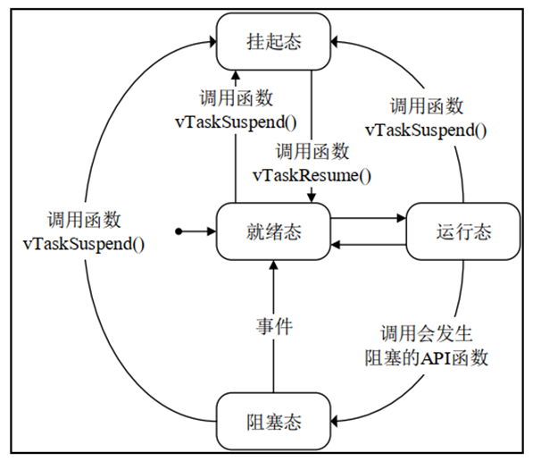

在这四种状态中，除了运行态，其他三种任务状态的任务都有其对应的任务状态列表：

- **就绪列表**：`pxReadyTasksLists[x]`，数组的下标对应任务的优先级，优先级越低，对应的数组下标越小。空闲任务的优先级最低，对应的是下标为 0 的链表。任务在创建时，会根据任务的优先级插入到就绪列表的不同位置。相同优先级的任务会插入到就绪列表中的同一条链表中。
- **阻塞列表**：`pxDelayedTaskList`
- **挂起列表**：`xSuspendedTaskList`

在程序中，可以使用`eTaskGetState()` API 函数，通过任务的句柄查询任务当前所处的状态。任务的状态由枚举类型`eTaskState`表示，具体如下：

```c
/**
  * @brief  查询一个任务当前处于什么状态
  * @param  pxTask：要查询任务状态的任务句柄，NULL表示查询自己
  * @retval 任务状态的枚举类型
  */
eTaskState eTaskGetState(TaskHandle_t pxTask);

/*任务状态枚举类型返回值*/
typedef enum
{
    eRunning = 0,    /* 任务正在查询自身的状态，因此肯定是运行状态 */
    eReady,          /* 就绪状态 */
    eBlocked,        /* 阻塞状态 */
    eSuspended,      /* 挂起状态 */
    eDeleted,        /* 正在查询的任务已被删除，但其TCB尚未释放 */
    eInvalid         /* 无效状态 */
} eTaskState;
```

## 源码函数命名规律

FreeRTOS 源码中的函数命名遵循一定的规律，并非随机命名，这样便于使用者通过函数名获取更多信息。函数名一般由三部分组成：①函数返回值类型简写，②函数所在文件，③函数作用名称。函数返回值类型简写

- `u`：表示`unsigned`
- `c`：表示`char`
- `s`：表示`int16_t(short)`
- `l`：表示`int32_t(long)`
- `p`：表示指针类型变量
- `x`：表示`BaseType_t`结构体和其他非标准类型的变量名
- `uc`：表示`UBaseType_t`结构体
- `v`：表示`void`
- `prv`：表示私有函数无返回值

这些简写可以自由组合，例如`pc`表示`char *`类型，`uc`表示`unsigned char`类型。

### 函数所在文件

- `CoRoutine`：表示该函数定义在`coroutine.c`文件中。
- `EventGroup`：表示该函数定义在`event_groups.c`文件中。
- `List`：表示该函数定义在`list.c`文件中。
- `Queue`：表示该函数定义在`queue.c`文件中。
- `StreamBuffer`：表示该函数定义在`stream_buffer.c`文件中。
- `Task`：表示该函数定义在`tasks.c`文件中。
- `Timer`：表示该函数定义在`timers.c`文件中。
- `Port`：表示该函数定义在`port.c`或`heap_x.c`文件中。

举几个例子：

- `xTaskCreate`：函数返回值为`BaseType_t`结构体类型，函数被定义在`tasks.c`文件中，函数作用为 “创建”。
- `vTaskSuspend`：函数返回值为`void`类型，函数被定义在`tasks.c`文件中，函数作用为 “挂起”。
- `prvTaskIsTaskSuspended`：该函数为私有函数，仅能在`tasks.c`文件中使用，函数作用为 “判断任务是否被挂起”。

# 任务创建和删除

## 一个最简单的任务函数

在 FreeRTOS 中，任务是一个永远不会退出的 C 函数，通常以无限循环的形式实现。它不允许以任何方式从实现函数中返回。如果一个任务不再需要，可以显式地将其删除。其典型的任务函数结构如下：

```c
/**
  * @brief  任务函数
  * @retval None
  */
void ATaskFunction(void *pvParameters)  
{
    /*初始化或定义任务需要使用的变量*/
    int iVariable = 0;
    
    for(;;)
    {
        /*完成任务的功能代码*/
    }
    /*跳出循环的任务需要被删除*/
    vTaskDelete(NULL);
}
```

## 创建任务函数

```c
/**
  * @brief  动态分配内存创建任务函数，需将宏 configSUPPORT_DYNAMIC_ALLOCATION 配置为 1 
  * @param  pxTaskCode：指向任务函数的指针，该函数为任务的具体执行逻辑
  * @param  pcName：任务名称，仅用于辅助调试，最大长度为 configMAX_TASK_NAME_LEN
  * @param  usStackDepth：任务堆栈大小，单位为字（word）
  * @param  pvParameters：传递给任务函数的参数
  * @param  uxPriority：任务优先级，范围为 0 到 configMAX_PRIORITIES - 1
  * @param  pxCreatedTask：任务句柄，后续可通过该句柄对任务进行删除、挂起等操作
  * @retval pdTRUE：任务创建成功；errCOULD_NOT_ALLOCATE_REQUIRED_MEMORY：因内存不足导致任务创建失败
  */
BaseType_t xTaskCreate(TaskFunction_t pxTaskCode,
                       const char * const pcName,
                       unsigned short usStackDepth,
                       void *pvParameters,
                       UBaseType_t uxPriority,
                       TaskHandle_t *pxCreatedTask);

/**
  * @brief  静态分配内存创建任务函数，需将宏 configSUPPORT_STATIC_ALLOCATION 配置为 1 
  * @param  pxTaskCode：任务函数，即任务的具体执行逻辑
  * @param  pcName：任务名称，用于调试参考
  * @param  usStackDepth：任务栈深度，单位为字（word）
  * @param  pvParameters：任务参数，传递给任务函数
  * @param  uxPriority：任务优先级，确定任务执行的先后顺序
  * @param  puxStackBuffer：任务栈空间数组，由用户提供
  * @param  pxTaskBuffer：任务控制块存储空间，由用户提供
  * @retval 创建成功的任务句柄，可用于后续操作任务
  */
TaskHandle_t xTaskCreateStatic(TaskFunction_t pxTaskCode,
                               const char * const pcName,
                               uint32_t ulStackDepth,
                               void *pvParameters,
                               UBaseType_t uxPriority,
                               StackType_t * const puxStackBuffer,
                               StaticTask_t * const pxTaskBuffer);
```

### 函数差异对比

上述两个任务创建函数存在以下几点不同。后续若无特殊需求，将统一采用动态分配内存的方式创建任务或其他实例。

1. **内存分配方式**：`xTaskCreateStatic` 在创建任务时，需要用户手动指定任务的任务控制块以及任务栈空间所需的内存；而 `xTaskCreate` 会动态分配任务的存储空间，无需用户手动指定。
2. **返回值与任务句柄处理**：`xTaskCreateStatic` 函数的返回值为成功创建的任务句柄；`xTaskCreate` 则需要在参数中提前定义并指定任务句柄，其函数返回值仅用于表示任务创建是否成功。

### 动态创建任务函数内部实现

此函数创建的任务会立即进入就绪态，由任务调度器调度运行，具体步骤如下：

1. **内存申请**：申请任务所需的堆栈内存和任务控制块内存。
2. **结构体赋值**：对任务控制块（TCB）结构体的成员进行赋值。
3. **添加到就绪列表**：将新创建的任务添加到就绪列表中。

### 任务控制块结构体成员介绍

```c
typedef struct tskTaskControlBlock
{
    volatile StackType_t    *pxTopOfStack;     /* 任务栈栈顶，必须为 TCB 的第一个成员 */
    ListItem_t              xStateListItem;    /* 任务状态列表项 */
    ListItem_t              xEventListItem;    /* 任务事件列表项 */
    UBaseType_t             uxPriority;        /* 任务优先级，数值越大，优先级越高 */
    StackType_t             *pxStack;          /* 任务栈起始地址 */
    char                    pcTaskName[ configMAX_TASK_NAME_LEN ]; /* 任务名字 */
    …
    // 省略很多条件编译的成员
} tskTCB;

typedef struct tskTaskControlBlock *TaskHandle_t;
```

`TaskHandle_t` 和 `tskTCB` 本质上都是用于表示任务控制块。任务栈栈顶与任务切换时的上下文保存和恢复密切相关；每个任务都有其独立的任务控制块，类似于任务的 “身份证”。

## 任务优先级

在 FreeRTOS 中，每个任务都有自己的优先级。该优先级可以在创建任务时通过参数传入，也可以在需要修改时使用 `vTaskPrioritySet()` API 函数进行动态设置。

### 优先级设置范围与方式

任务优先级的设置范围为 1 到 `configMAX_PRIORITIES - 1`，优先级数字越大，任务的优先级越高。设置优先级时，既可以直接使用数字，也可以使用内核定义好的枚举类型。另外，可以使用 `uxTaskPriorityGet()` API 函数获取任务的优先级。以下是部分优先级枚举类型的定义：

```c
/* cmsis_os2.c 中的定义 */
typedef enum {
  osPriorityNone          =  0,         ///< No priority (not initialized).
  osPriorityIdle          =  1,         ///< Reserved for Idle thread.
  osPriorityLow           =  8,         ///< Priority: low
  osPriorityNormal        = 24,         ///< Priority: normal
  osPriorityAboveNormal   = 32,         ///< Priority: above normal
  osPriorityHigh          = 40,         ///< Priority: high
  osPriorityRealtime      = 48,         ///< Priority: realtime
  osPriorityISR           = 56,         ///< Reserved for ISR deferred thread.
} osPriority_t;
```

### 优先级作用与相关函数

任务的优先级决定了在任务调度时，当多个任务同时处于就绪态，哪个任务将优先执行。FreeRTOS 调度器会确保在任何时刻，总是从所有可运行的任务中选择优先级最高的任务进入运行态。以下是设置和获取任务优先级函数的具体声明：

```c
/**
  * @brief  修改任务优先级
  * @param  pxTask：要修改优先级的任务句柄，传入 NULL 表示修改当前任务自身的优先级
  * @param  uxNewPriority：要设置的新任务优先级
  * @retval None
  */
void vTaskPrioritySet(TaskHandle_t pxTask, UBaseType_t uxNewPriority);

/**
  * @brief  获取任务优先级
  * @param  pxTask：要获取优先级的任务句柄，传入 NULL 表示获取当前任务自身的优先级
  * @retval 任务的优先级
  */
UBaseType_t uxTaskPriorityGet(TaskHandle_t pxTask);
```

## 延时函数

在学习 STM32 时，我们经常使用 HAL 库的延时函数 `HAL_Delay()`。在 FreeRTOS 中，也提供了 `vTaskDelay()` 和 `vTaskDelayUntil()` 两个 API 延时函数，具体如下：

```c
/**
  * @brief  延时函数
  * @param  xTicksToDelay：延迟的心跳周期数
  * @retval None
  */
void vTaskDelay(TickType_t xTicksToDelay);

/**
  * @brief  延时函数，用于实现任务的固定执行周期
  * @param  pxPreviousWakeTime：保存任务上一次离开阻塞态的时刻
  * @param  xTimeIncrement：指定任务执行的心跳周期数
  * @retval None
  */
void vTaskDelayUntil(TickType_t *pxPreviousWakeTime, TickType_t xTimeIncrement);
```

这两个 FreeRTOS 延时函数与 `HAL_Delay()` 都有延时的作用，但 FreeRTOS 延时函数 API 可以使任务进入阻塞状态，而 `HAL_Delay()` 不具备该功能。因此，当一个任务需要延时操作时，通常应使用 FreeRTOS 的 API 函数让任务进入阻塞状态等待延时结束，处于阻塞状态的任务会让出内核资源，以便处理其他任务。

对于 `vTaskDelayUntil()` API 函数的 `pxPreviousWakeTime` 参数，一般通过 `xTaskGetTickCount()` API 函数获取，该函数用于获取滴答信号的当前计数值，具体如下：

```c
/**
  * @brief  获取滴答信号当前计数值
  * @retval 滴答信号当前计数值
  */
TickType_t xTaskGetTickCount(void);

/**
  * @brief  获取滴答信号当前计数值的中断安全版本
  */
TickType_t xTaskGetTickCountFromISR(void);

/**
  * @brief  周期任务函数结构
  * @retval None
  */
void APeriodTaskFunction(void *pvParameters)  
{
    /* 获取任务创建后的滴答信号计数值 */
    TickType_t pxPreviousWakeTime = xTaskGetTickCount();

    for(;;)
    {
        /* 完成任务的功能代码 */

        /* 任务周期 500ms */
        vTaskDelayUntil(&pxPreviousWakeTime, pdMS_TO_TICKS(500));
    }
    /* 跳出循环的任务需要被删除 */
    vTaskDelete(NULL);
}
```

当一个任务因延时函数或其他同步事件进入阻塞状态后，可以使用 `xTaskAbortDelay()` API 函数终止其阻塞状态。即使任务等待的事件尚未发生，或者任务进入时指定的超时时间未到，也会使其进入就绪状态。具体函数描述如下：

```c
/**
  * @brief  终止任务延时，退出阻塞状态
  * @param  xTask：要操作的任务句柄
  * @retval pdPASS：任务成功从阻塞状态中移除；pdFALSE：任务不属于阻塞状态，移除失败
  */
BaseType_t xTaskAbortDelay(TaskHandle_t xTask);
```

## 为什么会有空闲任务？

### 概述

FreeRTOS 调度器要求在任何时刻处理器都必须有一个任务处于运行状态。当用户创建的所有任务都处于阻塞状态而无法运行时，空闲任务就会被调度运行。

空闲任务是一个优先级为 0（最低优先级）的简短循环，其低优先级确保不会影响更高优先级任务的运行。一旦有更高优先级的任务进入就绪态，空闲任务会立即退出运行态。

空闲任务在调用 `vTaskStartScheduler()` 启动调度器时会自动创建，此外，空闲任务还负责释放已删除任务所占用的系统分配内存。

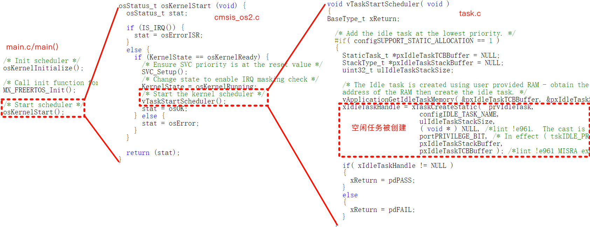

### 空闲任务钩子函数

空闲任务有一个钩子函数，可以通过将 `configUSE_IDLE_HOOK` 参数配置为 `Enable` 来启用。如果使用 STM32CubeMX 软件生成工程，会自动生成空闲任务钩子函数。当调度器调度内核进入空闲任务时，会调用该钩子函数。

通常，空闲任务钩子函数主要用于以下几种情况，以下是其典型的任务函数结构：

```c
/**
  * @brief  空闲任务钩子函数
  * @retval NULL
  */
void vApplicationIdleHook(void)
{
    /*
        1. 执行低优先级或后台需要持续处理的功能代码
        2. 测试系统处理裕量（内核执行空闲任务的时间越长，表示内核越空闲）
        3. 将处理器配置到低功耗模式（Tickless 模式）
    */
}
```

## 删除任务

当一个任务不再需要时，需要显式调用 `vTaskDelete()` API 函数将其删除。该函数需要传入要删除任务的句柄（传入 `NULL` 表示删除当前任务自身），函数声明如下：

```c
/**
  * @brief  任务删除函数，需将宏 `INCLUDE_vTaskDelete` 配置为 1 
  * @param  pxTaskToDelete：要删除的任务句柄，传入 NULL 表示删除当前任务自身
  * @retval None
  */
void vTaskDelete(TaskHandle_t pxTaskToDelete);
```

此函数用于删除已创建的任务，被删除的任务将从就绪态任务列表、阻塞态任务列表、挂起态任务列表和事件列表中移除。

### 注意事项

1. 当传入的参数为 `NULL` 时，表示删除当前正在运行的任务自身。
2. 空闲任务会负责释放被删除任务中由系统分配的内存，但用户在任务删除前自行申请的内存，需要在任务删除前手动释放，否则会导致内存泄漏。

### 删除任务函数的内部实现过程

1. **获取任务控制块**：根据传入的任务句柄，确定要删除的任务。若传入 `NULL`，则表示删除当前任务自身。
2. **移除任务列表**：将被删除的任务从其所在的列表中移除，包括就绪、阻塞、挂起和事件等列表。
3. **内存处理与任务数量更新**：如果删除的是当前任务自身，需先将其添加到等待删除列表，内存释放操作将在空闲任务中执行；如果删除的是其他任务，则直接释放其内存，并将任务数量减 1。
4. **更新阻塞时间**：更新下一个任务的阻塞超时时间，以防止被删除的任务恰好是下一个阻塞超时的任务。

# 中断管理

## 中断概述

### 中断的定义

中断是指让 CPU 暂时打断正在正常运行的程序，转而去处理更为紧急的事件（程序），处理完成后再返回原程序继续执行。

### 中断执行机制

中断执行机制可简单概括为以下三个步骤：

1. **中断请求**：外设产生中断请求，例如 GPIO 外部中断、定时器中断等。
2. **响应中断**：CPU 停止执行当前程序，转而执行对应的中断处理程序（ISR）。
3. **退出中断**：中断处理程序执行完毕后，CPU 返回被打断的程序处，继续往下执行。

## 中断优先级分组设置

### 中断优先级配置寄存器

ARM Cortex - M 使用 8 位宽的寄存器来配置中断的优先等级，该寄存器即中断优先级配置寄存器。不过，STM32 仅使用了该寄存器的高 4 位 [7 : 4]，因此 STM32 最多可提供 16 级的中断优先等级。

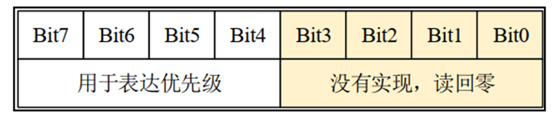

### 抢占优先级与子优先级

STM32 的中断优先级分为`抢占优先级`和`子优先级`：

- **抢占优先级**：抢占优先级高的中断能够打断正在执行但抢占优先级低的中断。
- **子优先级**：当两个具有相同抢占优先级的中断同时发生时，子优先级数值小的中断将优先执行。

需要注意的是，中断优先级数值越小，代表该中断越优先。

### 优先级分组方式

一共有 5 种分配方式，对应中断优先级分组的 5 个组，具体如下表所示：

| 优先级分组           | 抢占优先级          | 子优先级          | 优先级配置寄存器高 4 位                  |
| -------------------- | ------------------- | ----------------- | ---------------------------------------- |
| NVIC_PriorityGroup_0 | 0 级抢占优先级      | 0 - 15 级子优先级 | 0 bit 用于抢占优先级，4 bit 用于子优先级 |
| NVIC_PriorityGroup_1 | 0 - 1 级抢占优先级  | 0 - 7 级子优先级  | 1 bit 用于抢占优先级，3 bit 用于子优先级 |
| NVIC_PriorityGroup_2 | 0 - 3 级抢占优先级  | 0 - 3 级子优先级  | 2 bit 用于抢占优先级，2 bit 用于子优先级 |
| NVIC_PriorityGroup_3 | 0 - 7 级抢占优先级  | 0 - 1 级子优先级  | 3 bit 用于抢占优先级，1 bit 用于子优先级 |
| NVIC_PriorityGroup_4 | 0 - 15 级抢占优先级 | 0 级子优先级      | 4 bit 用于抢占优先级，0 bit 用于子优先级 |

由于 FreeRTOS 的中断配置未处理子优先级（即响应优先级）的情况，所以通常将其配置为组 4，这样直接拥有 16 个优先级，使用起来更为简便。在 `HAL_Init` 函数中调用 `HAL_NVIC_SetPriorityGrouping(NVIC_PRIORITYGROUP_4)` 即可完成设置。

### 分组设置特点

- 只有低于 `configMAX_SYSCALL_INTERRUPT_PRIORITY` 优先级的中断，才允许调用 FreeRTOS 的 API 函数。
- 建议将所有优先级位指定为抢占优先级位，以便于 FreeRTOS 进行管理。
- 中断优先级数值越小越优先，而任务优先级数值越大越优先。

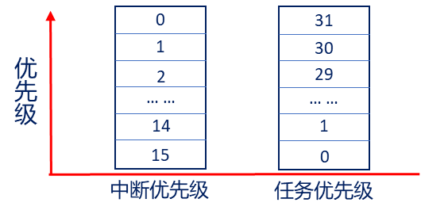

## 中断相关寄存器

### 系统中断优先级配置寄存器

有三个系统中断优先级配置寄存器，分别为 SHPR1、SHPR2 和 SHPR3，其寄存器地址如下：

- SHPR1 寄存器地址：0xE000ED18
- SHPR2 寄存器地址：0xE000ED1C
- SHPR3 寄存器地址：0xE000ED20

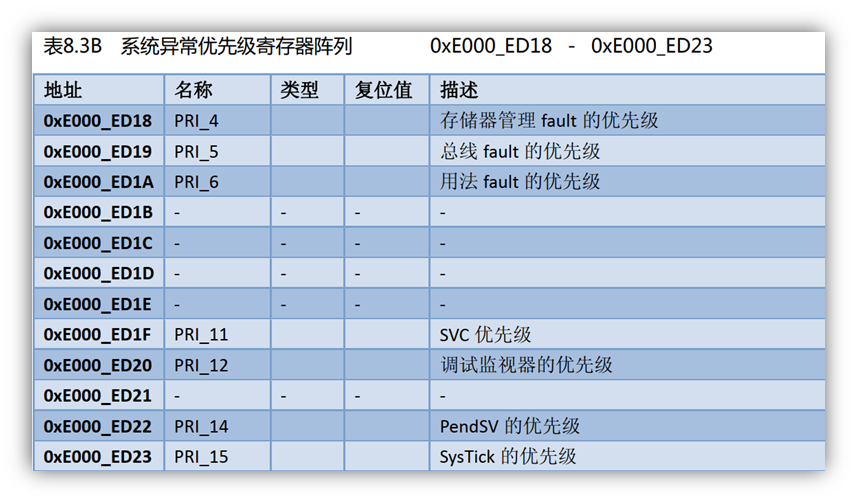

将 PendSV 和 SysTick 设置为最低优先级，其作用是保证系统任务切换不会阻塞系统其他中断的响应。

### 中断屏蔽寄存器

有三个中断屏蔽寄存器，分别为 PRIMASK、FAULTMASK 和 BASEPRI。

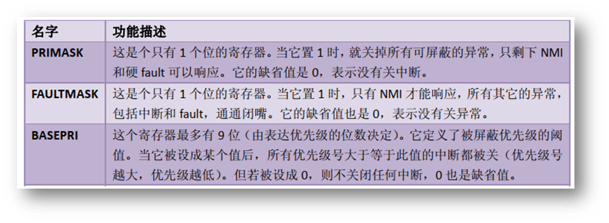

FreeRTOS 的中断管理主要利用的是 **BASEPRI** 寄存器。

### BASEPRI 寄存器

BASEPRI 寄存器用于屏蔽优先级低于某一阈值的中断。当将其设置为 0 时，则不关闭任何中断。

#### 关中断示例

```c
#define portDISABLE_INTERRUPTS()         vPortRaiseBASEPRI()
static portFORCE_INLINE void vPortRaiseBASEPRI( void )
{
    uint32_t ulNewBASEPRI = configMAX_SYSCALL_INTERRUPT_PRIORITY;
    __asm
    {
        msr basepri, ulNewBASEPRI
        dsb
        isb
    }
}
#define configMAX_SYSCALL_INTERRUPT_PRIORITY ( configLIBRARY_MAX_SYSCALL_INTERRUPT_PRIORITY << (8 - configPRIO_BITS) )
#define configLIBRARY_MAX_SYSCALL_INTERRUPT_PRIORITY     5   /* FreeRTOS可管理的最高中断优先级 */
```

中断优先级在5 ~ 15的全部被关闭

当BASEPRI设置为0x50时: 

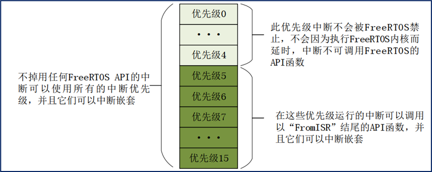

在中断服务函数中调度 FreeRTOS 的 API 函数时，需要注意以下两点：

1. 中断服务函数的优先级必须在 FreeRTOS 所管理的范围内。
2. 在中断服务函数中调用 FreeRTOS 的 API 函数时，必须使用带 `FromISR` 后缀的函数。

#### 开中断示例

```c
#define portENABLE_INTERRUPTS()         vPortSetBASEPRI( 0 )
static portFORCE_INLINE void vPortSetBASEPRI( uint32_t ulBASEPRI )
{
    __asm
    {
        msr basepri, ulBASEPRI
    }
}
```

FreeRTOS 的中断管理正是通过 BASEPRI 寄存器来实现的。

# 临界段代码保护

## 临界段代码保护概述

### 临界段代码的定义

临界段代码，也被称为临界区，是指那些必须完整执行、不能被中途打断的代码段。在程序运行过程中，这些代码的完整性对于系统的正常运行至关重要。

### 适用场景

临界段代码的保护适用于以下几种常见场合：

1. **外设操作**：对于一些需要严格按照特定时序进行初始化的外设，如 IIC、SPI 等，其初始化代码通常属于临界段代码。因为这些外设的初始化过程对时序要求极高，如果在初始化过程中被打断，可能会导致外设初始化失败，进而影响整个系统的正常工作。
2. **系统需求**：系统自身的某些操作可能也需要在临界段内完成。例如，系统在进行一些关键数据的读写操作时，为了保证数据的一致性和完整性，需要避免其他中断或任务调度的干扰。
3. **用户需求**：根据用户的特定需求，某些代码段也可能需要作为临界段进行保护。例如，用户自定义的一些关键算法或数据处理过程，不希望被其他操作打断。

### 可能打断程序运行的因素

在程序运行过程中，有两种主要因素可能会打断当前程序的执行，即中断和任务调度。中断是外部设备或内部事件触发的一种机制，会使 CPU 暂停当前程序的执行，转而处理中断服务程序；任务调度则是操作系统根据任务的优先级和状态，决定哪个任务可以获得 CPU 资源并执行。

## 临界段代码保护函数详解

### 原理说明

由于临界区代码的执行需要避免被中断干扰，而系统任务调度和中断服务程序（ISR）的执行都依赖于中断机制。因此，FreeRTOS 在进入临界段代码时会关闭中断，以确保临界段代码能够完整执行；当临界段代码处理完毕后，再重新打开中断，恢复系统的正常中断响应能力。

### 函数列表

FreeRTOS 提供了以下几个用于临界段代码保护的函数：

| 函数                            | 描述                                                         |
| ------------------------------- | ------------------------------------------------------------ |
| `taskENTER_CRITICAL()`          | （任务级）进入临界段，用于在任务代码中开启临界段保护。       |
| `taskEXIT_CRITICAL()`           | （任务级）退出临界段，与 `taskENTER_CRITICAL()` 配对使用，用于结束任务级的临界段保护。 |
| `taskENTER_CRITICAL_FROM_ISR()` | （中断级）进入临界段，用于在中断服务程序中开启临界段保护。   |
| `taskEXIT_CRITICAL_FROM_ISR()`  | （中断级）退出临界段，与 `taskENTER_CRITICAL_FROM_ISR()` 配对使用，用于结束中断级的临界段保护。 |

### 调用格式示例

#### 任务级临界区调用格式

```c
taskENTER_CRITICAL();
{
    // 临界区代码，这里放置需要保护的代码段
    … …
}
taskEXIT_CRITICAL();
```

#### 中断级临界区调用格式

```c
uint32_t save_status;
save_status = taskENTER_CRITICAL_FROM_ISR(); 
{
    // 临界区代码，这里放置需要保护的代码段
    … …
}
taskEXIT_CRITICAL_FROM_ISR(save_status);
```

### 函数使用特点

在使用这些临界段保护函数时，需要注意以下几个特点：

1. **成对使用**：`taskENTER_CRITICAL()` 与 `taskEXIT_CRITICAL()`、`taskENTER_CRITICAL_FROM_ISR()` 与 `taskEXIT_CRITICAL_FROM_ISR()` 必须成对出现，确保临界段的开启和关闭操作正确匹配，避免出现中断管理混乱的情况。
2. **支持嵌套**：这些函数支持嵌套使用，即在一个临界段内可以再次进入另一个临界段。在嵌套使用时，系统会正确处理中断的开关状态，确保临界段的保护逻辑正确。
3. **尽量缩短耗时**：由于临界段代码执行期间会关闭中断，可能会影响系统对其他中断的响应能力。因此，应尽量缩短临界段代码的执行时间，以减少对系统实时性的影响。

# 列表和列表项

## 列表和列表项的简介

### 基本概念

在 FreeRTOS 中，列表是一种重要的数据结构，其概念与链表相似，主要用于跟踪任务。而列表项则是存放在列表中的元素。

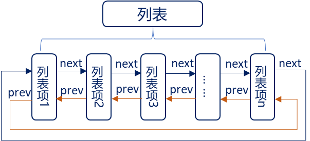

可以将列表类比为链表，列表项类比为链表中的节点。实际上，FreeRTOS 中的列表是一个双向环形链表。

### 列表与数组特点对比

列表具有以下特点：

- 列表项之间的地址并非连续，而是通过人为的方式连接在一起。
- 列表项的数量可根据后期添加的情况随时改变。

数组的特点则为：

- 数组成员的地址是连续的。
- 数组在初始化时确定了成员数量，后期无法更改。

由于操作系统中任务的数量不确定，且任务状态会发生变化，因此列表（链表）这种数据结构非常适合用于管理任务。

### 示例说明


列表结构体定义

与列表相关的代码主要位于 `list.c` 和 `list.h` 文件中。下面是 `list.h` 中定义的列表相关结构体：

```c
typedef struct xLIST
{
    listFIRST_LIST_INTEGRITY_CHECK_VALUE               /* 校验值 */
    volatile UBaseType_t uxNumberOfItems;              /* 列表中的列表项数量 */
    ListItem_t *configLIST_VOLATILE pxIndex;           /* 用于遍历列表项的指针 */
    MiniListItem_t xListEnd;                           /* 末尾列表项 */
    listSECOND_LIST_INTEGRITY_CHECK_VALUE              /* 校验值 */
} List_t;
```

### 结构体成员说明

1. **校验宏**：结构体中包含两个宏，它们是已知的常量。FreeRTOS 通过检查这两个常量的值，判断列表的数据在程序运行过程中是否遭到破坏。该功能主要用于调试，默认情况下是不开启的。
2. **`uxNumberOfItems`**：用于记录列表中列表项的个数（不包含 `xListEnd`）。
3. **`pxIndex`**：指向列表中的某个列表项，通常用于遍历列表中的所有列表项。
4. **`xListEnd`**：是一个迷你列表项，位于列表的末尾。

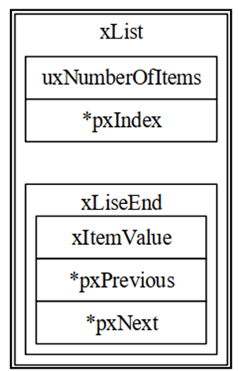

## 列表项结构解析

### 列表项结构体定义

列表项是列表中存放数据的单元，在 `list.h` 文件中有其相关结构体定义：

```c
struct xLIST_ITEM
{
    listFIRST_LIST_ITEM_INTEGRITY_CHECK_VALUE;         /* 用于检测列表项的数据完整性 */
    configLIST_VOLATILE TickType_t xItemValue;         /* 列表项的值 */
    struct xLIST_ITEM *configLIST_VOLATILE pxNext;     /* 下一个列表项 */
    struct xLIST_ITEM *configLIST_VOLATILE pxPrevious; /* 上一个列表项 */
    void *pvOwner;                                     /* 此列表项的任务控制块 */
    struct xLIST *configLIST_VOLATILE pxContainer;     /* 列表项所在列表 */
    listSECOND_LIST_ITEM_INTEGRITY_CHECK_VALUE;        /* 用于检测列表项的数据完整性 */
};
typedef struct xLIST_ITEM ListItem_t;
```

### 结构体成员说明

1. **`xItemValue`**：表示列表项的值，常用于按升序对列表中的列表项进行排序。
2. **`pxNext` 和 `pxPrevious`**：分别指向列表中该列表项的下一个和上一个列表项。
3. **`pvOwner`**：指向包含该列表项的对象，通常是任务控制块。
4. **`pxContainer`**：指向列表项所在的列表。

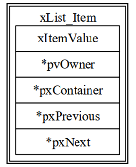

## 迷你列表项结构解析

### 迷你列表项结构体定义

迷你列表项同样属于列表项，但其仅用于标记列表的末尾以及挂载其他插入列表中的列表项。

```c
struct xMINI_LIST_ITEM
{
    listFIRST_LIST_ITEM_INTEGRITY_CHECK_VALUE;         /* 用于检测数据完整性 */
    configLIST_VOLATILE TickType_t xItemValue;         /* 列表项的值 */
    struct xLIST_ITEM *configLIST_VOLATILE pxNext;     /* 上一个列表项 */
    struct xLIST_ITEM *configLIST_VOLATILE pxPrevious; /* 下一个列表项 */
};
typedef struct xMINI_LIST_ITEM MiniListItem_t;
```

### 结构体成员说明

1. **`xItemValue`**：列表项的值，用于按升序对列表中的列表项进行排序。
2. **`pxNext` 和 `pxPrevious`**：分别指向列表中该列表项的下一个和上一个列表项。
3. **内存优化**：由于迷你列表项仅用于标记末尾和挂载其他列表项，因此不需要 `pxOwner` 和 `pxContainer` 成员变量，从而节省了内存开销。

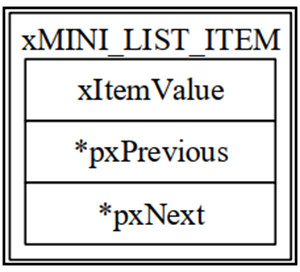

## 列表与列表项操作函数

### 初始化列表 `vListInitialise()`

```c
void vListInitialise(List_t *const pxList)
{
    // 初始化时，列表中只有 xListEnd，因此 pxIndex 指向 xListEnd
    pxList->pxIndex = (ListItem_t *) &(pxList->xListEnd);
    // xListEnd 的值初始化为最大值，用于列表项升序排序时排在最后
    pxList->xListEnd.xItemValue = portMAX_DELAY;
    // 初始化时，列表中只有 xListEnd，因此上一个和下一个列表项都为 xListEnd 本身
    pxList->xListEnd.pxNext = (ListItem_t *) &(pxList->xListEnd);
    pxList->xListEnd.pxPrevious = (ListItem_t *) &(pxList->xListEnd);
    // 初始化时，列表中的列表项数量为 0（不包含 xListEnd）
    pxList->uxNumberOfItems = (UBaseType_t) 0U;
    // 初始化用于检测列表数据完整性的校验值
    listSET_LIST_INTEGRITY_CHECK_1_VALUE(pxList);
    listSET_LIST_INTEGRITY_CHECK_2_VALUE(pxList);
}
```

初始化后的列表结构如下：

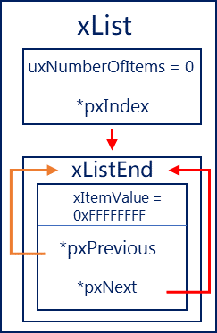

### 初始化列表项 `vListInitialiseItem()`

```c
void vListInitialiseItem(ListItem_t *const pxItem)
{
    // 初始化时，列表项所在列表设为空
    pxItem->pxContainer = NULL;
    // 初始化用于检测列表项数据完整性的校验值
    listSET_FIRST_LIST_ITEM_INTEGRITY_CHECK_VALUE(pxItem);
    listSET_SECOND_LIST_ITEM_INTEGRITY_CHECK_VALUE(pxItem);
}
```

初始化后的列表项结构如下：


### 列表项有序插入列表函数 `vListInsert()`

```c
/**
 * @brief  此函数用于将待插入列表的列表项按照列表项值升序进行排序，并有序地插入到列表中。
 * @param  pxList：目标列表。
 * @param  pxNewListItem：待插入的列表项。
 * @retval None
 */
void vListInsert(List_t *const pxList, ListItem_t *const pxNewListItem)
{
    ListItem_t *pxIterator;
    // 获取列表项的数值，依据该数值进行升序排列
    const TickType_t xValueOfInsertion = pxNewListItem->xItemValue;
    // 检查参数是否正确
    listTEST_LIST_INTEGRITY(pxList);
    // 检查待插入列表项的完整性
    listTEST_LIST_ITEM_INTEGRITY(pxNewListItem);

    // 如果待插入列表项的值为最大值
    if (xValueOfInsertion == portMAX_DELAY)
    {
        // 插入的位置为列表 xListEnd 前面
        pxIterator = pxList->xListEnd.pxPrevious;
    }
    else
    {
        // 遍历列表中的列表项，找到插入的位置
        for (pxIterator = (ListItem_t *) &(pxList->xListEnd);
             pxIterator->pxNext->xItemValue <= xValueOfInsertion;
             pxIterator = pxIterator->pxNext) { }
    }

    // 将待插入的列表项插入指定位置
    pxNewListItem->pxNext = pxIterator->pxNext;
    pxNewListItem->pxNext->pxPrevious = pxNewListItem;
    pxNewListItem->pxPrevious = pxIterator;
    pxIterator->pxNext = pxNewListItem;

    // 更新待插入列表项所在列表
    pxNewListItem->pxContainer = pxList;
    // 更新列表中列表项的数量
    (pxList->uxNumberOfItems)++;
}
```

### 列表项无序插入列表函数 `vListInsertEnd()`

```c
/**
 * @brief  此函数用于将待插入列表的列表项插入到列表 pxIndex 指针指向的列表项前面，是一种无序的插入方法。
 * @param  pxList：目标列表。
 * @param  pxNewListItem：待插入的列表项。
 * @retval None
 */
void vListInsertEnd(List_t *const pxList, ListItem_t *const pxNewListItem)
{
    // 获取列表 pxIndex 指向的列表项
    ListItem_t *const pxIndex = pxList->pxIndex;
    // 更新待插入列表项的指针成员变量
    pxNewListItem->pxNext = pxIndex;
    pxNewListItem->pxPrevious = pxIndex->pxPrevious;
    // 更新列表中原本列表项的指针成员变量
    pxIndex->pxPrevious->pxNext = pxNewListItem;
    pxIndex->pxPrevious = pxNewListItem;
    // 更新待插入列表项的所在列表成员变量
    pxNewListItem->pxContainer = pxList;
    // 更新列表中列表项的数量
    (pxList->uxNumberOfItems)++;
}
```

### 列表项移除函数 `uxListRemove()`

```c
/**
 * @brief  此函数用于将列表项从其所在列表中移除。
 * @param  pxItemToRemove：待移除的列表项。
 * @retval 待移除列表项移除后，所在列表剩余列表项的数量（整数）。
 */
UBaseType_t uxListRemove(List_t *const pxItemToRemove)
{
    // 获取待移除列表项所在的列表
    List_t *const pxList = pxItemToRemove->pxContainer;

    // 从列表中移除列表项
    pxItemToRemove->pxNext->pxPrevious = pxItemToRemove->pxPrevious;
    pxItemToRemove->pxPrevious->pxNext = pxItemToRemove->pxNext;

    // 如果 pxIndex 正指向待移除的列表项
    if (pxList->pxIndex == pxItemToRemove)
    {
        // pxIndex 指向上一个列表项
        pxList->pxIndex = pxItemToRemove->pxPrevious;
    }
    else
    {
        mtCOVERAGE_TEST_MARKER();
    }

    // 将待移除的列表项的所在列表指针清空
    pxItemToRemove->pxContainer = NULL;
    // 更新列表中列表项的数量
    (pxList->uxNumberOfItems)--;
    // 返回移除后的列表中列表项的数量
    return pxList->uxNumberOfItems;
}
```

# 任务调度

## 开启任务调度器

### vTaskStartScheduler()

此函数的作用是启动任务调度器。任务调度器启动后，FreeRTOS 就会开始进行任务调度。其内部实现步骤如下：

1. **创建空闲任务**：为系统提供一个最低优先级的任务，确保在没有其他任务可运行时，CPU 仍有任务可执行。
2. **创建定时器任务（若使能软件定时器）**：如果配置中使能了软件定时器功能，该步骤会创建定时器任务，用于管理软件定时器的计时和触发操作。
3. **关闭中断**：在调度器开启之前或过程中关闭中断，以防止中断干扰调度器的初始化过程。中断会在第一个任务开始运行时重新打开。
4. **初始化全局变量并设置运行标志**：对一些全局变量进行初始化操作，并将任务调度器的运行标志设置为已运行状态，表明调度器已成功启动。
5. **初始化任务运行时间统计功能的时基定时器**：为任务运行时间统计功能提供时间基准，方便后续对任务的运行时间进行统计和分析。
6. **调用 xPortStartScheduler () 函数**：该函数负责完成启动任务调度器中与硬件架构相关的配置部分，并启动第一个任务。

### xPortStartScheduler()

该函数的作用是完成启动任务调度器中与硬件架构相关的配置部分，以及启动第一个任务。其内部实现步骤如下：

1. **检测中断配置**：检查用户在 `FreeRTOSConfig.h` 文件中对中断的相关配置是否正确，确保后续中断操作的稳定性。
2. **配置中断优先级**：将 PendSV 和 SysTick 的中断优先级设置为最低优先级，避免它们干扰其他重要中断的处理。
3. **配置 SysTick**：调用 `vPortSetupTimerInterrupt()` 函数对 SysTick 定时器进行配置，为系统提供时间基准。
4. **初始化临界区嵌套计数器**：将临界区嵌套计数器初始化为 0，用于记录临界区的嵌套层数。
5. **使能 FPU**：调用 `prvEnableVFP()` 函数使能浮点运算单元（FPU），以支持浮点运算。
6. **启动第一个任务**：调用 `prvStartFirstTask()` 函数启动第一个任务，使系统开始执行任务调度。

## 启动第一个任务

### 启动思路

要启动第一个任务，例如任务 A，需要将任务 A 的寄存器值恢复到 CPU 寄存器中。这些寄存器值在任务创建时就已经保存在任务堆栈中。

### 注意事项

1. **寄存器出入栈规则**：当中断产生时，硬件会自动将 xPSR、PC（R15）、LR（R14）、R12、R3 - R0 进行出栈或入栈操作；而 R4 ~ R11 则需要手动进行出栈或入栈操作。
2. **MSP 指针使用**：进入中断后，硬件会强制使用主堆栈指针（MSP），此时 LR（R14）的值会自动更新为特殊的 EXC_RETURN。

### prvStartFirstTask()

该函数用于初始化启动第一个任务前的环境，主要是重新设置 MSP 指针，并使能全局中断。

#### MSP 指针介绍

在程序运行过程中，需要一定的栈空间来保存局部变量等信息。当有信息保存到栈中时，MCU 会自动更新 SP 指针。ARM Cortex - M 内核提供了两个栈空间：

- **主堆栈指针（MSP）**：由 OS 内核、异常服务例程以及所有需要特权访问的应用程序代码使用。
- **进程堆栈指针（PSP）**：用于常规的应用程序代码（不处于异常服务例程中时）。

在 FreeRTOS 中，中断使用 MSP（主堆栈），中断以外使用 PSP（进程堆栈）。

#### 获取 MSP 初始值的原因

需要从地址 0xE000ED08 获取向量表的偏移，这是因为向量表的第一个元素是 MSP 指针。具体思路是先根据向量表的位置寄存器 VTOR（0xE000ED08）获取向量表存储的地址，再根据该地址访问第一个元素，即初始的 MSP。CM3 允许向量表重定位，向量表偏移量寄存器用于记录向量表的起始地址，而该起始地址保存的就是主栈指针 MSP 的初始值。

### vPortSVCHandler()

需要注意的是，SVC 中断只在启动第一次任务时会调用一次，之后不再调用。当使能了全局中断并手动触发 SVC 中断后，会进入 SVC 的中断服务函数，其操作步骤如下：

1. **获取任务栈地址**：通过 `pxCurrentTCB` 获取优先级最高的就绪态任务的任务栈地址，该任务即为系统将要运行的任务。
2. **恢复寄存器值**：通过任务的栈顶指针，将任务栈中的内容出栈到 CPU 寄存器中。这些内容在调用任务创建函数时已经初始化，然后设置 PSP 指针。
3. **允许中断**：向 BASEPRI 寄存器中写入 0，允许中断的发生。
4. **EXC_RETURN 值说明**：R14 是链接寄存器 LR，在 ISR 中（此时处于 SVC 的 ISR 中），它记录了异常返回值 EXC_RETURN。EXC_RETURN 只有 6 个合法的值（M4、M7），具体如下表所示：

|                  描述                   | 使用浮点单元 | 未使用浮点单元 |
| :-------------------------------------: | :----------: | :------------: |
| 中断返回后进入 Handler 模式，并使用 MSP |  0xFFFFFFE1  |   0xFFFFFFF1   |
|   中断返回后进入线程模式，并使用 MSP    |  0xFFFFFFE9  |   0xFFFFFFF9   |
|   中断返回后进入线程模式，并使用 PSP    |  0xFFFFFFED  |   0xFFFFFFFD   |

## 出栈 / 压栈汇编指令详解

### 出栈（恢复现场）

出栈操作的方向是从下往上（低地址往高地址）。假设 r0 地址为 0x04，汇编指令示例如下：

收起

```asm
ldmia r0!, {r4 - r6}   /* 任务栈 r0 地址由低到高，将 r0 存储地址里面的内容手动加载到 CPU 寄存器 r4、r5、r6 */
```

具体操作过程为：

- 将 r0 地址（0x04）的内容加载到 r4，此时地址 r0 = r0 + 4 = 0x08。
- 将 r0 地址（0x08）的内容加载到 r5，此时地址 r0 = r0 + 4 = 0x0C。
- 将 r0 地址（0x0C）的内容加载到 r6，此时地址 r0 = r0 + 4 = 0x10。

### 压栈（保存现场）

压栈操作的方向是从上往下（高地址往低地址）。假设 r0 地址为 0x10，汇编指令示例如下：

收起

```asm
stmdb r0!, {r4 - r6}   /* r0 的存储地址由高到低递减，将 r4、r5、r6 里的内容存储到 r0 的任务栈里面。 */
```

具体操作过程为：

- 地址 r0 = r0 - 4 = 0x0C，将 r6 的内容（寄存器值）存放到 r0 所指向的地址（0x0C）。
- 地址 r0 = r0 - 4 = 0x08，将 r5 的内容（寄存器值）存放到 r0 所指向的地址（0x08）。
- 地址 r0 = r0 - 4 = 0x04，将 r4 的内容（寄存器值）存放到 r0 所指向的地址（0x04）。

## 任务切换

### 任务切换的本质

任务切换的本质是 CPU 寄存器的切换。当从任务 A 切换到任务 B 时，主要分为以下两步：

1. **保存现场**：暂停任务 A 的执行，并将此时任务 A 的寄存器保存到任务堆栈中。
2. **恢复现场**：将任务 B 的各个寄存器值（存储在任务堆栈中）恢复到 CPU 寄存器中。

将对任务 A 保存现场和对任务 B 恢复现场的整个过程称为 “上下文切换”。需要注意的是，任务切换的过程在 `PendSV 中断服务函数` 中完成。

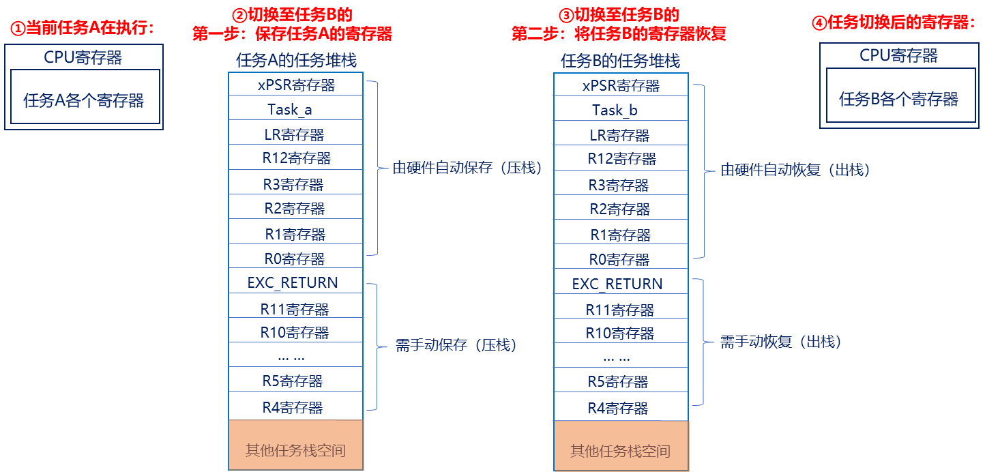

### PendSV 中断的触发方式

1. **滴答定时器中断调用**：滴答定时器中断会触发 PendSV 中断，从而引发任务切换。
2. **执行 FreeRTOS 相关 API 函数**：调用 `portYIELD()` 函数，本质上是通过向中断控制和状态寄存器 ICSR 的 bit28 写入 1 来挂起 PendSV，从而启动 PendSV 中断。

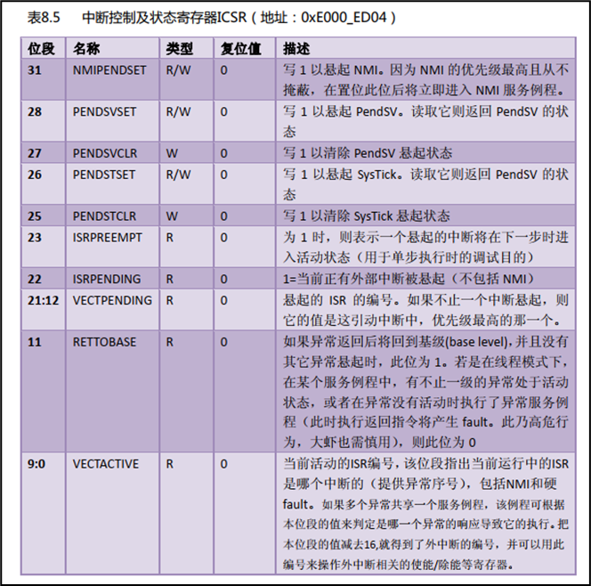

### PendSV 的任务切换操作（出栈，即恢复现场）

硬件会自动将 xPSR、PC（R15）、LR（R14）、R12、R3 - R0 使用 PSP 压入或出任务堆栈中。具体操作步骤如下：

```asm
ldr r3, =pxCurrentTCB 
ldr r2, [ r3 ] 
```

**获取当前运行任务的栈顶地址**：R2 保存的是栈顶地址，注意 R3 等于 `pxCurrentTCB` 的地址。

```asm
stmdb r0!, {r4 - r11, r14}
```

**压栈操作**：以 r0 的值作为压栈的起始地址，从上往下进行压栈。例如，先将 r14 的内容放入 r0 所指的内存地址，然后 r0 = r0 - 4，再将 r11 的内容存入，以此类推。压栈方向是从高地址到低地址，此时 r0 的值为所保存数据的最底部地址，通过该地址往上查找即可找到这些寄存器所保存的值。

```asm
str r0, [ r2 ] 
```

**保存栈顶地址**：将 r0 的值（前面的底部地址）存到 r2 地址所指向的内存中（即栈顶地址指向的内存，`pxTopOfStack` 中）。

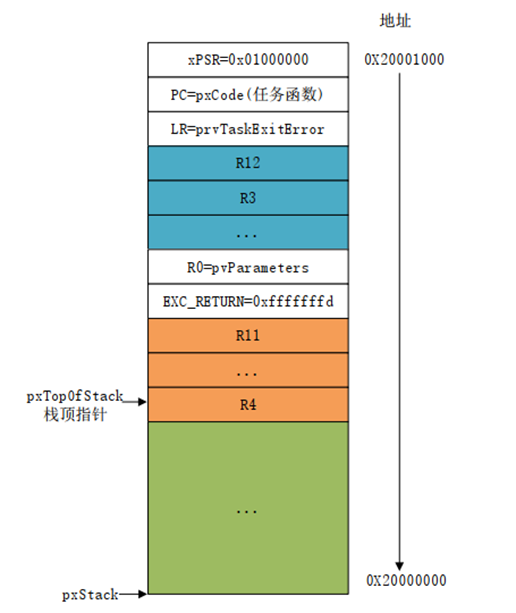

### PendSV 的任务切换操作（入栈，即保存现场）

在任务切换的入栈操作中，也就是保存现场的过程里，硬件会自动使用进程堆栈指针（PSP）对 xPSR、PC（R15）、LR（R14）、R12 以及 R3 - R0 这些寄存器进行压栈或出栈操作。下面详细介绍入栈阶段的具体步骤及对应的汇编代码：

```asm
bl vTaskSwitchContext
```

**获取下一个执行任务的任务控制块**
调用 `vTaskSwitchContext` 函数，其作用是根据任务调度算法，从就绪任务列表中挑选出下一个需要执行的任务，并将该任务的任务控制块（TCB）地址赋值给全局变量 `pxCurrentTCB`。这样，`pxCurrentTCB` 就指向了即将要运行的新任务的控制块。

```asm
ldr r1, [ r3]
ldr r0, [ r1 ] 
```

**获取入栈时保存的寄存器寻址地址**
之前已经提到，寄存器 `r3` 中存放的是 `pxCurrentTCB` 的地址。经过上述步骤后，`pxCurrentTCB` 已经指向了下一个要运行的任务控制块。执行 `ldr r1, [ r3]` 指令，会将 `pxCurrentTCB` 所指向的任务控制块的首地址加载到寄存器 `r1` 中。而任务控制块的首成员是栈顶地址 `pxTopOfStack`，所以此时 `r1` 指向的就是 `pxTopOfStack`。接着执行 `ldr r0, [ r1 ]` 指令，会从 `pxTopOfStack` 所指向的内存地址中取出一个值，并将其存放到寄存器 `r0` 中。这个值就是之前入栈操作时保存的寄存器寻址地址，也就是后续出栈操作的起始地址。

```asm
ldmia r0!, {r4-r11, r14}
```

**出栈操作恢复寄存器值**
使用 `ldmia`（Load Multiple Increment After）指令进行出栈操作。`ldmia r0!, {r4-r11, r14}` 表示从寄存器 `r0` 所指向的内存地址开始，按照低地址到高地址的顺序，依次将内存中的数据加载到寄存器 `r4` 到 `r11` 以及 `r14` 中。每加载一个数据，`r0` 的值会自动增加 4（因为每个寄存器的数据大小为 4 字节）。这样，就将之前保存的寄存器值从任务堆栈中恢复到了 CPU 的寄存器中。

```asm
msr psp, r0     /* 更新任务B的栈给PSP */
bx r14 
```

**更新 PSP 线程堆栈**
执行 `msr psp, r0` 指令，将寄存器 `r0` 的值更新到进程堆栈指针（PSP）中。此时，PSP 就指向了新任务的任务堆栈，后续的堆栈操作将基于这个新的堆栈进行。

**返回线程模式执行新任务**
执行 `bx r14` 指令，该指令会根据寄存器 `r14`（链接 4`（链接寄存器 LR）中保存的返回地址，返回到线程模式，并开始执行新任务。此时，任务切换完成，系统开始运行下一个任务。


# 任务状态查询 API 函数介绍

在 FreeRTOS 中，提供了一系列用于查询任务状态和相关信息的 API 函数，下面将详细介绍这些函数的功能、参数和返回值。

## 任务优先级相关函数

### uxTaskPriorityGet

```c
/**
 * @brief  此函数用于获取指定任务的任务优先级。使用该函数需将宏 INCLUDE_uxTaskPriorityGet 置为 1。
 * @param  xTask：要查找的任务句柄。若传入 NULL，则代表获取当前任务自身的优先级。
 * @retval 任务优先级数值（整数）。
 */
UBaseType_t uxTaskPriorityGet(const TaskHandle_t xTask)
```

### vTaskPrioritySet

```c
/**
 * @brief  此函数用于改变某个任务的任务优先级。使用该函数需将宏 INCLUDE_vTaskPrioritySet 置为 1。
 * @param  xTask：要查找的任务句柄。若传入 NULL，则代表改变当前任务自身的优先级。
 * @param  uxNewPriority：需要设置的任务优先级。
 * @retval None
 */
void vTaskPrioritySet(TaskHandle_t xTask, UBaseType_t uxNewPriority)
```

## 任务数量查询函数

### uxTaskGetNumberOfTasks

```c
/**
 * @brief  此函数用于获取系统中任务的数量。
 * @param  None
 * @retval 系统中任务的数量（整数）。
 */
UBaseType_t uxTaskGetNumberOfTasks(void)
```

## 系统任务状态信息获取函数

### uxTaskGetSystemState

```c
/**
 * @brief  此函数用于获取系统中所有任务的任务状态信息。使用该函数需将宏 configUSE_TRACE_FACILITY 置为 1。
 * @param  xTaskStatusArray：指向 TaskStatus_t 结构体数组首地址，用于存储获取到的任务状态信息。
 * @param  uxArraySize：接收信息的数组大小，确保数组有足够的空间存储所有任务的信息。
 * @param  pulTotalRunTime：系统总运行时间。若为 NULL，则省略总运行时间值。
 * @retval 获取信息的任务数量（整数）。
 */
UBaseType_t uxTaskGetSystemState(TaskStatus_t *const pxTaskStatusArray,
                                 const UBaseType_t uxArraySize,
                                 configRUN_TIME_COUNTER_TYPE *const pulTotalRunTime )
```

### TaskStatus_t 结构体

```c
typedef struct xTASK_STATUS
{
    TaskHandle_t                 xHandle;                      /* 任务句柄 */ 
    const char *                 pcTaskName;                   /* 任务名 */ 
    UBaseType_t                  xTaskNumber;                  /* 任务编号 */ 
    eTaskState                   eCurrentState;                /* 任务状态 */ 
    UBaseType_t                  uxCurrentPriority;            /* 任务当前优先级 */ 
    UBaseType_t                  uxBasePriority;               /* 任务原始优先级 */ 
    configRUN_TIME_COUNTER_TYPE  ulRunTimeCounter;             /* 任务运行时间 */
    StackType_t *                pxStackBase;                  /* 任务栈基地址 */ 
    configSTACK_DEPTH_TYPE       usStackHighWaterMark;         /* 任务栈历史剩余最小值 */ 
} TaskStatus_t;
```

### vTaskGetInfo


```c
/**
 * @brief  此函数用于获取指定的单个任务的状态信息。使用该函数需将宏 configUSE_TRACE_FACILITY 置为 1。
 * @param  xTask：指定获取信息的任务的句柄。
 * @param  pxTaskStatus：接收任务信息的变量，类型为 TaskStatus_t 结构体。
 * @param  xGetFreeStackSpace：任务栈历史剩余最小值标识。当为 pdFALSE 则跳过检查历史剩余最小堆栈；当为 pdTRUE 则检查。
 * @param  eState：任务状态，可直接赋值。如想获取实际状态，代入 eInvalid。
 * @retval None
 */
void vTaskGetInfo(TaskHandle_t xTask, 
                  TaskStatus_t *pxTaskStatus,
                  BaseType_t xGetFreeStackSpace, 
                  eTaskState eState)
```

### eTaskState 枚举类型

```c
typedef enum
{   
    eRunning = 0,   /* 运行态：任务正在 CPU 上执行 */ 
    eReady,         /* 就绪态：任务已准备好执行，等待调度器分配 CPU 时间 */ 
    eBlocked,       /* 阻塞态：任务因等待某个事件（如信号量、消息队列等）而暂停执行 */ 
    eSuspended,     /* 挂起态：任务被显式挂起，需要手动恢复才能继续执行 */ 
    eDeleted,       /* 任务被删除：任务已被从系统中移除 */ 
    eInvalid        /* 无效：表示状态无效或未定义 */ 
} eTaskState;
```

### 获取任务句柄相关函数

#### xTaskGetCurrentTaskHandle

```c
/**
  * @brief  此函数用于获取当前正在执行任务的任务句柄。使用该函数需将宏 INCLUDE_xTaskGetCurrentTaskHandle 置为 1。
  * @param  None
  * @retval 当前任务的任务句柄
  */
TaskHandle_t xTaskGetCurrentTaskHandle(void)
```

#### xTaskGetHandle

```c
/**
  * @brief  此函数用于通过任务名获取对应的任务句柄。使用该函数需将宏 INCLUDE_xTaskGetHandle 置为 1。
  * @param  pcNameToQuery：要查询的任务名
  * @retval 若找到对应任务，返回该任务的任务句柄；若未找到，返回 NULL
  */
TaskHandle_t xTaskGetHandle(const char *pcNameToQuery)
```

### 获取任务栈信息函数

#### uxTaskGetStackHighWaterMark

```c
/**
  * @brief  此函数用于获取指定任务的任务栈历史最小剩余堆栈。使用该函数需将宏 INCLUDE_uxTaskGetStackHighWaterMark 置为 1。
  * @param  xTask：要查询的任务句柄
  * @retval 任务栈的历史剩余最小值，可用于评估任务栈的使用情况
  */
UBaseType_t uxTaskGetStackHighWaterMark(TaskHandle_t xTask)
```

### 查询任务运行状态函数

#### eTaskGetState

```c
/**
  * @brief  此函数用于查询某个任务的运行状态。使用此函数需将宏 INCLUDE_eTaskGetState 置为 1。
  * @param  xTask：待获取状态任务的任务句柄
  * @retval 任务的当前状态，类型为 eTaskState 枚举值
  */
eTaskState eTaskGetState(TaskHandle_t xTask)
```

### 以表格形式获取系统任务信息函数

#### vTaskList

```c
/**
  * @brief  此函数用于以表格的形式获取系统中所有任务的信息。使用此函数需将宏 configUSE_TRACE_FACILITY 和 configUSE_STATS_FORMATTING_FUNCTIONS 置为 1。
  * @param  pcWriteBuffer：用于接收任务信息的缓存指针，需要确保缓存空间足够大
  * @retval None
  */
void vTaskList(char *pcWriteBuffer)
```

调用该函数后，会将系统中所有任务的相关信息以表格形式存储在 `pcWriteBuffer` 中。表格各列信息说明如下：

- **Name**：创建任务时给任务分配的名字，方便识别不同任务。
- **State**：任务的状态信息，其中 `B` 表示阻塞态，`R` 表示就绪态，`S` 表示挂起态，`D` 表示删除态。
- **Priority**：任务优先级，反映了任务在调度时的执行顺序。
- **Stack**：任务堆栈的`高水位线`，即堆栈历史最小剩余大小，可用于评估任务栈的使用情况。
- **Num**：任务编号，这个编号是唯一的。当多个任务使用同一个任务名的时候可以通过此编号来做区分。 

表格如下所示: 

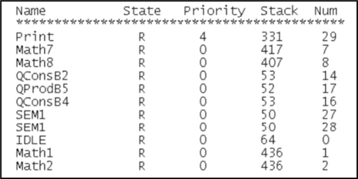

### 任务运行时间统计函数

```c
/**
 * @brief  此函数用于统计任务的运行时间信息。使用该函数需将宏 configGENERATE_RUN_TIME_STAT 和 configUSE_STATS_FORMATTING_FUNCTIONS 置为 1。
 * @param  pcWriteBuffer：接收任务运行时间信息的缓存指针，需确保该缓存有足够空间存储统计信息。
 * @retval None
 */
void vTaskGetRunTimeStats(char *pcWriteBuffer)
```

调用此函数后，会将各个任务的运行时间信息存储在 `pcWriteBuffer` 中。这些信息包含以下内容：

- **Task**：任务名称，即创建任务时为其指定的标识名称。
- **Abs Time**：任务实际运行的总时间（绝对时间），反映了任务从开始到统计时刻实际占用 CPU 的时间。
- **% Time**：任务运行时间占总处理时间的百分比，可直观地看出每个任务在系统中占用 CPU 资源的比例。

运行时间统计信息通常以表格形式呈现，示例如下：

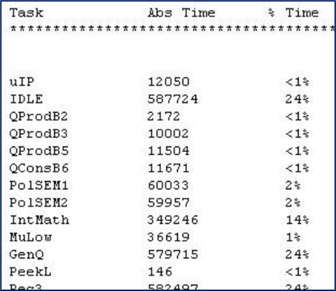

#### 时间统计 API 函数使用流程

要使用 `vTaskGetRunTimeStats` 函数进行任务运行时间统计，需要按照以下步骤进行配置：

#### 1. 启用宏定义

首先，需要将以下两个宏定义置为 1：

- `configGENERATE_RUN_TIME_STATS`：该宏用于启用任务运行时间统计功能。
- `configUSE_STATS_FORMATTING_FUNCTIONS`：该宏用于启用统计信息格式化功能，确保统计信息以易读的表格形式输出。

#### 2. 实现必要的宏定义

当将 `configGENERATE_RUN_TIME_STAT` 置为 1 之后，还需要实现以下两个宏定义：

##### ① `portCONFIGURE_TIMER_FOR_RUNTIME_STATE()`

此宏用于初始化用于配置任务运行时间统计的时基定时器。该时基定时器用于精确记录任务的运行时间，其计时精度需高于系统时钟节拍精度的 10 至 100 倍。这是因为更高的计时精度可以提供更准确的任务运行时间统计结果，避免因精度不足而导致统计误差。

##### ② `portGET_RUN_TIME_COUNTER_VALUE()`

该宏用于获取该功能时基硬件定时器计数的计数值。通过获取这个计数值，可以计算出任务的实际运行时间。

按照以上步骤进行配置后，就可以使用 `vTaskGetRunTimeStats` 函数准确地统计任务的运行时间信息了。

# 时间管理

## 延时函数介绍

在 FreeRTOS 中，提供了两种常用的延时函数，它们各自适用于不同的应用场景，具体信息如下表所示：

| 函数                | 描述     |
| ------------------- | -------- |
| `vTaskDelay()`      | 相对延时 |
| `xTaskDelayUntil()` | 绝对延时 |

### 相对延时与绝对延时的概念

- **相对延时**：使用 `vTaskDelay()` 函数进行的延时操作属于相对延时。每次调用该函数时，延时是从函数执行的那一刻开始计算，直到达到指定的延时时间结束。这种延时方式简单直接，适用于对时间精度要求不高，只需要在某个操作后进行固定时长等待的场景。

- **绝对延时**：`xTaskDelayUntil()` 函数实现的是绝对延时。它将整个任务的运行周期看作一个整体，适用于需要按照固定频率周期性运行的任务。使用该函数可以确保任务以稳定的时间间隔执行，不受任务执行时间波动的影响。

    ### 绝对延时示例图示分析

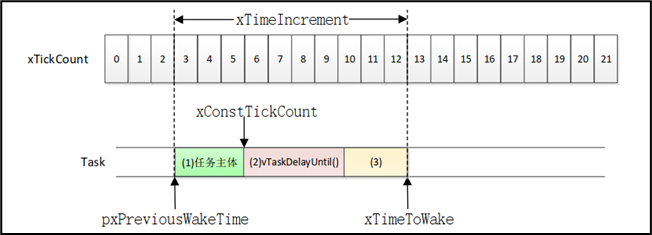

结合上图，对绝对延时的工作流程进行详细说明：

- **任务主体（区域 (1)）**：这部分是任务真正要执行的核心工作。在一个任务的运行周期内，这是实现具体功能的代码部分，比如数据采集、算法处理等。
- **延时操作（区域 (2)）**：在任务函数中调用 `xTaskDelayUntil()` 函数对任务进行延时。该函数会根据预先设定的时间间隔，精确控制任务的下一次执行时间，从而保证任务以固定的周期运行。
- **其他任务运行（区域 (3)）**：在当前任务进行延时期间，CPU 可以调度执行其他任务，充分利用系统资源，提高系统的并发处理能力。这样，系统可以同时处理多个任务，实现高效的多任务调度。

# 消息队列

## 队列简介

队列是 FreeRTOS 中实现任务与任务、任务与中断之间数据交流（消息传递）的重要机制。基于队列，FreeRTOS 实现了多种功能，如队列集、互斥信号量、计数型信号量、二值信号量以及递归互斥信号量等。因此，深入了解 FreeRTOS 的队列机制十分必要。

队列在读写操作上进行了保护，可有效防止多任务同时访问时产生冲突。开发者只需直接调用相关 API 函数，即可轻松实现队列操作，使用起来简单便捷。

队列用于存储数量有限、大小固定的数据，队列中的每个数据被称为 “队列项目”，队列能够存储 “队列项目” 的最大数量则被定义为队列的长度。

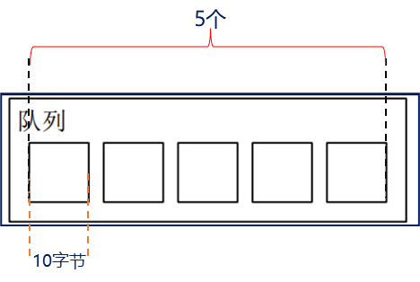

如图所示，该队列的相关参数为：

1. **队列长度**：可容纳 5 个队列项目。
2. **队列项目大小**：每个队列项目的大小为 10 字节。

需要注意的是，在创建队列时，必须明确指定队列长度以及队列项目的大小。

### 队列特点

1. **数据入队出队方式**：队列通常采用 “先进先出”（FIFO）的数据存储缓冲机制，即先进入队列的数据会优先被读取出来。不过，在 FreeRTOS 中，也可以将队列配置为 “后进先出”（LIFO）方式。

2. **数据传递方式**：FreeRTOS 中的队列采用实际值传递的方式，即将数据拷贝到队列中进行传递。当然，也可以传递指针，当需要传递较大的数据时，使用指针传递可以提高效率。

3. **多任务访问**：队列并不专属于某个特定的任务，任何任务和中断都可以向队列发送或读取消息，实现数据的共享和交互。

4. 出队、入队阻塞

    ：当任务向一个队列发送消息时，可以指定一个阻塞时间。假设此时队列已满，无法进行入队操作，不同的阻塞时间设置会有不同的处理方式：

    - **阻塞时间为 0**：任务将直接返回，不会进行等待。
    - **阻塞时间为 0 ~ port_MAX_DELAY**：任务会等待设定的阻塞时间，如果在该时间内仍然无法入队，超时后将直接返回，不再继续等待。
    - **阻塞时间为 port_MAX_DELAY**：任务会一直等待，直到队列有空间可以入队为止。出队阻塞的情况与入队阻塞类似。

### 入队阻塞


当队列已满，无法写入数据时，会发生入队阻塞。此时，系统会进行以下操作：

1. 将该任务的状态列表项挂载在 `pxDelayedTaskList` 上。
2. 将该任务的事件列表项挂载在 `xTasksWaitingToSend` 上。

### 出队阻塞

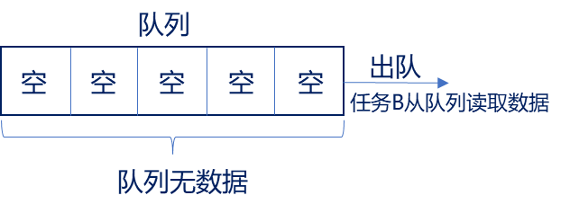

当队列为空，无法读取数据时，会发生出队阻塞。此时，系统会进行以下操作：

1. 将该任务的状态列表项挂载在 `pxDelayedTaskList` 上。
2. 将该任务的事件列表项挂载在 `xTasksWaitingToReceive` 上。

##    队列操作基本过程

①创建队列

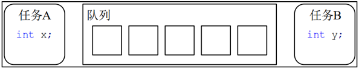

②往队列写入第一个消息

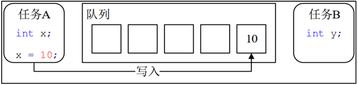

③往队列写入第二个消息

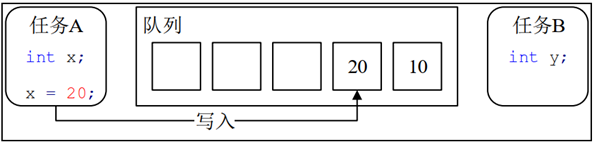

④从队列读取第一个消息

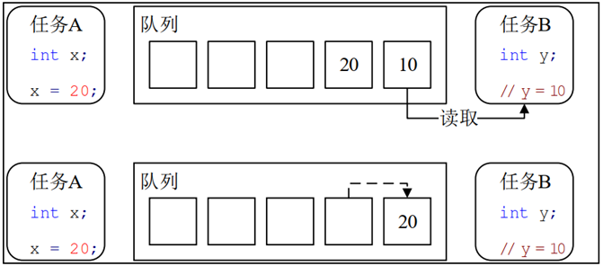

## 队列结构体介绍

```c
typedef struct QueueDefinition 
{
    int8_t * pcHead;                        /* 存储区域的起始地址，标识队列数据存储的起始位置 */
    int8_t * pcWriteTo;                     /* 下一个写入的位置，指示新数据将被写入的地址 */
    union
    {
        QueuePointers_t     xQueue; 
        SemaphoreData_t  xSemaphore; 
    } u;
    /* 联合体 u 用于根据不同的使用场景，存储队列相关指针或信号量数据 */
    List_t xTasksWaitingToSend;             /* 等待发送列表，记录等待向该队列发送数据的任务 */
    List_t xTasksWaitingToReceive;          /* 等待接收列表，记录等待从该队列接收数据的任务 */
    volatile UBaseType_t uxMessagesWaiting; /* 非空闲队列项目的数量，即当前队列中已有的数据项数量 */
    UBaseType_t uxLength;                   /* 队列长度，定义了队列最多能容纳的数据项数量 */
    UBaseType_t uxItemSize;                 /* 队列项目的大小，每个数据项占用的字节数 */
    volatile int8_t cRxLock;                /* 读取上锁计数器，用于控制队列读取操作的并发访问 */
    volatile int8_t cTxLock;                /* 写入上锁计数器，用于控制队列写入操作的并发访问 */
    /* 其他的一些条件编译 */
} xQUEUE;
```

### 不同使用场景下的子结构体

#### 队列使用场景

当该结构体用于队列功能时，使用 `QueuePointers_t` 结构体：

```c
typedef struct QueuePointers
{
    int8_t * pcTail;                 /* 存储区的结束地址，标记队列数据存储的末尾位置 */
    int8_t * pcReadFrom;             /* 最后一个读取队列的地址，指示下次读取操作的起始位置 */
} QueuePointers_t;
```

#### 互斥信号量和递归互斥信号量使用场景

当用于互斥信号量和递归互斥信号量功能时，使用 `SemaphoreData_t` 结构体：

```c
typedef struct SemaphoreData
{
    TaskHandle_t xMutexHolder;        /* 互斥信号量持有者，记录当前持有互斥信号量的任务句柄 */
    UBaseType_t uxRecursiveCallCount; /* 递归互斥信号量的获取计数器，用于递归调用时的计数 */
} SemaphoreData_t;
```

### 队列结构体整体示意图

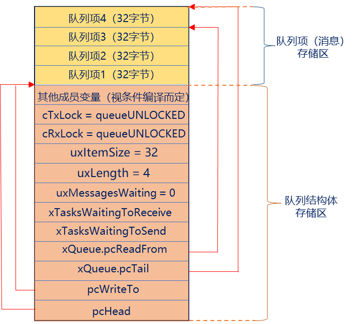

### 队列使用主要流程

使用队列的主要流程为：创建队列 -> 写队列 -> 读队列。

## 创建队列

在使用队列之前，必须先对其进行创建。和创建任务类似，FreeRTOS 提供了两种创建队列的方式，分别是动态内存分配和静态内存分配，下面是具体的 API 函数声明。

```c
/**
 * @brief  该函数通过动态分配内存的方式创建队列。
 * 
 * 此函数会在堆内存中分配足够的空间，用于存储队列的数据结构和数据项。
 * 
 * @param  uxQueueLength：队列深度，即队列能够容纳的数据项数量。
 * @param  uxItemSize：队列中每个数据单元的长度，以字节为单位。
 * @retval 返回创建成功的队列句柄。若返回 NULL，则表明因内存不足，队列创建失败。
 */
QueueHandle_t xQueueCreate(UBaseType_t uxQueueLength, UBaseType_t uxItemSize);

/**
 * @brief  该函数采用静态分配内存的方式创建队列。
 * 
 * 此函数使用用户预先分配好的内存空间来存储队列的数据结构和数据项。
 * 
 * @param  uxQueueLength：队列深度，指定队列可容纳的数据项数量。
 * @param  uxItemSize：队列中每个数据单元的长度，单位为字节。
 * @param  pucQueueStorageBuffer：队列栈空间数组，为队列数据提供存储区域。
 * @param  pxQueueBuffer：指向 StaticQueue_t 类型的变量，用于保存队列的数据结构。
 * @retval 返回创建成功的队列句柄。若返回 NULL，则意味着因内存不足，队列创建失败。
 */
QueueHandle_t xQueueCreateStatic(UBaseType_t uxQueueLength,
                                 UBaseType_t uxItemSize,
                                 uint8_t *pucQueueStorageBuffer,
                                 StaticQueue_t *pxQueueBuffer);

/* 示例：创建一个队列长度为 5，队列项目大小为 2 字节的队列 */
QueueHandle_t QueueHandleTest;
QueueHandleTest = xQueueCreate(5, sizeof(uint16_t));
```


前面提到，FreeRTOS 基于队列实现了多种功能，每种功能都对应一种特定的队列类型。这些队列类型在 `queue.h` 文件中进行了定义：

```c
#define queueQUEUE_TYPE_BASE              ( ( uint8_t ) 0U )    /* 普通队列 */
#define queueQUEUE_TYPE_SET               ( ( uint8_t ) 0U )    /* 队列集 */
#define queueQUEUE_TYPE_MUTEX             ( ( uint8_t ) 1U )    /* 互斥信号量 */
#define queueQUEUE_TYPE_COUNTING_SEMAPHORE ( ( uint8_t ) 2U )    /* 计数型信号量 */
#define queueQUEUE_TYPE_BINARY_SEMAPHORE  ( ( uint8_t ) 3U )    /* 二值信号量 */
#define queueQUEUE_TYPE_RECURSIVE_MUTEX   ( ( uint8_t ) 4U )    /* 递归互斥信号量 */
```

## 向队列写入数据

在 FreeRTOS 系统里，任务或者中断向队列写入数据的操作被称为发送消息。通常而言，队列遵循 FIFO（先入先出）规则，即数据从队列尾部进入，从队列头部读出。不过，通过改变写入方式，队列也能以 LIFO（后入先出）的方式工作。

以下是向队列中写入数据的主要三组 FreeRTOS API 函数：

```c
/**
  * @brief  向队列后方发送数据（FIFO先入先出）
  * @param  xQueue：要写入数据的队列句柄
  * @param  pvItemToQueue：要写入的数据
  * @param  xTicksToWait：阻塞超时时间，单位为节拍数，portMAXDELAY表示无限等待
  * @retval pdPASS：数据发送成功，errQUEUE_FULL：队列满无法写入
  */
BaseType_t xQueueSend(QueueHandle_t xQueue,
                      const void * pvItemToQueue,
                      TickType_t xTicksToWait);

/**
  * @brief  向队列后方发送数据（FIFO先入先出），与xQueueSend()函数一致
  */
BaseType_t xQueueSendToBack(QueueHandle_t xQueue,
                            const void * pvItemToQueue,
                            TickType_t xTicksToWait);

/**
  * @brief  向队列前方发送数据（LIFO后入先出）
  */
BaseType_t xQueueSendToFront(QueueHandle_t xQueue,
                             const void * pvItemToQueue,
                             TickType_t xTicksToWait);

/**
  * @brief  以下三个函数为上述三个函数的中断安全版本
  * @param  pxHigherPriorityTaskWoken：用于通知应用程序编写者是否应该执行上下文切换
  */
BaseType_t xQueueSendFromISR(QueueHandle_t xQueue,
                             const void *pvItemToQueue,
                             BaseType_t *pxHigherPriorityTaskWoken);

BaseType_t xQueueSendToBackFromISR(QueueHandle_t xQueue,
                                   const void *pvItemToQueue,
                                   BaseType_t *pxHigherPriorityTaskWoken);

BaseType_t xQueueSendToFrontFromISR(QueueHandle_t xQueue,
                                    const void *pvItemToQueue,
                                    BaseType_t *pxHigherPriorityTaskWoken);
```

另外，还有一组特殊的向队列写入数据的 FreeRTOS API 函数。这组函数仅适用于队列长度为 1 的队列，在队列已满时会覆盖队列原来的数据，具体如下：

```c
/**
  * @brief  向长度为1的队发送数据
  * @param  xQueue：要写入数据的队列句柄
  * @param  pvItemToQueue：要写入的数据
  * @retval pdPASS：数据发送成功，errQUEUE_FULL：队列满无法写入
  */
BaseType_t xQueueOverwrite(QueueHandle_t xQueue, const void *pvItemToQueue);

/**
  * @brief  以下函数为上述函数的中断安全版本
  * @param  pxHigherPriorityTaskWoken：用于通知应用程序编写者是否应该执行上下文切换
  */
BaseType_t xQueueOverwriteFromISR(QueueHandle_t xQueue,
                                  const void *pvItemToQueue,
                                  BaseType_t *pxHigherPriorityTaskWoken);
```

队列写入消息


值得注意的是，上述几个写入函数实际上都调用了同一个函数 `xQueueGenericSend()`，只是指定了不同的写入位置。队列一共有 3 种写入位置，具体定义如下：

```c
#define queueSEND_TO_BACK                         ( ( BaseType_t ) 0 )        /* 写入队列尾部 */
#define queueSEND_TO_FRONT                        ( ( BaseType_t ) 1 )        /* 写入队列头部 */
#define queueOVERWRITE                            ( ( BaseType_t ) 2 )        /* 覆写队列*/
```

## 从队列接收数据

在 FreeRTOS 中，任务或者中断从队列中读取数据的操作称为接收消息。从队列中读取数据主要有两组 FreeRTOS API 函数，具体如下：

```c
/**
  * @brief  从队列头部接收数据单元，接收的数据同时会从队列中删除
  * @param  xQueue：被读队列句柄
  * @param  pvBuffer：接收缓存指针
  * @param  xTicksToWait：阻塞超时时间，单位为节拍数
  * @retval pdPASS：数据接收成功，errQUEUE_FULL：队列空无读取到任何数据
  */
BaseType_t xQueueReceive(QueueHandle_t xQueue,
                         void *pvBuffer,
                         TickType_t xTicksToWait);

/**
  * @brief  从队列头部接收数据单元，不从队列中删除接收的单元
  */
BaseType_t xQueuePeek(QueueHandle_t xQueue,
                      void *pvBuffer,
                      TickType_t xTicksToWait);

/**
  * @brief  以下两个函数为上述两个函数的中断安全版本
  * @param  pxHigherPriorityTaskWoken：用于通知应用程序编写者是否应该执行上下文切换
  */
BaseType_t xQueueReceiveFromISR(QueueHandle_t xQueue,
                                void *pvBuffer,
                                BaseType_t *pxHigherPriorityTaskWoken);

BaseType_t xQueuePeekFromISR(QueueHandle_t xQueue, void *pvBuffer);
```

## 查询队列

FreeRTOS 还提供了一些用于查询队列当前有效数组单元个数和剩余可用空间数的 API 函数，具体介绍如下：

```c
/**
  * @brief  查询队列剩余可用空间数
  * @param  xQueue：被查询的队列句柄
  * @retval 返回队列中可用的空间数
  */
UBaseType_t uxQueueSpacesAvailable(QueueHandle_t xQueue);

/**
  * @brief  查询队列有效数据单元个数
  * @param  xQueue：被查询的队列句柄
  * @retval 当前队列中保存的数据单元个数
  */
UBaseType_t uxQueueMessagesWaiting(const QueueHandle_t xQueue);

/**
  * @brief  查询队列有效数据单元个数函数的中断安全版本
  */
UBaseType_t uxQueueMessagesWaitingFromISR(const QueueHandle_t xQueue);
```

## 阻塞状态

### 进入阻塞状态的情况

当出现以下几种情况时，任务会进入阻塞状态：

1. 当某个任务向队列写入数据，但被写的队列已满时，任务将进入阻塞状态，等待队列出现新的位置。
2. 当某个任务从队列读取数据，但被读的队列是空时，任务将进入阻塞状态，等待队列出现新的数据。

### 退出阻塞状态的情况

当出现以下几种情况时，任务会退出阻塞状态：

1. 进入阻塞状态的任务达到设置的阻塞超时时间之后，会退出阻塞状态。
2. 向满队列中写数据的任务等到队列中出现新的位置。
3. 从空队列中读数据的任务等到队列中出现新的数据。

当存在多个任务处于阻塞状态，且同时满足解除阻塞的条件时，所有等待任务中 **优先级最高的任务 或者 优先级均相同但等待最久的任务** 将被解除阻塞状态。

## 删除队列

```c
/**
  * @brief  删除队列
  * @param  pxQueueToDelete：要删除的队列句柄
  * @retval None
  */
void vQueueDelete(QueueHandle_t pxQueueToDelete);
```

## 复位队列

```c
/**
  * @brief  将队列重置为其原始空状态
  * @param  xQueue：要复位的队列句柄
  * @retval pdPASS（从FreeRTOS V7.2.0之后）
  */
BaseType_t xQueueReset(QueueHandle_t xQueue);
```

## 队列读写过程

如下图展示了用作 FIFO 的队列写入和读取数据的具体过程：

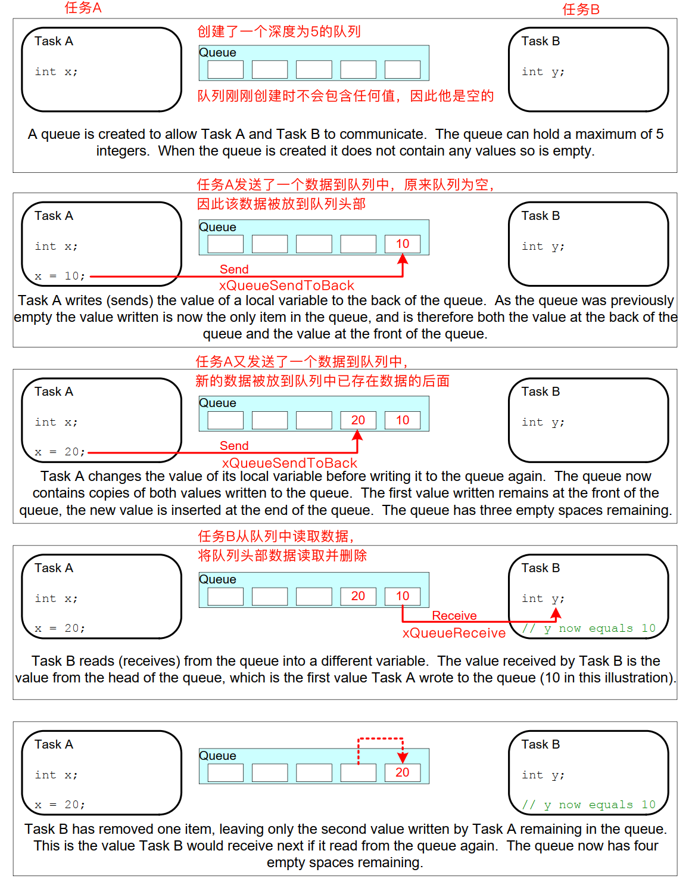

# 信号量

## 信号量简介

信号量是一种用于进程间通信的机制，它基于队列实现，尤其适用于进程间的同步操作。信号量主要分为二值信号量（Binary Semaphores）和计数信号量（Counting Semaphores）两类。

## 任务的同步和互斥

在《RTOS 中的同步与互斥》相关内容中提到，实时操作系统（RTOS）里的同步是指不同任务之间，或者任务与外部事件之间的协同工作方式。其目的是确保多个并发执行的任务能按照预期的顺序或时机执行。同步涉及线程或任务间的通信和协调机制，可有效避免数据竞争、解决竞态条件，从而保证系统的正确运行。而互斥则意味着某一资源在同一时间只允许一个访问者进行访问，具有唯一性和排他性。

信号量通过计数值来表示资源状态：

- 当计数值大于 0 时，代表有信号量资源可供使用。
- 释放信号量时，信号量的计数值（即资源数）会加 1。
- 获取信号量时，信号量的计数值（即资源数）会减 1。

信号量的计数值存在上限，即有一个限定的最大值：

- 若最大值被限定为 1，那么该信号量就是`二值信号量`。
- 若最大值不为 1，它就是`计数型信号量`。

信号量主要用于传递状态信息。下面对队列和信号量进行对比：

| 队列                                                         | 信号量                                                       |
| ------------------------------------------------------------ | ------------------------------------------------------------ |
| 可容纳多个数据；创建队列时需要分配两部分内存，分别是队列结构体和队列项存储空间 | 仅存放计数值，无法存放其他数据；创建信号量时，只需分配信号量结构体 |
| 写入队列操作：当队列满时，操作可进入阻塞状态                 | 释放信号量操作：不可阻塞，计数值加 1；当计数值达到最大值时，操作返回失败 |
| 读取队列操作：当队列为空时，操作可进入阻塞状态               | 获取信号量操作：计数值减 1；当没有可用资源时，操作可进入阻塞状态 |

## 二值信号量和计数型信号量

### 二值信号量

二值信号量可看作是只有一个项的队列，该队列要么为空，要么为满，呈现出二值状态。它就像一个标志，非常适合用于进程间同步通信。二值信号量通常用于互斥访问或任务同步，虽然它与互斥信号量较为相似，但使用二值信号量可能会导致优先级翻转问题，因此它更适合用于同步场景。

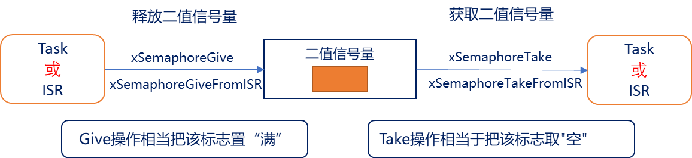

### 计数信号量

计数信号量相当于有固定长度的队列，队列中的每个单元都可视为一个标志。它通常用于对多个共享资源的访问进行控制。

## 创建信号量

信号量在使用之前必须先进行创建。创建完成后，信号量初始状态为无效，计数值为 0。由于信号量分为二值信号量和计数信号量两种类型，FreeRTOS 提供了不同的 API 函数来创建它们，具体如下：

```c
/**
  * @brief  动态分配内存创建二值信号量函数
  * @param  xSemaphore：创建的二值信号量句柄
  * @retval None
  */
void vSemaphoreCreateBinary(SemaphoreHandle_t xSemaphore);

/**
  * @brief  静态分配内存创建二值信号量函数
  * @param  pxSemaphoreBuffer：指向一个StaticSemaphore_t类型的变量，该变量将用于保存信号量的状态
  * @retval 返回创建成功的信号量句柄，如果返回NULL则表示因为pxSemaphoreBuffer为空无法创建
  */
SemaphoreHandle_t xSemaphoreCreateBinaryStatic(
                                    StaticSemaphore_t *pxSemaphoreBuffer);

/**
  * @brief  动态分配内存创建计数信号量函数
  * @param  uxMaxCount：可以达到的最大计数值
  * @param  uxInitialCount：创建信号量时分配给信号量的计数值
  * @retval 返回创建成功的信号量句柄，如果返回NULL则表示内存不足无法创建
  */
SemaphoreHandle_t xSemaphoreCreateCounting(UBaseType_t uxMaxCount, 
                                           UBaseType_t uxInitialCount);

/**
  * @brief  静态分配内存创建计数信号量函数
  * @param  uxMaxCount：可以达到的最大计数值
  * @param  uxInitialCount：创建信号量时分配给信号量的计数值
  * @param  pxSempahoreBuffer：指向StaticSemaphore_t类型的变量，该变量然后用于保存信号量的数据结构体
  * @retval 返回创建成功的信号量句柄，如果返回NULL则表示因为pxSemaphoreBuffer为空无法创建
  */
SemaphoreHandle_t xSemaphoreCreateCountingStatic(
                                    UBaseType_t uxMaxCount,
                                    UBaseType_t uxInitialCount,
                                    StaticSemaphore_t pxSempahoreBuffer);
```

## 释放信号量

以下两个函数不仅可用于释放二值信号量，还能用于释放计数信号量和互斥量，具体如下：

```c
/**
  * @brief  释放信号量函数
  * @param  xSemaphore：要释放的信号量的句柄
  * @retval 如果信号量释放成功，则返回pdTRUE；如果发生错误，则返回pdFALSE
  */
BaseType_t xSemaphoreGive(SemaphoreHandle_t xSemaphore);

/**
  * @brief  释放信号量的中断安全版本函数
  * @param  pxHigherPriorityTaskWoken：用于通知应用程序编写者是否应该执行上下文切换
  * @retval 如果成功给出信号量，则返回pdTRUE，否则errQUEUE_FULL
  */
BaseType_t xSemaphoreGiveFromISR(SemaphoreHandle_t xSemaphore, 
                                 BaseType_t *pxHigherPriorityTaskWoken);
```

## 获取信号量

```c
/**
  * @brief  获取信号量函数
  * @param  xSemaphore：正在获取的信号量的句柄
  * @param  xTicksToWait：等待信号量变为可用的时间
  * @retval 成功获得信号量则返回pdTRUE；如果xTicksToWait过期，信号量不可用，则返回pdFALSE
  */
BaseType_t xSemaphoreTake(SemaphoreHandle_t xSemaphore, TickType_t xTicksToWait);

/**
  * @brief  获取信号量的中断安全版本函数
  * @param  xSemaphore：正在获取的信号量的句柄
  * @param  pxHigherPriorityTaskWoken：用于通知应用程序编写者是否应该执行上下文切换
  * @retval 成功获取则返回pdTRUE，未成功获取则返回pdFALSE
  */
BaseType_t xSemaphoreTakeFromISR(SemaphoreHandle_t xSemaphore, 
                                 signed BaseType_t *pxHigherPriorityTaskWoken);
```

## 删除信号量

```c
/**
  * @brief  删除信号量，包括互斥锁型信号量和递归信号量
  * @param  xSemaphore：被删除的信号量的句柄
  * @retval None
  */
void vSemaphoreDelete(SemaphoreHandle_t xSemaphore);
```

## 获取信号量计数

```c
/**
  * @brief  获取信号量计数
  * @param  xSemaphore：正在查询的信号量的句柄
  * @retval 如果信号量是计数信号量，则返回信号量的当前计数值。如果信号量是二进制信号量，则当信号量可用时，返回1，当信号量不可用时，返回 0
  */
UBaseType_t uxSemaphoreGetCount(SemaphoreHandle_t xSemaphore);
```

# 互斥量

## 优先级翻转简介

在使用二值信号量进行进程间同步时，可能会出现 “优先级翻转” 问题。下面详细阐述该问题的具体表现：

- **t1 时刻**：低优先级任务 `TaskLP` 进入运行状态，并获取了一个二值信号量 `Binary Semaphores`。
- **t2 时刻**：高优先级任务 `TaskHP` 请求获取该二值信号量 `Binary Semaphores`。但由于 `TaskLP` 尚未释放此信号量，所以在后续的 **t3 时刻**，`TaskHP` 进入阻塞状态，等待信号量被释放。
- **t4 时刻**：中等优先级任务 `TaskMP` 进入就绪状态。由于它不需要获取该二值信号量，因此抢占了低优先级任务 `TaskLP` 的处理器资源，开始运行。
- **t5 时刻**：任务 `TaskMP` 运行结束，低优先级任务 `TaskLP` 重新获得处理器资源，继续运行。
- **t6 时刻**：任务 `TaskLP` 运行结束，并释放了二值信号量 `Binary Semaphores`。此时，高优先级任务 `TaskHP` 从阻塞状态中恢复，开始运行。
- **t7 时刻**：任务 `TaskHP` 运行结束。

从上述流程可以看出，在 **t4 时刻**，中等优先级任务 `TaskMP` 先于高优先级任务 `TaskHP` 抢占了处理器资源，这违背了 FreeRTOS 基于优先级抢占式执行的原则。我们将这种情况称为优先级翻转问题，其任务运行过程的具体时刻流程图如下所示：

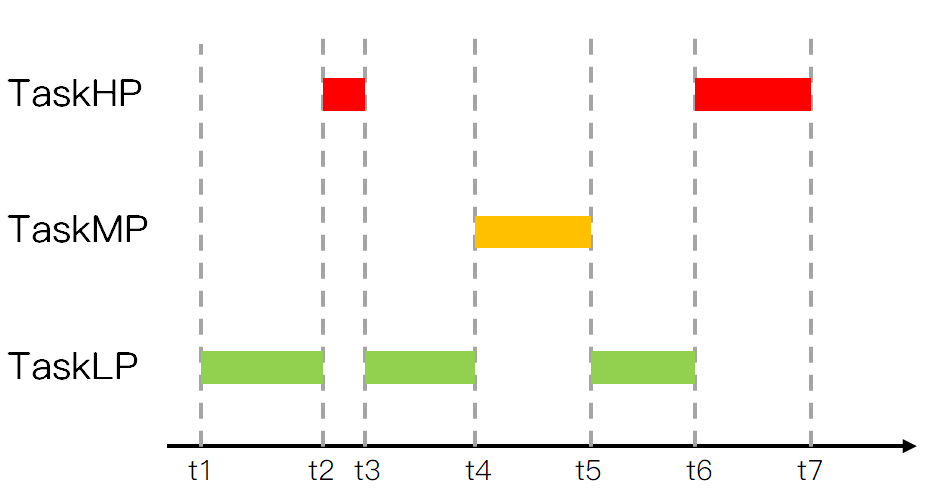

## 优先级继承和互斥信号量

为了解决使用二值信号量可能出现的优先级翻转问题，对二值信号量进行了改进，引入了 “优先级继承” 机制。改进后的实例被称为互斥量。需要注意的是，互斥量虽然可以缓解优先级翻转问题，但无法完全杜绝该问题。

下面通过一个例子来介绍优先级继承的概念。仍然以 “优先级翻转问题” 小节中的任务运行为例，具体流程如下，读者可以仔细体会其中的差异：

- **t1 时刻**：低优先级任务 `TaskLP` 进入运行状态，并获取了一个互斥量 `Mutexes`。
- **t2 时刻**：高优先级任务 `TaskHP` 请求获取互斥量 `Mutexes`。由于 `TaskLP` 尚未释放该互斥量，在 **t3 时刻**，`TaskHP` 进入阻塞状态等待。与二值信号量不同的是，此时 FreeRTOS 会将任务 `TaskLP` 的优先级临时提升到与任务 `TaskHP` 相同的高优先级。
- **t4 时刻**：中等优先级任务 `TaskMP` 进入就绪状态，触发任务调度。但由于任务 `TaskLP` 的优先级已被提升为高优先级，所以任务 `TaskMP` 只能保持就绪状态，等待高优先级任务执行完毕。
- **t5 时刻**：任务 `TaskLP` 执行完毕，释放了互斥量 `Mutexes`。此时，任务 `TaskHP` 抢占处理器资源，开始运行，同时任务 `TaskLP` 的优先级恢复到原来的水平。
- **t6 时刻**：任务 `TaskHP` 执行完毕，轮到任务 `TaskMP` 开始执行。
- **t7 时刻**：任务 `TaskMP` 运行结束。

通过对比互斥量和二值信号量的任务流程，可以明显看出它们之间的差异。上述任务运行过程的具体时刻流程图如下所示：

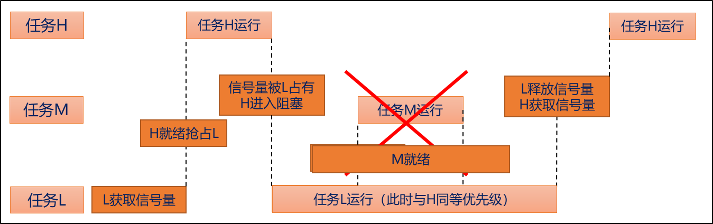

## 互斥信号量

互斥量（互斥锁）是一种特殊类型的二进制信号量，主要用于控制多个任务对共享资源的访问。可以将互斥锁看作是与共享资源相关联的一个令牌。任何想要合法访问该资源的任务，都必须先成功 “获取” 这个令牌，从而成为资源的持有者。当持有者完成对资源的访问后，需要 “归还” 令牌，之后该令牌才能被其他任务获取。这种机制确保了对共享资源的互斥访问，具体机制如下图所示：

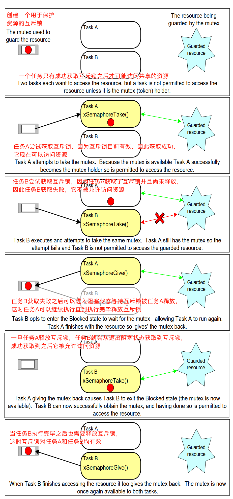

## 死锁现象

“死锁” 是使用互斥锁进行互斥操作时可能遇到的另一个问题。当两个任务都在等待对方占用的资源，从而导致双方都无法继续执行时，就会发生死锁。下面考虑以下情况：

1. 任务 A 开始执行，并成功获取了互斥量 X。
2. 任务 A 被任务 B 抢占。
3. 任务 B 在尝试获取互斥量 X 之前，成功获取了互斥量 Y。但由于互斥量 X 被任务 A 持有，对任务 B 不可用，因此任务 B 进入阻塞状态，等待互斥量 X 被释放。
4. 任务 A 继续执行，尝试获取互斥量 Y。但互斥量 Y 被任务 B 持有，对任务 A 不可用，所以任务 A 也进入阻塞状态，等待互斥量 Y 被释放。

经过上述过程，可以发现任务 A 在等待任务 B 释放互斥量 Y，而任务 B 在等待任务 A 释放互斥量 X，两个任务都处于阻塞状态，无法继续执行，从而导致了 “死锁” 现象。与优先级翻转问题一样，避免 “死锁” 的最佳方法是在系统设计阶段充分考虑其潜在影响，确保系统不会出现死锁情况。

## 递归互斥量

任务自身也可能会发生死锁。当任务多次尝试获取同一个互斥体，而没有先释放该互斥体时，就会出现这种情况。下面考虑以下场景：

1. 任务成功获取了互斥锁。
2. 在持有互斥体的过程中，任务调用了一个库函数。
3. 该库函数的实现尝试获取同一个互斥锁，并进入阻塞状态，等待互斥锁可用。

在这个场景结束时，任务会处于阻塞状态，等待互斥体被释放，但实际上该任务已经是互斥体的持有者。由于任务在等待自身释放互斥体，从而导致了死锁。

通过使用递归互斥体代替标准互斥体，可以避免这种类型的死锁。同一个任务可以多次 “获取” 递归互斥锁，但只有在每次 “获取” 后都调用一次 “释放” 操作，才会真正释放该互斥锁。

因此，递归互斥量可以看作是一种特殊的互斥量。普通互斥量被一个任务获取后，其他任务必须等待该任务释放才能获取；而递归互斥量允许同一个任务多次获取，但每次获取都必须与一次释放操作配对使用。

需要注意的是，无论是互斥量还是递归互斥量，都具备优先级继承机制。但由于中断服务程序（ISR）并非任务，所以互斥量和递归互斥量不能在中断中使用。

## 互斥信号量相关 API 函数

使用互斥信号量时，首先需要将宏 `configUSE_MUTEXES` 置为 1。

### 创建互斥量

互斥量在使用前必须先进行创建。由于互斥量分为普通互斥量和递归互斥量两种类型，FreeRTOS 提供了不同的 API 函数来创建它们，具体如下：

```c
/**
  * @brief  动态分配内存创建互斥信号量函数
  * @retval 创建互斥信号量的句柄
  */
SemaphoreHandle_t xSemaphoreCreateMutex(void);

/**
  * @brief  静态分配内存创建互斥信号量函数
  * @param  pxMutexBuffer：指向StaticSemaphore_t类型的变量，该变量将用于保存互斥锁型信号量的状态
  * @retval 返回成功创建后的互斥锁的句柄，如果返回NULL则表示内存不足创建失败
  */
SemaphoreHandle_t xSemaphoreCreateMutexStatic(StaticSemaphore_t *pxMutexBuffer);

/**
  * @brief  动态分配内存创建递归互斥信号量函数
  * @retval 创建递归互斥信号量的句柄，如果返回NULL则表示内存不足创建失败
  */
SemaphoreHandle_t xSemaphoreCreateRecursiveMutex(void);

/**
  * @brief  静态分配内存创建递归互斥信号量函数
  * @param  pxMutexBuffer：指向StaticSemaphore_t类型的变量，该变量将用于保存互斥锁型信号量的状态
  * @retval 返回成功创建后的递归互斥锁的句柄，如果返回NULL则表示内存不足创建失败
  */
SemaphoreHandle_t xSemaphoreCreateRecursiveMutexStatic(StaticSemaphore_t *pxMutexBuffer);
```

### 获取互斥量

获取互斥量可以直接使用获取信号量的函数，但对于递归互斥量，需要使用专门的获取函数，具体如下：

```c
/**
  * @brief  获取信号量函数
  * @param  xSemaphore：正在获取的信号量的句柄
  * @param  xTicksToWait：等待信号量变为可用的时间
  * @retval 成功获取信号量则返回pdTRUE，xTicksToWait过期且信号量不可用，则返回pdFALSE
  */
BaseType_t xSemaphoreTake(SemaphoreHandle_t xSemaphore, TickType_t xTicksToWait);

/**
  * @brief  获取递归互斥量
  * @param  xMutex：正在获得的互斥锁的句柄
  * @param  xTicksToWait：等待信号量变为可用的时间
  * @retval 成功获取信号量则返回pdTRUE，xTicksToWait过期且信号量不可用，则返回pdFALSE
  */
BaseType_t xSemaphoreTakeRecursive(SemaphoreHandle_t xMutex, TickType_t xTicksToWait);
```

### 释放互斥量

释放互斥量可以直接使用释放信号量的函数，但对于递归互斥量，需要使用专门的释放函数，具体如下：

```c
/**
  * @brief  释放信号量函数
  * @param  xSemaphore：要释放的信号量的句柄
  * @retval 成功释放信号量则返回pdTRUE，若发生错误，则返回pdFALSE
  */
BaseType_t xSemaphoreGive(SemaphoreHandle_t xSemaphore);

/**
  * @brief  释放递归互斥量
  * @param  xMutex：正在释放或“给出”的互斥锁的句柄
  * @retval 成功释放递归互斥量后返回pdTRUE
  */
BaseType_t xSemaphoreGiveRecursive(SemaphoreHandle_t xMutex);
```

### 删除互斥量

删除互斥量可以直接使用信号量的删除函数，具体如下：

```c
/**
  * @brief  删除信号量函数
  * @param  xSemaphore：要删除的信号量的句柄
  * @retval None
  */
void vSemaphoreDelete(SemaphoreHandle_t xSemaphore);
```

# 队列集

## 队列集简介

普通队列只允许在任务间传递同一种数据类型的消息。如果需要在任务间传递不同数据类型的消息，就可以使用队列集。队列集的主要作用是对多个队列或信号量进行 “监听”，只要其中任何一个队列或信号量有消息到来，就可以让等待的任务退出阻塞状态。

## 相关函数

```c
/**
  * @brief  此函数用于创建队列集
  * @param  uxEventQueueLength：队列集可容纳的队列数量
  * @retval 返回创建成功的队列集句柄，如果返回NULL则表示内存不足无法创建
  */
QueueSetHandle_t xQueueCreateSet(const UBaseType_t uxEventQueueLength);

/**
  * @brief  此函数用于往队列集中添加队列，要注意的是，队列在被添加到队列集之前，队列中不能有有效的消息
  * @param  xQueueOrSemaphore：待添加的队列句柄
  * @param  xQueueSet：队列集
  * @retval pdPASS 队列集添加队列成功，pdFAIL 队列集添加队列失败
  */
BaseType_t xQueueAddToSet(QueueSetMemberHandle_t xQueueOrSemaphore,
                          QueueSetHandle_t xQueueSet);

/**
  * @brief  此函数用于从队列集中移除队列， 要注意的是，队列在从队列集移除之前，必须没有有效的消息
  * @param  xQueueOrSemaphore：待移除的队列句柄
  * @param  xQueueSet：队列集
  * @retval pdPASS 队列集移除队列成功，pdFAIL 队列集移除队列失败
  */
BaseType_t xQueueRemoveFromSet(QueueSetMemberHandle_t xQueueOrSemaphore,
                               QueueSetHandle_t xQueueSet);

/**
  * @brief  此函数用于在任务中获取队列集中有有效消息的队列
  * @param  xQueueSet：队列集
  * @param  xTicksToWait：阻塞超时时间
  * @retval 返回消息的队列句柄，如果返回NULL则表示获取消息失败
  */
QueueSetMemberHandle_t xQueueSelectFromSet(QueueSetHandle_t xQueueSet,
                                           TickType_t const xTicksToWait);
```

## 队列集使用流程

1. **启用功能**：将宏 `configUSE_QUEUE_SETS` 配置为 1，以启用队列集功能。
2. **创建队列集**：使用 `xQueueCreateSet` 函数创建队列集。
3. **创建队列或信号量**：根据需求创建所需的队列或信号量。
4. **添加到队列集**：使用 `xQueueAddToSet` 函数将创建好的队列或信号量添加到队列集中。
5. **发送消息或释放信号量**：向队列发送消息或释放信号量。
6. **获取消息**：使用 `xQueueSelectFromSet` 函数从队列集中获取有有效消息的队列。

# 事件标志组

## 事件标志组简介

事件标志组是一种强大的机制，适用于多个事件触发一个或多个任务运行的场景。它不仅可以实现事件的广播，还能实现多个任务的同步运行，具体表现如下：

- 事件标志组允许任务等待一个或多个事件的组合，为任务调度提供了更灵活的控制方式。
- 当特定事件发生时，事件标志组会解除所有等待同一事件的任务的阻塞状态，类似于广播的效果。

在事件标志组中，每个事件标志的状态由 `EventBits_t` 类型变量中的单个位来表示。若 `EventBits_t` 变量中的某个位被设置为 1，则表示该位所代表的事件已经发生；若设置为 0，则表示该事件尚未发生。

一个事件标志组包含一个 `EventBits_t` 数据类型的变量，下图展示了各个事件标志如何映射到 `EventBits_t` 类型变量中的各个位：

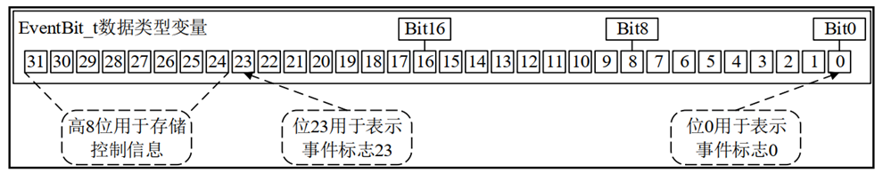

### EventBits_t 数据类型

一个事件标志组对象有一个变量类型为 EventBits_t 的内部变量用于存储事件标志位，该变量可以设置为 16 位或 32 位，具体由参数 configUSE_16_BIT_TICKS 所决定，当参数设置为 1 时，那么每个事件标志组包含 8 个可用的事件位（包括 8 个保留位），否则设置为 0 时，每个事件标志组包含 24 个可用的事件位（包括 8 个保留位）

### EventBits_t 数据类型

每个事件标志组对象都有一个类型为 `EventBits_t` 的内部变量，用于存储事件标志位。该变量的长度可以是 16 位或 32 位，具体由参数 `configUSE_16_BIT_TICKS` 决定：

- 当 `configUSE_16_BIT_TICKS` 设置为 1 时，每个事件标志组包含 8 个可用的事件位（同时包含 8 个保留位）。
- 当 `configUSE_16_BIT_TICKS` 设置为 0 时，每个事件标志组包含 24 个可用的事件位（同样包含 8 个保留位）。

## 队列和事件标志组的区别

| 功能         | 唤醒对象                                                 | 事件清除                                                     |
| ------------ | -------------------------------------------------------- | ------------------------------------------------------------ |
| 队列、信号量 | 事件发生时，只会唤醒一个任务                             | 属于消耗型资源，队列的数据被读取后就不存在了；信号量被获取后，其计数值会减少 |
| 事件标志组   | 事件发生时，会唤醒所有符合条件的任务，具有 “广播” 的作用 | 被唤醒的任务有两种选择，可以保留事件标志不变，也可以清除事件标志 |

## 创建事件标志组

在使用事件标志组之前，必须先进行创建。以下是使用动态和静态内存分配创建事件标志组的 API 函数：

```c
/**
  * @brief  动态分配内存创建事件标志组函数
  * @retval 返回成功创建的事件标志组的句柄，若返回NULL表示因内存空间不足创建失败
  */
EventGroupHandle_t xEventGroupCreate(void);

/**
  * @brief  静态分配内存创建事件标志组函数
  * @param  pxEventGroupBuffer：指向StaticEventGroup_t类型的变量，该变量用于存储事件标志组数据结构体
  * @retval 返回成功创建的事件标志组的句柄，若返回NULL表示因pxEventGroupBuffer空间不足创建失败
  */
EventGroupHandle_t xEventGroupCreateStatic(StaticEventGroup_t *pxEventGroupBuffer);
```

## 操作事件标志组

FreeRTOS 提供了两组 API 函数，用于对事件标志组的某些位进行置位和清零操作，具体如下：

```c
/**
  * @brief  设置事件标志位
  * @param  xEventGroup：要设置位的事件标志组
  * @param  uxBitsToSet：指定要在事件标志组中设置的一个或多个位的按位值，例如设置为0x09表示置位第3位和第0位（0x09 = 0b1001）
  * @retval 返回事件标志组中的事件标志位值
  */
EventBits_t xEventGroupSetBits(EventGroupHandle_t xEventGroup, const EventBits_t uxBitsToSet);

/**
  * @brief  将事件标志组某些位清零
  * @param  xEventGroup：要在其中清除位的事件标志组
  * @param  uxBitsToClear：表示要在事件标志组中清除一个或多个位的按位值
  * @retval 返回清零事件标志位之前事件标志组中事件标志位的值
  */
EventBits_t xEventGroupClearBits(EventGroupHandle_t xEventGroup, const EventBits_t uxBitsToClear);

/**
  * @brief  上述两个函数的中断安全版本
  * @param  pxHigherPriorityTaskWoken：用于通知应用程序编写者是否应该执行上下文切换
  * @retval 消息已发送到RTOS软件定时器服务任务，则返回pdPASS，否则将返回pdFAIL
  */
BaseType_t xEventGroupSetBitsFromISR(EventGroupHandle_t xEventGroup, const EventBits_t uxBitsToSet, BaseType_t *pxHigherPriorityTaskWoken);

BaseType_t xEventGroupClearBitsFromISR(EventGroupHandle_t xEventGroup, const EventBits_t uxBitsToClear);
```

同时，FreeRTOS 还提供了查询事件标志组当前值的 API 函数：

```c
/**
  * @brief  读取事件标志组的当前值
  * @param  xEventGroup：正在查询的事件标志组
  * @retval 返回事件标志组当前的值
  */
EventBits_t xEventGroupGetBits(EventGroupHandle_t xEventGroup);

/**
  * @brief  上述函数的中断安全版本
  */
EventBits_t xEventGroupGetBitsFromISR(EventGroupHandle_t xEventGroup);
```

## 等待事件标志组函数

FreeRTOS 针对事件标志组提供了两个重要的 API 函数：`xEventGroupWaitBits()` 和 `xEventGroupSync()`，分别适用于不同的使用场景。`xEventGroupWaitBits()` 主要用于事件的管理，而 `xEventGroupSync()` 主要用于任务间的同步。下面详细介绍 `xEventGroupWaitBits()` 函数的具体用法：

`xEventGroupWaitBits()` 函数允许任务读取事件标志组的值，并可以选择在阻塞状态下等待事件标志组中的一个或多个事件位被设置（如果这些事件位尚未设置）。其具体的函数声明如下：

```c
/**
  * @brief  等待事件标志组中多个事件位表示的事件成立
  * @param  xEventGroup：所操作事件标志组的句柄
  * @param  uxBitsToWaitFor：所等待事件位的掩码，例如设置为0x05表示等待第0位和/或第2位
  * @param  xClearOnExit：pdTRUE表示事件标志组条件成立退出阻塞状态时将掩码指定的所有位清零；pdFALSE表示事件标志组条件成立退出阻塞状态时不将掩码指定的所有位清零
  * @param  xWaitForAllBits：pdTRUE表示等待掩码中所有事件位都置1，条件才算成立（逻辑与）；pdFALSE表示等待掩码中所有事件位中一个置1，条件就成立（逻辑或）
  * @param  xTicksToWait：任务进入阻塞状态的节拍数
  * @retval 返回事件位等待完成设置或阻塞时间过期时的事件标志组值
  */
EventBits_t xEventGroupWaitBits(const EventGroupHandle_t xEventGroup, const EventBits_t uxBitsToWaitFor, const BaseType_t xClearOnExit, const BaseType_t xWaitForAllBits, TickType_t xTicksToWait);
```

### 函数特点

- 可以等待某一位，也可以等待多位事件标志被设置。
- 当等到期望的事件后，还可以根据需求清除某些位。

### uxBitsToWaitFor 和 xWaitForAllBits 参数

调度程序依据 “解除阻塞条件” 来判断任务是否进入阻塞状态以及何时离开阻塞状态。该条件由 `uxBitsToWaitFor` 和 `xWaitForAllBits` 参数值的组合指定：

- `uxBitsToWaitFor`：指定要测试事件标志组中的哪些事件位。
- `xWaitForAllBits`：指定是使用按位 OR 测试（逻辑或）还是按位 AND 测试（逻辑与）。

如果调用 `xEventGroupWaitBits()` 时满足解锁条件，任务将不会进入阻塞状态。下表提供了导致任务进入阻塞状态或退出阻塞状态的条件示例。表中仅显示事件标志组和 `uxBitsToWaitFor` 值的最低有效的四个二进制位，其他位均假定为零：

| 现有事件标志组值 | uxBitsToWaitFor | xWaitForAllBits | 导致的结果                                                   |
| ---------------- | --------------- | --------------- | ------------------------------------------------------------ |
| 0000             | 0101            | pdFALSE         | 由于事件标志组中的位 0 或位 2 均未设置，调用任务将进入阻塞状态，并且当事件标志组中的位 0 或位 2 被设置时，调用任务将离开阻塞状态 |
| 0100             | 0101            | pdTRUE          | 调用任务将进入阻塞状态，因为事件标志组中的位 0 和位 2 未同时设置，并且当事件标志组中的位 0 和位 2 均设置时，调用任务将离开阻塞状态 |
| 0100             | 0110            | pdFALSE         | 调用任务不会进入阻塞状态，因为 `xWaitForAllBits` 为 `pdFALSE`，并且 `uxBitsToWaitFor` 指定的两个位之一已在事件标志组中设置 |
| 0100             | 0110            | pdTRUE          | 调用任务将进入阻塞状态，因为 `xWaitForAllBits` 为 `pdTRUE`，并且事件标志组中仅已设置 `uxBitsToWaitFor` 指定的两个位之一。当事件标志组中的位 2 和位 3 均被设置时，任务将离开阻塞状态 |

### xClearOnExit 参数

调用任务使用 `uxBitsToWaitFor` 参数指定要测试的位，并且可能需要在满足解锁条件后将这些位清零。虽然可以使用 `xEventGroupClearBits()` API 函数手动清除事件位，但这可能会导致应用程序代码中出现竞争条件。

为避免这些潜在的竞争条件，提供了 `xClearOnExit` 参数。如果 `xClearOnExit` 设置为 `pdTRUE`，则事件位的测试和清除对于调用任务来说是一个原子操作（不能被其他任务或中断中断）。简单来说，如果 `xClearOnExit` 设置为 `pdTRUE`，则调用任务退出后会将事件标志组中掩码指定的所有位清零；否则，不清零。

如果 `xEventGroupWaitBits()` 由于满足调用任务的解锁条件而返回，则返回值是满足解锁条件时事件标志组的值（如果 `xClearOnExit` 为 `pdTRUE`，则在自动清除任何位之前），此时返回值也将满足解锁条件。如果 `xEventGroupWaitBits()` 因为 `xTicksToWait` 参数指定的退出阻塞时间到期而返回，则返回值为退出阻塞时间到期时事件标志组的值，此时返回值将不满足解锁条件。

## 事件标志组同步函数

`xEventGroupSync()` 函数的作用是允许两个或多个任务使用事件标志组来相互同步。该函数允许任务设置事件标志组中的一个或多个事件位，然后等待同一事件标志组中指定的事件位组合被设置。其具体声明如下：

```c
/**
  * @brief  事件标志组同步
  * @param  xEventGroup：操作的事件标志组句柄
  * @param  uxBitsToSet：设置和测试位的事件标志组
  * @param  uxBitsToWaitFor：指定事件标志组中要测试的一个或多个事件位的按位值
  * @param  xTicksToWait：任务进入阻塞状态的节拍数
  * @retval 返回函数退出时事件标志组的值
  */
EventBits_t xEventGroupSync(EventGroupHandle_t xEventGroup, const EventBits_t uxBitsToSet, const EventBits_t uxBitsToWaitFor, TickType_t xTicksToWait);
```

### 函数返回值

`xEventGroupSync()` 函数返回函数退出时事件标志组的值，可能出现以下两种情况：

- 如果该函数由于满足解锁条件而返回，则 `uxBitsToWaitFor` 指定的事件位将在 `xEventGroupSync()` 返回之前清回零，并且在自动清为零之前会将事件标志组的值作为函数返回值返回。
- 如果 `xEventGroupSync()` 由于 `xTicksToWait` 参数指定的阻塞时间到期而返回，则返回值为阻塞时间到期时事件标志组的值，此时返回值将不满足调用任务的解锁条件。

### 应用举例

下面通过一个简单的例子来帮助理解：

假设存在两个任务，分别为 `TASK1` 和 `TASK2`。如果 `TASK1` 在执行过程中，由于延时等原因先于 `TASK2` 调用了 `xEventGroupSync()` 函数，且参数 `uxBitsToSet` 被设置为 0x01（二进制为 0000 0001），参数 `uxBitsToWaitFor` 被设置为 0x05（二进制为 0000 0101），那么 `TASK1` 执行到该函数时，会将事件标志组中位 0 的值置 1，然后进入阻塞状态，等待位 2 和位 0 同时被置 1。

如果 `TASK2` 与 `TASK1` 类似，但落后于 `TASK1` 执行 `xEventGroupSync()` 函数，并且参数 `uxBitsToSet` 被设置为 0x04（二进制为 0000 0100），当 `TASK2` 执行该函数时，会将事件标志组中位 2 的值置 1。此时满足解锁条件，所以 `TASK2` 不会进入阻塞状态，同时 `TASK1` 也满足解锁条件，从阻塞状态中退出。假设两个任务优先级一致，那么 `TASK1` 和 `TASK2` 会同时从同步点开始运行后续的程序代码，从而达到同步的目的。

## 删除事件标志组

```c
/**
  * @brief  删除事件标志组
  * @param  xEventGroup：要删除事件标志组的句柄
  * @retval None
  */
void vEventGroupDelete(EventGroupHandle_t xEventGroup);
```

# 任务通知

## 任务通知的简介

任务通知是一种用于通知任务的机制，任务控制块中的结构体成员变量 `ulNotifiedValue` 就是这个通知值。

在传统的通信方式中，如使用队列、信号量、事件标志组时，都需要另外创建一个结构体，通过中间的结构体进行间接通信，示例图如下：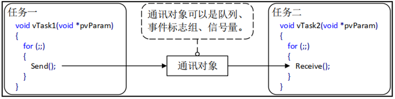

而使用任务通知时，任务结构体 TCB 中就包含了内部对象，可以直接接收别人发过来的 “通知”，示例图如下：

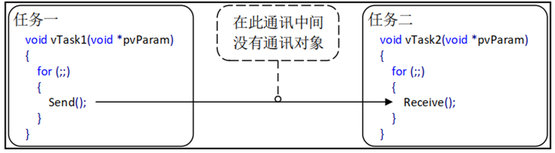

### 任务通知值的更新方式

任务通知值有以下几种更新方式：

- 不覆盖接受任务的通知值。
- 覆盖接受任务的通知值。
- 更新接受任务通知值的一个或多个 bit。
- 增加接受任务的通知值。

只要合理、灵活地利用任务通知的特点，在一些场合中可以替代队列、信号量、事件标志组。

### 任务通知的优势及劣势

#### 优势

- **性能优势**：使用任务通知向任务发送事件或数据比使用队列、信号量或事件组执行等效操作要快得多。
- **内存占用优势**：启用任务通知功能的固定开销仅为每个任务 8 个字节的 RAM，而队列、信号量、事件组等在使用前都必须创建，占用空间较大。

#### 劣势

- **通信方向受限**：任务通知只能用于将事件和数据从 ISR 发送到任务，不能用于将事件或数据从任务发送到 ISR。而其他通信对象可用于将事件和数据在 ISR 与任务之间双向发送。
- **通信对象单一**：任务通知只能将事件和数据发送到某个具体的接收任务中，发送的事件和数据只能由接收任务使用处理。而任何知道通信对象句柄的任务和 ISR 都可以访问队列、信号量等通信对象，多个任务或 ISR 都可以发送或接收消息。
- **数据保存能力有限**：任务的通知值一次只能保存一个值。而队列是一种通信对象，一次可以保存多个数据项，已发送到队列但尚未从队列接收的数据将缓冲在队列对象内。
- **广播功能缺失**：任务通知直接发送给接收任务，因此只能由接收任务处理。而事件组可用于一次向多个任务发送事件。
- **无阻塞等待机制**：如果任务尝试向已经有待处理通知的任务发送任务通知，则发送任务不可能在阻塞状态下等待接收任务重置其通知状态。而如果通信对象暂时处于无法向其写入更多数据或事件的状态（例如，当队列已满时，无法向队列发送更多数据），则尝试写入该对象的任务可以选择进入阻塞状态以等待其写操作完成。

## 任务通知值和通知状态

若要启用任务通知功能，需将 `configUSE_TASK_NOTIFICATIONS` 参数设置为 1。启用该功能后，每个任务的 TCB（任务控制块）会额外增加 8 字节的空间。此时，每个任务都具备一个 “通知状态”（有 “挂起” 和 “未挂起” 两种状态）以及一个 “通知值”（为 32 位无符号整数）。当任务接收到通知时，其通知状态会被设置为挂起；而当任务读取自身的通知值后，通知状态会被设置为未挂起。

以下代码展示了任务控制块中与任务通知相关的定义：

```c
typedef struct tskTaskControlBlock 
{
    … …
        #if ( configUSE_TASK_NOTIFICATIONS  ==  1 )
            volatile  uint32_t    ulNotifiedValue [ configTASK_NOTIFICATION_ARRAY_ENTRIES ];
            volatile  uint8_t      ucNotifyState [ configTASK_NOTIFICATION_ARRAY_ENTRIES ];
        #endif
    … …
} tskTCB;
#define  configTASK_NOTIFICATION_ARRAY_ENTRIES    1      /* 定义任务通知数组的大小, 默认: 1 */
```

### 任务通知状态

任务通知状态共有 3 种取值，具体定义如下：

```c
#define     taskNOT_WAITING_NOTIFICATION ( ( uint8_t ) 0 ) 
/* 任务没有在等待通知。此为初始状态，或者是任务已经完成了对通知的等待，准备进入下一个等待通知的周期。 */
#define     taskWAITING_NOTIFICATION     ( ( uint8_t ) 1 ) 
/* 任务正在等待通知，也被称为 Not - Pending（未挂起）。当任务调用 ulTaskNotifyTake 等待通知时，其状态将变为等待通知状态，
并会一直保持该状态，直至收到通知或者等待超时。 */
#define     taskNOTIFICATION_RECEIVED    ( ( uint8_t ) 2 ) 
/* 任务已经收到通知，也被称为 pending（挂起）。当任务成功接收到通知时，其状态将从等待通知状态切换到通知已接收状态，
此时任务可通过调用 ulTaskNotifyTake 函数获取通知的值，并执行相应操作。 */
```

## 任务通知 API 函数概述

- 强大通用但较复杂的 `xTaskNotify()` 和 `xTaskNotifyWait()` API 函数

- 用作二进制或计数信号量的更轻量级且更快替代方案的 `xTaskNotifyGive()` 和 `ulTaskNotifyTake()` API 函数

- 在序号 1 基础上增加 `*pulPreviousNotifyValue` 参数值的 `xTaskNotifyAndQuery()` API 函数

## `xTaskNotifyGive()` 和 `ulTaskNotifyTake()` API 函数

`xTaskNotifyGive()` 函数用于直接向任务发送通知，同时会对接收任务的通知值进行递增（加 1，这是模拟信号量的操作）。若接收任务的通知状态尚未挂起，调用该函数会将其通知状态设置为挂起。实际上，该 API 是以宏的形式实现的，并非函数，其具体声明如下：

```c
/**
  * @brief  任务通知用作轻量级且更快的二进制或计数信号量替代方案时所使用的通知发送函数
  * @param  xTaskToNotify：通知发送到的任务的句柄
  * @retval 只会返回 pdPASS
  */
BaseType_t xTaskNotifyGive(TaskHandle_t xTaskToNotify);

/**
  * @brief  上述函数的中断安全版本函数
  * @param  xTaskToNotify：通知发送到的任务的句柄
  * @param  pxHigherPriorityTaskWoken：用于通知应用程序编写者是否应该执行上下文切换
  * @retval None
  */
void vTaskNotifyGiveFromISR(TaskHandle_t xTaskToNotify, BaseType_t *pxHigherPriorityTaskWoken);
```

当一个任务使用 `xTaskNotifyGive()` API 函数将通知值用作二值或等效计数信号量时，被通知的任务应使用 `ulTaskNotifyTake()` API 函数来接收或等待通知值。

`ulTaskNotifyTake()` 函数允许任务在阻塞状态下等待其通知值大于零，并在返回之前对任务的通知值进行递减（减 1）或清零操作。其具体函数声明如下：

```c
/**
  * @brief  任务通知被用作更快、更轻的二进制或计数信号量替代时使用的通知接收函数
  * @param  xClearCountOnExit：设置为 pdTRUE，则该函数返回之前，调用任务的通知值将被清零；
  *                            设置为 pdFALSE，并且通知值大于 0，则调用任务的通知值将在该函数返回之前递减
  * @param  xTicksToWait：调用任务应保持阻塞状态以等待其通知值大于零的最长时间
  * @retval 阻塞时间到期也没能等到消息则返回 0，阻塞时间到期前等到消息则返回之前的通知值
  */
uint32_t ulTaskNotifyTake(BaseType_t xClearCountOnExit, TickType_t xTicksToWait);
```

## `xTaskNotify()` API 函数

`xTaskNotify()` 是 `xTaskNotifyGive()` 功能更强大的版本，可通过以下多种方式更新接收任务的通知值：

1. **通知值递增**：使接收任务的通知值递增（加 1），此时 `xTaskNotify()` 等同于 `xTaskNotifyGive()`。
2. **设置指定位**：在接收任务的通知值中设置一位或多位，这使得任务的通知值可作为**事件标志组**更轻量级和更快的替代方案。
3. **写入新值（有条件）**：将一个全新的数字写入接收任务的通知值，但前提是接收任务自上次更新以来已读取其通知值，这让任务的通知值具备与**长度为 1 的队列**类似的功能。
4. **写入新值（无条件）**：将一个全新的数字写入接收任务的通知值，即便接收任务自上次更新以来尚未读取其通知值，这使任务的通知值能提供与 `xQueueOverwrite()` API 函数类似的功能，这种行为有时被称为 **“邮箱”**。

`xTaskNotify()` 比 `xTaskNotifyGive()` 更加灵活和强大，但由于其功能更丰富，使用起来也相对复杂一些。使用该函数时，若接收任务的通知状态尚未挂起，调用 `xTaskNotify()` 会将其设置为挂起状态。其具体函数声明如下：

```c
/**
  * @brief  任务通知函数
  * @param  xTaskToNotify：通知发送到的任务的句柄
  * @param  ulValue：ulValue 的使用方式取决于 eAction 值，参考 “eAction 参数” 小节
  * @param  eAction：一个枚举类型，指定如何更新接收任务的通知值，参考 “eAction 参数” 小节
  * @retval 除 “eAction 参数” 小节提到的一种情况外，均返回 pdPASS
  */
BaseType_t xTaskNotify(TaskHandle_t xTaskToNotify, uint32_t ulValue, eNotifyAction eAction);

/**
  * @brief  任务通知的中断安全版本函数
  * @param  xTaskToNotify：通知发送到的任务的句柄
  * @param  ulValue：ulValue 的使用方式取决于 eAction 值，参考 “eAction 参数” 小节
  * @param  eAction：一个枚举类型，指定如何更新接收任务的通知值，参考 “eAction 参数” 小节
  * @param  pxHigherPriorityTaskWoken：用于通知应用程序编写者是否应该执行上下文切换
  * @retval 除 “eAction 参数” 小节提到的一种情况外，均返回 pdPASS
  */
BaseType_t xTaskNotifyFromISR(TaskHandle_t xTaskToNotify, uint32_t ulValue, eNotifyAction eAction, BaseType_t *pxHigherPriorityTaskWoken);
```

### `eAction` 参数

`eAction` 参数属于 `eNotifyAction` 枚举类型，它定义了 5 种不同的枚举值，用于模拟二值信号量、计数信号量、队列、事件组和 “邮箱” 等功能，具体定义如下：

```c
typedef enum
{    
    eNoAction = 0,                /* 无操作 */
    eSetBits,                     /* 更新指定 bit */
    eIncrement,                   /* 通知值加一 */
    eSetValueWithOverwrite,       /* 覆写的方式更新通知值 */
    eSetValueWithoutOverwrite     /* 不覆写通知值 */
} eNotifyAction;
```

不同 `eNotifyAction` 值对接收任务的最终影响如下表所示：

| `eNotifyAction` 值          | 对接收任务的最终影响                                         |
| --------------------------- | ------------------------------------------------------------ |
| `eNoAction`                 | 接收任务的通知状态设置为待处理，而不更新其通知值，不使用 `xTaskNotify()` 中的 `ulValue` 参数 |
| `eSetBits`                  | 接收任务的通知值与 `xTaskNotify()` 中 `ulValue` 参数传递的值进行按位或运算。例如，若 `ulValue` 设置为 0x01，则接收任务的通知值中将置位第 0 位 |
| `eIncrement`                | 接收任务的通知值递增，不使用 `xTaskNotify()` 中的 `ulValue` 参数 |
| `eSetValueWithoutOverwrite` | 如果接收任务在调用 `xTaskNotify()` 之前有待处理的通知，则不执行任何操作，并且 `xTaskNotify()` 将返回 `pdFAIL`；如果在调用之前接收任务没有待处理的通知，则接收任务的通知值将设置为 `xTaskNotify()` 中 `ulValue` 参数传递的值 |
| `eSetValueWithOverwrite`    | 接收任务的通知值设置为 `xTaskNotify()` 中 `ulValue` 参数传递的值，无论接收任务在调用 `xTaskNotify()` 之前是否有待处理的通知 |

## `xTaskNotifyWait()` API 函数

`xTaskNotifyWait()` 是 `ulTaskNotifyTake()` 功能更强大的版本，它允许任务以可选的超时时间等待自身的通知状态变为待处理（若当前尚未处于待处理状态）。该函数提供了 `ulBitsToClearOnEntry` 和 `ulBitsToClearOnExit` 两个参数，分别用于在进入函数和退出函数时清除调用任务的通知值中的位。其具体函数声明如下：

```c
/**
  * @brief  任务通知等待函数
  * @param  ulBitsToClearOnEntry：参考 “ulBitsToClearOnEntry 参数” 小节
  * @param  ulBitsToClearOnExit：参考 “ulBitsToClearOnExit 参数” 小节
  * @param  pulNotificationValue：用于传递任务的通知值，因为等待通知的函数可能由于 ulBitsToClearOnExit 参数在函数退出时收到的消息值已被更改
  * @param  xTicksToWait：调用任务应保持阻塞状态以等待其通知状态变为挂起状态的最长时间
  * @retval 参考 “xTaskNotifyWait() 函数返回值” 小节
  */
BaseType_t xTaskNotifyWait(uint32_t ulBitsToClearOnEntry, uint32_t ulBitsToClearOnExit, uint32_t *pulNotificationValue, TickType_t xTicksToWait);
```

### `ulBitsToClearOnEntry` 参数

若调用任务在调用 `xTaskNotifyWait()` 之前没有待处理的通知，那么在进入该函数时，会将任务通知值中 `ulBitsToClearOnEntry` 参数所设置的任何位清除。例如，若 `ulBitsToClearOnEntry` 为 0x01，则任务通知值的位 0 将被清除；若将其设置为 0xffffffff（`ULONG_MAX`），则会清除任务通知值中的所有位，使其值变为 0。

### `ulBitsToClearOnExit` 参数

若调用任务因为收到通知而退出 `xTaskNotifyWait()`，或者在调用该函数时已经有通知挂起，那么在任务退出该函数之前，会将任务通知值中 `ulBitsToClearOnExit` 参数所设置的任何位清除。例如，若 `ulBitsToClearOnExit` 为 0x03，则任务通知值的位 0 和位 1 将在函数退出前被清除；若设置为 0xffffffff（`ULONG_MAX`），则会清除任务通知值中的所有位，使其值变为 0。

### `xTaskNotifyWait()` 函数返回值

该函数有两种可能的返回值，分别为 `pdPASS` 和 `pdFALSE`，具体情况如下：

- `pdPASS`

    ：

    - 调用 `xTaskNotifyWait()` 时，调用任务已经有待处理的通知。
    - 调用时任务没有待处理的通知，但由于设置了阻塞时间，任务进入阻塞状态等待消息挂起，并且在阻塞时间到期之前成功等到消息挂起。

- **`pdFALSE`**：
    调用 `xTaskNotifyWait()` 时任务没有待处理的通知，设置阻塞时间后进入阻塞状态等待消息挂起，但直到阻塞时间到期都没有等到消息挂起。

## 其他 API 函数

除了上述常用的 API 函数外，还有一些工具类或不常用的 API 函数。由于启用任务通知功能后，会在任务控制块中增加任务状态和任务通知值，因此 FreeRTOS 提供了清除任务状态的 `xTaskNotifyStateClear()` API 函数和清除任务通知值的 `ulTaskNotifyValueClear()` API 函数。

此外，还在 `xTaskNotify()` API 函数的基础上增加了 `*pulPreviousNotifyValue` 参数，形成了 `xTaskNotifyAndQuery()` API 函数及其对应的中断安全版本函数。以下是这四个函数的具体声明：

```c
/**
 * @brief 清除指定任务的通知状态
 * 
 * 此函数用于清除目标任务的通知状态。若目标任务存在待处理的通知，并且成功清除该通知，则返回 pdTRUE；
 * 若目标任务不存在待处理的通知，则返回 pdFALSE。
 * 
 * @param xTask 要操作的任务句柄，用于指定目标任务。
 * @return BaseType_t 清除成功且任务有待处理通知返回 pdTRUE，任务无待处理通知返回 pdFALSE。
 */
BaseType_t xTaskNotifyStateClear(TaskHandle_t xTask);

/**
 * @brief 清除指定任务通知值的指定位
 * 
 * 该函数会清除目标任务通知值中由 ulBitsToClear 参数指定的位，并返回这些位被清除之前目标任务的通知值。
 * 例如，将 ulBitsToClear 设置为 0x01 表示清除通知值的第 0 位。
 * 
 * @param xTask 要操作的任务句柄，用于指定目标任务。
 * @param ulBitsToClear 目标任务通知值中要清除的位的位掩码。
 * @return uint32_t ulBitsToClear 指定的位被清除之前目标任务的通知值。
 */
uint32_t ulTaskNotifyValueClear(TaskHandle_t xTask, uint32_t ulBitsToClear);

/**
 * @brief 执行与 xTaskNotify() 相同操作并返回目标任务先前通知值
 * 
 * 此函数的功能与 xTaskNotify() 一致，可根据 eAction 参数更新目标任务的通知值。
 * 同时，它会通过 pulPreviousNotifyValue 参数返回目标任务在调用该函数时的通知值，而非函数返回时的通知值。
 * 关于 ulValue 参数的使用方式，请参考 “eAction 参数” 小节。
 * 
 * @param xTaskToNotify 被通知任务的句柄，指定要接收通知的目标任务。
 * @param ulValue 通知值，其使用方式由 eAction 参数决定。
 * @param eAction 枚举类型，指定如何更新接收任务的通知值，详情见 “eAction 参数” 小节。
 * @param pulPreviousNotifyValue 指针，用于返回目标任务的先前通知值（调用函数时的值）。
 * @return BaseType_t 除 “eAction 参数” 小节提到的特定情况外，均返回 pdPASS。
 */
BaseType_t xTaskNotifyAndQuery(TaskHandle_t xTaskToNotify, uint32_t ulValue, eNotifyAction eAction, uint32_t *pulPreviousNotifyValue);

/**
 * @brief xTaskNotifyAndQuery() 函数的中断安全版本
 * 
 * 此函数是 xTaskNotifyAndQuery() 的中断安全版本，可在中断服务程序中安全使用。
 * 它的功能与 xTaskNotifyAndQuery() 相同，会根据 eAction 参数更新目标任务的通知值，
 * 并通过 pulPreviousNotifyValue 参数返回目标任务在调用时的通知值。同时，会使用 pxHigherPriorityTaskWoken
 * 指针通知应用程序编程者是否需要进行上下文切换。
 * 
 * @param xTaskToNotify 被通知任务的句柄，指定要接收通知的目标任务。
 * @param ulValue 通知值，其使用方式由 eAction 参数决定。
 * @param eAction 枚举类型，指定如何更新接收任务的通知值，详情见 “eAction 参数” 小节。
 * @param pulPreviousNotifyValue 指针，用于返回目标任务的先前通知值（调用函数时的值）。
 * @param pxHigherPriorityTaskWoken 指针，用于通知应用程序编程者是否需要进行上下文切换。
 * @return BaseType_t 除 “eAction 参数” 小节提到的特定情况外，均返回 pdPASS。
 */
BaseType_t xTaskNotifyAndQueryFromISR(TaskHandle_t xTaskToNotify, uint32_t ulValue, NotifyAction eAction, uint32_t *pulPreviousNotifyValue, BaseType_t *pxHigherPriorityTaskWoken);
```

# 软件定时器

## 软件定时器回调函数

软件定时器的回调函数是一个返回值为 `void` 类型的 C 语言函数，且仅包含软件定时器句柄这一个参数。其函数原型如下：

```c
/**
  * @brief  软件定时器回调函数
  * @param  xTimer：软件定时器句柄
  * @retval None
  */
void ATimerCallback(TimerHandle_t xTimer)
{
    /* do something */
}
```

### 软件定时器服务任务

在调用 `vTaskStartScheduler()` 开启任务调度器时，会创建一个专门用于管理软件定时器的任务，即软件定时器服务任务。

需注意，软件定时器的回调函数应尽量简短，且在函数体内不能调用任何会使任务进入阻塞状态的 API 函数。不过，若将调用函数的 `xTicksToWait` 参数设置为 0 ，则可调用如 `xQueueReceive()` 等 API 函数。

### 软件定时器服务任务的作用

1. **负责软件定时器超时的逻辑判断**
2. **调用超时软件定时器的超时回调函数**
3. **处理软件定时器命令队列**

## 软件定时器属性和状态

### 周期

软件定时器的周期指从软件定时器启动到软件定时器回调函数执行之间的时间。

### 分类

软件定时器分为单次定时器（One - shot timers）和周期定时器（Auto - reload timers）。

### 软件定时器的状态

- **休眠态**：软件定时器可通过其句柄被引用，但因未运行，其定时超时回调函数不会被执行。
- **运行态**：运行态的定时器，当指定时间到达后，其超时回调函数会被调用。

### 软件定时器的状态转换图

**单次定时器状态转换图**：

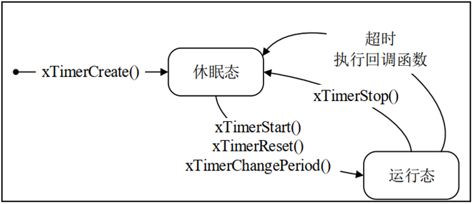

**周期定时器状态转换图**：

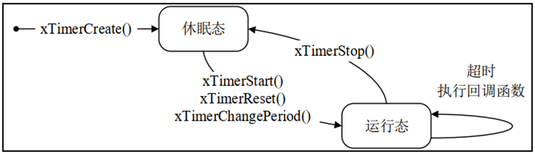

### 软件定时器的命令队列

FreeRTOS 提供了众多与软件定时器相关的 API 函数，这些函数大多是向定时器的队列中写入消息（发送命令），该队列即为软件定时器命令队列，仅供 FreeRTOS 中的软件定时器使用，用户无法直接访问。 

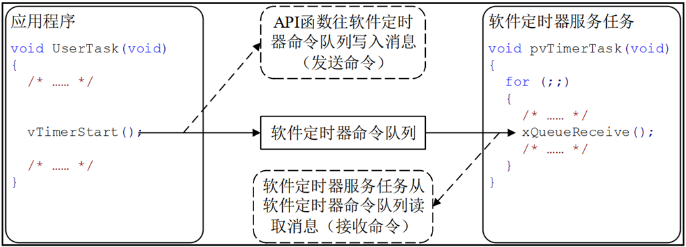

### 软件定时器的相关配置

- 当 FreeRTOS 的配置项 `configUSE_TIMERS` 设置为 1 时，在启动任务调度器时，会自动创建软件定时器的服务 / 守护任务 `prvTimerTask()` 。
- 软件定时器服务任务的优先级为 `configTIMER_TASK_PRIORITY` = 31 。
- 定时器的命令队列长度为 `configTIMER_QUEUE_LENGTH` = 5 。

由于软件定时器的超时回调函数在软件定时器服务任务中被调用，且该任务并非专为某个定时器服务，还需处理其他软件定时器，因此定时器的回调函数不能影响其他定时器。具体要求如下：

1. 回调函数应尽快执行，不能进入阻塞状态，即不能调用如 `vTaskDelay()` 等会阻塞任务的 API 函数。
2. 不能调用访问队列或者信号量的非零阻塞时间的 API 函数。

## 软件定时器结构体成员介绍

```c
typedef struct
{
    const char *              pcTimerName;         /* 软件定时器名字 */
    ListItem_t                xTimerListItem;      /* 软件定时器列表项 */
    TickType_t                xTimerPeriodInTicks; /* 软件定时器的周期 */     
    void *                    pvTimerID;           /* 软件定时器的ID */
    TimerCallbackFunction_t   pxCallbackFunction;  /* 软件定时器的回调函数 */
#if ( configUSE_TRACE_FACILITY == 1 )
    UBaseType_t               uxTimerNumber;       /*  软件定时器的编号，调试用  */
#endif
    uint8_t                   ucStatus;            /*  软件定时器的状态  */
} xTIMER;
```

## 创建、启动软件定时器

根据 FreeRTOS API 的惯例，创建软件定时器提供了动态内存创建和静态内存创建两个不同的 API 函数。软件定时器可在调度程序运行之前创建，也可在调度程序启动后从任务创建。以下为两个 API 函数声明：

```c
/**
  * @brief  动态分配内存创建软件定时器
  * @param  pcTimerName：定时器的描述性名称，辅助调试用
  * @param  xTimerPeriod：定时器的周期，单位为系统节拍周期，即tick
  * @param  uxAutoReload：pdTRUE表示周期软件定时器，pdFASLE表示单次软件定时器
  * @param  pvTimerID：定时器ID
  * @param  pxCallbackFunction：定时器回调函数指针，参考 “软件定时器回调函数” 小节
  * @retval 创建成功则返回创建的定时器的句柄，失败则返回NULL
  */
TimerHandle_t xTimerCreate(const char * const pcTimerName,
                           const TickType_t xTimerPeriod,
                           const UBaseType_t uxAutoReload,
                           void * const pvTimerID,
                           TimerCallbackFunction_t pxCallbackFunction);

/**
  * @brief  动态分配内存创建软件定时器
  * @param  pcTimerName：定时器的描述性名称，辅助调试用
  * @param  xTimerPeriod：定时器的周期，单位为系统节拍周期，即tick
  * @param  uxAutoReload：pdTRUE表示周期软件定时器，pdFASLE表示单次软件定时器
  * @param  pvTimerID：定时器ID
  * @param  pxCallbackFunction：定时器回调函数指针
  * @param  pxTimerBuffer：指向StaticTimer_t类型的变量，然后用该变量保存定时器的状态
  * @retval 创建成功则返回创建的定时器的句柄，失败则返回NULL
  */
TimerHandle_t xTimerCreateStatic(const char * const pcTimerName,
                                 const TickType_t xTimerPeriod,
                                 const UBaseType_t uxAutoReload,
                                 void * const pvTimerID,
                                 TimerCallbackFunction_t pxCallbackFunction,
                                 StaticTimer_t *pxTimerBuffer);
```

**创建完的软件定时器处于休眠状态，需调用 `xTimerStart()` 或其他 API 函数才会进入运行状态。**

```c
/**
  * @brief  启动定时器
  * @param  xTimer：要操作的定时器句柄
  * @param  xBlockTime：参考 “xTicksToWait 参数” 小节
  * @retval 参考 “xTimerStart()函数返回值” 小节
  */
BaseType_t xTimerStart(TimerHandle_t xTimer,
                       TickType_t xTicksToWait);

/**
  * @brief  启动定时器的中断安全版本
  * @param  xTimer：要操作的定时器句柄
  * @param  pxHigherPriorityTaskWoken：用于通知应用程序编写者是否应该执行上下文切换
  * @retval 参考 “xTimerStart()函数返回值” 小节
  */
BaseType_t xTimerStartFromISR(TimerHandle_t xTimer,
                              BaseType_t *pxHigherPriorityTaskWoken);
```

### *xTicksToWait* 参数

`xTimerStart()` 使用定时器命令队列向软件定时器服务任务发送 “启动定时器” 命令，`xTicksToWait` 指定调用任务应保持在阻塞状态以等待定时器命令队列上的空间变得可用的最长时间（若队列已满）。该参数需注意以下几点：

1. 若 `xTicksToWait` 为零且定时器命令队列已满，`xTimerStart()` 将立即返回，该参数以滴答定时器时间刻度为单位。
2. 若在 `FreeRTOSConfig.h` 中将 `INCLUDE_vTaskSuspend` 设置为 1 ，则将 `xTicksToWait` 设置为 `portMAX_DELAY` 将导致调用任务无限期地保持在阻塞状态（无超时），以等待定时器命令队列中的空间变得可用。
3. 若在启动调度程序之前调用 `xTimerStart()` ，则 `xTicksToWait` 的值将被忽略，并且 `xTimerStart()` 的行为就像 `xTicksToWait` 已设置为零一样。

### xTimerStart () 函数返回值

有两种可能的返回值，分别为 `pdPASS` 和 `pdFALSE` ，具体如下：

- 返回 pdPASS 的情况：仅当 “启动定时器” 命令成功发送到定时器命令队列时，才会返回`pdPASS` 。
    - 若守护程序任务的优先级高于调用 `xTimerStart()` 的任务的优先级，则调度程序将确保在 `xTimerStart()` 返回之前处理启动命令。因为一旦定时器命令队列中有数据，守护任务就会抢占调用 `xTimerStart()` 的任务，从而总是保证将命令成功发送到定时器命令队列。
    - 若指定了阻塞时间（`xTicksToWait` 不为零），则调用任务可能会被置于阻塞状态，以等待定时器命令队列中的空间在函数返回之前变得可用，只要在阻塞时间到期之前命令已成功写入定时器命令队列，就可返回 `pdPASS` 。
- 返回 pdFALSE 的情况：若由于队列已满或超过阻塞时间等原因无法将 “启动定时器” 命令写入定时器命令队列，则将返回`pdFALSE`。
    - 若指定了阻塞时间（`xTicksToWait` 不为零），则调用任务将被置于阻塞状态以等待软件定时器服务任务在定时器命令队列中腾出空间，但若指定的阻塞时间在等待定时器命令队列中腾出空间之前已过期，所以返回 `pdFALSE` 。

## 软件定时器 ID

每个软件定时器都有一个 ID ，它是一个标签值，应用程序编写者可将其用于任何目的。ID 被存储在空指针中，因此可直接存储整数值，指向任何其他对象，或用作函数指针。

创建软件定时器时会为 ID 分配一个初始值，之后可使用 `vTimerSetTimerID()` API 函数更新 ID ，并可使用 `pvTimerGetTimerID()` API 函数查询 ID 。这两个 API 函数具体如下：

```c
/**
  * @brief  设置定时器ID值
  * @param  xTimer：要操作的定时器句柄
  * @param  pvNewID：想要设置软件定时器的新ID值
  * @retval None
  */
void vTimerSetTimerID(TimerHandle_t xTimer, void *pvNewID);

/**
  * @brief  获取定时器ID值
  * @param  xTimer：要操作的定时器句柄
  * @retval 正在查询的软件定时器ID
  */
void *pvTimerGetTimerID(TimerHandle_t xTimer);
```

需注意，与其他软件定时器 API 函数不同，`vTimerSetTimerID()` 和 `pvTimerGetTimerID()` 直接访问软件定时器，不向定时器命令队列发送命令。

若创建了多个软件定时器，且所有软件定时器均使用了同一个回调函数，则可给软件定时器设置不同的 ID 值，然后在回调函数中通过 ID 值判断软件定时器触发的来源。

## 改变软件定时器周期

创建软件定时器时会为定时器周期设置初始值，后续也可使用 `xTimerChangePeriod()` 函数动态更改软件定时器的周期。该函数具体声明如下：

```c
/**
  * @brief  改变软件定时器的周期
  * @param  xTimer：要操作的定时器句柄
  * @param  xNewPeriod：软件定时器的新周期，以刻度为单位指定
  * @param  xBlockTime：参考 “xTicksToWait 参数” 小节
  * @retval 参考 “xTimerStart() 函数返回值” 小节
  */
BaseType_t xTimerChangePeriod(TimerHandle_t xTimer,
                               TickType_t xNewPeriod,
                               TickType_t xBlockTime);

/**
  * @brief  改变软件定时器周期的中断安全版本
  * @param  xTimer：要操作的定时器句柄
  * @param  xNewPeriod：软件定时器的新周期，以刻度为单位指定
  * @param  pxHigherPriorityTaskWoken：用于通知应用程序编写者是否应该执行上下文切换
  * @retval 参考 “xTimerStart() 函数返回值” 小节
  */
BaseType_t xTimerChangePeriodFromISR(TimerHandle_t xTimer,
                                      TickType_t xNewPeriod,
                                      BaseType_t *pxHigherPriorityTaskWoken);
```

若 `xTimerChangePeriod()` 用于更改已运行的定时器的周期，则定时器将使用新的周期值重新计算其到期时间，重新计算的到期时间是相对于调用 `xTimerChangePeriod()` 的时间，而非相对于定时器最初启动的时间。

若使用 `xTimerChangePeriod()` 更改处于休眠状态（未运行的定时器）的定时器的周期，则定时器将计算到期时间，并转换到运行状态（定时器将开始运行）。

另外，若希望查询一个定时器的定时周期，可通过 `xTimerGetPeriod()` API 函数查询，具体函数声明如下：

```c
/**
  * @brief  查询一个软件定时器的周期
  * @param  xTimer：要查询的定时器句柄
  * @retval 返回一个软件定时器的周期
  */
TickType_t xTimerGetPeriod(TimerHandle_t xTimer);
```

## 重置软件定时器

重置软件定时器是指重新启动定时器，定时器的到期时间将根据重置定时器的时间重新计算，而非相对于定时器最初启动的时间。如下图对此进行了演示，其中显示了一个定时器，该定时器启动的周期为 6 ，然后重置两次，最后到期并执行其回调函数。

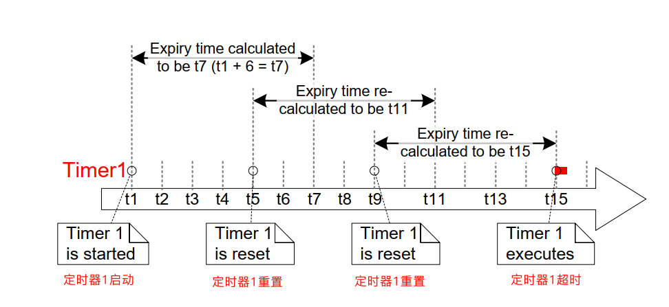

FreeRTOS 中使用 `xTimerReset()` API 函数重置软件定时器，除此之外还可用于启动处于休眠状态的定时。该函数具体声明如下：

```c
/**
  * @brief  重置软件定时器
  * @param  xTimer：要操作的定时器句柄
  * @param  xBlockTime：参考 “xTicksToWait 参数” 小节
  * @retval 参考 “xTimerStart() 函数返回值” 小节
  */
BaseType_t xTimerReset(TimerHandle_t xTimer,
                       TickType_t xBlockTime);

/**
  * @brief  重置软件定时器的中断安全版本
  * @param  xTimer：要操作的定时器句柄
  * @param  pxHigherPriorityTaskWoken：用于通知应用程序编写者是否应该执行上下文切换
  * @retval 参考 “xTimerStart() 函数返回值” 小节
  */
BaseType_t xTimerResetFromISR(TimerHandle_t xTimer,
                              BaseType_t *pxHigherPriorityTaskWoken);
```

## 停止、删除软件定时器

```c
/**
  * @brief  停止软件定时器
  * @param  xTimer：要操作的定时器句柄
  * @param  xBlockTime：参考 “xTicksToWait 参数” 小节
  * @retval 参考 “xTimerStart() 函数返回值” 小节
  */
BaseType_t xTimerStop(TimerHandle_t xTimer,
                      TickType_t xBlockTime);

/**
  * @brief  删除软件定时器
  * @param  xTimer：要操作的定时器句柄
  * @param  xBlockTime：参考 “xTicksToWait 参数” 小节
  * @retval 参考 “xTimerStart() 函数返回值” 小节
  */
BaseType_t xTimerDelete(TimerHandle_t xTimer,
                        TickType_t xBlockTime);

/**
  * @brief  停止软件定时器的中断安全版本
  * @param  xTimer：要操作的定时器句柄
  * @param  pxHigherPriorityTaskWoken：用于通知应用程序编写者是否应该执行上下文切换
  * @retval 参考 “xTimerStart() 函数返回值” 小节
  */
BaseType_t xTimerStopFromISR(TimerHandle_t xTimer,
                             BaseType_t *pxHigherPriorityTaskWoken);
```

## 其他 API 函数

```c
/**
  * @brief  将软件定时器的“模式”更新为 自动重新加载定时器 或 一次性定时器 
  * @param  xTimer：要操作的定时器句柄
  * @param  uxAutoReload：设置为pdTRUE则将定时器设置为周期软件定时器，设置为pdFASLE则将定时器设置为单次软件定时器
  * @retval None
  */
void vTimerSetReloadMode(TimerHandle_t xTimer,
                         const UBaseType_t uxAutoReload);

/**
  * @brief  查询软件定时器是 单次定时器 还是 周期定时器
  * @param  xTimer：要查询的定时器句柄
  * @retval 如果为周期软件定时器则返回pdTRUE，否则返回pdFALSE
  */
BaseType_t xTimerGetReloadMode(TimerHandle_t xTimer);

/**
  * @brief  查询软件定时器到期的时间
  * @param  xTimer：要查询的定时器句柄
  * @retval 如果要查询的定时器处于活动状态则返回定时器下一次到期的时间，否则未定义返回值
  */
TickType_t xTimerGetExpiryTime(TimerHandle_t xTimer);
```

# Tickless 低功耗模式

## 低功耗模式简介

在众多应用领域，如可穿戴低功耗产品、物联网低功耗设备等，对功耗有着极为严苛的要求。一般而言，各类 MCU 均配备相应的低功耗模式，在裸机开发时，开发者能够直接运用这些 MCU 的低功耗模式。而对于采用 FreeRTOS 操作系统进行开发的场景，FreeRTOS 提供了名为 Tickless 的低功耗模式，极大地方便了相关应用的开发工作。

## STM32 三种低功耗模式

STM32 具备三种低功耗模式，分别为：

- **睡眠模式**：该模式下系统功耗有所降低，部分外设时钟停止工作，但内核仍可快速响应中断。
- **停止模式**：此模式进一步降低功耗，关闭更多时钟，包括内核时钟，仅保留最低限度的系统时钟以维持低功耗状态，同时 SRAM 和寄存器内容保持不变。
- **待机模式**：这是 STM32 功耗最低的模式，几乎关闭所有时钟，只有备份域相关电路工作，系统功耗极低，唤醒后需要重新初始化系统。

在我们的开发中，主要使用的是睡眠模式。

### 进入睡眠模式

可以通过以下指令进入睡眠模式：

- **WFI 指令**：`__WFI`，Wait For Interrupt 的缩写，执行该指令后，处理器进入低功耗等待状态，直到有中断发生才被唤醒。
- **WFE 指令**：`__WFE`，Wait For Event 的缩写，与 WFI 类似，但它等待的是事件，事件可以是中断或者通过`SEV`（Send Event）指令触发的事件。

### 退出睡眠模式

在睡眠模式下，任何中断或事件都可以唤醒系统，使 MCU 退出睡眠模式，恢复正常运行状态。

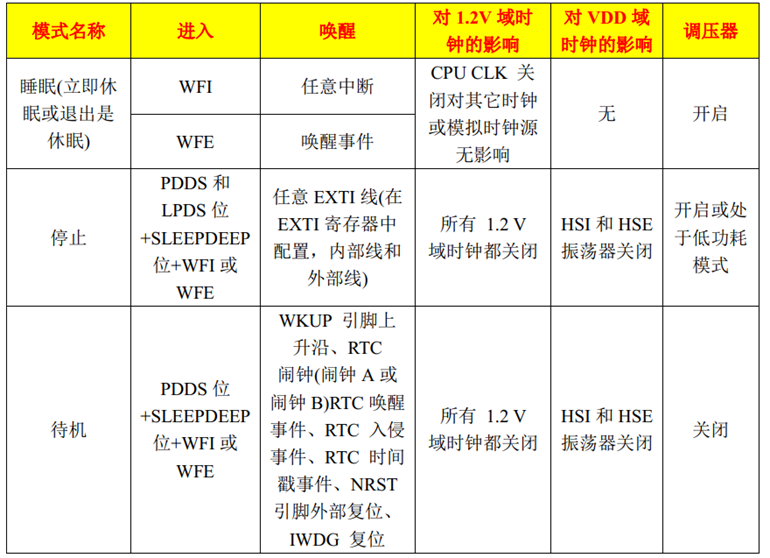

### 如何降低功耗

Tickless 低功耗模式的核心原理是通过调用`WFI`指令实现睡眠模式。在系统空闲时，让 MCU 进入睡眠状态，减少不必要的功耗消耗。

### Tickless 模式的设计思想

通过对任务运行时间的统计实验，我们可以清晰地看到，在整个系统运行过程中，大部分时间都处于执行空闲任务的状态。空闲任务是在系统中所有其他任务都处于阻塞或被挂起时才运行的。

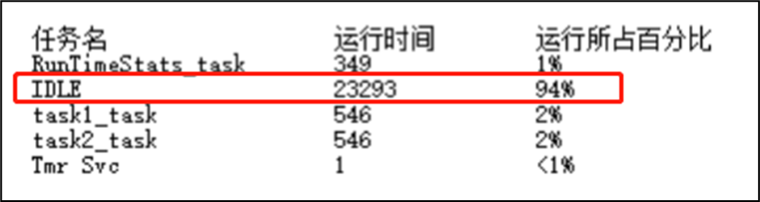

## Tickless 模式详解

为了在降低功耗的同时不影响系统的正常运行，我们可以利用 Tickless 模式。其基本思路是在本该执行空闲任务的时间段，让 MCU 进入相应的低功耗模式；当其他任务准备运行时，及时唤醒 MCU，使其退出低功耗模式，恢复正常工作。

### 难点

- **唤醒时间的确定**：进入低功耗模式后，需要精准判断何时唤醒，即如何确保下一个要运行的任务能够被准确唤醒，保证系统的实时性。
- **中断对低功耗效果的影响**：由于任何中断都可以唤醒 MCU，如果滴答定时器频繁中断，会频繁打断低功耗状态，从而严重影响低功耗的效果。

### 解决方案

- **调整滴答定时器中断周期**：将滴答定时器的中断周期修改为低功耗运行时间，避免不必要的频繁中断，减少对低功耗状态的干扰。
- **补充系统时钟节拍数**：在退出低功耗模式后，需要补上系统在低功耗期间缺失的时钟节拍数，以保证系统时间的准确性和任务调度的正常进行。

值得庆幸的是，FreeRTOS 的低功耗 Tickless 模式机制已经妥善处理好了这些难点，开发者可以放心使用。

## Tickless 模式相关配置项

- **configUSE_TICKLESS_IDLE**：此宏用于使能低功耗 Tickless 模式。当将其设置为特定值（通常为 1）时，系统将启用 Tickless 低功耗模式，允许 MCU 在空闲时进入低功耗状态。
- **configEXPECTED_IDLE_TIME_BEFORE_SLEEP**：该宏用于定义系统进入相应低功耗模式的最短时长。只有当系统预计空闲时间达到或超过此设定值时，才会进入低功耗模式，避免因频繁进入和退出低功耗模式带来的额外开销。
- **configPRE_SLEEP_PROCESSING(x)**：此宏用于定义在系统进入低功耗模式前需要执行的事务。例如，在进入低功耗前关闭外设时钟，以进一步降低功耗，减少系统在低功耗模式下的能源消耗。
- **configPOSR_SLEEP_PROCESSING(x)**：这个宏用于定义系统退出低功耗模式后需要执行的事务。比如，在退出低功耗后开启之前关闭的外设时钟，确保系统能够正常运行，恢复到进入低功耗模式前的工作状态。

# 内存管理

## 内存管理简介

在使用 FreeRTOS 创建任务、队列、信号量等对象时，通常提供了两种方式：

- **动态方法创建**：自动从 FreeRTOS 管理的内存堆中申请创建对象所需的内存空间。当对象被删除后，这块内存会被释放回 FreeRTOS 管理的内存堆，以便后续重新分配使用，具有较高的灵活性。
- **静态方法创建**：需要用户自行提供各种内存空间。而且使用静态方式占用的内存空间一旦分配，通常就固定下来了。即使相关任务、队列等被删除，这些被占用的内存空间一般也无法再作其他用途，缺乏动态调整的能力。

显然，动态方式管理内存相较于静态方式更加灵活，能够更好地适应不同的应用场景和内存需求变化。

除了 FreeRTOS 提供的动态内存管理方法外，标准的 C 库也提供了`malloc()`和`free()`函数来实现动态的内存申请和释放操作。然而，在嵌入式系统开发中，通常不使用标准 C 库自带的内存管理算法，原因如下：

- **代码空间占用大**：标准 C 库的内存管理算法通常较为复杂，会占用大量的代码空间，这对于资源紧缺的嵌入式系统来说是一个很大的负担。
- **缺乏线程安全机制**：在多线程环境下，标准 C 库的内存管理函数没有提供线程安全的相关机制，容易导致内存访问冲突和数据不一致等问题。
- **运行不确定性**：每次调用这些函数时，其执行时间可能会因为内存分配和释放的具体情况而不同，这对于对实时性要求较高的嵌入式系统来说是不可接受的。
- **内存碎片化**：频繁的内存申请和释放容易导致内存碎片化，使得可用内存空间变得不连续，降低内存的利用率，甚至可能导致后续无法分配到足够大的连续内存块。

因此，FreeRTOS 针对不同的嵌入式系统，提供了多种动态内存管理算法，分别为：`heap_1`、`heap_2`、`heap_3`、`heap_4`、`heap_5` 。这些算法各有优缺点，如下表所示：

| 算法     | 优点                                                         | 缺点                                                         |
| -------- | ------------------------------------------------------------ | ------------------------------------------------------------ |
| `heap_1` | 分配简单，时间确定，实现简单，适合对内存分配实时性要求高且不需要释放内存的场景。 | 只允许申请内存，不允许释放内存，适用场景有限。               |
| `heap_2` | 允许申请和释放内存，使用最适应算法，能在一定程度上满足常见的内存申请和释放需求。 | 不能合并相邻的空闲内存块，会产生内存碎片，随着时间推移，内存利用率会逐渐降低；且内存分配时间不定。 |
| `heap_3` | 直接调用 C 库函数`malloc()`和`free()`，实现简单，与 C 库的内存管理方式集成度高。 | 速度慢，时间不定，性能较差，不适合对性能要求高的嵌入式系统；且未解决 C 库内存管理的固有问题。 |
| `heap_4` | 相邻空闲内存可合并，有效减少内存碎片的产生，提高内存利用率；支持内存的申请与释放。 | 时间不定，在内存分配和释放时的时间开销不确定。               |
| `heap_5` | 在`heap_4`的基础上，能够管理多个非连续内存区域，适用于内存布局复杂的嵌入式系统。 | 时间不定，内存管理的时间开销不确定。                         |

在我们的 FreeRTOS 例程中，使用的均为`heap_4`内存管理算法，因为它在内存碎片管理和适用性方面表现较为出色，适合大多数嵌入式系统的内存管理需求。

### heap_1 内存管理算法

`heap_1`只实现了`pvPortMalloc`函数，用于内存申请，而没有实现`vPortFree`函数，即无法进行内存释放操作。这意味着如果你的工程中，创建好的任务、队列、信号量等对象在整个运行过程中都不需要被删除，那么可以使用`heap_1`内存管理算法。

`heap_1`的实现非常简单，它管理的内存堆是一个数组。在申请内存时，`heap_1`内存管理算法只是简单地从数组中划分出合适大小的内存块。内存堆数组的定义如下：

```c
/* 定义一个大数组作为FreeRTOS管理的内存堆 */
static uint8_t ucHeap[ configTOTAL_HEAP_SIZE ];
```

heap_1 内存管理算法的分配过程如下图所示：

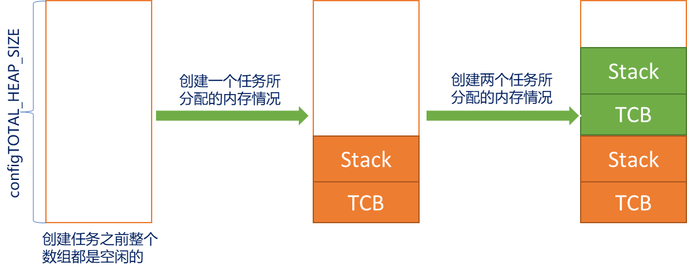

### heap_2 内存管理算法

与`heap_1`内存管理算法相比，`heap_2`内存管理算法有以下特点：

- 使用最适应算法，能够根据内存需求选择最合适的空闲内存块进行分配，并且支持内存释放操作。
- 然而，`heap_2`内存管理算法不能将相邻的空闲内存块合并成一个大的空闲内存块。因此，在多次内存申请和释放操作后，不可避免地会产生内存碎片，降低内存的利用率。

**最适应算法**：假设 heap 中有 3 块空闲内存（按内存块大小由小到大排序）：5 字节、25 字节、50 字节。现在新创建一个任务需要申请 20 字节的内存，其分配过程如下：

1. 找出最小的、能满足`pvPortMalloc`的内存：25 字节。
2. 把它划分为 20 字节、5 字节；返回这 20 字节的地址，剩下的 5 字节仍然是空闲状态，留给后续的`pvPortMalloc`使用。

内存碎片是由于多次申请和释放内存，但释放的内存无法与相邻的空闲内存合并而产生的。

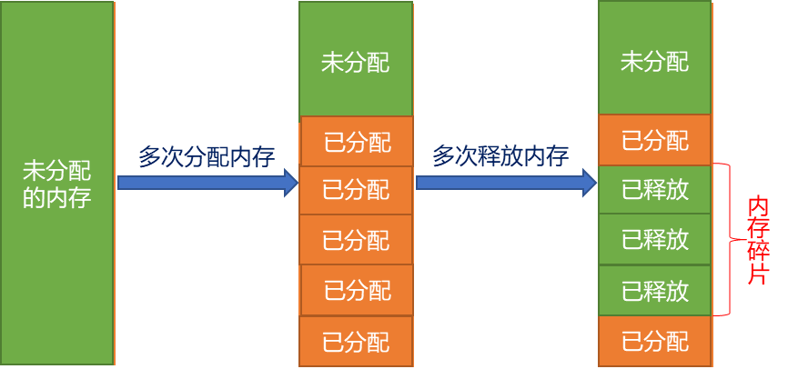

适用场景：频繁地创建和删除任务，且所创建的任务堆栈大小都相同。在这类场景下，由于每次申请和释放的内存大小一致，`Heap_2`不会产生内存碎片化的问题。

### heap_4 内存管理算法

`heap_4`内存管理算法使用了**首次适应算法**，并且支持内存的申请与释放。该算法的一个显著优点是能够将空闲且相邻的内存进行合并，从而有效减少内存碎片的现象，提高内存的利用率。

**首次适应算法**：假设 heap 有 3 块空闲内存（按内存块地址由低到高排序）：5 字节、50 字节、25 字节。现在新创建一个任务需要申请 20 字节的内存，其分配过程如下：

1. 找出第一个能满足`pvPortMalloc`的内存：50 字节。
2. 把它划分为 20 字节、30 字节；返回这 20 字节的地址，剩下 30 字节仍然是空闲状态，留给后续的`pvPortMalloc`使用。

`heap_4`内存管理算法会把相邻的空闲内存合并为一个更大的空闲内存，这有助于减少内存的碎片问题，提高内存的整体使用效率。

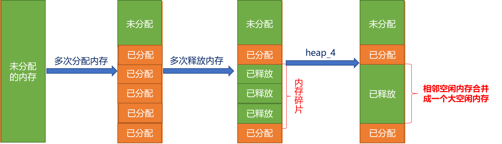

适用于这种场景：频繁地分配、释放不同大小的内存。在这种情况下，`heap_4`能够较好地管理内存，减少内存碎片的产生，保证系统的稳定运行。

### heap_5 内存管理算法

`heap_5`内存管理算法是在`heap_4`内存管理算法的基础上扩展而来的，它实现了**管理多个非连续内存区域的能力**。

`heap_5`内存管理算法默认并没有定义内存堆，需要用户手动指定内存区域的信息，对其进行初始化。

**如何指定一块内存**：使用如下结构体：

```c
typedef struct HeapRegion
{
    uint8_t *    pucStartAddress;     /* 内存区域的起始地址 */
    size_t       xSizeInBytes;         /* 内存区域的大小，单位：字节 */
} HeapRegion_t; 
```

**如何指定多块且不连续的内存**：

```c
const HeapRegion_t  xHeapRegions[] =
{
    { (uint8_t *)0x80000000, 0x10000 },     /* 内存区域1 */
    { (uint8_t *)0x90000000, 0xA0000 },     /* 内存区域2 */
    { NULL, 0 }                     /* 数组终止标志 */
};
vPortDefineHeapRegions(xHeapRegions); 
```

适用场景：在嵌入式系统中，当内存的地址并不连续，存在多个非连续的内存区域需要管理时，`heap_5`内存管理算法就能够发挥其优势，有效地管理这些分散的内存资源。

## 内存管理相关 API 函数介绍


```c
/**
  * @brief  申请内存
  * @param  xWantedSize：申请的内存大小，以字节为单位
  * @retval 返回一个指针 ，指向已分配大小的内存。如果申请内存失败，则返回 NULL
  */
void * pvPortMalloc( size_t xWantedSize );
```

```c
/**
  * @brief  释放内存
  * @param  pv：指针指向一个要释放内存的内存块
  * @retval None
  */
void vPortFree( void * pv );
```

```c
/**
  * @brief  获取当前空闲内存的大小
  * @param  None
  * @retval 返回当前剩余的空闲内存大小
  */
size_t xPortGetFreeHeapSize( void );
```

初始化后的内存堆，如下：

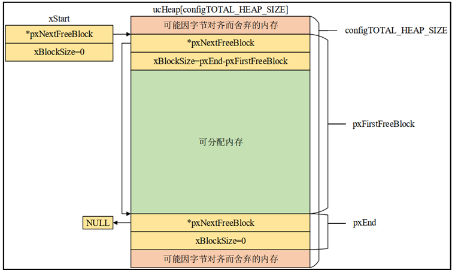

插入新的空闲内存块，如下

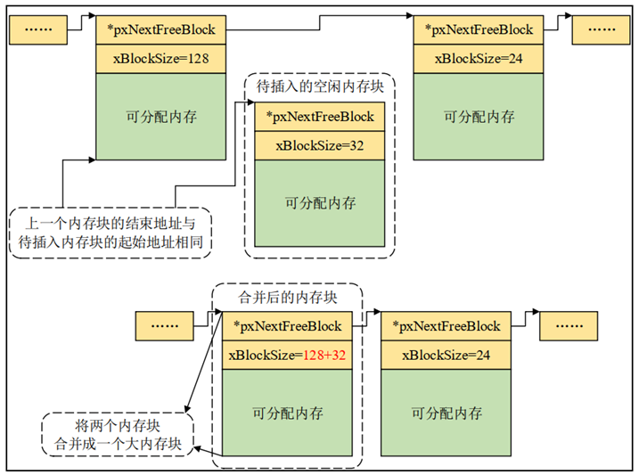
