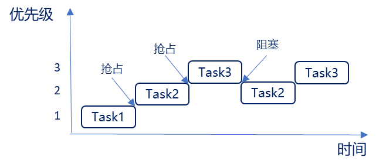
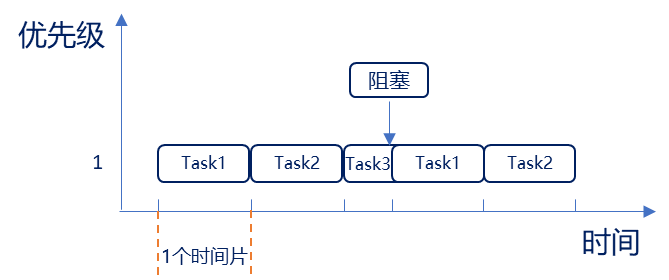

# FreeRTOS基础知识

## 任务调度简介

调度器就是使用相关的`调度算法`来决定当前需要执行的哪个任务

FreeRTOS 一共支持三种任务调度方式:  

1. **抢占式调度**: 主要是针对优先级不同的任务, 每个任务都有一个优先级, 优先级高的任务可以抢占优先级低的任务。
2. **时间片调度**: 主要针对优先级相同的任务, 当多个任务的优先级相同时,  任务调度器会在每一次系统时钟节拍到的时候切换任务。
3. **协程式调度**: 当前执行任务将会一直运行, 同时高优先级的任务不会抢占低优先级任务

>  虽然 FreeRTOS 现在还支持协程式调度, 但是官方已经表示不会再更新了

### 抢占式调度



运行过程如下: 

1. 首先Task1在运行中, 在这个过程中Task2就绪了, 在抢占式调度器的作用下Task2会抢占Task1的运行
2. Task2运行过程中, Task3就绪了, 在抢占式调度器的作用下Task3会抢占Task2的运行
3. Task3运行过程中, Task3阻塞了 (系统延时或等待信号量等 ) , 此时就绪态中, 优先级最高的任务Task2执行
4. Task3阻塞解除了 (延时到了或者接收到信号量 ) , 此时Task3恢复到就绪态中, 抢占TasK2的运行

总结: 

1. 高优先级任务, 优先执行
2. 高优先级任务不停止, 低优先级任务无法执行
3. 被抢占的任务将会进入就绪态

### 时间片调度

同等优先级任务轮流地享有相同的 CPU 时间(可设置),  叫**时间片**, 在 FreeRTOS 中, 一个时间片就等于 SysTick 中断周期, 注意没有用完的时间片不会再使用



运行过程如下: 

1. 首先Task1运行完一个时间片后, 切换至Task2运行
2. Task2运行完一个时间片后, 切换至Task3运行
3. Task3运行过程中 (还不到一个时间片 ) , Task3阻塞了 (系统延时或等待信号量等 ) , 此时直接切换到下一个任务Task1
4. Task1运行完一个时间片后, 切换至Task2运行

## 任务状态

FreeRTOS 中任务共存在4种状态: 

1. 运行态: 正在执行的任务, 该任务就处于运行态, 注意在STM32中, 同一时间仅一个任务处于运行态
2. 就绪态: 如果该任务已经能够被执行, 但当前还未被执行, 那么该任务处于就绪态
3. 阻塞态: 如果一个任务因延时或等待外部事件发生, 那么这个任务就处于阻塞态
4. 挂起态: 类似暂停, 调用函数`vTaskSuspend()`进入挂起态, 需要调用解挂函数`vTaskResume()`才可以进入就绪态

四种任务状态之间的转换图: 


总结: 

1. 仅就绪态可转变成运行态
2. 其他状态的任务想运行, 必须先转变成就绪态

这四种状态中, 除了运行态, 其他三种任务状态的任务都有其对应的任务状态列表

1. 就绪列表:`pxReadyTasksLists[x]`, 其中x代表任务优先级数值, x取值0~31, 当某个位, 置一时, 代表所对应的优先级就绪列表有任务存在
2. 阻塞列表: pxDelayedTaskList
3. 挂起列表: xSuspendedTaskList

# FreeRTOS的任务创建和删除

任务的创建和删除本质就是调用FreeRTOS的API函数

| API函数             | 描述             |
| ------------------- | ---------------- |
| xTaskCreate()       | 动态方式创建任务 |
| xTaskCreateStatic() | 静态方式创建任务 |
| vTaskDelete()       | 删除任务         |

**动态创建任务**: 任务的任务控制块以及任务的栈空间所需的内存, 均由 FreeRTOS 从 FreeRTOS 管理的堆中分配
**静态创建任务**: 任务的任务控制块以及任务的栈空间所需的内存, 需用户分配提供

## 动态创建任务函数

```c
BaseType_t xTaskCreate
( 	
    TaskFunction_t 					pxTaskCode,		/* 指向任务函数的指针 */
    const char *const 				pcName, 		/* 任务名字, 最大长度configMAX_TASK_NAME_LEN */
    const configSTACK_DEPTH_TYPE    usStackDepth, 	/* 任务堆栈大小, 注意字为单位 */
    void *const 					pvParameters,	/* 传递给任务函数的参数 */
    UBaseType_t 					uxPriority,		/* 任务优先级, 范围: 0 ~ configMAX_PRIORITIES - 1 */
    TaskHandle_t *const 			pxCreatedTask 	/* 任务句柄, 就是任务的任务控制块*/
);
```

```c
typedef struct tskTaskControlBlock * TaskHandle_t;
```


| 返回值                                | 描述         |
| ------------------------------------- | ------------ |
| pdPASS                                | 任务创建成功 |
| errCOULD_NOT_ALLOCATE_REQUIRED_MEMORY | 任务创建失败 |

### 实现动态创建任务流程 (用起来只需这三步)

1. 将宏`configSUPPORT_DYNAMIC_ALLOCATION`配置为 1 
2. 定义函数入口参数
3. 编写任务函数

### 动态创建任务函数内部实现 (此函数创建的任务会立刻进入就绪态, 由任务调度器调度运行)

1. 申请堆栈内存&任务控制块内存
2. TCB结构体成员赋值
3. 添加新任务到就绪列表中

### 任务控制块结构体成员介绍

```c
typedef struct tskTaskControlBlock
{
	volatile StackType_t *pxTopOfStack; 	/* 任务栈栈顶, 必须为TCB的第一个成员 */
	ListItem_t 			 xStateListItem;    /* 任务状态列表项 */
	ListItem_t 			 xEventListItem;	/* 任务事件列表项 */
	UBaseType_t 		 uxPriority;        /* 任务优先级, 数值越大, 优先级越大 */
	StackType_t 		 *pxStack;			/* 任务栈起始地址 */
	char 				 pcTaskName[ configMAX_TASK_NAME_LEN ]; /* 任务名字 */
	…
	省略很多条件编译的成员
} tskTCB;
```

> 任务栈栈顶: 在任务切换时的任务上下文保存、任务恢复息息相关
>
> 注意: 每个任务都有属于自己的任务控制块, 类似身份证

## 静态创建任务函数

```c
TaskHandle_t xTaskCreateStatic
(
    TaskFunction_t			pxTaskCode,				/* 指向任务函数的指针 */
    const char *const		pcName,					/* 任务函数名 */
    const uint32_t			ulStackDepth, 			/* 任务堆栈大小注意字为单位 */
    void *const			pvParameters, 				/* 传递的任务函数参数 */
    UBaseType_t				uxPriority, 			/* 任务优先级 */
    StackType_t *const		puxStackBuffer, 		/* 任务堆栈, 一般为数组, 由用户分配 */
    StaticTask_t *const	pxTaskBuffer				/* 任务控制块指针, 由用户分配 */
);
```

| 返回值 | 描述                                 |
| ------ | ------------------------------------ |
| NULL   | 用户没有提供相应的内存, 任务创建失败 |
| 其他值 | 任务句柄, 任务创建成功               |

### 静态创建任务使用流程 (用起来只需这五步)

1. 需将宏`configSUPPORT_STATIC_ALLOCATION`配置为 1 
2. 定义空闲任务&定时器任务的任务堆栈及TCB
3. 实现两个接口函数`vApplicationGetIdleTaskMemory()`和`vApplicationGetTimerTaskMemory()`
4. 定义函数入口参数
5. 编写任务函数

> 此函数创建的任务会立刻进入就绪态, 由任务调度器调度运行

### 静态创建内部实现

1. TCB结构体成员赋值
2. 添加新任务到就绪列表中

## 任务删除函数

```c
void vTaskDelete(TaskHandle_t xTaskToDelete);
```

| 形参          | 描述                 |
| ------------- | -------------------- |
| xTaskToDelete | 待删除任务的任务句柄 |

> 用于删除已被创建的任务, 被删除的任务将从就绪态任务列表、阻塞态任务列表、挂起态任务列表和事件列表中移除

注意: 

1. 当传入的参数为 NULL, 则代表删除任务自身 (当前正在运行的任务 ) 
2. 空闲任务会负责释放被删除任务中由系统分配的内存, 但是由用户在任务删除前申请的内存,  则需要由用户在任务被删除前提前释放, 否则将导致内存泄露 

### 删除任务流程 (用起来只要这两步)

1. 使用删除任务函数, 需将宏`INCLUDE_vTaskDelete`配置为 1 
2. 入口参数输入需要删除的任务句柄 (NULL代表删除本身 ) 

### 删除任务函数的内部实现过程

1. 获取所要删除任务的控制块: 通过传入的任务句柄, 判断所需要删除哪个任务, NULL代表删除自身
2. 将被删除任务, 移除所在列表: 将该任务在所在列表中移除, 包括: 就绪、阻塞、挂起、事件等列表
3. 判断所需要删除的任务: 如果删除任务自身, 需先添加到等待删除列表, 内存释放将在空闲任务执行,如果删除其他任务, 释放内存, 任务数量--
4. 更新下个任务的阻塞时间: 更新下一个任务的阻塞超时时间, 以防被删除的任务就是下一个阻塞超时的任务

# FreeRTOS的任务挂起与恢复

## 任务的挂起与恢复的API函数

| API函数              | 描述                     |
| -------------------- | ------------------------ |
| vTaskSuspend()       | 挂起任务                 |
| vTaskResume()        | 恢复被挂起的任务         |
| xTaskResumeFromISR() | 在中断中恢复被挂起的任务 |

**挂起**: 挂起任务类似暂停, 可恢复; 删除任务, 无法恢复, 类似“人死两清”

**恢复**: 恢复被挂起的任务

> 带`FromISR`后缀是在中断函数中专用的API函数

## 任务挂起函数介绍

```c
void vTaskSuspend(TaskHandle_t xTaskToSuspend);
```

| 形参           | 描述                 |
| -------------- | -------------------- |
| xTaskToSuspend | 待挂起任务的任务句柄 |

此函数用于挂起任务, 使用时需将宏`INCLUDE_vTaskSuspend`配置为 1。 

无论优先级如何, 被挂起的任务都将不再被执行, 直到任务被恢复 。

> 注意: 当传入的参数为NULL, 则代表挂起任务自身 (当前正在运行的任务 ) 

## 任务恢复函数介绍 (任务中恢复 ) 

```c
任务中恢复被挂起函数: void vTaskResume(TaskHandle_t xTaskToResume) 
```

| 形参          | 描述                 |
| ------------- | -------------------- |
| xTaskToResume | 待恢复任务的任务句柄 |

使用该函数注意宏:`INCLUDE_vTaskSuspend`必须定义为 1

> 注意: 任务无论被 vTaskSuspend() 挂起多少次, 只需在任务中调用 vTakResume() 恢复一次, 就可以继续运行。且被恢复的任务会进入就绪态！ 

## 任务恢复函数介绍 (中断中恢复 )

中断中恢复被挂起函数: 

```c
BaseType_t xTaskResumeFromISR(TaskHandle_t xTaskToResume); 
```

| 形参          | **描述**             |
| ------------- | -------------------- |
| xTaskToResume | 待恢复任务的任务句柄 |

| 返回值  | 描述                         |
| ------- | ---------------------------- |
| pdTRUE  | 任务恢复后需要进行任务切换   |
| pdFALSE | 任务恢复后不需要进行任务切换 |

使用该函数注意宏:`INCLUDE_vTaskSuspend`和`INCLUDE_xTaskResumeFromISR`必须定义为 1

该函数专用于中断服务函数中, 用于解挂被挂起任务

> 注意: 中断服务程序中要调用freeRTOS的API函数则中断优先级不能高于FreeRTOS所管理的最高优先级

## 任务挂起函数内部实现

1. 获取所要挂起任务的控制块: 通过传入的任务句柄, 判断所需要挂起哪个任务, NULL代表挂起自身
2. 移除所在列表: 将要挂起的任务从相应的状态列表和事件列表中移除 (就绪或阻塞列表 ) 
3. 插入挂起任务列表: 将待挂起任务的任务状态列表向插入到挂起态任务列表末尾
4. 判断任务调度器是否运行: 在运行, 更新下一次阻塞时间, 防止被挂起任务为下一次阻塞超时任务
5. 判断待挂起任务是否为当前任务: 如果挂起的是任务自身, 且调度器正在运行, 需要进行一次任务切换, 调度器没有运行, 判断挂起任务数是否等于任务总数, 是: 当前控制块赋值为NULL, 否: 寻找下一个最高优先级任务

## 任务恢复函数内部实现

1. 恢复任务不能是正在运行任务
2. 判断任务是否在挂起列表中: 成立就会将该任务在挂起列表中移除,  将该任务添加到就绪列表中
3. 判断恢复任务优先级: 判断恢复的任务优先级是否大于当前正在运行的 是的话执行任务切换

# FreeRTOS中断管理

## 什么是中断？

> 让CPU打断正常运行的程序, 转而去处理紧急的事件 (程序 ) , 就叫中断

中断执行机制, 可简单概括为三步: 

1, 中断请求: 外设产生中断请求 (GPIO外部中断、定时器中断等 ) 
2, 响应中断: CPU停止执行当前程序, 转而去执行中断处理程序 (ISR ) 
3, 退出中断: 执行完毕, 返回被打断的程序处, 继续往下执行

## 中断优先级分组设置

ARM Cortex-M 使用了 8 位宽的寄存器来配置中断的优先等级, 这个寄存器就是中断优先级配置寄存器

但STM32, 只用了中断优先级配置寄存器的高4位 [7 : 4], 所以STM32提供了最大16级的中断优先等级


STM32 的中断优先级可以分为`抢占优先级`和`子优先级 `

**抢占优先级**:  抢占优先级高的中断可以打断正在执行但抢占优先级低的中断 

**子优先级**: 当同时发生具有相同抢占优先级的两个中断时, 子优先级数值小的优先执行

> 注意: 中断优先级数值越小越优先

## 中断优先级分组设置

一共有 5 种分配方式, 对应着中断优先级分组的 5 个组 

| 优先级分组           | 抢占优先级        | 子优先级        | 优先级配置寄存器高 4 位                   |
| -------------------- | ----------------- | --------------- | ----------------------------------------- |
| NVIC_PriorityGroup_0 | 0 级抢占优先级    | 0-15 级子优先级 | 0bit 用于抢占优先级     4bit 用于子优先级 |
| NVIC_PriorityGroup_1 | 0-1 级抢占优先级  | 0-7 级子优先级  | 1bit 用于抢占优先级     3bit 用于子优先级 |
| NVIC_PriorityGroup_2 | 0-3 级抢占优先级  | 0-3 级子优先级  | 2bit 用于抢占优先级     2bit 用于子优先级 |
| NVIC_PriorityGroup_3 | 0-7 级抢占优先级  | 0-1 级子优先级  | 3bit 用于抢占优先级     1bit 用于子优先级 |
| NVIC_PriorityGroup_4 | 0-15 级抢占优先级 | 0 级子优先级    | 4bit 用于抢占优先级     0bit 用于子优先级 |

在HAL_Init中通过调用函数`HAL_NVIC_SetPriorityGrouping(NVIC_PRIORITYGROUP_4 )`即可完成设置

## 中断优先级分组设置

特点: 

1. 低于`configMAX_SYSCALL_INTERRUPT_PRIORITY`优先级的中断里才允许调用 FreeRTOS 的API函数
2. 建议将所有优先级位指定为抢占优先级位, 方便FreeRTOS管理
3. 中断优先级数值越小越优先, 任务优先级数值越大越优先


## 中断相关寄存器

三个系统中断优先级配置寄存器, 分别为 SHPR1.  SHPR2.  SHPR3 

SHPR1寄存器地址: 0xE000ED18

SHPR2寄存器地址: 0xE000ED1C

SHPR3寄存器地址: 0xE000ED20


PendSV 和 SysTick 设置最低优先级的作用: 保证系统任务切换不会阻塞系统其他中断的响应

三个, 分别为 PRIMASK、 FAULTMASK 和BASEPRI 


FreeRTOS所使用的中断管理就是利用的**BASEPRI**这个寄存器

BASEPRI: 屏蔽优先级低于某一个阈值的中断

比如:  BASEPRI设置为0x50, 代表中断优先级在5\~15内的均被屏蔽, 0\~4的中断优先级正常执行

### BASEPRI寄存器

屏蔽优先级低于某一个阈值的中断, 当设置为0时, 则不关闭任何中断

**关中断**程序示例: 

```c
#define portDISABLE_INTERRUPTS() 		vPortRaiseBASEPRI()
static portFORCE_INLINE void vPortRaiseBASEPRI( void )
{
	uint32_t ulNewBASEPRI = configMAX_SYSCALL_INTERRUPT_PRIORITY;
	__asm
	{
		msr basepri, ulNewBASEPRI
		dsb
		isb
	}
}
#define configMAX_SYSCALL_INTERRUPT_PRIORITY            ( configLIBRARY_MAX_SYSCALL_INTERRUPT_PRIORITY << (8 - configPRIO_BITS) )
#define configLIBRARY_MAX_SYSCALL_INTERRUPT_PRIORITY        5      /* FreeRTOS可管理的最高中断优先级 */
```

中断优先级在5 ~ 15的全部被关闭

当BASEPRI设置为0x50时: 


在中断服务函数中调度 FreeRTOS 的API函数需注意: 

1. 中断服务函数的优先级需在 FreeRTOS 所管理的范围内
2. 在中断服务函数里边需调用 FreeRTOS 的API函数, 必须使用带`FromISR`后缀的函数

**开中断**程序示例: 

```c
#define portENABLE_INTERRUPTS()		 vPortSetBASEPRI( 0 )
static portFORCE_INLINE void vPortSetBASEPRI( uint32_t ulBASEPRI )
{
	__asm
	{
		msr basepri, ulBASEPRI
	}
}
```

FreeRTOS中断管理就是利用BASEPRI寄存器实现的

# FreeRTOS临界段代码保护及任务调度器挂起和恢复

## 临界段代码保护简介

> 什么是临界段? 临界段代码也叫做临界区, 是指那些必须完整运行, 不能被打断的代码段

适用场合如: 

1. 外设: 需严格按照时序初始化的外设: IIC、SPI等等
2. 系统: 系统自身需求
3. 用户: 用户需求

问题: 什么可以打断当前程序的运行? 中断或者任务调度

## 临界段代码保护函数介绍

> 临界区是直接屏蔽了中断, 系统任务调度靠中断, ISR也靠中断

FreeRTOS 在进入临界段代码的时候需要关闭中断, 当处理完临界段代码以后再打开中断

| 函数                          | 描述             |
| ----------------------------- | ---------------- |
| taskENTER_CRITICAL()          | 任务级进入临界段 |
| taskEXIT_CRITICAL()           | 任务级退出临界段 |
| taskENTER_CRITICAL_FROM_ISR() | 中断级进入临界段 |
| taskEXIT_CRITICAL_FROM_ISR()  | 中断级退出临界段 |

任务级临界区调用格式示例: 

```c
taskENTER_CRITICAL() ;
{
        … …	/* 临界区 */
}
taskEXIT_CRITICAL()	;	
```

中断级临界区调用格式示例: 

```c
uint32_t  save_status;
save_status  = taskENTER_CRITICAL_FROM_ISR(); 
{
        … …	/* 临界区 */
}
taskEXIT_CRITICAL_FROM_ISR(save_status );	
```

特点: 

1. 成对使用
2. 支持嵌套
3. 尽量保持临界段耗时短

## 任务调度器的挂起和恢复

挂起任务调度器,  调用此函数不需要关闭中断

| 函数              | 描述           |
| ----------------- | -------------- |
| vTaskSuspendAll() | 挂起任务调度器 |
| xTaskResumeAll()  | 恢复任务调度器 |

使用格式示例: 

```c
vTaskSuspendAll();
{
        … …	/* 内容 */
}
xTaskResumeAll();
```

1. 与临界区不一样的是, 挂起任务调度器, 未关闭中断; 
2. 它仅仅是防止了任务之间的资源争夺, 中断照样可以直接响应; 
3. 挂起调度器的方式, 适用于临界区位于任务与任务之间; 既不用去延时中断, 又可以做到临界区的安全

# FreeRTOS的列表和列表项

## 列表和列表项的简介

> 列表是 FreeRTOS 中的一个数据结构, 概念上和链表有点类似, 列表被用来跟踪 FreeRTOS 中的任务。 

列表项就是存放在列表中的项目


列表相当于链表, 列表项相当于节点, FreeRTOS 中的列表是一个双向环形链表 

列表的特点: 列表项间的地址非连续的, 是人为的连接到一起的。列表项的数目是由后期添加的个数决定的, 随时可以改变

数组的特点: 数组成员地址是连续的, 数组在最初确定了成员数量后期无法改变

在OS中任务的数量是不确定的, 并且任务状态是会发生改变的, 所以非常适用列表(链表)这种数据结构

举个例子: 


### 列表

有关于列表的东西均在文件 list.c 和 list.h 中, 首先我们先看下在list.h中的, 列表相关结构体: 

```c
typedef struct xLIST
{
	listFIRST_LIST_INTEGRITY_CHECK_VALUE			/* 校验值 */
	volatile UBaseType_t uxNumberOfItems;			/* 列表中的列表项数量 */
	ListItem_t *configLIST_VOLATILE pxIndex		/* 用于遍历列表项的指针 */
	MiniListItem_t xListEnd							/* 末尾列表项 */
	listSECOND_LIST_INTEGRITY_CHECK_VALUE			/* 校验值 */
} List_t;
```

1. 在该结构体中,  包含了两个宏, 这两个宏是确定的已知常量,  FreeRTOS 通过检查这两个常量的值, 
来判断列表的数据在程序运行过程中, 是否遭到破坏 , 该功能一般用于调试,  默认是不开启的 
2. 成员 uxNumberOfItems, 用于记录列表中列表项的个数 (不包含 xListEnd ) 
3. 成员 pxIndex 用于指向列表中的某个列表项, 一般用于遍历列表中的所有列表项 
4. 成员变量 xListEnd 是一个迷你列表项, 排在最末尾 


### 列表项

列表项是列表中用于存放数据的地方, 在 list.h 文件中, 有列表项的相关结构体定义: 

```c
struct xLIST_ITEM
{
	listFIRST_LIST_ITEM_INTEGRITY_CHECK_VALUE				/* 用于检测列表项的数据完整性 */
	configLIST_VOLATILE TickType_t xItemValue				/* 列表项的值 */
	struct xLIST_ITEM *configLIST_VOLATILE pxNext			/* 下一个列表项 */
	struct xLIST_ITEM *configLIST_VOLATILE pxPrevious		/* 上一个列表项 */
	void *pvOwner											/* 列表项的拥有者 */
	struct xLIST *configLIST_VOLATILE pxContainer; 			/* 列表项所在列表 */
	listSECOND_LIST_ITEM_INTEGRITY_CHECK_VALUE				/* 用于检测列表项的数据完整性 */
};
typedef struct xLIST_ITEM ListItem_t;
```

1. 成员变量 xItemValue 为列表项的值, 这个值多用于按升序对列表中的列表项进行排序 
2. 成员变量 pxNext 和 pxPrevious 分别用于指向列表中列表项的下一个列表项和上一个列表项 
3. 成员变量 pxOwner 用于指向包含列表项的对象 (通常是任务控制块 )  
4. 成员变量 pxContainer 用于指向列表项所在列表。 


### 迷你列表项

迷你列表项也是列表项, 但迷你列表项仅用于标记列表的末尾和挂载其他插入列表中的列表项

```c
struct xMINI_LIST_ITEM
{
	listFIRST_LIST_ITEM_INTEGRITY_CHECK_VALUE 				/* 用于检测数据完整性 */
	configLIST_VOLATILE TickType_t xItemValue;				/* 列表项的值 */
	struct xLIST_ITEM *configLIST_VOLATILE pxNext;			/* 上一个列表项 */
	struct xLIST_ITEM *configLIST_VOLATILE pxPrevious; 	/* 下一个列表项 */
};
typedef struct xMINI_LIST_ITEM MiniListItem_t;
```

1. 成员变量 xItemValue 为列表项的值, 这个值多用于按升序对列表中的列表项进行排序 
2. 成员变量 pxNext 和 pxPrevious 分别用于指向列表中列表项的下一个列表项和上一个列表项 
3. 迷你列表项只用于标记列表的末尾和挂载其他插入列表中的列表项, 因此不需要成员变量 pxOwner 和 pxContainer, 以节省内存开销 


## 列表相关API函数介绍

| 函数                  | 描述               |
| --------------------- | ------------------ |
| vListInitialise()     | 初始化列表         |
| vListInitialiseItem() | 初始化列表项       |
| vListInsertEnd()      | 列表末尾插入列表项 |
| vListInsert()         | 列表插入列表项     |
| uxListRemove()        | 列表移除列表项     |

### 初始化列表vListInitialise()

```c
void vListInitialise(List_t *const pxList)
{
	/*  初始化时, 列表中只有 xListEnd, 因此 pxIndex 指向 xListEnd */
	pxList->pxIndex = ( ListItem_t * ) & ( pxList->xListEnd );
	/* xListEnd 的值初始化为最大值, 用于列表项升序排序时, 排在最后 */
	pxList->xListEnd.xItemValue = portMAX_DELAY;
	/* 初始化时, 列表中只有 xListEnd, 因此上一个和下一个列表项都为 xListEnd 本身 */
	pxList->xListEnd.pxNext = ( ListItem_t * ) & ( pxList->xListEnd );
	pxList->xListEnd.pxPrevious = ( ListItem_t * ) & ( pxList->xListEnd );
	/* 初始化时, 列表中的列表项数量为 0 (不包含 xListEnd )  */
	pxList->uxNumberOfItems = ( UBaseType_t ) 0U;
	/* 初始化用于检测列表数据完整性的校验值 */
	listSET_LIST_INTEGRITY_CHECK_1_VALUE( pxList );
	listSET_LIST_INTEGRITY_CHECK_2_VALUE( pxList );
}
```

| 形参   | 描述         |
| ------ | ------------ |
| pxList | 待初始化列表 |

初始化后列表结构: 


### 初始化列表项vListInitialiseItem()

```c
void vListInitialiseItem( ListItem_t *const pxItem )
{
	/* 初始化时, 列表项所在列表设为空 */
	pxItem->pxContainer = NULL;
	/* 初始化用于检测列表项数据完整性的校验值 */
	listSET_FIRST_LIST_ITEM_INTEGRITY_CHECK_VALUE( pxItem );
	listSET_SECOND_LIST_ITEM_INTEGRITY_CHECK_VALUE( pxItem );
}
```

| 形参   | 描述           |
| ------ | -------------- |
| pxItem | 待初始化列表项 |

初始化后的列表项结构: 


### 列表项有序插入列表函数vListInsert()

此函数用于将待插入列表的列表项按照列表项值升序进行排序, 有序地插入到列表中 

| 形参          | 描述         |
| ------------- | ------------ |
| pxList        | 列表         |
| pxNewListItem | 待插入列表项 |

```c
void vListInsert( List_t *const pxList, ListItem_t *const pxNewListItem )
{
	ListItem_t *pxIterator;
	const TickType_t  xValueOfInsertion = pxNewListItem->xItemValue; 	/* 获取列表项的数值依据数值升序排列 */
	listTEST_LIST_INTEGRITY( pxList ); 						/* 检查参数是否正确 */
	listTEST_LIST_ITEM_INTEGRITY( pxNewListItem ); 				/* 如果待插入列表项的值为最大值 */ 
	if ( xValueOfInsertion == portMAX_DELAY )
	{
		pxIterator = pxList->xListEnd.pxPrevious; 				/* 插入的位置为列表 xListEnd 前面 */
	}
	else
	{
		for (  pxIterator = ( ListItem_t * ) & ( pxList->xListEnd ); 			/*遍历列表中的列表项, 找到插入的位置*/
		        pxIterator->pxNext->xItemValue <= xValueOfInsertion;
		        pxIterator = pxIterator->pxNext  ) { }
	}
	pxNewListItem->pxNext = pxIterator->pxNext;					/* 将待插入的列表项插入指定位置 */
	pxNewListItem->pxNext->pxPrevious = pxNewListItem;
	pxNewListItem->pxPrevious = pxIterator;
	pxIterator->pxNext = pxNewListItem;
	pxNewListItem->pxContainer = pxList; 						/* 更新待插入列表项所在列表 */
	( pxList->uxNumberOfItems )++;							/* 更新列表中列表项的数量 */
}
```

### 列表项无序插入列表函数vListInsertEnd()

```c
void vListInsertEnd(List_t *const pxList, ListItem_t *const pxNewListItem)
{
	省略部分非关键代码 … …
	/* 获取列表 pxIndex 指向的列表项 */
	ListItem_t *const pxIndex = pxList->pxIndex;
	/* 更新待插入列表项的指针成员变量 */
	pxNewListItem->pxNext = pxIndex;
	pxNewListItem->pxPrevious = pxIndex->pxPrevious;
	/* 更新列表中原本列表项的指针成员变量 */
	pxIndex->pxPrevious->pxNext = pxNewListItem;
	pxIndex->pxPrevious = pxNewListItem;
	/* 更新待插入列表项的所在列表成员变量 */
	pxNewListItem->pxContainer = pxList;
	/* 更新列表中列表项的数量 */
	( pxList->uxNumberOfItems )++;
}
```

| 形参          | 描述         |
| ------------- | ------------ |
| pxList        | 列表         |
| pxNewListItem | 待插入列表项 |

此函数用于将待插入列表的列表项插入到列表 pxIndex 指针指向的列表项前面, 是一种无序的插入方法 

### 列表项移除函数uxListRemove()

```c
UBaseType_t uxListRemove (ListItem_t* const pxItemToRemove);
```

此函数用于将列表项从列表项所在列表中移除

| 形参           | 描述           |
| -------------- | -------------- |
| pxItemToRemove | 待移除的列表项 |

| 返回值 | 描述                                         |
| ------ | -------------------------------------------- |
| 整数   | 待移除列表项移除后, 所在列表剩余列表项的数量 |

```c
UBaseType_t uxListRemove( ListItem_t *const pxItemToRemove )
{
	List_t *const pxList = pxItemToRemove->pxContainer;
	/* 从列表中移除列表项 */
	pxItemToRemove->pxNext->pxPrevious = pxItemToRemove->pxPrevious;
	pxItemToRemove->pxPrevious->pxNext = pxItemToRemove->pxNext;
	/*如果 pxIndex 正指向待移除的列表项 */
	if ( pxList->pxIndex == pxItemToRemove )
	{
		/*pxIndex 指向上一个列表项*/
		pxList->pxIndex = pxItemToRemove->pxPrevious;
	}
	else
	{
		mtCOVERAGE_TEST_MARKER();
	}
	/*将待移除的列表项的所在列表指针清空*/
	pxItemToRemove->pxContainer = NULL;
	/*更新列表中列表项的数量*/
	( pxList->uxNumberOfItems )--;
	/*返回移除后的列表中列表项的数量*/
	return pxList->uxNumberOfItems;
}
```

