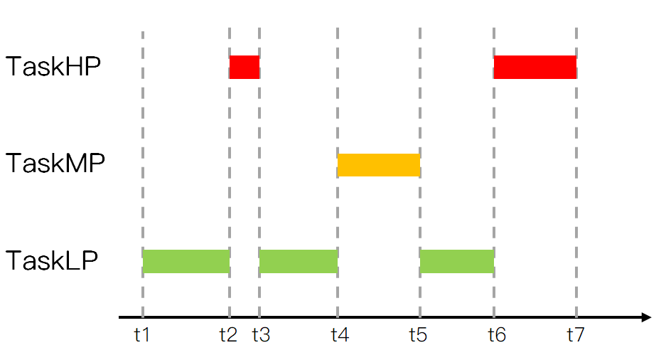
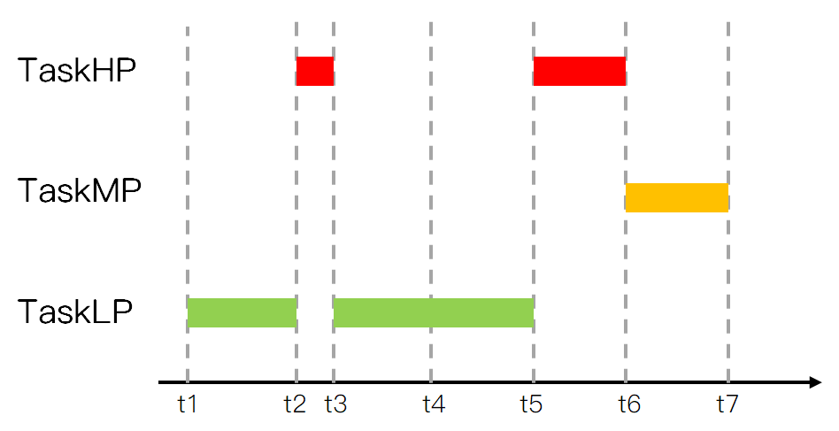

# FreeRTOS基础知识

## 任务调度简介

调度器就是使用相关的`调度算法`来决定当前需要执行的哪个任务

FreeRTOS 一共支持三种任务调度方式:  

1. **抢占式调度**: 主要是针对优先级不同的任务, 每个任务都有一个优先级, 优先级高的任务可以抢占优先级低的任务。
2. **时间片调度**: 主要针对优先级相同的任务, 当多个任务的优先级相同时,  任务调度器会在每一次系统时钟节拍到的时候切换任务。
3. **协程式调度**: 当前执行任务将会一直运行, 同时高优先级的任务不会抢占低优先级任务

>  虽然 FreeRTOS 现在还支持协程式调度, 但是官方已经表示不会再更新了

### 抢占式调度


运行过程如下: 

1. 首先Task1在运行中, 在这个过程中Task2就绪了, 在抢占式调度器的作用下Task2会抢占Task1的运行
2. Task2运行过程中, Task3就绪了, 在抢占式调度器的作用下Task3会抢占Task2的运行
3. Task3运行过程中, Task3阻塞了 (系统延时或等待信号量等 ) , 此时就绪态中, 优先级最高的任务Task2执行
4. Task3阻塞解除了 (延时到了或者接收到信号量 ) , 此时Task3恢复到就绪态中, 抢占TasK2的运行

总结: 

1. 高优先级任务, 优先执行
2. 高优先级任务不停止, 低优先级任务无法执行
3. 被抢占的任务将会进入就绪态

### 时间片调度

同等优先级任务轮流地享有相同的 CPU 时间(可设置),  叫**时间片**, 在 FreeRTOS 中, 一个时间片就等于 SysTick 中断周期, 注意没有用完的时间片不会再使用


运行过程如下: 

1. 首先Task1运行完一个时间片后, 切换至Task2运行
2. Task2运行完一个时间片后, 切换至Task3运行
3. Task3运行过程中 (还不到一个时间片 ) , Task3阻塞了 (系统延时或等待信号量等 ) , 此时直接切换到下一个任务Task1
4. Task1运行完一个时间片后, 切换至Task2运行

## 任务状态

FreeRTOS 中任务共存在4种状态: 

1. 运行态: 正在执行的任务, 该任务就处于运行态, 注意在STM32中, 同一时间仅一个任务处于运行态
2. 就绪态: 如果该任务已经能够被执行, 但当前还未被执行, 那么该任务处于就绪态
3. 阻塞态: 如果一个任务因延时或等待外部事件发生, 那么这个任务就处于阻塞态
4. 挂起态: 类似暂停, 调用函数`vTaskSuspend()`进入挂起态, 需要调用解挂函数`vTaskResume()`才可以进入就绪态

四种任务状态之间的转换图: 


总结: 

1. 仅就绪态可转变成运行态
2. 其他状态的任务想运行, 必须先转变成就绪态

这四种状态中, 除了运行态, 其他三种任务状态的任务都有其对应的任务状态列表

1. 就绪列表:`pxReadyTasksLists[x]`, 其中x代表任务优先级数值, x取值0~31, 当某个位, 置一时, 代表所对应的优先级就绪列表有任务存在
2. 阻塞列表: pxDelayedTaskList
3. 挂起列表: xSuspendedTaskList

# FreeRTOS的任务创建和删除

任务的创建和删除本质就是调用FreeRTOS的API函数

| API函数             | 描述             |
| ------------------- | ---------------- |
| xTaskCreate()       | 动态方式创建任务 |
| xTaskCreateStatic() | 静态方式创建任务 |
| vTaskDelete()       | 删除任务         |

**动态创建任务**: 任务的任务控制块以及任务的栈空间所需的内存, 均由 FreeRTOS 从 FreeRTOS 管理的堆中分配
**静态创建任务**: 任务的任务控制块以及任务的栈空间所需的内存, 需用户分配提供

## 动态创建任务函数

```c
BaseType_t xTaskCreate
( 	
    TaskFunction_t 					pxTaskCode,		/* 指向任务函数的指针 */
    const char *const 				pcName, 		/* 任务名字, 最大长度configMAX_TASK_NAME_LEN */
    const configSTACK_DEPTH_TYPE    usStackDepth, 	/* 任务堆栈大小, 注意字为单位 */
    void *const 					pvParameters,	/* 传递给任务函数的参数 */
    UBaseType_t 					uxPriority,		/* 任务优先级, 范围: 0 ~ configMAX_PRIORITIES - 1 */
    TaskHandle_t *const 			pxCreatedTask 	/* 任务句柄, 就是任务的任务控制块*/
);
```


| 返回值                                | 描述         |
| ------------------------------------- | ------------ |
| pdPASS                                | 任务创建成功 |
| errCOULD_NOT_ALLOCATE_REQUIRED_MEMORY | 任务创建失败 |

### 实现动态创建任务流程 (用起来只需这三步)

1. 将宏`configSUPPORT_DYNAMIC_ALLOCATION`配置为 1 
2. 定义函数入口参数
3. 编写任务函数

### 动态创建任务函数内部实现 (此函数创建的任务会立刻进入就绪态, 由任务调度器调度运行)

1. 申请堆栈内存&任务控制块内存
2. TCB结构体成员赋值
3. 添加新任务到就绪列表中

### 任务控制块结构体成员介绍

```c
typedef struct tskTaskControlBlock
{
	volatile StackType_t *pxTopOfStack; 	/* 任务栈栈顶, 必须为TCB的第一个成员 */
	ListItem_t 			 xStateListItem;    /* 任务状态列表项 */
	ListItem_t 			 xEventListItem;	/* 任务事件列表项 */
	UBaseType_t 		 uxPriority;        /* 任务优先级, 数值越大, 优先级越大 */
	StackType_t 		 *pxStack;			/* 任务栈起始地址 */
	char 				 pcTaskName[ configMAX_TASK_NAME_LEN ]; /* 任务名字 */
	…
	省略很多条件编译的成员
} tskTCB;
```

```c
typedef struct tskTaskControlBlock *TaskHandle_t;
```

`*TaskHandle_t`和`tskTCB`都是任务控制块


> 任务栈栈顶: 在任务切换时的任务上下文保存、任务恢复息息相关
>
> 注意: 每个任务都有属于自己的任务控制块, 类似身份证

## 静态创建任务函数

```c
TaskHandle_t xTaskCreateStatic
(
    TaskFunction_t			pxTaskCode,				/* 指向任务函数的指针 */
    const char *const		pcName,					/* 任务函数名 */
    const uint32_t			ulStackDepth, 			/* 任务堆栈大小注意字为单位 */
    void *const			pvParameters, 				/* 传递的任务函数参数 */
    UBaseType_t				uxPriority, 			/* 任务优先级 */
    StackType_t *const		puxStackBuffer, 		/* 任务堆栈, 一般为数组, 由用户分配 */
    StaticTask_t *const	pxTaskBuffer				/* 任务控制块指针, 由用户分配 */
);
```

| 返回值 | 描述                                 |
| ------ | ------------------------------------ |
| NULL   | 用户没有提供相应的内存, 任务创建失败 |
| 其他值 | 任务句柄, 任务创建成功               |

### 静态创建任务使用流程 (用起来只需这五步)

1. 需将宏`configSUPPORT_STATIC_ALLOCATION`配置为 1 
2. 定义空闲任务&定时器任务的任务堆栈及TCB
3. 实现两个接口函数`vApplicationGetIdleTaskMemory()`和`vApplicationGetTimerTaskMemory()`
4. 定义函数入口参数
5. 编写任务函数

> 此函数创建的任务会立刻进入就绪态, 由任务调度器调度运行

### 静态创建内部实现

1. TCB结构体成员赋值
2. 添加新任务到就绪列表中

## 任务删除函数

```c
void vTaskDelete(TaskHandle_t xTaskToDelete);
```

| 形参          | 描述                 |
| ------------- | -------------------- |
| xTaskToDelete | 待删除任务的任务句柄 |

> 用于删除已被创建的任务, 被删除的任务将从就绪态任务列表、阻塞态任务列表、挂起态任务列表和事件列表中移除

注意: 

1. 当传入的参数为 NULL, 则代表删除任务自身 (当前正在运行的任务 ) 
2. 空闲任务会负责释放被删除任务中由系统分配的内存, 但是由用户在任务删除前申请的内存,  则需要由用户在任务被删除前提前释放, 否则将导致内存泄露 

### 删除任务流程 (用起来只要这两步)

1. 使用删除任务函数, 需将宏`INCLUDE_vTaskDelete`配置为 1 
2. 入口参数输入需要删除的任务句柄 (NULL代表删除本身 ) 

### 删除任务函数的内部实现过程

1. 获取所要删除任务的控制块: 通过传入的任务句柄, 判断所需要删除哪个任务, NULL代表删除自身
2. 将被删除任务, 移除所在列表: 将该任务在所在列表中移除, 包括: 就绪、阻塞、挂起、事件等列表
3. 判断所需要删除的任务: 如果删除任务自身, 需先添加到等待删除列表, 内存释放将在空闲任务执行,如果删除其他任务, 释放内存, 任务数量--
4. 更新下个任务的阻塞时间: 更新下一个任务的阻塞超时时间, 以防被删除的任务就是下一个阻塞超时的任务

# FreeRTOS的任务挂起与恢复

## 任务的挂起与恢复的API函数

| API函数              | 描述                     |
| -------------------- | ------------------------ |
| vTaskSuspend()       | 挂起任务                 |
| vTaskResume()        | 恢复被挂起的任务         |
| xTaskResumeFromISR() | 在中断中恢复被挂起的任务 |

**挂起**: 挂起任务类似暂停, 可恢复; 删除任务, 无法恢复, 类似`人死两清`

**恢复**: 恢复被挂起的任务

> 带`FromISR`后缀是在中断函数中专用的API函数

## 任务挂起函数介绍

```c
void vTaskSuspend(TaskHandle_t xTaskToSuspend);
```

| 形参           | 描述                 |
| -------------- | -------------------- |
| xTaskToSuspend | 待挂起任务的任务句柄 |

此函数用于挂起任务, 使用时需将宏`INCLUDE_vTaskSuspend`配置为 1。 

无论优先级如何, 被挂起的任务都将不再被执行, 直到任务被恢复 。

> 注意: 当传入的参数为NULL, 则代表挂起任务自身 (当前正在运行的任务 ) 

## 任务恢复函数介绍 (任务中恢复 ) 

```c
任务中恢复被挂起函数: void vTaskResume(TaskHandle_t xTaskToResume) 
```

| 形参          | 描述                 |
| ------------- | -------------------- |
| xTaskToResume | 待恢复任务的任务句柄 |

使用该函数注意宏:`INCLUDE_vTaskSuspend`必须定义为 1

> 注意: 任务无论被 vTaskSuspend() 挂起多少次, 只需在任务中调用 vTakResume() 恢复一次, 就可以继续运行。且被恢复的任务会进入就绪态!  

## 任务恢复函数介绍 (中断中恢复 )

中断中恢复被挂起函数: 

```c
BaseType_t xTaskResumeFromISR(TaskHandle_t xTaskToResume); 
```

| 形参          | **描述**             |
| ------------- | -------------------- |
| xTaskToResume | 待恢复任务的任务句柄 |

| 返回值  | 描述                         |
| ------- | ---------------------------- |
| pdTRUE  | 任务恢复后需要进行任务切换   |
| pdFALSE | 任务恢复后不需要进行任务切换 |

使用该函数注意宏:`INCLUDE_vTaskSuspend`和`INCLUDE_xTaskResumeFromISR`必须定义为 1

该函数专用于中断服务函数中, 用于解挂被挂起任务

> 注意: 中断服务程序中要调用freeRTOS的API函数则中断优先级不能高于FreeRTOS所管理的最高优先级

## 任务挂起函数内部实现

1. 获取所要挂起任务的控制块: 通过传入的任务句柄, 判断所需要挂起哪个任务, NULL代表挂起自身
2. 移除所在列表: 将要挂起的任务从相应的状态列表和事件列表中移除 (就绪或阻塞列表 ) 
3. 插入挂起任务列表: 将待挂起任务的任务状态列表向插入到挂起态任务列表末尾
4. 判断任务调度器是否运行: 在运行, 更新下一次阻塞时间, 防止被挂起任务为下一次阻塞超时任务
5. 判断待挂起任务是否为当前任务: 如果挂起的是任务自身, 且调度器正在运行, 需要进行一次任务切换, 调度器没有运行, 判断挂起任务数是否等于任务总数, 是: 当前控制块赋值为NULL, 否: 寻找下一个最高优先级任务

## 任务恢复函数内部实现

1. 恢复任务不能是正在运行任务
2. 判断任务是否在挂起列表中: 成立就会将该任务在挂起列表中移除,  将该任务添加到就绪列表中
3. 判断恢复任务优先级: 判断恢复的任务优先级是否大于当前正在运行的 是的话执行任务切换

# FreeRTOS中断管理

## 什么是中断? 

> 让CPU打断正常运行的程序, 转而去处理紧急的事件 (程序 ) , 就叫中断

中断执行机制, 可简单概括为三步: 

1, 中断请求: 外设产生中断请求 (GPIO外部中断、定时器中断等 ) 
2, 响应中断: CPU停止执行当前程序, 转而去执行中断处理程序 (ISR ) 
3, 退出中断: 执行完毕, 返回被打断的程序处, 继续往下执行

## 中断优先级分组设置

ARM Cortex-M 使用了 8 位宽的寄存器来配置中断的优先等级, 这个寄存器就是中断优先级配置寄存器

但STM32, 只用了中断优先级配置寄存器的高4位 [7 : 4], 所以STM32提供了最大16级的中断优先等级


STM32 的中断优先级可以分为`抢占优先级`和`子优先级 `

**抢占优先级**:  抢占优先级高的中断可以打断正在执行但抢占优先级低的中断 

**子优先级**: 当同时发生具有相同抢占优先级的两个中断时, 子优先级数值小的优先执行

> 注意: 中断优先级数值越小越优先

## 中断优先级分组设置

一共有 5 种分配方式, 对应着中断优先级分组的 5 个组 

| 优先级分组           | 抢占优先级        | 子优先级        | 优先级配置寄存器高 4 位                   |
| -------------------- | ----------------- | --------------- | ----------------------------------------- |
| NVIC_PriorityGroup_0 | 0 级抢占优先级    | 0-15 级子优先级 | 0bit 用于抢占优先级     4bit 用于子优先级 |
| NVIC_PriorityGroup_1 | 0-1 级抢占优先级  | 0-7 级子优先级  | 1bit 用于抢占优先级     3bit 用于子优先级 |
| NVIC_PriorityGroup_2 | 0-3 级抢占优先级  | 0-3 级子优先级  | 2bit 用于抢占优先级     2bit 用于子优先级 |
| NVIC_PriorityGroup_3 | 0-7 级抢占优先级  | 0-1 级子优先级  | 3bit 用于抢占优先级     1bit 用于子优先级 |
| NVIC_PriorityGroup_4 | 0-15 级抢占优先级 | 0 级子优先级    | 4bit 用于抢占优先级     0bit 用于子优先级 |

在HAL_Init中通过调用函数`HAL_NVIC_SetPriorityGrouping(NVIC_PRIORITYGROUP_4 )`即可完成设置

## 中断优先级分组设置

特点: 

1. 低于`configMAX_SYSCALL_INTERRUPT_PRIORITY`优先级的中断里才允许调用 FreeRTOS 的API函数
2. 建议将所有优先级位指定为抢占优先级位, 方便FreeRTOS管理
3. 中断优先级数值越小越优先, 任务优先级数值越大越优先


## 中断相关寄存器

三个系统中断优先级配置寄存器, 分别为 SHPR1.  SHPR2.  SHPR3 

SHPR1寄存器地址: 0xE000ED18

SHPR2寄存器地址: 0xE000ED1C

SHPR3寄存器地址: 0xE000ED20


> PendSV 和 SysTick 设置最低优先级的作用: 保证系统任务切换不会阻塞系统其他中断的响应

三个, 分别为 PRIMASK、 FAULTMASK 和BASEPRI 


FreeRTOS所使用的中断管理就是利用的**BASEPRI**这个寄存器

BASEPRI: 屏蔽优先级低于某一个阈值的中断

比如:  BASEPRI设置为0x50, 代表中断优先级在5\~15内的均被屏蔽, 0\~4的中断优先级正常执行

### BASEPRI寄存器

屏蔽优先级低于某一个阈值的中断, 当设置为0时, 则不关闭任何中断

**关中断**程序示例: 

```c
#define portDISABLE_INTERRUPTS() 		vPortRaiseBASEPRI()
static portFORCE_INLINE void vPortRaiseBASEPRI( void )
{
	uint32_t ulNewBASEPRI = configMAX_SYSCALL_INTERRUPT_PRIORITY;
	__asm
	{
		msr basepri, ulNewBASEPRI
		dsb
		isb
	}
}
#define configMAX_SYSCALL_INTERRUPT_PRIORITY            ( configLIBRARY_MAX_SYSCALL_INTERRUPT_PRIORITY << (8 - configPRIO_BITS) )
#define configLIBRARY_MAX_SYSCALL_INTERRUPT_PRIORITY        5      /* FreeRTOS可管理的最高中断优先级 */
```

中断优先级在5 ~ 15的全部被关闭

当BASEPRI设置为0x50时: 


在中断服务函数中调度 FreeRTOS 的API函数需注意: 

1. 中断服务函数的优先级需在 FreeRTOS 所管理的范围内
2. 在中断服务函数里边需调用 FreeRTOS 的API函数, 必须使用带`FromISR`后缀的函数

**开中断**程序示例: 

```c
#define portENABLE_INTERRUPTS()		 vPortSetBASEPRI( 0 )
static portFORCE_INLINE void vPortSetBASEPRI( uint32_t ulBASEPRI )
{
	__asm
	{
		msr basepri, ulBASEPRI
	}
}
```

FreeRTOS中断管理就是利用BASEPRI寄存器实现的

# FreeRTOS临界段代码保护及任务调度器挂起和恢复

## 临界段代码保护简介

> 什么是临界段? 临界段代码也叫做临界区, 是指那些必须完整运行, 不能被打断的代码段

适用场合如: 

1. 外设: 需严格按照时序初始化的外设: IIC、SPI等等
2. 系统: 系统自身需求
3. 用户: 用户需求

问题: 什么可以打断当前程序的运行? 中断或者任务调度

## 临界段代码保护函数介绍

> 临界区是直接屏蔽了中断, 系统任务调度靠中断, ISR也靠中断

FreeRTOS 在进入临界段代码的时候需要关闭中断, 当处理完临界段代码以后再打开中断

| 函数                          | 描述             |
| ----------------------------- | ---------------- |
| taskENTER_CRITICAL()          | 任务级进入临界段 |
| taskEXIT_CRITICAL()           | 任务级退出临界段 |
| taskENTER_CRITICAL_FROM_ISR() | 中断级进入临界段 |
| taskEXIT_CRITICAL_FROM_ISR()  | 中断级退出临界段 |

任务级临界区调用格式示例: 

```c
taskENTER_CRITICAL() ;
{
        … …	/* 临界区 */
}
taskEXIT_CRITICAL()	;	
```

中断级临界区调用格式示例: 

```c
uint32_t  save_status;
save_status  = taskENTER_CRITICAL_FROM_ISR(); 
{
        … …	/* 临界区 */
}
taskEXIT_CRITICAL_FROM_ISR(save_status );	
```

特点: 

1. 成对使用
2. 支持嵌套
3. 尽量保持临界段耗时短

## 任务调度器的挂起和恢复

挂起任务调度器,  调用此函数不需要关闭中断

| 函数              | 描述           |
| ----------------- | -------------- |
| vTaskSuspendAll() | 挂起任务调度器 |
| xTaskResumeAll()  | 恢复任务调度器 |

使用格式示例: 

```c
vTaskSuspendAll();
{
        … …	/* 内容 */
}
xTaskResumeAll();
```

1. 与临界区不一样的是, 挂起任务调度器, 未关闭中断; 
2. 它仅仅是防止了任务之间的资源争夺, 中断照样可以直接响应; 
3. 挂起调度器的方式, 适用于临界区位于任务与任务之间; 既不用去延时中断, 又可以做到临界区的安全

# FreeRTOS的列表和列表项

## 列表和列表项的简介

> 列表是 FreeRTOS 中的一个数据结构, 概念上和链表有点类似, 列表被用来跟踪 FreeRTOS 中的任务。 

列表项就是存放在列表中的项目


列表相当于链表, 列表项相当于节点, FreeRTOS 中的列表是一个双向环形链表 

列表的特点: 列表项间的地址非连续的, 是人为的连接到一起的。列表项的数目是由后期添加的个数决定的, 随时可以改变

数组的特点: 数组成员地址是连续的, 数组在最初确定了成员数量后期无法改变

在OS中任务的数量是不确定的, 并且任务状态是会发生改变的, 所以非常适用列表(链表)这种数据结构

举个例子: 


### 列表

有关于列表的东西均在文件 list.c 和 list.h 中, 首先我们先看下在list.h中的, 列表相关结构体: 

```c
typedef struct xLIST
{
	listFIRST_LIST_INTEGRITY_CHECK_VALUE			/* 校验值 */
	volatile UBaseType_t uxNumberOfItems;			/* 列表中的列表项数量 */
	ListItem_t *configLIST_VOLATILE pxIndex		/* 用于遍历列表项的指针 */
	MiniListItem_t xListEnd							/* 末尾列表项 */
	listSECOND_LIST_INTEGRITY_CHECK_VALUE			/* 校验值 */
} List_t;
```

1. 在该结构体中,  包含了两个宏, 这两个宏是确定的已知常量,  FreeRTOS 通过检查这两个常量的值, 
来判断列表的数据在程序运行过程中, 是否遭到破坏 , 该功能一般用于调试,  默认是不开启的 
2. 成员 uxNumberOfItems, 用于记录列表中列表项的个数 (不包含 xListEnd ) 
3. 成员 pxIndex 用于指向列表中的某个列表项, 一般用于遍历列表中的所有列表项 
4. 成员变量 xListEnd 是一个迷你列表项, 排在最末尾 


### 列表项

列表项是列表中用于存放数据的地方, 在`list.h`文件中, 有列表项的相关结构体定义: 

```c
struct xLIST_ITEM
{
	listFIRST_LIST_ITEM_INTEGRITY_CHECK_VALUE				/* 用于检测列表项的数据完整性 */
	configLIST_VOLATILE TickType_t xItemValue				/* 列表项的值 */
	struct xLIST_ITEM *configLIST_VOLATILE pxNext			/* 下一个列表项 */
	struct xLIST_ITEM *configLIST_VOLATILE pxPrevious		/* 上一个列表项 */
	void *pvOwner											/* 此列表项的任务控制块 */
	struct xLIST *configLIST_VOLATILE pxContainer; 			/* 列表项所在列表 */
	listSECOND_LIST_ITEM_INTEGRITY_CHECK_VALUE				/* 用于检测列表项的数据完整性 */
};
typedef struct xLIST_ITEM ListItem_t;
```

1. 成员变量 xItemValue 为列表项的值, 这个值多用于按升序对列表中的列表项进行排序 
2. 成员变量 pxNext 和 pxPrevious 分别用于指向列表中列表项的下一个列表项和上一个列表项 
3. 成员变量 pvOwner 用于指向包含列表项的对象 (通常是任务控制块 )  
4. 成员变量 pxContainer 用于指向列表项所在列表。 


### 迷你列表项

迷你列表项也是列表项, 但迷你列表项仅用于标记列表的末尾和挂载其他插入列表中的列表项

```c
struct xMINI_LIST_ITEM
{
	listFIRST_LIST_ITEM_INTEGRITY_CHECK_VALUE 				/* 用于检测数据完整性 */
	configLIST_VOLATILE TickType_t xItemValue;				/* 列表项的值 */
	struct xLIST_ITEM *configLIST_VOLATILE pxNext;			/* 上一个列表项 */
	struct xLIST_ITEM *configLIST_VOLATILE pxPrevious; 	/* 下一个列表项 */
};
typedef struct xMINI_LIST_ITEM MiniListItem_t;
```

1. 成员变量 xItemValue 为列表项的值, 这个值多用于按升序对列表中的列表项进行排序 
2. 成员变量 pxNext 和 pxPrevious 分别用于指向列表中列表项的下一个列表项和上一个列表项 
3. 迷你列表项只用于标记列表的末尾和挂载其他插入列表中的列表项, 因此不需要成员变量 pxOwner 和 pxContainer, 以节省内存开销 


## 列表相关API函数介绍

| 函数                  | 描述               |
| --------------------- | ------------------ |
| vListInitialise()     | 初始化列表         |
| vListInitialiseItem() | 初始化列表项       |
| vListInsertEnd()      | 列表末尾插入列表项 |
| vListInsert()         | 列表插入列表项     |
| uxListRemove()        | 列表移除列表项     |

### 初始化列表vListInitialise()

```c
void vListInitialise(List_t *const pxList)
{
	/*  初始化时, 列表中只有 xListEnd, 因此 pxIndex 指向 xListEnd */
	pxList->pxIndex = ( ListItem_t * ) & ( pxList->xListEnd );
	/* xListEnd 的值初始化为最大值, 用于列表项升序排序时, 排在最后 */
	pxList->xListEnd.xItemValue = portMAX_DELAY;
	/* 初始化时, 列表中只有 xListEnd, 因此上一个和下一个列表项都为 xListEnd 本身 */
	pxList->xListEnd.pxNext = ( ListItem_t * ) & ( pxList->xListEnd );
	pxList->xListEnd.pxPrevious = ( ListItem_t * ) & ( pxList->xListEnd );
	/* 初始化时, 列表中的列表项数量为 0 (不包含 xListEnd )  */
	pxList->uxNumberOfItems = ( UBaseType_t ) 0U;
	/* 初始化用于检测列表数据完整性的校验值 */
	listSET_LIST_INTEGRITY_CHECK_1_VALUE( pxList );
	listSET_LIST_INTEGRITY_CHECK_2_VALUE( pxList );
}
```

| 形参   | 描述         |
| ------ | ------------ |
| pxList | 待初始化列表 |

初始化后列表结构: 


### 初始化列表项vListInitialiseItem()

```c
void vListInitialiseItem( ListItem_t *const pxItem )
{
	/* 初始化时, 列表项所在列表设为空 */
	pxItem->pxContainer = NULL;
	/* 初始化用于检测列表项数据完整性的校验值 */
	listSET_FIRST_LIST_ITEM_INTEGRITY_CHECK_VALUE( pxItem );
	listSET_SECOND_LIST_ITEM_INTEGRITY_CHECK_VALUE( pxItem );
}
```

| 形参   | 描述           |
| ------ | -------------- |
| pxItem | 待初始化列表项 |

初始化后的列表项结构: 


### 列表项有序插入列表函数vListInsert()

此函数用于将待插入列表的列表项按照列表项值升序进行排序, 有序地插入到列表中 

| 形参          | 描述         |
| ------------- | ------------ |
| pxList        | 列表         |
| pxNewListItem | 待插入列表项 |

```c
void vListInsert( List_t *const pxList, ListItem_t *const pxNewListItem )
{
	ListItem_t *pxIterator;
	const TickType_t  xValueOfInsertion = pxNewListItem->xItemValue; 	/* 获取列表项的数值依据数值升序排列 */
	listTEST_LIST_INTEGRITY( pxList ); 						/* 检查参数是否正确 */
	listTEST_LIST_ITEM_INTEGRITY( pxNewListItem ); 				/* 如果待插入列表项的值为最大值 */ 
	if ( xValueOfInsertion == portMAX_DELAY )
	{
		pxIterator = pxList->xListEnd.pxPrevious; 				/* 插入的位置为列表 xListEnd 前面 */
	}
	else
	{
		for (  pxIterator = ( ListItem_t * ) & ( pxList->xListEnd ); 			/*遍历列表中的列表项, 找到插入的位置*/
		        pxIterator->pxNext->xItemValue <= xValueOfInsertion;
		        pxIterator = pxIterator->pxNext  ) { }
	}
	pxNewListItem->pxNext = pxIterator->pxNext;					/* 将待插入的列表项插入指定位置 */
	pxNewListItem->pxNext->pxPrevious = pxNewListItem;
	pxNewListItem->pxPrevious = pxIterator;
	pxIterator->pxNext = pxNewListItem;
	pxNewListItem->pxContainer = pxList; 						/* 更新待插入列表项所在列表 */
	( pxList->uxNumberOfItems )++;							/* 更新列表中列表项的数量 */
}
```

### 列表项无序插入列表函数vListInsertEnd()

```c
void vListInsertEnd(List_t *const pxList, ListItem_t *const pxNewListItem)
{
	省略部分非关键代码 … …
	/* 获取列表 pxIndex 指向的列表项 */
	ListItem_t *const pxIndex = pxList->pxIndex;
	/* 更新待插入列表项的指针成员变量 */
	pxNewListItem->pxNext = pxIndex;
	pxNewListItem->pxPrevious = pxIndex->pxPrevious;
	/* 更新列表中原本列表项的指针成员变量 */
	pxIndex->pxPrevious->pxNext = pxNewListItem;
	pxIndex->pxPrevious = pxNewListItem;
	/* 更新待插入列表项的所在列表成员变量 */
	pxNewListItem->pxContainer = pxList;
	/* 更新列表中列表项的数量 */
	( pxList->uxNumberOfItems )++;
}
```

| 形参          | 描述         |
| ------------- | ------------ |
| pxList        | 列表         |
| pxNewListItem | 待插入列表项 |

此函数用于将待插入列表的列表项插入到列表 pxIndex 指针指向的列表项前面, 是一种无序的插入方法 

### 列表项移除函数uxListRemove()

```c
UBaseType_t uxListRemove (ListItem_t* const pxItemToRemove);
```

此函数用于将列表项从列表项所在列表中移除

| 形参           | 描述           |
| -------------- | -------------- |
| pxItemToRemove | 待移除的列表项 |

| 返回值 | 描述                                         |
| ------ | -------------------------------------------- |
| 整数   | 待移除列表项移除后, 所在列表剩余列表项的数量 |

```c
UBaseType_t uxListRemove( ListItem_t *const pxItemToRemove )
{
	List_t *const pxList = pxItemToRemove->pxContainer;
	/* 从列表中移除列表项 */
	pxItemToRemove->pxNext->pxPrevious = pxItemToRemove->pxPrevious;
	pxItemToRemove->pxPrevious->pxNext = pxItemToRemove->pxNext;
	/*如果 pxIndex 正指向待移除的列表项 */
	if ( pxList->pxIndex == pxItemToRemove )
	{
		/*pxIndex 指向上一个列表项*/
		pxList->pxIndex = pxItemToRemove->pxPrevious;
	}
	else
	{
		mtCOVERAGE_TEST_MARKER();
	}
	/*将待移除的列表项的所在列表指针清空*/
	pxItemToRemove->pxContainer = NULL;
	/*更新列表中列表项的数量*/
	( pxList->uxNumberOfItems )--;
	/*返回移除后的列表中列表项的数量*/
	return pxList->uxNumberOfItems;
}
```

# FreeRTOS任务调度

## 开启任务调度器

### vTaskStartScheduler()

> 作用: 用于启动任务调度器, 任务调度器启动后, FreeRTOS 便会开始进行任务调度 

该函数内部实现, 如下: 

1. 创建空闲任务

2. 如果使能软件定时器, 则创建定时器任务

3. 关闭中断, 防止调度器开启之前或过程中, 受中断干扰, 会在运行第一个任务时打开中断

4. 初始化全局变量, 并将任务调度器的运行标志设置为已运行

5. 初始化任务运行时间统计功能的时基定时器 

6. 调用函数 xPortStartScheduler() 

###     xPortStartScheduler()

> 作用: 该函数用于完成启动任务调度器中与硬件架构相关的配置部分, 以及启动第一个任务

该函数内部实现, 如下: 

1. 检测用户在 FreeRTOSConfig.h 文件中对中断的相关配置是否有误 

2. 配置 PendSV 和 SysTick 的中断优先级为最低优先级

3. 调用函数 vPortSetupTimerInterrupt()配置 SysTick

4. 初始化临界区嵌套计数器为 0 

5. 调用函数 prvEnableVFP()使能 FPU

6. 调用函数 prvStartFirstTask()启动第一个任务

## 启动第一个任务

想象下应该如何启动第一个任务? 

假设我们要启动的第一个任务是任务A, 那么就需要将任务A的寄存器值恢复到CPU寄存器

任务A的寄存器值, 在一开始创建任务时就保存在任务堆栈里边! 

注意: 

1. 中断产生时, 硬件自动将xPSR, PC(R15), LR(R14), R12, R3-R0出/入栈; 而R4~R11需要手动出/入栈
	
2. 进入中断后硬件会强制使用MSP指针 , 此时LR(R14) 的值将会被自动被更新为特殊的EXC_RETURN

### prvStartFirstTask()

> 用于初始化启动第一个任务前的环境, 主要是重新设置MSP 指针, 并使能全局中断

1、什么是MSP指针? 

程序在运行过程中需要一定的栈空间来保存局部变量等一些信息。当有信息保存到栈中时, 
 MCU 会自动更新 SP 指针, ARM Cortex-M 内核提供了两个栈空间, : 

主堆栈指针 (MSP) 它由 OS 内核、异常服务例程以及所有需要特权访问的应用程序代码来使用。

进程堆栈指针 (PSP) 用于常规的应用程序代码 (不处于异常服务例程中时) 。

> 在FreeRTOS中, 中断使用MSP (主堆栈) , 中断以外使用PSP (进程堆栈) 

2、为什么是 0xE000ED08?  

因为需从 0xE000ED08 获取向量表的偏移, 为啥要获得向量表呢? 因为向量表的第一个是 MSP 指针! 

取 MSP 的初始值的思路是先根据向量表的位置寄存器 VTOR (0xE000ED08) 来获取向量表存储的地址; 

在根据向量表存储的地址, 来访问第一个元素, 也就是初始的 MSP

CM3 允许向量表重定位——从其它地址处开始定位各异常向量 这个就是向量表偏移量寄存器, 向量表的起始地址保存的就是主栈指针MSP 的初始值

### vPortSVCHandler () 

> 注意: SVC中断只在启动第一次任务时会调用一次, 以后均不调用 

当使能了全局中断, 并且手动触发 SVC 中断后, 就会进入到 SVC 的中断服务函数中 

1. 通过 pxCurrentTCB 获取优先级最高的就绪态任务的任务栈地址, 优先级最高的就绪态任务是系统将要运行的任务 。

2. 通过任务的栈顶指针, 将任务栈中的内容出栈到 CPU 寄存器中, 任务栈中的内容在调用任务创建函数的时候, 已初始化, 然后设置 PSP 指针 。

3. 通过往 BASEPRI 寄存器中写 0, 允许中断。 

4. R14 是链接寄存器 LR, 在 ISR 中 (此刻我们在 SVC 的 ISR 中) , 它记录了异常返回值 EXC_RETURN

而EXC_RETURN 只有 6 个合法的值 (M4、M7) , 如下表所示:  

| 描述                                 | 使用浮点单元 | 未使用浮点单元 |
| ------------------------------------ | ------------ | -------------- |
| 中断返回后进入Hamdler模式, 并使用MSP | 0xFFFFFFE1   | 0xFFFFFFF1     |
| 中断返回后进入线程模式, 并使用 MSP   | 0xFFFFFFE9   | 0xFFFFFFF9     |
| 中断返回后进入线程模式, 并使用 PSP   | 0xFFFFFFED   | 0xFFFFFFFD     |

## 出栈/压栈汇编指令详解

1. 出栈 (恢复现场) , 方向: 从下往上 (低地址往高地址) : 假设r0地址为0x04汇编指令示例: 

```asm
ldmia r0!, {r4-r6}   /* 任务栈r0地址由低到高, 将r0存储地址里面的内容手动加载到 CPU寄存器r4、r5、r6 */
```

r0地址(0x04)内容加载到r4, 此时地址r0 = r0+4 = 0x08

r0地址(0x08)内容加载到r5, 此时地址r0 = r0+4 = 0x0C

r0地址(0x0C)内容加载到r6, 此时地址r0 = r0+4 = 0x10

2. 压栈 (保存现场) , 方向: 从上往下 (高地址往低地址) : 假设r0地址为0x10汇编指令示例: 

```asm
stmdb r0!, {r4-r6} }   /* r0的存储地址由高到低递减, 将r4、r5、r6里的内容存储到r0的任务栈里面。 */
```

地址: r0 = r0-4 = 0x0C, 将r6的内容 (寄存器值) 存放到r0所指向地址(0x0C)

地址: r0 = r0-4 = 0x08, 将r5的内容 (寄存器值) 存放到r0所指向地址(0x08)

地址: r0 = r0-4 = 0x04, 将r4的内容 (寄存器值) 存放到r0所指向地址(0x04)

## 任务切换

> 任务切换的本质: 就是CPU寄存器的切换。

假设当由任务A切换到任务B时, 主要分为两步: 

第一步: 需暂停任务A的执行, 并将此时任务A的寄存器保存到任务堆栈, 这个过程叫做`保存现场`

第二步: 将任务B的各个寄存器值 (被存于任务堆栈中) 恢复到CPU寄存器, 这个过程叫做`恢复现场`

对任务A保存现场, 对任务B恢复现场, 这个整体的过程称之为`上下文切换`

> 注意: 任务切换的过程在`PendSV中断服务函数`里边完成


### PendSV中断是如何触发的?

1. 滴答定时器中断调用

2. 执行FreeRTOS提供的相关API函数: portYIELD() 

> 本质: 通过向中断控制和状态寄存器 ICSR 的bit28 写入 1 挂起 PendSV 来启动 PendSV 中断


### PendSV的任务切换操作 (出栈, 即恢复现场) 

硬件自动将xPSR, PC(R15), LR(R14), R12, R3-R0使用PSP压入/出任务堆栈中

```asm
ldr r3, =pxCurrentTCB 
ldr r2, [ r3 ] 
```

1. 获取当前运行任务的栈顶地址

即R2保存的栈顶地址, 注意R3等于pxCurrentTCB的地址

```asm
stmdb r0!, {r4-r11, r14}
```

2. 压栈, 从上往下压, 将r0的值, 当压栈的起始地址, 开始压栈

如: 先压r14,r0 = r14 (即将r14中的内容放入r0所指的内存地址) ,接着r0 = r0 - 4, 再压r11, r0 = r11 ....压栈向下长, 高到低, 此时r0的值为所保存的这些数据的最底部的一个地址, 只要我们按照地址往上找就可以找到这些寄存器所保存的值

```asm
str r0, [ r2 ] 
```

3. 将r0的值(前面的底部地址), 存到r2地址所指向的内存中 (即栈顶地址指向的内存, pxTopOfStack中) 


### PendSV的任务切换操作 (入栈, 即保存现场) 

硬件自动将xPSR, PC(R15), LR(R14), R12, R3-R0使用PSP压入/出任务堆栈中

```asm
 bl vTaskSwitchContext
```

1. 通过该函数, 获取下一个执行任务的任务控制块, 赋值给pxCurrentTCB

```asm
ldr r1, [ r3]
ldr r0, [ r1 ] 
```

2. r3前面说过是存放的pxCurrentTCB的地址, 经过上述操作后, 此时该地址指向了当前下一个要运行的任务控制块, 所以r1指向pxCurrentTCB的首成员地址, 即栈顶地址pxTopOfStack , r0就取这个栈顶地址里边的值, 该值为入栈时所保存的寄存器寻址地址

```asm
ldmia r0!, {r4-r11, r14}
```

3. 出栈, 以寻址地址开始, 从下往上进行出栈, 将保存在这些地址的值恢复到寄存器里边去

```asm
msr psp, r0     /* 更新任务B的栈给PSP */
bx r14 
```

4. 将r0更新给psp线程堆栈

5. 返回线程模式, 执行新任务


# FreeRTOS任务状态查询API函数介绍

## FreeRTOS任务相关API函数介绍

| **函数**                      | **描述**                       |
| ----------------------------- | ------------------------------ |
| uxTaskPriorityGet()           | 获取任务优先级                 |
| vTaskPrioritySet()            | 设置任务优先级                 |
| uxTaskGetNumberOfTasks()      | 获取系统中任务的数量           |
| uxTaskGetSystemState()        | 获取所有任务状态信息           |
| vTaskGetInfo()                | 获取指定单个的任务信息         |
| xTaskGetCurrentTaskHandle()   | 获取当前任务的任务句柄         |
| xTaskGetHandle()              | 根据任务名获取该任务的任务句柄 |
| uxTaskGetStackHighWaterMark() | 获取任务的任务栈历史剩余最小值 |
| eTaskGetState()               | 获取任务状态                   |
| vTaskList()                   | 以`表格`形式获取所有任务的信息 |
| vTaskGetRunTimeStats()        | 获取任务的运行时间             |

```c
UBaseType_t uxTaskPriorityGet(const TaskHandle_t xTask)
```

此函数用于获取指定任务的任务优先级, 使用该函数需将宏 INCLUDE_uxTaskPriorityGet 置 1

| 形参  |                描述                |
| :---: | :--------------------------------: |
| xTask | 要查找的任务句柄, NULL代表任务自身 |

| 返回值 |      描述      |
| :----: | :------------: |
|  整数  | 任务优先级数值 |

```c
void vTaskPrioritySet(TaskHandle_t xTask, UBaseType_t uxNewPriority)
```

此函数用于改变某个任务的任务优先级, 使用该函数需将宏 INCLUDE_vTaskPrioritySet 为 1 

|     形参      |            描述            |
| :-----------: | :------------------------: |
|     xTask     | 任务句柄, NULL代表任务自身 |
| uxNewPriority |    需要设置的任务优先级    |

```c
UBaseType_t uxTaskGetNumberOfTasks(void)
```

此函数用于获取系统中任务的任务数量

| 返回值 |       描述       |
| :----: | :--------------: |
|  整型  | 系统中任务的数量 |

```c
UBaseType_t uxTaskGetSystemState(TaskStatus_t *const pxTaskStatusArray,const UBaseType_t uxArraySize, configRUN_TIME_COUNTER_TYPE *const pulTotalRunTime )
```

此函数用于获取系统中所有任务的任务状态信息, 使用该函数需将宏 configUSE_TRACE_FACILITY 置 1

|       形参       |                   描述                    |
| :--------------: | :---------------------------------------: |
| xTaskStatusArray |     指向TaskStatus_t 结构体数组首地址     |
|   uxArraySize    |            接收信息的数组大小             |
| pulTotalRunTime  | 系统总运行时间, 为NULL 则省略总运行时间值 |

| 返回值 |        描述        |
| :----: | :----------------: |
|  整型  | 获取信息的任务数量 |

```c
UBaseType_t uxTaskGetSystemState(TaskStatus_t *const pxTaskStatusArray, const UBaseType_t uxArraySize, configRUN_TIME_COUNTER_TYPE * const pulTotalRunTime  )
```

```c
typedef struct xTASK_STATUS
{
    TaskHandle_t 			xHandle;                       		/* 任务句柄 */ 
    const char *		 		pcTaskName;                    	/* 任务名 */ 
    UBaseType_t			xTaskNumber;                     		/* 任务编号 */ 
    eTaskState e				CurrentState;                  	/* 任务状态 */ 
    UBaseType_t 			uxCurrentPriority;               	/* 任务优先级 */ 
    UBaseType_t 			uxBasePriority;                 	/* 任务原始优先级*/ 
    configRUN_TIME_COUNTER_TYPE 	ulRunTimeCounter; 			/* 任务运行时间*/
    StackType_t * 			pxStackBase;                    	/* 任务栈基地址 */ 
    configSTACK_DEPTH_TYPE 	usStackHighWaterMark;  				/* 任务栈历史剩余最小值 */ 
} TaskStatus_t;
```

```c
void vTaskGetInfo(TaskHandle_t xTask, TaskStatus_t *pxTaskStatus, BaseType_t xGetFreeStackSpace, eTaskState eState)
```

此函数用于获取指定的单个任务的状态信息, 使用该函数需将宏 configUSE_TRACE_FACILITY 置 1 

|        形参        |                             描述                             |
| :----------------: | :----------------------------------------------------------: |
|       xTask        |                   指定获取信息的任务的句柄                   |
|    pxTaskStatus    |                      接收任务信息的变量                      |
| xGetFreeStackSpace | 任务栈历史剩余最小值<br />当为`pdFALSE` 则跳过这个步骤<br />当为`pdTRUE`则检查历史剩余最小堆栈 |
|       eState       |         任务状态, 可直接赋值, 如想获取代入`eInvalid`         |

```c
typedef enum
{   
	eRunning = 0,	/* 运行态 */ 
	eReady			/* 就绪态 */ 
	eBlocked, 		/* 阻塞态 */ 
	eSuspended, 	/* 挂起态 */ 
	eDeleted, 		/* 任务被删除 */ 
	eInvalid		/* 无效 */ 
} eTaskState;
```

```c
TaskHandle_t xTaskGetCurrentTaskHandle(void)
```

此函数用于获取当前任务的任务句柄,  使用该函数需将宏 INCLUDE_xTaskGetCurrentTaskHandle 置 1

|    返回值    |        描述        |
| :----------: | :----------------: |
| TaskHandle_t | 当前任务的任务句柄 |

```c
TaskHandle_t xTaskGetHandle(const char *pcNameToQuery)
```

此函数用于通过任务名获取任务句柄 ,  使用该函数需将宏 INCLUDE_xTaskGetHandle 置 1

|     形参      |  描述  |
| :-----------: | :----: |
| pcNameToQuery | 任务名 |

|   返回值   |   描述   |
| :--------: | :------: |
| TaskHandle | 任务句柄 |

```c
UBaseType_t uxTaskGetStackHighWaterMark(TaskHandle_t xTask)
```

此函数用于获取指定任务的任务栈历史最小剩余堆栈; 使用该函数需将宏 INCLUDE_uxTaskGetStackHighWaterMark 置 1

| 形参  |   描述   |
| :---: | :------: |
| xTask | 任务句柄 |

|   返回值    |          描述          |
| :---------: | :--------------------: |
| UBaseType_t | 任务栈的历史剩余最小值 |

```c
eTaskState eTaskGetState(TaskHandle_t xTask)
```

此函数用于查询某个任务的运行状态, 使用此函数需将宏 INCLUDE_eTaskGetState 置1 

| 形参  |           描述           |
| :---: | :----------------------: |
| xTask | 待获取状态任务的任务句柄 |

|   返回值   |   描述   |
| :--------: | :------: |
| eTaskState | 任务状态 |

```c
typedef enum
{   
	eRunning = 0,	/* 运行态 */ 
	eReady			/* 就绪态 */ 
	eBlocked, 		/* 阻塞态 */ 
	eSuspended, 	/* 挂起态 */ 
	eDeleted, 		/* 任务被删除 */ 
	eInvalid		/* 无效 */ 
} eTaskState;
```

```c
void vTaskList(char *pcWriteBuffer)
```

此函数用于以`表格`的形式获取系统中任务的信息 ; 使用此函数需将宏 configUSE_TRACE_FACILITY 和configUSE_STATS_FORMATTING_FUNCTIONS 置1 

|     形参      |          描述          |
| :-----------: | :--------------------: |
| pcWriteBuffer | 接收任务信息的缓存指针 |

Name   :  创建任务的时候给任务分配的名字。
State   :  任务的壮态信息,  B 是阻塞态,  R 是就绪态,  S 是挂起态,  D 是删除态
Priority : 任务优先级。
Stack   :  任务堆栈的`高水位线`, 就是堆栈历史最小剩余大小。
Num   :  任务编号, 这个编号是唯一的, 当多个任务使用同一个任务名的时候可以通过此编号来做区分。 

表格如下所示: 


```c
void vTaskGetRunTimeStats(char *pcWriteBuffer)
```

此函数用于统计任务的运行时间信息, 使用此函数需将宏 configGENERATE_RUN_TIME_STAT 、configUSE_STATS_FORMATTING_FUNCTIONS 置1 

|     形参      |              描述              |
| :-----------: | :----------------------------: |
| pcWriteBuffer | 接收任务运行时间信息的缓存指针 |

Task: 任务名称

Abs Time: 任务实际运行的总时间 (绝对时间) 

% Time: 占总处理时间的百分比


​      时间统计API函数使用流程

1. 将宏 configGENERATE_RUN_TIME_STATS 置1

2. 将宏 configUSE_STATS_FORMATTING_FUNCTIONS 置1

3. 当将此宏 configGENERATE_RUN_TIME_STAT 置1之后, 还需要实现2个宏定义: 

① portCONFIGURE_TIMER_FOR_RUNTIME_STATE() : 用于初始化用于配置任务运行时间统计的时基定时器; 

注意: 这个时基定时器的计时精度需高于系统时钟节拍精度的10至100倍! 

② portGET_RUN_TIME_COUNTER_VALUE(): 用于获取该功能时基硬件定时器计数的计数值 。

# FreeRTOS时间管理

## 延时函数介绍

|       函数        |   描述   |
| :---------------: | :------: |
|   vTaskDelay()    | 相对延时 |
| xTaskDelayUntil() | 绝对延时 |

**相对延时**: 指每次延时都是从执行函数vTaskDelay()开始，直到延时指定的时间结束

**绝对延时**: 指将整个任务的运行周期看成一个整体，适用于需要按照一定频率运行的任务


(1)为任务主体，也就是任务真正要做的工作

(2)是任务函数中调用vTaskDelayUntil()对任务进行延时

(3)为其他任务在运行

# FreeRTOS消息队列

## 队列简介

队列是任务到任务、任务到中断、中断到任务数据交流的一种机制（消息传递） 

FreeRTOS基于队列， 实现了多种功能，其中包括队列集、互斥信号量、计数型信号量、二值信号量、 递归互斥信号量，因此很有必要深入了解 FreeRTOS 的队列 。

读写队列做好了保护，防止多任务同时访问冲突；
我们只需要直接调用API函数即可，简单易用！

在队列中可以存储数量有限、大小固定的数据。队列中的每一个数据叫做“队列项目”，队列能够存储“队列项目”的最大数量称为队列的长度


1. 队列长度为：5个

2. 队列项目大小为：10字节

> 在创建队列时，就要指定队列长度以及队列项目的大小！

### FreeRTOS队列特点：

1. 数据入队出队方式	队列通常采用“先进先出”(FIFO)的数据存储缓冲机制，即先入队的数据会先从队列中被读取，FreeRTOS中也可以配置为“后进先出”LIFO方式；

2. 数据传递方式	FreeRTOS中队列采用实际值传递，即将数据拷贝到队列中进行传递， FreeRTOS采用拷贝数据传递，也可以传递指针，所以在传递较大的数据的时候采用指针传递

3. 多任务访问	队列不属于某个任务，任何任务和中断都可以向队列发送/读取消息

4. 出队、入队阻塞	当任务向一个队列发送消息时，可以指定一个阻塞时间，假设此时当队列已满无法入队

①若阻塞时间为0 ：直接返回不会等待；

②若阻塞时间为0~port_MAX_DELAY ：等待设定的阻塞时间，若在该时间内还无法入队，超时后直接返回不再等待；

③若阻塞时间为port_MAX_DELAY ：死等，一直等到可以入队为止。出队阻塞与入队阻塞类似；

### 入队阻塞：


队列满了，此时写不进去数据；

 ①将该任务的状态列表项挂载在pxDelayedTaskList；

 ②将该任务的事件列表项挂载在xTasksWaitingToSend；

### 出队阻塞：


队列为空，此时读取不了数据；

 ①将该任务的状态列表项挂载在pxDelayedTaskList；

 ②将该任务的事件列表项挂载在xTasksWaitingToReceive；

##    队列操作基本过程

①创建队列


②往队列写入第一个消息


③往队列写入第二个消息


④从队列读取第一个消息


## 队列结构体介绍

```c
typedef struct QueueDefinition 
{
    int8_t * pcHead						/* 存储区域的起始地址 */
    int8_t * pcWriteTo;        				/* 下一个写入的位置 */
    union
    {
        QueuePointers_t     xQueue; 
		SemaphoreData_t  xSemaphore; 
    } u ;
    List_t xTasksWaitingToSend; 			/* 等待发送列表 */
    List_t xTasksWaitingToReceive;			/* 等待接收列表 */
    volatile UBaseType_t uxMessagesWaiting; 	/* 非空闲队列项目的数量 */
    UBaseType_t uxLength；					/* 队列长度 */
    UBaseType_t uxItemSize;                 		/* 队列项目的大小 */
    volatile int8_t cRxLock; 				/* 读取上锁计数器 */
    volatile int8_t cTxLock；			/* 写入上锁计数器 */
   /* 其他的一些条件编译 */
} xQUEUE;
```

当用于队列使用时：

```c
typedef struct QueuePointers
{
     int8_t * pcTail; 				/* 存储区的结束地址 */
     int8_t * pcReadFrom;			/* 最后一个读取队列的地址 */
} QueuePointers_t;
```

当用于互斥信号量和递归互斥信号量时 ：

```c
typedef struct SemaphoreData
{
    TaskHandle_t xMutexHolder;		/* 互斥信号量持有者 */
    UBaseType_t uxRecursiveCallCount;	/* 递归互斥信号量的获取计数器 */
} SemaphoreData_t;
```

队列结构体整体示意图：


使用队列的主要流程：创建队列 -> 写队列 -> 读队列。

创建队列相关API函数介绍：

|         函数         |       描述       |
| :------------------: | :--------------: |
|    xQueueCreate()    | 动态方式创建队列 |
| xQueueCreateStatic() | 静态方式创建队列 |

动态和静态创建队列之间的区别：队列所需的内存空间由 FreeRTOS 从 FreeRTOS 管理的堆中分配，而静态创建需要用户自行分配内存。


此函数用于使用动态方式创建队列，队列所需的内存空间由 FreeRTOS 从 FreeRTOS 管理的堆中分配 

|     形参      |       描述       |
| :-----------: | :--------------: |
| uxQueueLength | 动态方式创建队列 |
|  uxItemSize   |  队列项目的大小  |

| 返回值 |            描述            |
| :----: | :------------------------: |
|  NULL  |        队列创建失败        |
| 其他值 | 队列创建成功，返回队列句柄 |

前面说 FreeRTOS 基于队列实现了多种功能，每一种功能对应一种队列类型，队列类型的 queue.h 文件中有定义：

```c
#define queueQUEUE_TYPE_BASE                  			( ( uint8_t ) 0U )	/* 队列 */
#define queueQUEUE_TYPE_SET                  			( ( uint8_t ) 0U )	/* 队列集 */
#define queueQUEUE_TYPE_MUTEX                 			( ( uint8_t ) 1U )	/* 互斥信号量*/
#define queueQUEUE_TYPE_COUNTING_SEMAPHORE    	( ( uint8_t ) 2U )	/* 计数型信号量 */
#define queueQUEUE_TYPE_BINARY_SEMAPHORE     	( ( uint8_t ) 3U )	/* 二值信号量 */
#define queueQUEUE_TYPE_RECURSIVE_MUTEX       		( ( uint8_t ) 4U )	/* 递归互斥信号量 */
```

往队列写入消息API函数：

|            函数            |                       描述                       |
| :------------------------: | :----------------------------------------------: |
|        xQueueSend()        |               往队列的尾部写入消息               |
|     xQueueSendToBack()     |                 同 xQueueSend()                  |
|    xQueueSendToFront()     |               往队列的头部写入消息               |
|     xQueueOverwrite()      |    覆写队列消息（只用于队列长度为 1  的情况）    |
|    xQueueSendFromISR()     |           在中断中往队列的尾部写入消息           |
| xQueueSendToBackFromISR()  |              同 xQueueSendFromISR()              |
| xQueueSendToFrontFromISR() |           在中断中往队列的头部写入消息           |
|  xQueueOverwriteFromISR()  | 在中断中覆写队列消息（只用于队列长度为 1  的情况 |

队列写入消息


可以看到这几个写入函数调用的是同一个函数`xQueueGenericSend( )`，只是指定了不同的写入位置！ 

队列一共有 3 种写入位置 ：

```c
#define queueSEND_TO_BACK                     	( ( BaseType_t ) 0 )		/* 写入队列尾部 */
#define queueSEND_TO_FRONT                    	( ( BaseType_t ) 1 )		/* 写入队列头部 */
#define queueOVERWRITE                        	( ( BaseType_t ) 2 )		/* 覆写队列*/
```

注意：覆写方式写入队列，只有在队列的队列长度为 1 时，才能够使用 

往队列写入消息函数入口参数解析：

```c
BaseType_t     xQueueGenericSend(  QueueHandle_t 	xQueue,					        	
									const void * const 	pvItemToQueue,
									TickType_t 		xTicksToWait,
									const BaseType_t 	xCopyPosition   ); 
```

|     形参      |     描述     |
| :-----------: | :----------: |
|    xQueue     | 待写入的队列 |
| pvItemToQueue |  待写入消息  |
| xTicksToWait  | 阻塞超时时间 |
| xCopyPosition |  写入的位置  |

|    返回值     |     描述     |
| :-----------: | :----------: |
|    pdTRUE     | 队列写入成功 |
| errQUEUE_FULL | 队列写入失败 |

从队列读取消息API函数：

|          函数          |                  描述                  |
| :--------------------: | :------------------------------------: |
|    xQueueReceive()     |     从队列头部读取消息，并删除消息     |
|      xQueuePeek()      |           从队列头部读取消息           |
| xQueueReceiveFromISR() | 在中断中从队列头部读取消息，并删除消息 |
|  xQueuePeekFromISR()   |       在中断中从队列头部读取消息       |

```c
BaseType_t xQueueReceive(QueueHandle_t xQueue, void * const pvBuffer, TickType_t xTicksToWait)
```

此函数用于在任务中，从队列中读取消息，并且消息读取成功后，会将消息从队列中移除。

|     形参     |      描述      |
| :----------: | :------------: |
|    xQueue    |  待读取的队列  |
|   pvBuffer   | 信息读取缓冲区 |
| xTicksToWait |  阻塞超时时间  |

| 返回值  |   描述   |
| :-----: | :------: |
| pdTRUE  | 读取成功 |
| pdFALSE | 读取失败 |

```c
BaseType_t xQueuePeek(QueueHandle_t xQueue, void *const pvBuffer, TickType_t xTicksToWait)
```

此函数用于在任务中，从队列中读取消息， 但与函数 xQueueReceive()不同，此函数在成功读取消息后，并不会移除已读取的消息！ 

|     形参     |      描述      |
| :----------: | :------------: |
|    xQueue    |  待读取的队列  |
|   pvBuffer   | 信息读取缓冲区 |
| xTicksToWait |  阻塞超时时间  |

| 返回值  |   描述   |
| :-----: | :------: |
| pdTRUE  | 读取成功 |
| pdFALSE | 读取失败 |

# 信号量

## 信号量的简介

信号量是一种解决同步问题的机制，可以实现对共享资源的有序访问

当计数值大于0，代表有信号量资源

当释放信号量，信号量计数值（资源数）加一

当获取信号量，信号量计数值（资源数）减一

信号量的计数值都有限制：限定最大值。

如果最大值被限定为1，那么它就是`二值信号量`；

如果最大值不是1，它就是`计数型信号量`。

> 信号量：用于传递状态

队列与信号量的对比

|                             队列                             |                            信号量                            |
| :----------------------------------------------------------: | :----------------------------------------------------------: |
| 可以容纳多个数据；  创建队列有两部分内存：队列结构体+队列项存储空间 | 仅存放计数值，无法存放其他数据；  创建信号量，只需分配信号量结构体 |
|                写入队列：当队列满时，可阻塞;                 | 释放信号量：不可阻塞，计数值++，  当计数值为最大值时，返回失败 |
|               读取队列：当队列为空时，可阻塞;                |         获取信号量：计数值--，  当没有资源时，可阻塞         |

## 二值信号量

二值信号量的本质是一个队列长度为 1 的队列 ，该队列就只有空和满两种情况，这就是二值。 

二值信号量通常用于互斥访问或任务同步， 与互斥信号量比较类似，但是二值信号量有可能会导致优先级翻转的问题 ，所以二值信号量更适合用于同步！


使用二值信号量的过程：创建二值信号量 -> 释放二值信号量 -> 获取二值信号量    

|              函数              |            描述            |
| :----------------------------: | :------------------------: |
|    xSemaphoreCreateBinary()    | 使用动态方式创建二值信号量 |
| xSemaphoreCreateBinaryStatic() | 使用静态方式创建二值信号量 |
|        xSemaphoreGive()        |         释放信号量         |
|    xSemaphoreGiveFromISR()     |     在中断中释放信号量     |
|        xSemaphoreTake()        |         获取信号量         |
|    xSemaphoreTakeFromISR()     |     在中断中获取信号量     |

创建二值信号量函数：`SemaphoreHandle_t  xSemaphoreCreateBinary(void)`

```c
#define xSemaphoreCreateBinary() xQueueGenericCreate(1,semSEMAPHORE_QUEUE_ITEM_LENGTH,queueQUEUE_TYPE_BINARY_SEMAPHORE)
#define semSEMAPHORE_QUEUE_ITEM_LENGTH ((uint8_t)0U)
#define queueQUEUE_TYPE_BASE                  			( ( uint8_t ) 0U )	/* 队列 */
#define queueQUEUE_TYPE_SET                  			( ( uint8_t ) 0U )	/* 队列集 */
#define queueQUEUE_TYPE_MUTEX                 			( ( uint8_t ) 1U )	/* 互斥信号量 */
#define queueQUEUE_TYPE_COUNTING_SEMAPHORE    			( ( uint8_t ) 2U )	/* 计数型信号量 */
#define queueQUEUE_TYPE_BINARY_SEMAPHORE     			(( uint8_t ) 3U )	/* 二值信号量 */
#define queueQUEUE_TYPE_RECURSIVE_MUTEX       			( ( uint8_t ) 4U )	/* 递归互斥信号量 */
```

| 返回值 |             描述             |
| :----: | :--------------------------: |
|  NULL  |           创建失败           |
| 其他值 | 创建成功返回二值信号量的句柄 |

释放二值信号量函数：`BaseType_t xSemaphoreGive(xSemaphore)`

```c
#define xSemaphoreGive(xSemaphore) xQueueGenericSend((QueueHandle_t)(xSemaphore),NULL,semGIVE_BLOCK_TIME, queueSEND_TO_BACK)
#define semGIVE_BLOCK_TIME ((TickType_t)0U)
```

|    形参    |        描述        |
| :--------: | :----------------: |
| xSemaphore | 要释放的信号量句柄 |

|    返回值     |      描述      |
| :-----------: | :------------: |
|    pdPASS     | 释放信号量成功 |
| errQUEUE_FULL | 释放信号量失败 |

获取二值信号量函数：`BaseType_t xSemaphoreTake(xSemaphore,xBlockTime)`

|    形参    |        描述        |
| :--------: | :----------------: |
| xSemaphore | 要获取的信号量句柄 |
| xBlockTime |      阻塞时间      |

| 返回值  |         描述         |
| :-----: | :------------------: |
| pdTRUE  |    获取信号量成功    |
| pdFALSE | 超时，获取信号量失败 |

## 计数型信号量

计数型信号量相当于队列长度大于1 的队列，因此计数型信号量能够容纳多个资源，这在计数型信号量被创建的时候确定的

计数型信号量适用场合：

1. 事件计数	当每次事件发生后，在事件处理函数中释放计数型信号量（计数值+1），其他任务

    会获取计数型信号量（计数值-1） ，这种场合一般在创建时将初始计数值设置为 0 

2. 资源管理	信号量表示有效的资源数目。任务必须先获取信号量（信号量计数值-1 ）才能获取资源控制权。当计数值减为零时表示没有的资源。当任务使用完资源后，必须释放信号量（信号量计数值+1）。信号量创建时计数值应等于最大资源数目

使用计数型信号量的过程：创建计数型信号量 -> 释放信号量 -> 获取信号量

|               函数               |             描述             |
| :------------------------------: | :--------------------------: |
|    xSemaphoreCreateCounting()    | 使用动态方法创建计数型信号量 |
| xSemaphoreCreateCountingStatic() | 使用静态方法创建计数型信号量 |
|      uxSemaphoreGetCount()       |      获取信号量的计数值      |

> 计数型信号量的释放和获取与二值信号量相同 ！

计数型信号量创建API函数

```c
#define xSemaphoreCreateCounting(uxMaxCount,uxInitialCount) xQueueCreateCountingSemaphore((uxMaxCount),(uxInitialCount))
```

此函数用于创建一个计数型信号量

|      形参      |        描述        |
| :------------: | :----------------: |
|   uxMaxCount   | 计数值的最大值限定 |
| uxInitialCount |   计数值的初始值   |

| 返回值 |              描述              |
| :----: | :----------------------------: |
|  NULL  |            创建失败            |
| 其他值 | 创建成功返回计数型信号量的句柄 |

```c
#define uxSemaphoreGetCount(xSemaphore) uxQueueMessagesWaiting((QueueHandle_t)(xSemaphore))
```

此函数用于获取信号量当前计数值大小

|    形参    |    描述    |
| :--------: | :--------: |
| xSemaphore | 信号量句柄 |

| 返回值 |          描述          |
| :----: | :--------------------: |
|  整数  | 当前信号量的计数值大小 |

## 优先级翻转简介

优先级翻转：高优先级的任务反而慢执行，低优先级的任务反而优先执行

优先级翻转在抢占式内核中是非常常见的，但是在实时操作系统中是不允许出现优先级翻转的，因为优先级翻转会破坏任务的预期顺序，可能会导致未知的严重后果。

在使用二值信号量的时候，经常会遇到优先级翻转的问题。

举个例子：



高优先级任务被低优先级任务阻塞，导致高优先级任务迟迟得不到调度。但其他中等优先级的任务却能抢到CPU资源。从现象上看，就像是中优先级的任务比高优先级任务具有更高的优先权（即优先级翻转）

## 互斥信号量

互斥信号量其实就是一个拥有`优先级继承`的二值信号量，在同步的应用中二值信号量最适合。互斥信号量适合用于那些需要互斥访问的应用中！

优先级继承：当一个互斥信号量正在被一个低优先级的任务持有时， 如果此时有个高优先级的任务也尝试获取这个互斥信号量，那么这个高优先级的任务就会被阻塞。**不过这个高优先级的任务会将低优先级任务的优先级提升到与自己相同的优先级**。



优先级继承并不能完全的消除优先级翻转的问题，它只是尽可能的降低优先级翻转带来的影响

注意：互斥信号量不能用于中断服务函数中，原因如下：

1. 互斥信号量有任务优先级继承的机制， 但是中断不是任务，没有任务优先级， 所以互斥信号量只能用与任务中，不能用于中断服务函数。

2. 中断服务函数中不能因为要等待互斥信号量而设置阻塞时间进入阻塞态。

## 互斥信号量相关API函数

使用互斥信号量：首先将宏configUSE_MUTEXES置一

使用流程：创建互斥信号量 -> （task）获取信号量 ->（give）释放信号量

创建互斥信号量函数：

|             函数              |             描述             |
| :---------------------------: | :--------------------------: |
|    xSemaphoreCreateMutex()    | 使用动态方法创建互斥信号量。 |
| xSemaphoreCreateMutexStatic() | 使用静态方法创建互斥信号量。 |

互斥信号量的释放和获取函数与二值信号量相同 ！只不过互斥信号量不支持中断中调用

> 注意：创建互斥信号量时，会主动释放一次信号量

```c
#define xSemaphoreCreateMutex() xQueueCreateMutex(queueQUEUE_TYPE_MUTEX)
```

| 返回值 |             描述             |
| :----: | :--------------------------: |
|  NULL  |           创建失败           |
| 其他值 | 创建成功返回互斥信号量的句柄 |
